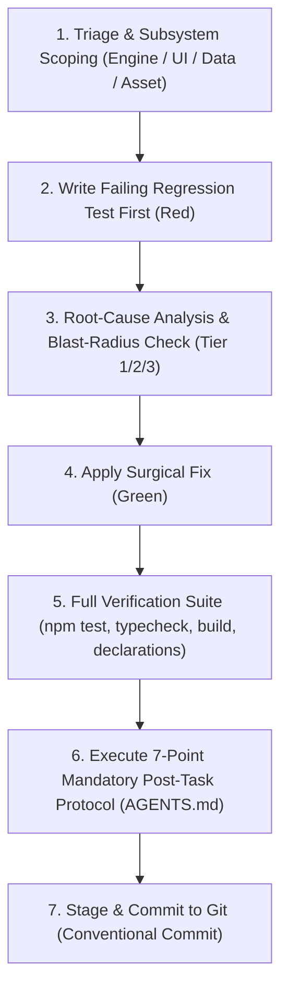

# 🛠️ Bug-Fix Protocol (Standard TDD & Remediation Workflow)

This skill guides the agent through an authoritative, test-first protocol to resolve bugs safely, deterministically, and with zero regressions.

---

## 📝 Execution Logging Requirement (`logs/skills/`)

Whenever a bug fix begins (triggered explicitly via `bug-fix: <description>` or through conversational bug reporting), append timestamped progress entries to `logs/skills/bug_fix_{YYYY-MM-DD}.log`:

```text
YYYY-MM-DDTHH:mm:ss.sssZ [TRIAGE] Bug reported: "<description>" (Subsystem: <Engine|UI|Data|Assets>)
YYYY-MM-DDTHH:mm:ss.sssZ [REPRO] Added failing regression test in tests/<subsystem>/<test_file>.test.ts
YYYY-MM-DDTHH:mm:ss.sssZ [FIX] Applied surgical fix in src/<path> (Blast-Radius Tier: <1|2|3>)
YYYY-MM-DDTHH:mm:ss.sssZ [VERIFY] All test suites passing (258+ tests, 0 typecheck errors, clean build)
YYYY-MM-DDTHH:mm:ss.sssZ [AUDIT] Completed 7-point post-task protocol & updated documentation
```

---

## 🚦 Blast-Radius Refactor Guardrails (3-Tier Classification)

Before modifying any source code, classify the required bug fix into one of three tiers:

* **Tier 1 (Localized Bug Fix — Direct Execution):**
  * Local component styling/layout fixes in `src/ui/`.
  * Localized bug fix inside a single engine helper, trigger handler, or payment step.
  * Declarative supplemental JSON correction in `src/data/supplemental/`.
  * Adding or refining unit tests.
* **Tier 2 (Shared Subsystem & State Reducer Fix — Verification Required):**
  * Modifying shared pipeline functions (`action-dispatcher.ts`, `round-upkeep.ts`, `villain-phase.ts`, `combat-engine.ts`).
  * Adjusting generic trigger dispatchers or status token counters.
  * **Requirement:** Must execute the full test suite across all heroes and scenarios to prove 0 regressions.
* **🛑 Tier 3 (Structural & Architectural Defect — Mandatory Plan & User Approval):**
  * Changing core state interfaces (`GameState`, `PlayerState`, `CardInstance`).
  * Restructuring public action dispatch signatures or phase state machines.
  * **Requirement:** Stop immediately, create `implementation_plan.md` detailing the architectural changes, and wait for explicit user approval before touching source code.

---

## 🔄 The 7-Step Bug Fix Lifecycle



### Step 1: Triage & Subsystem Scoping
1. Analyze the bug description, error messages, and reproduction steps.
2. **Inspect GameState Snapshots (`logs/gamestates/`):**
   * If the bug occurred during gameplay, inspect `logs/gamestates/latest_gamestate.json` (or timestamped snapshot archives in `logs/gamestates/`).
   * Examine active player status, villain HP, threat values, cards in hand, attachments, counters, and the resolution stack to understand the exact table condition.
3. Isolate the responsible layer:
   * **🧠 Headless Rules Engine (`src/engine/`):** Timing priority, trigger resolution, card costs, dynamic stat calculations, RR v1.8 rules violations.
   * **🎨 Presentation Layer (`src/ui/`):** React rendering, Tailwind styles, z-index layering, hover-zoom, animation glitches, speech balloon formatting.
   * **📦 Data / Supplemental Layer (`src/data/`):** Supplemental card JSON definitions, missing keywords/abilities, erroneous traits/packs.
   * **⚙️ Assets & Offline Pipeline (`vite.config.ts`, `cache/`, `fonts/`):** Local image caching, offline webfont serving, bundling errors.

### Step 2: Reproduce First (TDD Failing Test)
* **Golden Rule:** NEVER edit application source code before creating an automated reproduction test demonstrating the bug.
* **Seed from Snapshots:** When applicable, use the saved snapshot data from `logs/gamestates/latest_gamestate.json` to construct a minimal reproduction state in your test fixture.
* For Engine / Rules / Data bugs:
  * Create a new test case in `tests/engine/` or `tests/data/` recreating the exact game state sequence where the bug occurs.
  * Assert the expected behavior according to official RR v1.8 rules.
  * Run the single test file (`npx vitest run tests/<file>.test.ts`) to confirm it **fails** for the exact bug reported (**Red**).
* For UI / Visual bugs:
  * Inspect the component props, state transitions, or CSS utility classes. If visual/unit testable (e.g. formatters, hooks, layouts), write a unit test in `tests/ui/`.

### Step 3: Root-Cause Investigation & Blast-Radius Classification
* Trace the code execution from action dispatch to state mutation.
* Identify the exact line, condition, or missing state transition causing the defect.
* Classify the fix as Tier 1, Tier 2, or Tier 3. If Tier 3, pause and write an `implementation_plan.md`.

### Step 4: Surgical Implementation (Green)
* Apply the minimal, cleanest code change addressing the root cause.
* Respect all project architectural principles:
  1. **Strict Engine Decoupling:** Never import React, DOM, `window`, `document`, or CSS into `src/engine/`.
  2. **Official Rules Fidelity:** Strictly adhere to Marvel Champions Rules Reference v1.8.
  3. **Declarative Enrichment:** Fix card mechanics in `src/data/supplemental/` rather than hardcoding card codes into the engine.
  4. **Local-First Reliability:** Never add external runtime network dependencies.
* Run the reproduction test to verify it now **passes** (**Green**).

### Step 5: Full-Suite Verification & Zero-Regression Proof
Run the automated verification suite:
```bash
npm test && npm run typecheck && npm run build && npm run report:declarations
```
* Confirm all 47+ test files (258+ tests) pass cleanly.
* Confirm 0 TypeScript compilation errors (`tsc --noEmit`).
* Confirm production bundle succeeds (`vite build`).

### Step 6: Mandatory Post-Task Protocol (7-Point Audit Checklist)
Before completing the turn, execute the 7 mandatory checks from `AGENTS.md`:
1. **Check CHANGELOG.md:** Add entry under `[Unreleased]` with the bug fix summary, affected components, and root cause.
2. **Check Documentation:** Update any relevant docs in `docs/` or `README.md`.
3. **Check Specifications:** Update `docs/specifications/` or `docs/algorithmic_rules_reference.md` if rules mechanics or timing changed.
4. **Check Guidelines:** Update `docs/coding_guidelines.md` if new invariants or design patterns were introduced.
5. **Check ADRs:** Update or reference Architecture Decision Records in `docs/decisions/`.
6. **Check Ambiguities & Issues:** Close or resolve any related files in `docs/ambiguities/` or git issues.
7. **Check Declarations Usage Report:** Run `npm run report:declarations` whenever cards or supplemental data are modified.

### Step 7: Git Commit (Conventional Commits)
Stage all modified files, test suites, and documentation, then create a clean Conventional Commit:
```bash
git add -A
git commit -m "fix(<scope>): <concise description of bug fix>"
```
* **Scopes:** `fix(engine)`, `fix(ui)`, `fix(data)`, `fix(rules)`, `fix(assets)`, `fix(setup)`.

---

## 💡 Prompt Examples

* `bug-fix: Web-Shooter should generate physical resources when exhausted instead of wild resources.`
* `bug-fix: Spider-Man's Spider-Sense is triggering during villain phase step 1 instead of step 2 when the villain initiates an attack.`
* `bug-fix: In multi-hero mode, seat 2 cards in hand are visually clipping underneath the hero zone.`
* `bug-fix: When a minion with Guard is defeated, villain attack targeting does not immediately re-enable.`
