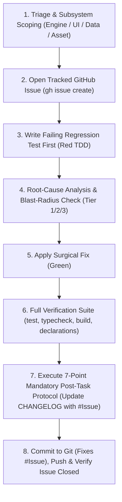

# 🛠️ Bug-Fix Protocol (Standard TDD & GitHub Issue Lifecycle Workflow)

**Path Policy:** Use paths relative to the MCD repository root for all local project files. Never use personal filesystem paths, drive-letter paths, `file:///` links, or `vscode://` links.

This skill guides the agent through an authoritative, test-first, and issue-tracked protocol to resolve defects safely, deterministically, and with zero regressions.

---

## 📝 Execution Logging Requirement (`logs/skills/`)

Whenever a bug fix begins (triggered explicitly via `bug-fix: <description>` or through conversational bug reporting), append timestamped progress entries to `logs/skills/bug_fix_{YYYY-MM-DD}.log`:

```text
YYYY-MM-DDTHH:mm:ss.sssZ [TRIAGE] Bug reported: "<description>" (Subsystem: <Engine|UI|Data|Assets>)
YYYY-MM-DDTHH:mm:ss.sssZ [ISSUE] Opened GitHub Issue #<NUM>: "<title>" (<URL>)
YYYY-MM-DDTHH:mm:ss.sssZ [REPRO] Added failing regression test in tests/<subsystem>/<test_file>.test.ts
YYYY-MM-DDTHH:mm:ss.sssZ [FIX] Applied surgical fix in src/<path> (Blast-Radius Tier: <1|2|3>)
YYYY-MM-DDTHH:mm:ss.sssZ [VERIFY] All test suites passing (258+ tests, 0 typecheck errors, clean build)
YYYY-MM-DDTHH:mm:ss.sssZ [AUDIT] Completed 7-point post-task protocol & updated documentation
YYYY-MM-DDTHH:mm:ss.sssZ [CLOSE] Pushed commit "fix(...): ... (Fixes #<NUM>)" & verified issue closed
```

---

## 🚦 Blast-Radius Refactor Guardrails (3-Tier Classification)

Before modifying any source code, classify the required bug fix into one of three tiers:

- **Tier 1 (Localized Bug Fix — Direct Execution):**
  - Local component styling/layout fixes in `src/ui/`.
  - Localized bug fix inside a single engine helper, trigger handler, or payment step.
  - Declarative supplemental JSON correction in `src/data/supplemental/`.
  - Adding or refining unit tests.
- **Tier 2 (Shared Subsystem & State Reducer Fix — Verification Required):**
  - Modifying shared pipeline functions (`action-dispatcher.ts`, `round-upkeep.ts`, `villain-phase.ts`, `combat-pipeline.ts`).
  - Adjusting generic trigger dispatchers, status token counters, or resolution stacks.
  - **Requirement:** Must execute the full test suite across all heroes and scenarios to prove 0 regressions.
- **🛑 Tier 3 (Structural & Architectural Defect — Mandatory Plan & User Approval):**
  - Changing core state interfaces (`GameState`, `PlayerState`, `CardInstance`).
  - Restructuring public action dispatch signatures, execution stacks, or phase state machines.
  - **Requirement:** Stop immediately, create `implementation_plan.md` detailing the architectural changes, and wait for explicit user approval before touching source code.

---

## 🔄 The 8-Step Bug Fix Lifecycle



---

### Step 1: Triage & Subsystem Scoping

1. Capture the failure mode from user report or test runner.
2. If available, inspect the real-time table state snapshots in `logs/gamestates/` (e.g. `latest_gamestate.json`, `latest_engine_log.json`).
3. Classify subsystem: `Engine` (state/mechanics), `UI` (presentation/interaction), `Data` (supplemental JSON), or `Assets`.

---

### Step 1B: Declarative Supplemental Card Audit (Enforce on all card defects) 🃏

- If the defect pertains to a specific card (Player card, Encounter card, Villain stage, Attachment, or Ally):
  1. **Do NOT inspect or modify `src/engine/` code yet.**
  2. Open the card's definition in `src/data/supplemental/pack/<pack_code>.json`.
  3. Compare the printed card text against the supplemental JSON declaration:
     - Is the `timing` accurate (`ACTION`, `HERO_ACTION`, `FORCED_RESPONSE`, `INTERRUPT`)?
     - Are all `costs` present (`EXHAUST_SELF`, `SPEND_RESOURCE`, `DAMAGE_SELF`)?
     - Are `steps: AbilityStep[]` using the right primitives, target selectors, and conditional gates (`THEN`, `ALWAYS`)?
  4. **Data-Only Resolution:** If the bug is caused by a missing/malformed JSON field or misconfigured primitive, the `implementation_plan.md` must be classified as **Tier 1 (Declarative Data Fix)** with ZERO engine code modifications.

---

### Step 1C: Rhino Release Scope Check 🎯
* Verify whether the reported bug affects **Gate 1: The Rhino Release** (Core Set Player cards or Rhino/Standard/Expert/Bomb Scare/Nemesis encounter cards).
* If the defect affects an expansion card outside the Rhino Release boundary (e.g. *Klaw*, *Ultron*, *Thor*), tag the issue with `deferred:post-rhino` and prioritize active Rhino blockers.

---

### Step 2: Open Tracked GitHub Issue (`gh issue create`)

Create a standardized, well-structured GitHub issue using the GitHub CLI:

```bash
gh issue create \
  --title "fix(<subsystem>): <concise bug title>" \
  --label "bug,<subsystem>" \
  --body "### 🐛 Bug Description
<Detailed description of what is happening vs what should happen>

### 📜 Rules Reference / Spec
- Marvel Champions Rules Reference v1.8: <citation or N/A>

### 🔍 Reproduction Context
- Subsystem: <engine | ui | data | assets>
- GameState Snapshot: <logs/gamestates/... if applicable>

### 🛠️ Planned Remediation
1. Add automated failing regression test in \`tests/<subsystem>/...\`
2. Apply surgical fix
3. Full verification suite passing"
```

- **Extract Issue Number:** Capture the created issue number `#<NUM>` for subsequent commit and log cross-references.
- **Graceful Fallback:** If `gh` CLI is unauthenticated or offline, log the issue details in `logs/skills/` and proceed without blocking execution.

---

### Step 3: Reproduce First (TDD Failing Test)

- **Golden Rule:** NEVER edit application source code before creating an automated reproduction test demonstrating the bug.
- **Seed from Snapshots:** When applicable, use the saved snapshot data from `logs/gamestates/latest_gamestate.json` to construct a minimal reproduction state in your test fixture.
- For Engine / Rules / Data bugs:
  - Create a new test case in `tests/engine/` or `tests/data/` recreating the exact game state sequence where the bug occurs.
  - Assert the expected behavior according to official RR v1.8 rules.
  - Run the single test file (`npx vitest run tests/<file>.test.ts`) to confirm it **fails** for the exact bug reported (**Red**).
- For UI / Visual bugs:
  - Inspect the component props, state transitions, or CSS utility classes. If visual/unit testable (e.g. formatters, hooks, layouts), write a unit test in `tests/ui/`.

---

### Step 4: Root-Cause Diagnosis & Implementation Plan Review 🛑

- Diagnose the exact line of code, mutation logic, or missing condition responsible for the failure.
- **MANDATORY REVIEW GATE:** Create an `implementation_plan.md` artifact detailing:
  1. **Root-Cause Analysis:** Why the defect occurs with reference to game state snapshots in `logs/gamestates/` and RR v1.8 rules.
  2. **Blast-Radius Classification:** Tier 1, 2, or 3.
  3. **Proposed Code Fix:** Exact lines and files to modify.
  4. **Regression Verification Strategy:** Specific test files to run.
- **STOP AND WAIT:** Set `request_feedback: true` in artifact metadata. Wait for explicit user review and approval before modifying source code.

---

### Step 5: Apply Surgical Code Fix (Green)

- Apply the minimal, cleanest code change addressing the root cause.
- Respect all project architectural principles:
  1. **Strict Engine Decoupling:** Never import React, DOM, `window`, `document`, or CSS into `src/engine/`.
  2. **Official Rules Fidelity:** Strictly adhere to Marvel Champions Rules Reference v1.8.
  3. **Declarative Enrichment:** Fix card mechanics in `src/data/supplemental/` rather than hardcoding card codes into the engine.
  4. **Local-First Reliability:** Never add external runtime network dependencies.
- Run the reproduction test to verify it now **passes** (**Green**).

---

### Step 5B: Declarative Supplemental Retrofit & Audit Metadata Update 🃏

- If the fix touched any card data or modified an engine primitive/keyword used by other cards:
  1. **Search Supplemental Data:** Search all pack files in `src/data/supplemental/pack/*.json` for any cards that share the affected mechanic.
  2. **Retrofit Card Definitions:** Apply the corrected declarations across all affected card entries.
  3. **Update Audit Metadata:** For every modified card entry, update:
     - `"updatedAt"`: Current ISO timestamp with `HH:MM` (e.g. `2026-09-01T09:48:00Z`).
     - `"reviewedAt"`: Current ISO timestamp with `HH:MM`.
     - `"reviewedBy"`: `"antigravity"` (or current agent identity).

---

### Step 6: Full-Suite Verification & Zero-Regression Proof

Execute the full verification suite across engine, tests, schemas, build, lint, and formatting:

```bash
npm run format:check && npm run lint && npm run typecheck && npm test && npm run build && npm run report:declarations
```

- Confirm all test files and suites pass cleanly.
- Confirm 0 TypeScript compilation errors (`tsc --noEmit`).
- Confirm production bundle succeeds (`vite build`).

---

### Step 7: Mandatory Post-Task Protocol (8-Point Audit Checklist)

Before completing the turn, execute the 8 mandatory checks from `AGENTS.md`:

1. **Check CHANGELOG.md:** Add entry under `[Unreleased]` with the bug fix summary, root cause, and clickable GitHub issue link (`[#<NUM>](https://github.com/SteveRodrigue/MCD/issues/<NUM>)`).
2. **Check Documentation:** Update any relevant docs in `docs/` or `README.md`.
3. **Check Specifications:** Update `docs/specifications/` or `docs/algorithmic_rules_reference.md` if rules mechanics or timing changed.
4. **Check Guidelines:** Update `docs/coding_guidelines.md` if new invariants or design patterns were introduced.
5. **Check ADRs:** Update or reference Architecture Decision Records in `docs/decisions/`. Any new or edited ADR **MUST** follow [`docs/decisions/template.md`](../../../docs/decisions/template.md) verbatim (heading form, `Status`/`Date`/`Authors`/`Deciders` block, and standard section order).
6. **Check Ambiguities & Issues:** Close or resolve any related files in `docs/ambiguities/`.
7. **Check Roadmap & Milestones:** Check off completed tasks, update active milestone status badges, and keep `docs/roadmap_and_milestones.md` synchronized.
8. **Check Declarations Usage Report:** Run `npm run report:declarations` whenever cards or supplemental data are modified.

---

### Step 8: Git Commit (Auto-Close Issue), Push & Verification

1. **Stage & Commit with Auto-Close Syntax:**

   ```bash
   git add -A
   git commit -m "fix(<scope>): <concise description of bug fix> (Fixes #<NUM>)"
   ```

   - **Scopes:** `fix(engine)`, `fix(ui)`, `fix(data)`, `fix(rules)`, `fix(assets)`, `fix(setup)`.
   - The `(Fixes #<NUM>)` trailer automatically links and closes the GitHub issue upon push.

2. **Push to Remote:**

   ```bash
   git push origin main
   ```

3. **Post Verification Comment & Ensure Closed:**
   If `gh` CLI is available, optionally post a verification note and confirm issue state:
   ```bash
   gh issue comment <NUM> --body "✅ **Verified**: Regression test passing cleanly. Full verification suite passing (0 typecheck errors, 0 build warnings)."
   gh issue close <NUM> --comment "Resolved and closed via automated TDD protocol."
   ```

---

## 💡 Prompt Examples

- `bug-fix: Web-Shooter should generate physical resources when exhausted instead of wild resources.`
- `bug-fix: Spider-Man's Spider-Sense is triggering during villain phase step 1 instead of step 2 when the villain initiates an attack.`
- `bug-fix: In multi-hero mode, seat 2 cards in hand are visually clipping underneath the hero zone.`
- `bug-fix: When a minion with Guard is defeated, villain attack targeting does not immediately re-enable.`
