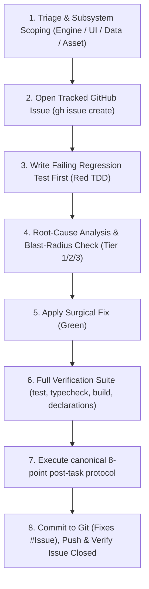

# 🛠️ Bug-Fix Protocol (Standard TDD & GitHub Issue Lifecycle Workflow)

**Shared rules:** Apply [`.agents/rules/shared-quality-gates.md`](../../rules/shared-quality-gates.md), including path, scope, plan, verification, and delivery policies. Classify fixes by the canonical 3-tier blast radius before modifying code.

**Needs:** `rtk` (see [`antigravity-rtk-rules.md`](../../rules/antigravity-rtk-rules.md)), Node.js with `npm ci`, and the GitHub CLI authenticated via `gh auth login` (check with `gh auth status`).

---

## 🔄 The 8-Step Bug Fix Lifecycle



```mermaid
flowchart TD
    S1["1. Triage & Subsystem Scoping (Engine / UI / Data / Asset)"] --> S2["2. Open Tracked GitHub Issue (gh issue create)"]
    S2 --> S3["3. Write Failing Regression Test First (Red TDD)"]
    S3 --> S4["4. Root-Cause Analysis & Blast-Radius Check (Tier 1/2/3)"]
    S4 --> S5["5. Apply Surgical Fix (Green)"]
    S5 --> S6["6. Full Verification Suite (test, typecheck, build, declarations)"]
    S6 --> S7["7. Execute canonical 8-point post-task protocol"]
    S7 --> S8["8. Commit to Git (Fixes #Issue), Push & Verify Issue Closed"]
```

---

### Step 1: Triage & Subsystem Scoping

1. Capture the failure mode from user report or test runner.
2. If available, inspect the real-time table state snapshots in `logs/gamestates/` (e.g. `latest_gamestate.json`, `latest_engine_log.json`).
3. Classify subsystem: `Engine` (state/mechanics), `UI` (presentation/interaction), `Data` (supplemental JSON), or `Assets`.

---

### Step 1B: Declarative Supplemental Card Audit (Enforce on all card defects) 🃏

- If the defect pertains to a specific card (Player card, Encounter card, Villain stage, Attachment, or Ally):
  1. **Do NOT inspect or modify `src/engine/` code yet.**
  2. Open the card's definition in `src/data/supplemental/pack/<pack_code>.json`.
  3. Compare the printed card text against the supplemental JSON declaration:
     - Is the `timing` accurate (`ACTION`, `HERO_ACTION`, `FORCED_RESPONSE`, `INTERRUPT`)?
     - Are all `costs` present (`EXHAUST_SELF`, `SPEND_RESOURCE`, `DAMAGE_SELF`)?
     - Are `steps: AbilityStep[]` using the right primitives, target selectors, and conditional gates (`THEN`, `ALWAYS`)?
  4. **Data-Only Resolution:** If the bug is caused by a missing/malformed JSON field or misconfigured primitive, the `implementation_plan.md` must be classified as **Tier 1 (Declarative Data Fix)** with ZERO engine code modifications.

---

### Step 1C: Roadmap Impact & Future-Risk Triage 🎯

Assess two independent dimensions. Roadmap alignment affects priority, not eligibility:

1. **Current roadmap and milestone impact:** Determine whether the defect blocks an active gate,
   acceptance criterion, release workflow, or work already scheduled in
   `docs/roadmap_and_milestones.md`. Bugs with greater impact on current delivery normally receive
   higher priority.
2. **Long-term risk:** Determine whether leaving the defect would create compounding technical debt,
   corrupt state or data, weaken a shared contract, spread an incorrect pattern, block a future
   migration, conceal regressions, create a security or accessibility risk, or become materially
   more expensive to fix later.

Apply these rules:

- Never reject or automatically defer a bug solely because its card, scenario, component, or
  subsystem is outside the active roadmap or milestone.
- Prioritize active-gate blockers when severity and long-term risk are otherwise comparable.
- Permit an off-milestone fix when severity, cross-cutting blast radius, compounding risk,
  prevention value, or explicit user direction justifies addressing it now.
- When deferring a valid bug, record the evidence-based reason, prerequisites, expected future
  impact, and the milestone or review condition that should reactivate it. Use only repository
  labels that have been verified to exist; do not invent release-specific labels.
- Record the triage outcome in the issue and implementation plan as one of:
  `current-milestone priority`, `preventative priority`, `scheduled`, or `deferred with trigger`.

---

### Step 2: Open Tracked GitHub Issue (`gh issue create`)

Create a standardized GitHub issue using the GitHub CLI (strict template: keep these headings):

Use the command and body in [`issue-template.md`](issue-template.md) (strict: keep every heading).

- **Extract Issue Number:** Capture the created issue number `#<NUM>` for subsequent commit and log cross-references.
- **Graceful Fallback:** If `gh` CLI is unauthenticated or offline, note the issue details in the implementation plan and proceed without blocking execution.

---

### Step 3: Reproduce First (TDD Failing Test)

- **Golden Rule:** NEVER edit application source code before creating an automated reproduction test demonstrating the bug.
- **Seed from Snapshots:** When applicable, use the saved snapshot data from `logs/gamestates/latest_gamestate.json` to construct a minimal reproduction state in your test fixture.
- For Engine / Rules / Data bugs:
  - Create a new test case in `tests/engine/` or `tests/data/` recreating the exact game state sequence where the bug occurs.
  - Assert the expected behavior according to official RR v1.8 rules.
  - Run the single test file (`npx vitest run tests/<file>.test.ts`) to confirm it **fails** for the exact bug reported (**Red**). If it passes or fails for a different reason, go back and rewrite the test.
- For UI / Visual bugs:
  - Inspect the component props, state transitions, or CSS utility classes. If visual/unit testable (e.g. formatters, hooks, layouts), write a unit test in `tests/ui/`.

---

### Step 4: Root-Cause Diagnosis & Implementation Plan Review 🛑

- Diagnose the exact line of code, mutation logic, or missing condition responsible for the failure.
- **MANDATORY REVIEW GATE:** Create an `implementation_plan.md` artifact detailing:
  1. **Root-Cause Analysis:** Why the defect occurs with reference to game state snapshots in `logs/gamestates/` and RR v1.8 rules.
  2. **Blast-Radius Classification:** Tier 1, 2, or 3.
  3. **Proposed Code Fix:** Exact lines and files to modify.
  4. **Regression Verification Strategy:** Specific test files to run.
- **STOP AND WAIT:** Set `request_feedback: true` in artifact metadata. Create `temp/.plan-pending` when you post the plan and delete it once the user approves. While it exists, a hook blocks edits under `src/`, `tests/`, `data/`, `tools/` and `scripts/`; fixing before approval skips the review gate.

---

### Step 5: Apply Surgical Code Fix (Green)

- Apply the minimal, cleanest code change addressing the root cause.
- Respect all project architectural principles:
  1. **Strict Engine Decoupling:** Never import React, DOM, `window`, `document`, or CSS into `src/engine/`.
  2. **Official Rules Fidelity:** Strictly adhere to Marvel Champions Rules Reference v1.8.
  3. **Declarative Enrichment:** Fix card mechanics in `src/data/supplemental/` rather than hardcoding card codes into the engine.
  4. **Local-First Reliability:** Never add external runtime network dependencies.
- Run the reproduction test to verify it now **passes** (**Green**). If it still fails, go back to Step 4 and re-diagnose.

---

### Step 5B: Declarative Supplemental Retrofit & Audit Metadata Update 🃏

- If the fix touched any card data or modified an engine primitive/keyword used by other cards:
  1. **Search Supplemental Data:** Search all pack files in `src/data/supplemental/pack/*.json` for any cards that share the affected mechanic.
  2. **Retrofit Card Definitions:** Apply the corrected declarations across all affected card entries.
  3. **Update Audit Metadata:** For every modified card entry, update:
     - `updatedAt`, `reviewedAt`, `reviewedBy`: per the [audit stamp rules](../../rules/shared-quality-gates.md#audit-stamp).

---

### Step 6: Full-Suite Verification & Zero-Regression Proof

Execute the full verification suite across engine, tests, schemas, build, lint, and formatting:

```bash
rtk npm run format:check && rtk npm run lint && rtk npm run typecheck && rtk npm test && rtk npm run build && rtk npm run report:declarations
```

- **Enforce Zero Skipped Tests Invariant:** Confirm all tests pass with **0 failed and 0 skipped** (`passed: N, failed: 0, skipped: 0`). A hook blocks skipped, todo, and focused tests in `tests/**`; do not comment out assertions either.
- Confirm 0 TypeScript compilation errors (`tsc --noEmit`).
- Confirm 0 ESLint warnings/errors and Prettier format compliance.
- Confirm production bundle succeeds (`vite build`).
- Confirm declarations report reports 0 schema or false-vanilla violations.

---

### Step 7: Post-Task Hygiene Protocol

Execute [`.agents/rules/post-task-checklist.md`](../../rules/post-task-checklist.md) scoped to the fix's blast-radius tier (Tier 1: CHANGELOG, and declarations if card data modified; Tier 2/3: full relevant checklist).

---

### Step 8: Present Fix & Verification Recap

Present the solution, verification results, and diff summary to the user. Per `AGENTS.md`, delivery (commit and push) is only executed upon the user's explicit request in the conversation. When requested, follow the `commit-and-push` protocol:
1. Stage the intentionally changed files (e.g. `rtk git add <files>`).
2. Run quality gates with `rtk`.
3. Commit with Conventional Commits syntax (e.g. `rtk git commit -m "fix(<scope>): <description> (Fixes #<NUM>)"`).
4. Push to remote and verify issue closure (`rtk git push`).


---

## 💡 Prompt Examples

- `bug-fix: Web-Shooter should generate physical resources when exhausted instead of wild resources.`
- `bug-fix: Spider-Man's Spider-Sense is triggering during villain phase step 1 instead of step 2 when the villain initiates an attack.`
- `bug-fix: In multi-hero mode, seat 2 cards in hand are visually clipping underneath the hero zone.`
- `bug-fix: When a minion with Guard is defeated, villain attack targeting does not immediately re-enable.`
