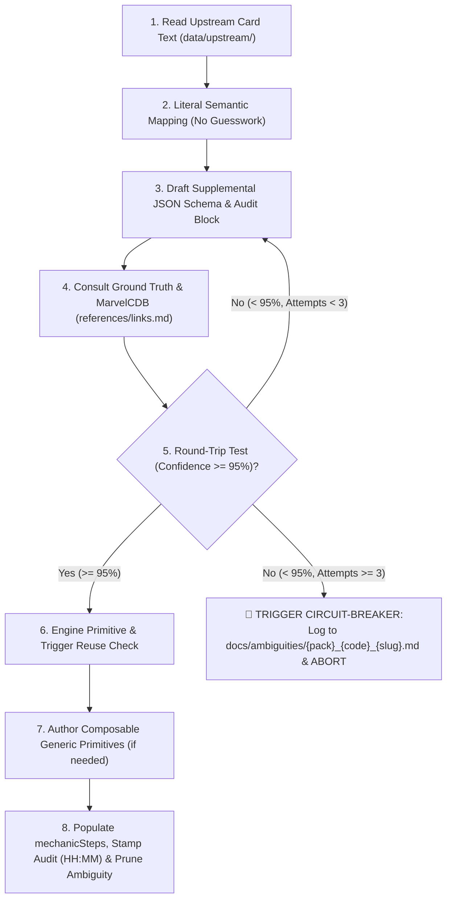

# Card Integration Protocol (8-Step Standard Workflow)

This skill guides the agent and developers through the rigorous, deterministic process of integrating Marvel Champions cards into the digital game engine.

---

## The 8-Step Integration Workflow



### Step 1: Ingest & Read Upstream Card Text
* Fetch the exact printed card text from `data/upstream/pack/{pack_code}.json`.
* Do not paraphrase, summarize, or alter the upstream text during analysis.

### Step 2: Literal Semantic Mapping (Zero Interpretation / Zero Guesswork)
* Per **ADR-0018** & **ADR-0019**, never interpret or guess unstated card rules.
* Identify the exact ability type:
  * **Timing:** `ACTION`, `HERO_ACTION`, `ALTER_EGO_ACTION`, `RESOURCE`, `INTERRUPT`, `HERO_INTERRUPT`, `RESPONSE`, `HERO_RESPONSE`, `FORCED_INTERRUPT`, `FORCED_RESPONSE`, `CONSTANT`, `SETUP`.
  * **Trigger:** Exact event (e.g. `VILLAIN_SCHEMES`, `VILLAIN_INITIATES_ATTACK`, `TAKE_ATTACK_DAMAGE`, `CARD_PLAYED`, `ROUND_END`).
  * **Target:** Exact entity (e.g. `the villain` $\neq$ `minions`; `an enemy` = `villain or minion`).
  * **Form Requirement:** Derived strictly from ability timing (`HERO_` vs `ALTER_EGO_` vs neutral).

### Step 3: Draft Structured Supplemental Schema & Audit Block
* Compose the JSON entry in `src/data/supplemental/pack/{pack_code}.json`:
```json
"{card_code}": {
  "comment": "<Brief human summary>",
  "audit": {
    "createdAt": "YYYY-MM-DDTHH:mm",
    "updatedAt": "YYYY-MM-DDTHH:mm",
    "reviewedAt": "YYYY-MM-DDTHH:mm",
    "reviewedBy": "antigravity",
    "rulesVersion": "v1.8",
    "confidence": 98
  },
  "mechanicSteps": [
    "Trigger: <Timing & Trigger event>",
    "Step 1: <Inspection/Cost>",
    "Step 2: <Filter/Targeting>",
    "Step 3: <Resolution/State Change>",
    "Step 4: <Cleanup/Destination>"
  ],
  "abilities": [
    {
      "id": "<card_name_ability_slug>",
      "timing": "<TIMING>",
      "trigger": "<TRIGGER_IF_REACTIVE>",
      "limit": "<ONCE_PER_ROUND | ONCE_PER_PHASE>",
      "cost": {
        "exhaustSelf": true,
        "removeCounter": 1,
        "discardSelf": true,
        "resourceCost": { "physical": 1 }
      },
      "effect": "<EFFECT_PRIMITIVE>",
      "params": { ... }
    }
  ]
}
```

### Step 4: Consult Ground Truth References (`references/`)
* Check `references/rules_reference_v18.md` for official timing rules.
* Consult `references/links.md` for:
  * Official FAQ & Errata: `https://marvelcdb.com/faqs`
  * Card-specific discussion: `https://marvelcdb.com/card/{card_code}`
* **The Golden Rule (RR v1.8 p. 2):** If the printed card text explicitly contradicts a general rule in the Rules Reference, the card text takes precedence.

### Step 5: Bidirectional Round-Trip Validation & Circuit-Breaker Rule
* **The Test:** Read your drafted JSON supplemental schema and translate it back into plain human language.
* **Criterion:** Does the reconstructed description match 100% of the printed card's intended behavior without omissions, unintended side effects, or missing constraints?
* **Confidence Target:** Must reach **$\ge 95\%$** before proceeding.
* **Refinement Iteration Limit:** Max **3 refinement iterations** between Steps 3 $\rightarrow$ 4 $\rightarrow$ 5.
* **🚨 CIRCUIT-BREAKER PROTOCOL (If Confidence Remains $< 95\%$ after Attempt 3):**
  1. **DO NOT** commit or integrate incomplete supplemental logic into the active game engine.
  2. Create a dedicated ambiguity report file in `docs/ambiguities/{pack}_{card_code}_{slug}.md`.
  3. Detail the exact blocker category, attempted drafts, and why confidence was not achieved.
  4. Escalate to the developer/team for rules clarification or engine primitive authoring.

### Step 6: Engine Primitive & Trigger Reuse Check
* Verify whether existing effect primitives in `src/engine/effects/` or triggers in `src/engine/triggers/` already satisfy the card's requirements.
* Avoid duplicating or creating card-specific one-off functions.

### Step 7: Composable Generic Primitives (When Extending Engine)
* If new engine functionality is needed, design it as a **generic, composable building block**:
  * E.g. Deck Inspection: `INSPECT_DECK_CARDS(zone, position, count)`
  * E.g. Stack Filtering: `FILTER_CARD_STACK(predicate)` $\rightarrow$ `{ matched, unmatched }`
  * E.g. Destination Routing: Route cards to `HAND`, `DISCARD`, `TABLEAU`, or `DECK`.
* Ensure the new primitive is generic enough that other cards with similar mechanics can reuse it immediately.

### Step 8: Stamp Audit Metadata (HH:MM), Codify Specs & Prune Ambiguity
1. **Audit Timestamping:**
   * If creating a new card: set `createdAt`, `updatedAt`, and `reviewedAt` to current ISO timestamp with `HH:mm` (e.g. `"2026-08-28T08:20"`).
   * If modifying logic/fixing a bug: bump `updatedAt` and `reviewedAt` to the current timestamp.
   * If auditing/confirming an existing card with no code changes: bump `reviewedAt` only.
2. **Populate `mechanicSteps`:** Ensure `mechanicSteps` is populated in the JSON schema.
3. **Document in Specs:** Add an entry to `docs/specs/card-mechanics-breakdown.md`.
4. **Inbox Zero Pruning:** If an open ambiguity file existed in `docs/ambiguities/` for this card, **delete it**.
5. **Verify:** Run test suite: `npm test; npm run typecheck; npm run build`.
