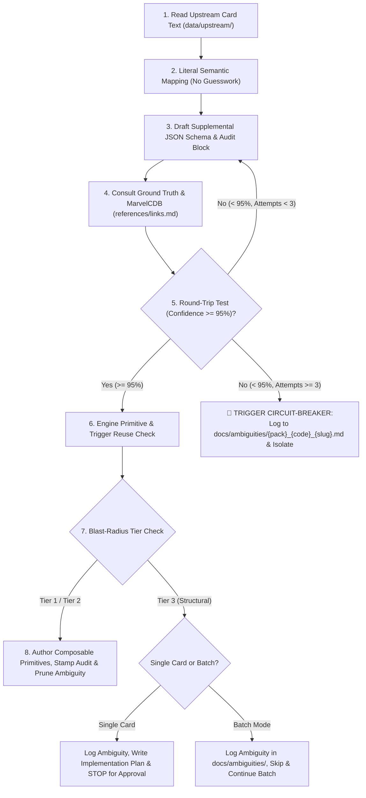

# Card Integration Protocol (8-Step Standard Workflow)

This skill guides the agent and developers through the rigorous, deterministic process of integrating Marvel Champions cards into the digital game engine.

---

## 📝 Execution Logging Requirement (`logs/skills/`)

Whenever this skill executes (for a single card or a batch review), it must append timestamped progress entries with the **confidence level** to `logs/skills/card_integration_{YYYY-MM-DD}.log`:

```text
YYYY-MM-DDTHH:mm:ss.sssZ [INFO] Looking at card [card_name] #{card_code}
YYYY-MM-DDTHH:mm:ss.sssZ [INFO] Card [card_name] #{card_code} integrated without any code change required (Tier 1, confidence 98%).
YYYY-MM-DDTHH:mm:ss.sssZ [INFO] Card [card_name] #{card_code} integrated with code change (Tier 2, confidence 98%).
YYYY-MM-DDTHH:mm:ss.sssZ [WARN] Card [card_name] #{card_code} card ambiguity: Circuit-Breaker fired (confidence 70%) -> docs/ambiguities/{pack}_{code}_{slug}.md
YYYY-MM-DDTHH:mm:ss.sssZ [WARN] Card [card_name] #{card_code} card ambiguity: Structural Refactor Gate (Tier 3, confidence 80%) -> docs/ambiguities/{pack}_{code}_{slug}.md
```

---

## 🚦 Blast-Radius Refactor Guardrails (3-Tier Classification)

Before modifying engine source code, classify the required change into one of three tiers:

* **Tier 1 (Fast-Track — Direct Execution):** Supplemental JSON edits, adding enum/union literals (`TriggerType`, `EffectType`), adding `case` branches to existing switch dispatchers, adding unit tests.
* **Tier 2 (Additive Generic Helpers — Permitted with 0 Regressions):** Adding pure generic utility functions in `src/engine/effects/` (e.g. deck inspection, stack filtering). All existing tests must pass with zero regressions.
* **🛑 Tier 3 (Structural Refactor Gate — Mandatory Plan & User Approval):** Modifying core state schemas (`GameState`, `PlayerState`, `CardInstance`), refactoring phase loops in `villain-phase.ts`, altering action dispatch contracts, or rewriting major subsystems.
  * **In Single-Card Mode:** Stop immediately, log to `docs/ambiguities/`, create `implementation_plan.md`, and wait for explicit user approval before touching source code.
  * **In Batch-Mode (Scanning multiple cards / sets):** **Do not halt the batch.** Log a dedicated ambiguity file to `docs/ambiguities/{pack}_{code}_{slug}.md` with `blocker_category: "TIER_3_STRUCTURAL_REFACTOR"`, skip the blocked card, continue scanning all remaining cards in the set, and present a consolidated report + implementation plan at the end of the batch run.

---

## 🔄 The 8-Step Integration Workflow



### Step 1: Ingest Upstream Card & Stream Real-Time Start Log
* **REAL-TIME LOGGING MANDATE (NO BATCH LOGGING):** You **MUST** append to `logs/skills/card_integration_{YYYY-MM-DD}.log` in real-time as each card is processed. **Never buffer or defer log entries to the end of a batch run.** After-the-fact batch logging makes timestamps irrelevant and loses live progress telemetry.
* Immediately append the start event to `logs/skills/card_integration_{YYYY-MM-DD}.log`:
  `{YYYY-MM-DDTHH:mm:ss.sssZ} [INFO] Looking at card [{card_name}] #{card_code}`
* Fetch the exact printed card text from `data/upstream/pack/{pack_code}.json`.
* Do not paraphrase, summarize, or alter the upstream text during analysis.

### Step 2: Literal Semantic Mapping & 8-Point Socratic Q&A Deconstruction
* Per **ADR-0018** & **ADR-0019**, never interpret or guess unstated card rules.
* Before drafting schema, rigorously answer the **8-Point Socratic Q&A Checklist**:
  1. **Q1 (Trigger & Timing):** What exact event triggers this? Is it optional (`ACTION`/`INTERRUPT`/`RESPONSE`) or mandatory (`FORCED_`/`WHEN_REVEALED`)?
  2. **Q2 (Costs & Prerequisites):** What must be paid before execution (`exhaustSelf`, `discardSelf`, `removeCounter`, `resourceCost`, form requirement)?
  3. **Q3 (Primary Target/Subject):** What exact entity is affected or searched (e.g. `the villain`, `an enemy`, `a minion`, specific card code)?
  4. **Q4 (Zones & Boundaries):** Where does this take place, or where do we search? **MUST use Fully Qualified Game Zones (FQGZ)**:
     * `ENCOUNTER_DECK`, `ENCOUNTER_DISCARD`, `SET_ASIDE_NEMESIS`, `SET_ASIDE_OUT_OF_PLAY`, `VICTORY_DISPLAY`
     * `PLAYER_DECK`, `PLAYER_DISCARD`, `PLAYER_HAND`, `PLAYER_TABLEAU` (with `targetPlayer: "SELF" | "CHOSEN_PLAYER" | "ALL_PLAYERS"`)
     * `ATTACHED_HOST`, `UNDER_CARD`
  5. **Q5 (State Mutation):** What exact state change occurs (deal damage, heal, remove threat, apply status, reveal, put into play)?
  6. **Q6 (Post-Resolution Side-Effects):** What mandatory rules follow completion (e.g. `shuffleDeck: "ENCOUNTER_DECK" | "PLAYER_DECK"`, `gainOverkill: true`)?
  7. **Q7 (Source Destination):** What happens to the source card upon resolution (`DISCARD_SELF`, `ATTACH_TO_HOST`, `STAYS_IN_PLAY`)?
  8. **Q8 (Contingencies & Branching):** Is there a fallback or conditional branch (e.g. "if you cannot...", "in alter-ego...", "if 0 healed -> surge")?

### Step 3: Draft Structured Supplemental Schema & Audit Block
* **MANDATORY EXECUTABLE ABILITIES REQUIREMENT:** `mechanicSteps` and `comment` are human-readable documentation and **CANNOT** replace engine data. Every card with printed rules text (Actions, When Revealed, Interrupts, Responses, Keywords, Passives, Scheme Icons) **MUST** have its logic fully encoded in `abilities: [...]` (or explicit schema properties).
* **100% PARAMETER COMPLETENESS & FULLY QUALIFIED ZONES:** Every parameter identified in the 8-point Q&A checklist **MUST** be explicitly declared in `params` with **Fully Qualified Game Zones** (e.g. `searchZones: ["ENCOUNTER_DECK", "ENCOUNTER_DISCARD"]`, `shuffleDeck: "ENCOUNTER_DECK"`, `revealTarget: true`). Generic unqualified strings like `["DECK", "DISCARD"]` are strictly prohibited as ambiguous and engine-breaking.
* `noSupplementalNeeded: true` is **ONLY** valid for pure vanilla cards with zero rules text (e.g. double resources, basic allies without abilities, or villain stages without abilities). Any card with rules text marked `noSupplementalNeeded: true` is an invalid schema error.
* Compose the JSON entry in `src/data/supplemental/pack/{pack_code}.json`:
```json
"{card_code}": {
  "comment": "<Brief human summary>",
  "audit": {
    "createdAt": "YYYY-MM-DDTHH:mm",
    "updatedAt": "YYYY-MM-DDTHH:mm",
    "reviewedAt": "YYYY-MM-DDTHH:mm",
    "reviewedBy": "antigravity",
    "rulesVersion": "v1.8",
    "confidence": 98,
    "reconstructedText": "<Proof-of-work: Decompiled text derived 100% from abilities array>"
  },
  "mechanicSteps": [
    "Trigger: <Timing & Trigger event>",
    "Step 1: <Inspection/Cost>",
    "Step 2: <Filter/Targeting>",
    "Step 3: <Resolution/State Change>",
    "Step 4: <Cleanup/Destination>"
  ],
  "abilities": [
    {
      "id": "<card_name_ability_slug>",
      "timing": "<TIMING>",
      "trigger": "<TRIGGER_IF_REACTIVE>",
      "limit": "<ONCE_PER_ROUND | ONCE_PER_PHASE>",
      "cost": {
        "exhaustSelf": true,
        "removeCounter": 1,
        "discardSelf": true,
        "resourceCost": { "physical": 1 }
      },
      "effect": "<EFFECT_PRIMITIVE>",
      "params": {
        "searchZones": ["ENCOUNTER_DECK", "ENCOUNTER_DISCARD"],
        "shuffleDeck": "ENCOUNTER_DECK",
        "revealTarget": true
      }
    }
  ]
}
```

### Step 4: Consult Ground Truth References (`references/`)
* Check `references/rules_reference_v18.md` for official timing rules.
* Consult `references/links.md` for:
  * Official FAQ & Errata: `https://marvelcdb.com/faqs`
  * Card-specific discussion: `https://marvelcdb.com/card/{card_code}`
* **The Golden Rule (RR v1.8 p. 2):** If the printed card text explicitly contradicts a general rule in the Rules Reference, the card text takes precedence.

### Step 5: Bidirectional Round-Trip Validation Feedback Loop & Circuit-Breaker
* **The Decompiler Feedback Loop:** Read **strictly** the drafted `abilities: [...]` array (and its `timing`, `trigger`, `cost`, `effect`, and `params`) and decompile it into natural card text.
  * **Strict Rule:** Do **NOT** read `comment` or `mechanicSteps` during this step. The decompiled text must be derived 100% from the machine-executable attributes.
* **Fidelity Evaluation:** Compare the decompiled text against the original printed card text from `data/upstream/`:
  * Does the executable schema reproduce the exact same timing, triggers, costs, targets, search zones, shuffle side-effects, constraints, and consequences?
  * Can the schema express every clause of the printed card text without semantic loss?
  * If the decompiled text is missing key elements answered in the 8-Point Q&A Checklist (e.g. search zones or shuffle rules), **iterate and refine the schema**.
* **Pessimistic Engine Support Rubric (Guilty Until Proven Innocent by Code & Tests):**
  * **Core Principle:** In early-stage development, the engine is assumed **incapable** of supporting any non-trivial mechanic unless explicit TypeScript code and verified trigger dispatch paths are audited line-by-line.
  * **100% (Vanilla or Tested Parity):** Pure vanilla card (zero rules text) or mathematically exact 1:1 behavioral deconstruction with active TypeScript handler and passing unit tests.
  * **95–98% (Fully Verified Support):** Complete semantic equivalence; all clauses, costs, targets, zones, and side-effects fully modeled, with inspected code in `src/engine/effects/` and verified pipeline dispatch in `src/engine/pipeline/`.
  * **< 95% (🚨 Hard Rejection / Pessimistic Default):**
    * If the trigger dispatch window is unverified or missing for that card type (e.g. `WHEN_REVEALED` on Minions, Attachments, or Side Schemes).
    * If any secondary clause is missing from code (e.g. deck shuffling after search, discarding attachments on defeat, surge fallback).
    * If interactive player choice is required but no UI prompt state machine exists.
    * If the effect primitive is a stub, placeholder, or only exists as a type name without execution logic.
  * **$\le$ 50% (Missing Implementation):** If a card has rules text but `abilities: [...]` is empty, missing, or marked `noSupplementalNeeded`.
* **Refinement Iteration Limit:** Max **3 refinement iterations** between Steps 2 $\rightarrow$ 3 $\rightarrow$ 4 $\rightarrow$ 5.
* **🚨 CIRCUIT-BREAKER PROTOCOL (If Confidence Remains $< 95\%$ after Attempt 3 or Tier 3 Gate):**
  1. **DO NOT COMMIT ACTIVE ABILITIES FOR BLOCKED CARDS:** If a card is ambiguous, incomplete, or blocked by a Tier 3 refactor, the **`abilities: [...]` array MUST BE STRIPPED / OMITTED** from `src/data/supplemental/pack/{pack_code}.json`. The supplemental entry retains ONLY `comment`, `audit` (with `ambiguityFile` path and `reconstructedText`), and `mechanicSteps`. This prevents the engine from attempting to execute unsupported logic.
  2. Create a dedicated ambiguity report file in `docs/ambiguities/{pack}_{card_code}_{slug}.md` with clear, exhaustive reasoning detailing:
     * Exact printed text and intended mechanics.
     * Specific lines of code in `src/engine/effects/` or `src/engine/pipeline/` that are missing or incomplete.
     * Architectural requirements to unlock full $\ge 95\%$ confidence.
  3. Log warning to `logs/skills/card_integration_{YYYY-MM-DD}.log`:
     `[WARN] Card [card_name] #{card_code} card ambiguity: Circuit-Breaker fired (confidence {confidence}%) -> docs/ambiguities/{pack}_{code}_{slug}.md`
  4. In batch mode: proceed to the next card; in single-card mode: report block to user.

### Step 6: Code-Level Primitive & Trigger Path Implementation Audit
* **Never Assume a String Primitive Is Complete:** Do not simply check that `"effect": "PRIMITIVE_NAME"` exists in an enum or switch case. You **MUST** open and inspect the actual TypeScript source code.
* **Sub-step 6A (Effect Primitive Code Audit):**
  * Open `src/engine/effects/index.ts` and inspect the exact lines of code executing that effect.
  * Audit every mechanical requirement against the TypeScript implementation:
    * **Zones:** Does it check all relevant zones (e.g. deck **AND** discard pile for search effects)?
    * **Mandatory Side-Effects:** Does it execute all required secondary rules (e.g. shuffling the deck after a search per RR v1.8 p. 25, exhausting targets, applying status cards)?
    * **Targeting & Scaling:** Does it handle player scaling (e.g. `baseThreatFixed` vs `baseThreat * players`)?
* **Sub-step 6B (Trigger Emission & Dispatch Window Trace):**
  * Open `src/engine/pipeline/` (e.g. `villain-phase.ts`, `action-dispatcher.ts`, `damage-pipeline.ts`) and trace whether the trigger event (e.g. `WHEN_REVEALED`, `VILLAIN_STAGE_TRANSITION`, `MINION_ATTACKED`) is **actually dispatched for this specific card type and phase window**.
  * If a trigger is not dispatched for that card type (e.g. `WHEN_REVEALED` on Minions / Side Schemes, or Villain Stage transitions), the mechanic is **inactive in the engine**.
* **Sub-step 6C (Code-Level Gap Routing):**
  * If the underlying TypeScript code has gaps, missing clauses, or un-emitted triggers:
    * **Tier 2 (Additive Helper / Dispatch Fix):** If the fix is a localized generic helper or wiring a missing dispatch without architectural changes, implement the generic fix and write a regression unit test.
    * **Tier 3 (Structural Blocker):** If the fix requires new state machines, state schema redesigns, or phase loop redesigns, **confidence CANNOT exceed 80%**; isolate the card to `docs/ambiguities/`.

### Step 7: Composable Generic Primitives & Blast-Radius Gate
* Check change tier (Tier 1 vs Tier 2 vs Tier 3) and **immediately stream append log entry** to `logs/skills/card_integration_{YYYY-MM-DD}.log` (never defer or batch log entries):
  * **Tier 1 (No code change needed / Fast-track):** Append `{ISO_TIMESTAMP} [INFO] Card [card_name] #{card_code} integrated without any code change required (Tier 1, confidence {confidence}%).`
  * **Tier 2 (Additive helper added):** Implement generic reusable building block and append `{ISO_TIMESTAMP} [INFO] Card [card_name] #{card_code} integrated with code change (Tier 2, confidence {confidence}%).`
  * **Tier 3 (Structural):** Append `{ISO_TIMESTAMP} [WARN] Card [card_name] #{card_code} card ambiguity: Structural Refactor Gate (Tier 3, confidence {confidence}%) -> docs/ambiguities/{pack}_{code}_{slug}.md`. In single-card mode: stop and request approval; in batch mode: isolate and continue batch.

### Step 8: Stamp Audit Metadata (HH:MM), Codify Specs & Prune Ambiguity
1. **Audit Timestamping:**
   * If creating a new card: set `createdAt`, `updatedAt`, and `reviewedAt` to current ISO timestamp with `HH:mm` (e.g. `"2026-08-28T08:47"`).
   * If modifying logic/fixing a bug: bump `updatedAt` and `reviewedAt` to current timestamp.
   * If auditing/confirming an existing card with no code changes: bump `reviewedAt` only.
2. **Populate `mechanicSteps`:** Ensure `mechanicSteps` is populated in the JSON schema.
3. **Document in Specs:** Add an entry to `docs/specs/card-mechanics-breakdown.md`.
4. **Inbox Zero Pruning:** If an open ambiguity file existed in `docs/ambiguities/` for this card, **delete it**.
5. **Canonical Card ID Sorting:** When saving `src/data/supplemental/pack/*.json`, always preserve canonical ascending card ID order (numerically by code with `a`/`b` identity letters, e.g. `01001a` -> `01001b` -> `01002`). Never append new keys out-of-order at the bottom of the file.
6. **Verify:** Run test suite: `npm test; npm run typecheck; npm run build`.
