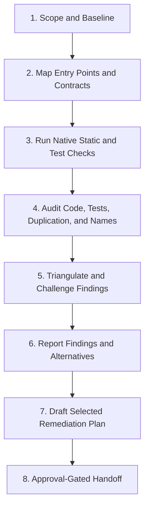

# Code Audit Protocol (Senior Software Developer Review)

**Shared rules:** Apply [`.agents/rules/shared-quality-gates.md`](../../rules/shared-quality-gates.md), including path, preservation, plan, verification, and delivery policies.

The auditor acts as a skeptical senior reviewer. Optimize for correctness and maintainability,
not finding count. Absence of a text reference is a lead, not proof that code is dead. Prefer a
small number of actionable findings over a large speculative inventory.

## Non-Negotiable Guardrails

1. **Read-only by default.** Do not edit source, tests, data, dependencies, configuration, or
   generated files during the audit. Present findings first. Remediation begins only after the
   user selects findings and approves an implementation plan under the shared quality gates.
2. **Preserve behavior.** Never recommend deletion, consolidation, or renaming without naming
   the public behavior and consumers that must remain unchanged.
3. **Prove reachability across boundaries.** Check static imports, barrel exports, package
   scripts, Vite entry points, registries, callbacks, string-key dispatch, supplemental JSON,
   assets, and test-only consumers before calling anything orphaned.
4. **Treat similarity as evidence, not a verdict.** Similar code may intentionally encode
   separate domain rules. Recommend abstraction only when it removes meaningful duplication
   without obscuring rules or coupling unrelated modules.
5. **Do not count generated or vendored content.** Exclude `node_modules/`, `dist/`, `coverage/`,
   `cache/`, `data/upstream/`, logs, snapshots, generated reports, and explicitly generated files
   unless the user asks to audit them.
6. **Respect architectural ownership and delivery priorities.** Keep `src/engine/` headless and
   card-specific behavior in `src/data/supplemental/`. Audit the full user-selected scope; use
   current roadmap and milestone gates to prioritize remediation, not to suppress findings.
7. **No drive-by fixes.** Security defects, gameplay bugs, documentation drift, card defects,
   and dependency vulnerabilities are findings to route to their owning skill, not silently fix.
8. **No speculative findings.** Every reported finding needs a reproducible check, exact paths
   and symbols, impact, confidence, and a concrete next action.
9. **Persist every audit.** Every run, including a clean audit with zero qualifying findings,
   must write a canonical Markdown report under `logs/reports/code-audit/`. The chat response is
   a summary, never the sole record. Do not place code-audit JSON directly in `logs/reports/`,
   where it could be mistaken for a user-submitted problem report.
10. **Preserve and transfer reports deliberately.** Never delete, prune, or overwrite a code-audit
    report. Because `logs/` is gitignored, reports are durable local artifacts, not repository-shared
    records. Before cleanup or cross-machine handoff, transfer the full report into a GitHub issue,
    attach it to the ticketing system, or copy it to a user-approved tracked documentation path.

## Audit Modes

| Mode      | Scope                                                 | Best use                             |
| --------- | ----------------------------------------------------- | ------------------------------------ |
| `focused` | Named file, folder, symbol, or subsystem              | Default when the user gives a target |
| `diff`    | Changed files plus direct callers, callees, and tests | Pull request or pre-commit review    |
| `full`    | All first-party source and tests                      | Periodic health review; highest cost |

Depth controls effort, not evidence standards:

- `quick`: static checks and high-confidence findings only.
- `standard`: static checks, local call-site tracing, tests, and history where ambiguity remains.
- `deep`: repository-wide relationships, coverage evidence, structural similarity, and trend risks.

Default to `focused --depth=standard`; if no scope is supplied, use `full --depth=standard`.

## Finding Taxonomy

| Code | Category                            | Look for                                                                                                  |
| ---- | ----------------------------------- | --------------------------------------------------------------------------------------------------------- |
| `C1` | Orphan or unreachable code          | Unreferenced exports/files, unreachable branches, stale registries, unused assets, abandoned adapters     |
| `C2` | Deprecated or superseded code       | Deprecated symbols still called, compatibility paths without consumers, code contradicting accepted ADRs  |
| `T1` | Orphan test                         | Test exercises no reachable production behavior or only tests a removed implementation detail             |
| `T2` | Duplicate or low-value test         | Same behavior and assertion boundary already covered; assertions that cannot fail meaningfully            |
| `T3` | Outdated or disabled test           | Superseded semantics, stale fixtures, skipped/todo/focused tests, commented assertions                    |
| `D1` | Exact duplication                   | Copied implementation or test setup with equivalent control flow and responsibility                       |
| `D2` | Structural similarity               | Parallel functions/classes that differ only by data, target, or strategy and may share an abstraction     |
| `N1` | Naming convention mismatch          | Case, plurality, file naming, trigger tense, primitive grammar, or component naming violation             |
| `N2` | Semantic naming mismatch            | Name no longer describes behavior, unit, ownership, lifecycle, or side effects                            |
| `A1` | Architecture boundary leak          | UI dependency in engine, card-specific engine branch, cross-layer import, duplicated source of truth      |
| `Q1` | Complexity or contract risk         | Excessive branching, mixed responsibilities, unsafe casts, broad types, swallowed errors, hidden mutation |
| `P1` | Dependency or configuration hygiene | Unused package, duplicate capability, stale script/config entry, production package used only in tooling  |

## Confidence and Severity

Score confidence independently from severity. Never raise confidence merely because impact is high.

| Confidence          | Required evidence                                                  | Action                              |
| ------------------- | ------------------------------------------------------------------ | ----------------------------------- |
| `95-100% Confirmed` | Direct static/runtime proof plus all relevant dynamic-entry checks | Report as actionable                |
| `80-94% Probable`   | Strong evidence with one unresolved dynamic or intent question     | Report as review-required           |
| `<80% Hypothesis`   | Pattern, smell, or incomplete reachability evidence                | Put in Open Questions, not findings |

Severity measures impact:

- **Critical:** active correctness, security, data-loss, or architecture-boundary failure.
- **High:** likely regression source, misleading test protection, or costly duplicated behavior.
- **Medium:** maintainability drag with a credible future failure mode.
- **Low:** local consistency or readability issue with limited blast radius.

Every finding must answer: What is wrong? What proves it? Why does it matter? What could make this
a false positive? What is the smallest safe remediation?

## The 8-Step Audit Lifecycle



### Step 1 - Scope and Baseline

1. Parse scope, mode, and depth. State exclusions.
2. Read `AGENTS.md`, the shared quality gates, relevant accepted ADRs, and the local coding guide.
3. Capture `git status --short`; preserve all pre-existing changes and distinguish them from audit output.
4. Inventory first-party source, tests, scripts, tools, and declared dependencies within scope.
5. Record the current branch or comparison base for `diff` mode. Do not assume `main`; verify it.
6. Reserve a new report path using
   `logs/reports/code-audit/YYYY-MM-DDTHH-mm-ssZ_<mode>_<scope-slug>.md`. Use UTC, sanitize the
   scope slug to lowercase ASCII kebab-case, use `repository` when no narrower scope exists, and
   never overwrite an earlier report; add `-2`, `-3`, and so on if a path already exists. Create
   the `logs/reports/code-audit/` directory when absent.

### Step 2 - Map Entry Points and Contracts

Build only the dependency map needed for the selected scope:

- Runtime entry points such as `src/main.tsx`, Vite configuration, workers, and lazy imports.
- `package.json` scripts and tool entry points.
- Import/export edges and barrel files.
- Registries, effect dispatchers, event handlers, string keys, Zod schemas, and supplemental data.
- Test discovery patterns, setup files, helpers, fixtures, and mocks.
- Public APIs and architecture boundaries established by accepted ADRs.

For each suspected orphan, perform an exact symbol/path search and inspect the nearest owner,
registry, and call site. Use `git log` or `git blame` only when current code cannot establish intent.

### Step 3 - Run Native Static and Test Checks

Use repository-native commands before proposing new tooling:

```powershell
npm run lint
npm run typecheck
npm test
npm run test:coverage
npm run build
```

Run the narrowest relevant command first. For a focused audit, prefer a targeted Vitest run and
targeted diagnostics, then widen only when needed. Record exact command results; do not claim
coverage, dead code, or build health from a command that was not run.

Also search for high-signal markers and bypasses:

- `@deprecated`, `deprecated`, `legacy`, `compat`, `TODO remove`, and superseded ADR references.
- `skip`, `todo`, focused tests, commented assertions, empty tests, and broad snapshots.
- `any`, unsafe assertions, `@ts-ignore`, lint disables, swallowed exceptions, and unreachable defaults.
- Naming vocabulary that violates `docs/coding_guidelines.md`, especially ADR-0058 taxonomy.

### Step 4 - Perform the Four Required Reviews

#### 4A. Orphaned and Deprecated Code

For every candidate:

1. Identify its definition, exports, and all static references.
2. Check indirect consumers: registries, scripts, callbacks, dynamic imports, string identifiers,
   supplemental declarations, serialization, and assets.
3. Check whether it is a supported public boundary or intentionally reserved extension point.
4. Compare deprecation claims with current call sites and accepted ADRs.
5. Classify separately as `unreferenced`, `unreachable`, `deprecated-in-use`, `superseded`, or
   `compatibility path`; these are not interchangeable.

Deletion is recommended only for a Confirmed finding with no runtime, tooling, data, test, or
documented public consumer.

#### 4B. Duplicate, Orphaned, and Outdated Tests

Evaluate tests by behavior and assertion boundary, not matching text alone:

1. Map each candidate test to reachable production behavior and its governing requirement or bug.
2. Compare setup, action, assertions, branch exercised, and failure message with neighboring tests.
3. Identify tests coupled only to implementation details or superseded architecture.
4. Detect disabled tests and duplicated names that make runner output ambiguous.
5. Use coverage as supporting evidence only. Execution coverage does not prove assertion quality,
   and no coverage does not prove a test is orphaned.
6. Preserve distinct regression tests when they document separate rules, prior defects, edge cases,
   identities, timing windows, or integration boundaries even if setup overlaps.

Prefer shared builders or table-driven cases for repeated setup/data. Do not merge tests when the
result would hide which rule failed.

#### 4C. Duplicate or Similar Functions and Classes

Review exact copies first, then structural similarity:

1. Compare responsibility, inputs, outputs, side effects, error behavior, and change cadence.
2. Determine whether differences are data, policy, domain rule, or accidental drift.
3. Recommend extraction when at least two implementations represent the same stable responsibility
   and the abstraction has a clear domain name. Three occurrences strengthen the case but are not
   a mechanical requirement.
4. Reject abstractions that add flags, weaken types, cross ownership boundaries, or obscure rules.
5. Offer alternatives: shared helper, parameterized strategy, table-driven data, composition, or
   intentional duplication with an explanatory test.

#### 4D. Inconsistent Naming

Check both syntax and meaning:

- Types/components: `PascalCase`; functions/methods: `camelCase`; constants: `UPPER_SNAKE_CASE`.
- Files follow the convention of their owning module; consistency within a module beats global churn.
- Trigger tense, primitive imperative form, plurality, and `CARD` token usage follow ADR-0058.
- Boolean names state a predicate (`is`, `has`, `can`, `should`) when that improves truth conditions.
- Units and identifiers are explicit where confusion is plausible (`damage`, `threat`, `playerId`).
- Names match current behavior and side effects; a convention-compliant misleading name is still a defect.

Before recommending a rename, enumerate references and identify serialized keys, locale keys, CSS
selectors, test IDs, saved data, external URLs, and public contracts that cannot be changed casually.

### Step 5 - Audit Additional Senior-Review Risks

Unless the user narrows the request to one lens, also inspect:

- **Architecture:** dependency direction, engine/UI separation, card-specific branching, duplicated truth.
- **Types and contracts:** impossible states, broad unions, unsafe casts, mutation, weak error handling.
- **Complexity:** mixed responsibilities, deep branching, oversized modules, temporal coupling.
- **Dependencies:** unused or misplaced packages, overlapping libraries, stale scripts and config.
- **Test portfolio:** missing boundary/error/negative tests, fixture realism, deterministic execution.
- **Operational quality:** diagnostics, actionable errors, local-first behavior, accessibility for UI code.

Do not turn generic preferences into findings. Tie each item to a repository rule, accepted ADR,
observable defect, measurable duplication, or credible maintenance failure mode.

### Step 6 - Triangulate and Challenge Findings

Before reporting a finding:

1. Seek one disconfirming explanation, such as dynamic registration, public API status, intentional
   domain separation, or a distinct regression history.
2. Verify the exact symbol and current line location.
3. Reproduce with the cheapest relevant static, test, build, or coverage check.
4. Reduce confidence when reachability, intent, generated status, or external consumption remains unknown.
5. Deduplicate related symptoms under one root-cause finding.

### Step 7 - Report Findings and Alternatives

Write the complete audit to the reserved report path before presenting the chat summary. Creating
this report is permitted by the read-only audit contract; it does not authorize changes to audited
source, tests, data, dependencies, or configuration.

The report must be self-contained and use this structure:

1. **Metadata:** report ID, generated-at UTC timestamp, status (`complete`, `partial`, or `blocked`),
   audit mode/depth/scope, exclusions, current roadmap or milestone context, branch, comparison
   base when applicable, HEAD commit, and whether the worktree was dirty.
2. **Executive Summary:** finding counts by severity/category and the recommended remediation order.
3. **Findings:** ordered by severity, then confidence, using the table below and detailed subsections.
4. **Open Questions:** hypotheses below 80% confidence and the evidence needed to resolve them.
5. **Healthy Patterns:** at most three evidenced practices worth preserving.
6. **Audit Coverage:** inspected paths, dynamic-entry checks, commands and outcomes, unavailable or
   failed checks, exclusions, and residual risk.
7. **Implementation Handoff:** ordered finding IDs, dependency relationships, suggested owning
   skill, exact verification commands for a developer or agent, and a retention note stating that
   the report is gitignored and must be transferred to an issue or approved tracked artifact for
   cross-machine collaboration.

Use stable finding IDs scoped to the report: `<REPORT-ID>-F001`, `<REPORT-ID>-F002`, and so on,
where `REPORT-ID` is `AUD-YYYYMMDD-HHMMSS`. Never renumber IDs after writing the report. Lead with
findings ordered by severity, then confidence. Use this table:

| ID  | Severity | Confidence | Category | Location | Evidence and impact | Recommendation |
| --- | -------- | ---------- | -------- | -------- | ------------------- | -------------- |

For each finding, include:

- Exact paths and symbols.
- Evidence and command result.
- False-positive check performed.
- Smallest safe remediation and affected tests.
- `Effort: S/M/L` and blast-radius tier.
- Ticket-ready title, problem statement, acceptance criteria, suggested owner skill, dependencies,
  and roadmap/milestone impact. The report must contain enough context to implement the finding
  without relying on the original chat transcript.

Then provide:

1. **Open Questions:** hypotheses below 80% confidence and the missing evidence.
2. **Healthy Patterns:** at most three practices worth preserving, only when evidenced.
3. **Remediation Order:** correctness and misleading tests first, then dead code, duplication,
   naming, and low-impact cleanup.
4. **Audit Coverage:** inspected scope, exclusions, commands run, failed/unavailable checks, and residual risk.

If no findings qualify, say so clearly. Never manufacture minor findings to make the audit appear useful.
Still write the report with zero counts, completed coverage, open questions, and residual risks.
In the final chat response, link the report and summarize its highest-priority findings and status.

### Step 8 - Approval-Gated Remediation Handoff

Do not modify audited code in the same pass. Use the persisted report and stable finding IDs as the
handoff contract. Ask the user which findings to address. For selected items:

1. Create or update a reviewable implementation plan without overwriting unrelated plan content.
2. State behavior preservation, exact files, migration/rename risks, tests, UI/Card Editor impact,
   blast-radius tier, and rollback approach.
3. Route defects to `bug-fix`, card-specific changes to `card-integration-protocol`, generic new
   capabilities to `feature-delivery`, docs drift to `documentation-audit`, dependency alerts to
   `dependabot`, and approved work to `execute-plan`.
4. Reference the report path and selected finding IDs in implementation plans, issues, and tickets.
5. Stop for explicit approval before implementation. Commit and push remain separately authorized.

## Tooling Policy

Perform the audit with the repository's existing toolchain and available workspace analysis:

- TypeScript type checking and compiler diagnostics.
- ESLint diagnostics, including unused declarations and disable directives.
- Vitest focused tests, full tests, and coverage when required by the selected depth.
- Production build output.
- Exact repository search, import/export tracing, symbol references, and local call-site analysis.
- Git history only when current code cannot establish intent.

Do not install dependencies, add analyzers, or modify configuration during the read-only audit.
The audit may recommend a tool or library as one remediation option when a confirmed problem is
better solved by adopting a proven capability than by maintaining custom code. Such a recommendation
must be tied to a specific finding; never propose tooling merely because it is popular or available.

For each proposed tool or library, the report must include:

- The affected classes, functions, or architectural responsibility and the concrete deficiency.
- A comparison of at least three options: retain and improve the current implementation, adopt the
  proposed dependency, and one credible alternative when available.
- Benefits and limitations of each option, with a clear recommendation and rationale.
- Compatibility with the project's architecture, TypeScript/Vite/Vitest stack, local-first policy,
  browser/runtime targets, licensing, maintenance health, security posture, and release cadence.
- Dependency weight, bundle/runtime impact, transitive dependencies, API stability, configuration
  burden, migration effort, lock-in, failure modes, and ongoing ownership cost.
- A migration outline, affected tests, rollback path, blast-radius tier, and measurable acceptance
  criteria proving that adoption improves the identified problem.

Prefer the standard library and existing dependencies when they solve the problem adequately. A new
dependency must provide material correctness, reliability, maintainability, performance, or security
value that outweighs its lifecycle cost. Installation or architectural adoption requires a separate
approval-gated implementation plan; dependency security findings route through `dependabot`.

If the existing toolchain cannot verify a candidate finding, lower its confidence, record the
limitation and missing evidence in the report, and classify it as an Open Question when confidence
falls below 80%. Do not recommend a tool solely to raise confidence in an otherwise unsupported claim.

## Prompt Examples

- `code-audit: src/engine/effects --depth=deep`
- `code-audit: tests/engine for duplicate and outdated tests`
- `code-audit: --mode=diff --depth=standard`
- `code-audit: full repository, report only`
