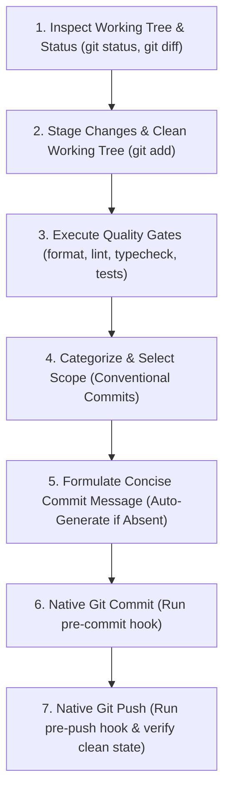

# 🚀 Commit-and-Push Protocol (Clean Delivery & Quality Gate Workflow)

**Path Policy:** Use repository-relative paths (`src/engine/`, `docs/`, `.githooks/`) for all local project files. Never use personal filesystem paths, drive-letter paths, `file:///` links, or `vscode://` links.

**Command Execution Policy:** Execute CLI commands natively directly in the environment shell without wrapping in `powershell -Command "..."` or `powershell -NoProfile -Command "..."`.

This skill provides an automated, foolproof workflow to stage, verify, format, categorize, commit, and push changes to remote with zero broken commits or failing hooks.

---

## 📋 The 7-Step Commit-and-Push Lifecycle



---

## 🔍 Step 1: Inspect Working Tree & Changes

1. Run `git status` to detect staged, unstaged, and untracked files.
2. Run `git diff` and `git diff --cached` to inspect the exact lines of code changed.
3. Verify that no unwanted files (e.g. debug scripts in `scratch/`, OS artifacts, temporary logs) are inadvertently staged.

---

## 📦 Step 2: Stage Target Changes

1. If files are unstaged, stage intentional changes:
   - For complete feature/fix deliveries: `git add .`
   - For selective commits: `git add <file1> <file2> ...`
2. If supplemental card data (`src/data/supplemental/`) was modified:
   - **Always run:** `npm run report:declarations`
   - Stage the updated report: `git add docs/reports/supplemental_declarations_usage_report.md`

---

## 🛡️ Step 3: Run Automated Quality Gates

Before committing, run the project's quality verification pipeline:

1. **Prettier Format Check:**
   ```sh
   npm run format:check
   ```
   *Auto-Recovery:* If formatting issues are found, automatically run `npm run format` and stage the re-formatted files (`git add .`).

2. **ESLint Static Analysis:**
   ```sh
   npm run lint
   ```
   *Requirement:* Must exit with 0 errors and 0 warnings (`--max-warnings 0`).

3. **TypeScript Typecheck:**
   ```sh
   npm run typecheck
   ```
   *Requirement:* Must compile cleanly with 0 TypeScript diagnostics (`tsc --noEmit`).

4. **Automated Test Suite:**
   ```sh
   npm test
   ```
   *Requirement:* All unit, integration, and contract tests must pass.

---

## 🏷️ Step 4: Category & Scope Selection Matrix

Select the appropriate Conventional Commits category and scope based on the modified files:

### Category Table

| Category | Usage & Criteria | Example Scenarios |
| :--- | :--- | :--- |
| `feat` | New capability, effect primitive, mechanic, UI component, or rule | Adding `SUFFERED_DAMAGE`, new card ability, form toggle |
| `fix` | Correcting a defect, rule violation, wrong target, or regression | Fixing cost calculation, card timing, missing status check |
| `test` | Adding, updating, or fixing tests without source code change | Adding contract tests, fixing test flakiness, determinism |
| `docs` | Documentation updates, specifications, ADRs, report updates | Updating roadmap, README, rules references, ADR records |
| `refactor` | Code reorganization or optimization with zero functional change | Extracting helper functions, renaming internal variables |
| `style` | Code style, Prettier formatting, semicolon adjustments | Formatting files, fixing trailing spaces |
| `chore` | Maintenance tasks, dependencies, git hooks, build configs | Updating `.githooks`, `package.json`, Vite config |

### Scope Matrix

| Subsystem Modified | Recommended Scope |
| :--- | :--- |
| `src/engine/` (State, actions, combat, triggers, phases) | `(engine)` |
| `src/ui/` (Components, views, modals, layouts, styles) | `(ui)` |
| `src/data/supplemental/` (Pack JSONs, card declarations) | `(data)` |
| `src/data/importer/` (Card loader, normalization, i18n) | `(importer)` |
| `src/tools/` or `tools/` (Analyzers, CLI tools, scripts) | `(tooling)` |
| `docs/` (Specs, guides, ADRs, roadmaps, reports) | `(docs)` |
| `.githooks/` or `.github/` (Hooks, workflows, CI) | `(hooks)` or `(ci)` |
| Test files in `tests/` across subsystems | `(tests)` or matching subsystem scope |

---

## ✍️ Step 5: Formulate Concise Commit Message

### 1. If Description Was Provided by User:
- Normalize into Conventional Commits: `<category>(<scope>): <Description in imperative mood>`
- Check if an open GitHub issue relates to the task; append `(Fixes #X)` or `(Closes #X)` if applicable.

### 2. If Description Was NOT Provided by User:
Analyze the staged git diff and synthesize a concise, informative title adhering to these rules:
- **Imperative Mood:** Use "Add", "Fix", "Implement", "Update" (never "Added", "Fixing", "Updated").
- **Length Constraint:** Header must be $\le 72$ characters.
- **Accurate Scope:** Reference the primary subsystem or card code (e.g. `fix(data): Update Gamma Slam target to CHOSEN_ENEMY`).
- **Detailed Body (Optional):** For multi-file changes, include a bulleted summary of key changes below the header.

### 3. Propose to User (or Confirm):
When running interactively, present the formulated message:
```text
Proposed Commit:
  category: <category>
  scope:    <scope>
  message:  <category>(<scope>): <description>
```

---

## 🔨 Step 6: Native Git Commit

Execute the commit command natively:

```sh
git commit -m "<category>(<scope>): <description>"
```

*Note:* The pre-commit hook in `.githooks/pre-commit` will automatically execute `format:check`, `lint`, and `typecheck`. Verify that it passes with code 0.

---

## 🚀 Step 7: Native Git Push & Final Verification

1. Push to the remote tracking branch:
   ```sh
   git push origin main
   ```
2. Verify the pre-push hook executes `npm test` cleanly.
3. Run `git status` to verify:
   - Working tree is clean (`nothing to commit, working tree clean`).
   - Branch is up to date with remote (`Your branch is up to date with 'origin/main'`).
4. Append timestamped execution log to `logs/skills/commit_and_push_{YYYY-MM-DD}.log`:
   ```text
   YYYY-MM-DDTHH:mm:ss.sssZ [COMMIT] <commit_hash> - <commit_message>
   YYYY-MM-DDTHH:mm:ss.sssZ [PUSH] Pushed to origin/main successfully. Working tree clean.
   ```
