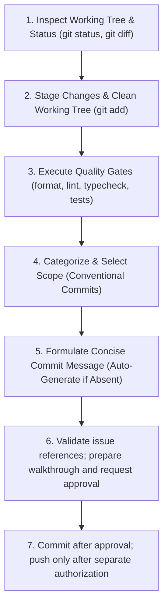

# 🚀 Commit-and-Push Protocol (Clean Delivery & Quality Gate Workflow)

**Path Policy:** Use repository-relative paths (`src/engine/`, `docs/`, `.githooks/`) for all local project files. Never use personal filesystem paths, drive-letter paths, `file:///` links, or `vscode://` links.

**Shared rules:** Apply [`.agents/rules/shared-quality-gates.md`](../../rules/shared-quality-gates.md), including path, command, verification, and delivery authorization policies.

**Command Execution Policy:** Execute CLI commands natively directly in the environment shell without wrapping in `powershell -Command "..."` or `powershell -NoProfile -Command "..."`.

This skill provides an approval-gated workflow to stage, verify, format, categorize, commit, and push changes to remote with explicit issue-state checks and no hidden staging or delivery scope.

---

## Commit Preparation Lifecycle



---

## 🔍 Step 1: Inspect Working Tree & Changes

1. Run `git status` to detect staged, unstaged, and untracked files.
2. Run `git diff` and `git diff --cached` to inspect the exact lines of code changed.
3. Verify that no unwanted files (e.g. debug scripts in `scratch/`, OS artifacts, temporary logs) are inadvertently staged.
4. Record the intended file set. Do not silently absorb unrelated staged or unstaged changes.

---

## 📦 Step 2: Stage Target Changes

1. If files are unstaged, stage intentional changes:
   - For complete feature/fix deliveries: stage the reviewed file list explicitly.
   - For selective commits: `git add <file1> <file2> ...`
2. If supplemental card data (`src/data/supplemental/`) was modified:
   - **Always run:** `npm run report:declarations`
   - Stage the updated report: `git add docs/reports/supplemental_declarations_usage_report.md`
3. Re-run `git diff --cached --name-status` and confirm every staged path belongs to the intended file set.
4. Never use `git add .` or a formatter's broad staging command as automatic recovery; review and stage only the files intentionally changed by this task.

---

## 🛡️ Step 3: Run Automated Quality Gates

Before committing, run the project's quality verification pipeline:

1. **Prettier Format Check:**

   ```sh
   npm run format:check
   ```

   _Recovery:_ If formatting issues are found, format only the reviewed file set, inspect the diff, and stage only the intended files.

2. **ESLint Static Analysis:**

   ```sh
   npm run lint
   ```

   _Requirement:_ Must exit with 0 errors and 0 warnings (`--max-warnings 0`).

3. **TypeScript Typecheck:**

   ```sh
   npm run typecheck
   ```

   _Requirement:_ Must compile cleanly with 0 TypeScript diagnostics (`tsc --noEmit`).

4. **Automated Test Suite (Zero Skipped Tests Invariant):**
   ```sh
   npm test
   ```
   _Requirement:_ All unit, integration, and contract tests must pass with **0 failures and 0 skipped tests** (`passed: N, failed: 0, skipped: 0`). Any skipped test (`it.skip`, `describe.skip`, `test.skip`, `it.todo`) is tech debt and strictly blocks commit and push until resolved or pruned. Tests must strictly pass or fail: no lingering code, no lingering problems.

---

## 🏷️ Step 4: Category & Scope Selection Matrix

Select the appropriate Conventional Commits category and scope based on the modified files:

### Category Table

| Category   | Usage & Criteria                                                  | Example Scenarios                                          |
| :--------- | :---------------------------------------------------------------- | :--------------------------------------------------------- |
| `feat`     | New capability, effect primitive, mechanic, UI component, or rule | Adding `SUFFERED_DAMAGE`, new card ability, form toggle    |
| `fix`      | Correcting a defect, rule violation, wrong target, or regression  | Fixing cost calculation, card timing, missing status check |
| `test`     | Adding, updating, or fixing tests without source code change      | Adding contract tests, fixing test flakiness, determinism  |
| `docs`     | Documentation updates, specifications, ADRs, report updates       | Updating roadmap, README, rules references, ADR records    |
| `refactor` | Code reorganization or optimization with zero functional change   | Extracting helper functions, renaming internal variables   |
| `style`    | Code style, Prettier formatting, semicolon adjustments            | Formatting files, fixing trailing spaces                   |
| `chore`    | Maintenance tasks, dependencies, git hooks, build configs         | Updating `.githooks`, `package.json`, Vite config          |

### Scope Matrix

| Subsystem Modified                                       | Recommended Scope                     |
| :------------------------------------------------------- | :------------------------------------ |
| `src/engine/` (State, actions, combat, triggers, phases) | `(engine)`                            |
| `src/ui/` (Components, views, modals, layouts, styles)   | `(ui)`                                |
| `src/data/supplemental/` (Pack JSONs, card declarations) | `(data)`                              |
| `src/data/importer/` (Card loader, normalization, i18n)  | `(importer)`                          |
| `src/tools/` or `tools/` (Analyzers, CLI tools, scripts) | `(tooling)`                           |
| `docs/` (Specs, guides, ADRs, roadmaps, reports)         | `(docs)`                              |
| `.githooks/` or `.github/` (Hooks, workflows, CI)        | `(hooks)` or `(ci)`                   |
| Test files in `tests/` across subsystems                 | `(tests)` or matching subsystem scope |

---

## ✍️ Step 5: Formulate Concise Commit Message

### 1. If Description Was Provided by User:

- Normalize into Conventional Commits: `<category>(<scope>): <Description in imperative mood>`
- Check if an open GitHub issue relates to the task; append `(Fixes #X)` or `(Closes #X)` if applicable.

### 2. If Description Was NOT Provided by User:

Analyze the staged git diff and synthesize a concise, informative title adhering to these rules:

- **Imperative Mood:** Use "Add", "Fix", "Implement", "Update" (never "Added", "Fixing", "Updated").
- **Length Constraint:** Header must be $\le 72$ characters.
- **Accurate Scope:** Reference the primary subsystem or card code (e.g. `fix(data): Update Gamma Slam target to CHOSEN_ENEMY`).
- **Detailed Body (Optional):** For multi-file changes, include a bulleted summary of key changes below the header.

### 3. Propose to User (or Confirm):

When running interactively, present the formulated message:

```text
Proposed Commit:
  category: <category>
  scope:    <scope>
  message:  <category>(<scope>): <description>
```

---

## Step 6: Issue Integrity, Commit, and Walkthrough

Before presenting the final walkthrough, inspect issue references in the staged diff and proposed commit message.

1. Extract explicit references such as `Fixes #123`, `Closes #123`, `Refs #123`, and `Issue #123`. Do not treat card IDs, ADR numbers, or arbitrary `#` text as GitHub issue references.
2. If no issue references exist, record `Issue validation: not applicable` and continue.
3. If references exist, confirm GitHub CLI availability and authentication with `gh auth status`.
4. Query every referenced issue:

   ```sh
   gh issue view <NUM> --json number,state,title,url
   ```

5. Before commit, enforce these conditions:
   - `Fixes` and `Closes` references point to an existing **open** issue.
   - `Refs` and informational references point to an existing issue; either state is valid.
   - A closed issue must not receive a new `Fixes` or `Closes` trailer. Change it to `Refs` or obtain explicit user approval for the exception.
6. If GitHub is unavailable or unauthenticated, stop before committing when issue references require validation. Report the exact limitation; do not claim validation succeeded.
7. Include the issue validation results in the walkthrough and verification recap. Ask for user confirmation before committing.

After confirmation, execute the commit command natively:

```sh
git commit -m "<category>(<scope>): <description>"
```

_Note:_ The pre-commit hook in `.githooks/pre-commit` will automatically execute `format:check`, `lint`, and `typecheck`. Verify that it passes with code 0.

---

## 🚀 Step 7: Native Git Push & Final Verification

1. Push to the remote tracking branch only after separate explicit authorization:
   ```sh
   git push origin main
   ```
2. Verify the pre-push hook executes `npm test` cleanly with **0 failures and 0 skipped tests** (`passed: N, failed: 0, skipped: 0`).
3. Re-query every referenced issue after push:
   ```sh
   gh issue view <NUM> --json number,state,closedAt,title,url
   ```
   - For `Fixes` and `Closes`, verify the issue is now `CLOSED`.
   - For `Refs` and informational references, report the current state and URL; do not claim the issue was closed.
   - If the expected state is not reached, report the post-push discrepancy explicitly instead of treating the delivery as fully verified.
4. Run `git status` to verify:
   - Working tree is clean (`nothing to commit, working tree clean`).
   - Branch is up to date with remote (`Your branch is up to date with 'origin/main'`).
