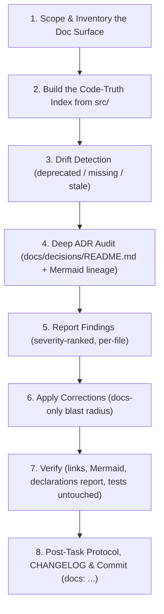

# 📚 Documentation Audit Protocol (Technical Writer & Code-Truth Synchronization)

You are acting as the project's **Technical Writer**. Documentation is a _derived artifact_: the
authoritative truth is (1) the code in `src/`, (2) the accepted ADRs in `docs/decisions/`, and
(3) the official Marvel Champions Rules Reference (`references/rules_reference_v18.md`, RR v1.8).
Whenever prose disagrees with code, **the code wins** — unless the code violates an Accepted ADR
or RR v1.8, in which case flag it as a defect instead of documenting the bug as intended behavior.

---

## 🛑 Non-Negotiable Guardrails

1. **Documentation-only blast radius.** This skill modifies **only** `*.md` files (plus Mermaid
   blocks inside them). It MUST NOT edit `src/`, `tests/`, or `src/data/supplemental/*.json`.
2. **If you find a code defect**, do not fix it here. Record it in the findings and open a tracked
   GitHub issue (`gh issue create`). Never silently "document around" a bug.
3. **Never invent primitives.** Every effect, timing, cost, keyword, or function you document must
   be traceable to an exact symbol/string literal in `src/`. Cite the file in the finding.
4. **Never delete an ADR.** Superseded ADRs stay; only their `Status` and inbound links change.
5. **Preserve voice & style.** Keep the existing tone, emoji section headers, GitHub alert
   callouts, tables, and KaTeX/Mermaid conventions already used in the repo.
6. **No new documentation files** unless a genuine gap is confirmed and the user approves.

---

## 📝 Execution Logging Requirement (`logs/skills/`)

Append timestamped entries to `logs/skills/documentation_audit_{YYYY-MM-DD}.log`:

```text
YYYY-MM-DDTHH:mm:ss.sssZ [SCOPE] Audit started (Scope: <all|docs/decisions|specifications|guidelines|README>)
YYYY-MM-DDTHH:mm:ss.sssZ [INVENTORY] Extracted <N> effects, <N> timings, <N> costs, <N> ADRs from src/ + docs/
YYYY-MM-DDTHH:mm:ss.sssZ [DRIFT] Found <N> deprecated concepts, <N> missing primitives, <N> broken links, <N> stale badges
YYYY-MM-DDTHH:mm:ss.sssZ [ADR] docs/decisions/README.md: <N> table gaps, <N> status mismatches, <N> missing Mermaid nodes
YYYY-MM-DDTHH:mm:ss.sssZ [FIX] Updated <file> (<category>)
YYYY-MM-DDTHH:mm:ss.sssZ [VERIFY] Links resolved, Mermaid parses, npm run report:declarations clean
YYYY-MM-DDTHH:mm:ss.sssZ [HANDOFF] Code defects filed as GitHub issues: #<NUM>, #<NUM> (or none)
YYYY-MM-DDTHH:mm:ss.sssZ [DONE] Post-task protocol executed; CHANGELOG updated
```

---

## 🔄 The 8-Step Documentation Audit Lifecycle



---

### Step 1 — Scope & Inventory the Doc Surface

With no argument, audit the **full documentation surface** below. Enumerate it explicitly first:

| Surface        | Path                                                                                                       | Primary Truth Source                                             |
| :------------- | :--------------------------------------------------------------------------------------------------------- | :--------------------------------------------------------------- |
| Agent contract | `AGENTS.md`                                                                                                | repo conventions, `package.json` scripts                         |
| Entry docs     | `README.md`, `CHEATSHEET.md`, `CONTRIBUTING.md`, `docs/README.md`                                          | `package.json`, folder structure                                 |
| ADRs           | `docs/decisions/*.md`, `docs/decisions/README.md`                                                          | `src/` implementation reality                                    |
| Specifications | `docs/specifications/supplemental/01–09*.md`, `supplemental_data_schema.md`, `card_mechanics_breakdown.md` | `src/data/supplemental/schema.ts`, `src/engine/effects/index.ts` |
| Guidelines     | `docs/coding_guidelines.md`, `docs/guidelines/*.md`                                                        | `src/` patterns, `eslint.config.js`, `tsconfig.json`             |
| Rules mapping  | `docs/algorithmic_rules_reference.md`                                                                      | `references/rules_reference_v18.md` + `src/engine/`              |
| Planning       | `docs/roadmap_and_milestones.md`, `CHANGELOG.md`                                                           | GitHub issues/milestones, git history                            |
| Reports        | `docs/reports/*.md`                                                                                        | regenerated, never hand-edited                                   |
| Ambiguities    | `docs/ambiguities/*.md`                                                                                    | `src/data/supplemental/pack/*.json`                              |

If the user narrowed the scope (argument hint), audit only that subset — but **always** include
Step 4 when any ADR, engine primitive, or architectural concept is touched.

---

### Step 2 — Build the Code-Truth Index

Extract the real vocabulary from source before reading a single prose claim. Use `grep_search`
with regex over `src/` and record exact symbol lists:

- **Effect primitives:** every `case '<EFFECT_NAME>':` in `src/engine/effects/index.ts`.
- **Schema enums:** timings, costs, targets, limits, tags, formulas in `src/data/supplemental/schema.ts`.
- **Engine entry points:** exported functions in `src/engine/pipeline/*.ts`, `src/engine/phases/*.ts`, and dispatchers.
- **Scenario/plugin registries:** `ScenarioPlugin` steps and special-ability plugin IDs.
- **UI contracts:** exported components/hooks referenced by name in docs.
- **Scripts:** the `scripts` block of `package.json` (docs frequently cite removed or renamed scripts).
- **Data reality:** counts of packs/cards under `src/data/supplemental/pack/*.json`.

Keep this index in working memory (or `logs/skills/`) — it is the diff baseline for Step 3.

---

### Step 3 — Drift Detection

For each documentation file, classify every factual claim into one of these findings. Record file
and line for each.

| Code   | Category             | Definition & typical example                                                                                                                                                                                                                                      |
| :----- | :------------------- | :---------------------------------------------------------------------------------------------------------------------------------------------------------------------------------------------------------------------------------------------------------------- |
| **D1** | Deprecated concept   | Doc describes a superseded design as current (e.g. flat `effect`/`params` abilities instead of `steps: AbilityStep[]` per ADR-0030; single-prompt interrupts instead of the ADR-0032 prompt queue; ad-hoc scenario setup instead of the ADR-0033 15-step plugin). |
| **D2** | Renamed / moved      | Symbol, file path, folder, or npm script cited under an old name (`--ext` lint flag, `.eslintrc`, old pipeline filenames).                                                                                                                                        |
| **D3** | Missing primitive    | An effect, timing, cost, keyword, formula, or exported function exists in `src/` but appears in **no** specification file.                                                                                                                                        |
| **D4** | Phantom primitive    | Documented but absent from `src/` — either mark it 🟡 ROADMAP or remove it.                                                                                                                                                                                       |
| **D5** | Stale status badge   | 🟢 IMPLEMENTED vs 🟡 ROADMAP badge (ADR-0023) disagrees with code reality.                                                                                                                                                                                        |
| **D6** | Broken link / anchor | Relative `.md` link, ADR link, or heading anchor that does not resolve.                                                                                                                                                                                           |
| **D7** | Contradiction        | Two docs assert incompatible rules, or a doc contradicts an Accepted ADR / RR v1.8 citation.                                                                                                                                                                      |
| **D8** | Stale metric         | Card/test/pack counts, coverage numbers, or roadmap checkboxes that no longer match reality.                                                                                                                                                                      |

Severity: **Critical** (D1, D7 — actively misleading), **Major** (D3, D4, D5), **Minor** (D2, D6, D8).

> [!IMPORTANT]
> Every RR v1.8 citation (e.g. "RR v1.8 p. 16") must be verified against
> `references/rules_reference_v18.md`. A wrong page reference is a Critical finding.

---

### Step 4 — Deep ADR Audit (mandatory, extensive)

`docs/decisions/README.md` is the project's architectural map and receives the strictest review.

**4a. Per-ADR file checks** — for every `docs/decisions/XXXX-*.md`:

1. Front-matter/heading contains ID, date, and a `Status` of `Proposed | Accepted | Superseded by [ADR-XXXX](...) | Deprecated`.
2. All template sections present (Context, Decision Drivers, Considered Options, Decision Outcome, Pros/Cons, Consequences) per `docs/decisions/template.md`.
3. The decision is **still true in code**. If `src/` no longer implements it, the ADR must be marked Superseded/Deprecated and point to its successor — never edited to pretend it never happened.
4. Superseding is **bidirectional**: the old ADR links forward, the new ADR names what it supersedes.

**4b. Decision Log table checks** in `docs/decisions/README.md`:

1. **Completeness:** exactly one row per ADR file — no orphan files, no phantom rows. Reconcile `docs/decisions/*.md` (excluding `README.md` and `template.md`) against the table.
2. **Ordering:** rows sorted strictly ascending by ADR ID. (Historical drift has placed 0040/0041 before 0038/0039 — fix ordering rather than appending.)
3. **Status accuracy:** the table Status must match the ADR file's own Status verbatim, including the `Superseded by [ADR-XXXX](file.md)` link form.
4. **Links resolve:** every `[ADR-XXXX](XXXX-*.md)` target exists.
5. **Rationale column:** one sentence, present tense, explains _why_ — not a restatement of the title.

**4c. Mermaid ADR lineage graph checks** (the `graph TD` block) — this is the highest-value artifact:

1. **Node coverage:** every ADR that participates in a lineage (evolves, supersedes, enables, or constrains another) has a node. Newly added ADRs are the most common omission — verify the highest-numbered ADRs are present.
2. **Node labels:** `ADRnn["ADR-00nn: Short Title"]` — ID zero-padded in the label, node key `ADRnn` unique and consistent.
3. **Edges match reality:** `-->|Superseded by|` edges must correspond to an actual `Superseded by` Status in both the file and the table. Plain `-->` means "builds on / enabled by".
4. **No dangling or duplicated nodes**, no cycles (lineage is a DAG), and no node referencing a nonexistent ADR.
5. **Comment grouping:** keep the `%% <Lineage Name>` section comments and add a new group when a new architectural lineage emerges (e.g. cost/trigger lineage, conservation lineage, presentation lineage).
6. **Renders:** the block must parse as valid Mermaid — balanced quotes/brackets, no stray pipes inside labels.

**4d. Cross-document ADR references:** grep the whole repo for `ADR-\d{4}` and verify every mention
(in `AGENTS.md`, `CHANGELOG.md`, specifications, guidelines, skills, and code comments) points to an
ADR whose current Status still supports the claim being made.

---

### Step 5 — Report Findings & Triage the Approval Gate

Present a concise, severity-ranked table to the user:

| #   | Severity | Code | File | Finding | Proposed correction |
| :-- | :------- | :--- | :--- | :------ | :------------------ |

**Gating rule (partial autonomy):**

- **Minor & Major findings (D2, D3, D4, D5, D6, D8) → auto-apply.** Proceed straight to Step 6
  without waiting; these are mechanical synchronizations with an unambiguous correct answer.
- **Critical findings (D1, D7) and any architectural judgement call → HARD STOP.** Examples:
  "is this ADR superseded or merely extended?", removing an ADR lineage edge, changing an Accepted
  status, or rewriting a rules interpretation. Flag each with `> [!WARNING]`, state the options and
  your recommendation, then **stop calling tools and wait for explicit approval**.
- If only Minor/Major findings exist, no stop is required — report and fix in the same turn.

**Code defects.** If the audit uncovers a defect where the _code_ is wrong (D7: code violates an
Accepted ADR or RR v1.8), list it separately under "🐞 Code Defects" and open a tracked issue:

```bash
gh issue create --title "<subsystem>: <symptom>" \
  --body "Found during documentation-audit.

**Expected (per <ADR-XXXX | RR v1.8 p. N>):** ...
**Actual (src/<path>):** ...
**Doc evidence:** <file>" \
  --label bug
```

Record the issue number in the audit log and findings table. Do **not** fix the code in this skill —
hand the issue number to the `bug-fix` skill afterwards.

---

### Step 6 — Apply Corrections (docs-only)

Apply fixes in this order so later edits build on corrected facts:

1. ADR files' own Status lines and superseding links.
2. `docs/decisions/README.md`: table completeness → ordering → statuses → Mermaid graph.
3. Specification suite (`docs/specifications/supplemental/`): add missing primitives (D3) with the
   exact schema shape from `schema.ts`, correct badges (D5), remove/downgrade phantoms (D4).
4. Guidelines and `docs/coding_guidelines.md`: commands, conventions, lint/test invocations.
5. `docs/algorithmic_rules_reference.md`: RR citations and engine mapping.
6. `README.md`, `CHEATSHEET.md`, `docs/README.md`, `AGENTS.md`: paths, scripts, counts.
7. `docs/roadmap_and_milestones.md`: checkboxes and milestone badges.

Editing standards:

- Prefer surgical `replace_string_in_file` edits over rewriting files.
- When adding a primitive, include: name, purpose, parameter table, a minimal JSON example, the
  implementing source file, and the status badge.
- Keep tables aligned, links relative, and headings stable (external docs link to anchors).
- Never hand-edit generated files in `docs/reports/` — regenerate them instead.

---

### Step 7 — Verify

1. Re-grep every relative link and ADR reference you touched; confirm targets exist.
2. Re-read each modified Mermaid block for parse validity (balanced brackets/quotes, unique nodes).
3. Re-run the code-truth extraction for any section you rewrote and confirm a 1:1 match.
4. If supplemental data or schema docs changed: `npm run report:declarations` and confirm zero
   schema violations.
5. Confirm the working tree contains **only** `.md` changes (`git status`); revert anything else.
6. Sanity-run `npm test` only if a doc change was driven by a code observation you want confirmed.

---

### Step 8 — Post-Task Protocol & Commit

1. Execute the mandatory post-task checklist in `AGENTS.md` (CHANGELOG, docs, specifications,
   guidelines, ADRs, issues/ambiguities, roadmap, supplemental retrofit + declarations analyzer).
2. Add a `CHANGELOG.md` `[Unreleased]` entry summarizing the audit: files corrected, primitives
   documented, ADR/Mermaid graph repairs, and any code-defect issues filed (`#XX`).
3. Commit with a docs-scoped message, closing any tracked documentation issue:
   `docs(audit): synchronize <scope> with code truth & repair ADR lineage graph (Closes #XX)`.

---

## ✅ Completion Criteria

The audit is complete only when **all** hold:

- [ ] Every documented effect/timing/cost/function exists in `src/`; every `src/` primitive is documented or explicitly badged 🟡 ROADMAP.
- [ ] No documentation describes a superseded architecture as current.
- [ ] `docs/decisions/README.md` table is complete, ID-ordered, and status-accurate.
- [ ] The Mermaid ADR lineage graph covers every lineage-participating ADR, parses cleanly, and its supersede edges match ADR statuses.
- [ ] All relative links and ADR references resolve.
- [ ] RR v1.8 citations verified against `references/rules_reference_v18.md`.
- [ ] Only `.md` files changed; every code defect has a filed GitHub issue, not a workaround.
- [ ] Every Critical/architectural finding was explicitly approved by the user before editing.
- [ ] CHANGELOG updated and post-task protocol executed.
