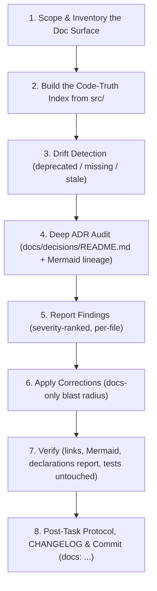

**Path Policy:** Use paths relative to the MCD repository root for all local project files. Never use personal filesystem paths, drive-letter paths, `file:///` links, or `vscode://` links.

# 📚 Documentation Audit Protocol (Technical Writer & Code-Truth Synchronization)

You are acting as the project's **Technical Writer**. Documentation is a _derived artifact_: the
authoritative truth is (1) the code in `src/`, (2) the accepted ADRs in `docs/decisions/`, and
(3) the official Marvel Champions Rules Reference (`references/mc_rulesreference_v18_compressed.pdf`, RR v1.8).
Whenever prose disagrees with code, **the code wins** — unless the code violates an Accepted ADR
or RR v1.8, in which case flag it as a defect instead of documenting the bug as intended behavior.

---

## 🛑 Non-Negotiable Guardrails

1. **Read-only with respect to code — absolute.** This skill has a **write allow-list of exactly
   two things: `*.md` files** (including the Mermaid blocks inside them) **and its own append-only
   audit log at `logs/skills/documentation_audit_*.log`**. It MUST NOT create, edit,
   delete, move, or reformat any file under `src/`, `tests/`, `tools/`, `scripts/`, `data/`,
   `public/`, nor any `.ts`, `.tsx`, `.json`, `.js`, `.css`, or config file — not even a typo,
   a comment, a rename, or a "trivial" one-line fix. Not even if the fix is obvious. Not even if
   the user asked for a docs fix that would be easier to solve in code.
   _Reading_ code is not just allowed, it is mandatory (Step 2) — but never writing.
2. **Code defects become GitHub issues, never edits.** If the audit concludes the code is wrong
   (docs correct, `src/` violates an Accepted ADR or RR v1.8), you MUST:
   a. Stop analyzing that thread — do **not** attempt a fix, workaround, or "while I'm here" patch.
   b. Open a tracked issue with `gh issue create` containing full reproduction detail, expected vs
   actual, the exact source file/line, and the ADR / RR v1.8 citation (template in Step 5).
   c. Record the issue number in the findings table and the audit log.
   d. Leave it there. **A human peer reviewer asserts the defect and decides whether/how to act**,
   typically by invoking the `bug-fix` skill against that issue number.
   Never silently "document around" a bug — that hides the defect behind prose.
3. **Never invent primitives.** Every effect, timing, cost, keyword, or function you document must
   be traceable to an exact symbol/string literal in `src/`. Cite the file in the finding.
4. **Never delete an ADR.** Superseded ADRs stay; only their `Status` and inbound links change.
5. **Preserve voice & style.** Keep the existing tone, emoji section headers, GitHub alert
   callouts, tables, and KaTeX/Mermaid conventions already used in the repo.
6. **No new documentation files** unless a genuine gap is confirmed and the user approves.
7. **Prove the blast radius before finishing.** `git status --short` must show `.md` paths only
   (the audit log under `logs/skills/` is the sole permitted non-`.md` write).
   If any other file is dirty, revert it (`git checkout -- <path>`) and report the incident.
   The `AGENTS.md` pre-execution plan gate does not apply here precisely _because_ no source code
   is ever touched; that exemption is void the moment a disallowed file changes.
8. **Pessimism by default.** Assume you are wrong until the evidence proves otherwise. Every
   finding carries a confidence score (below) and nothing below the threshold is ever written.

---

## 🎯 Confidence Scoring (Pessimistic, Evidence-Only)

> [!IMPORTANT]
> This skill **never interprets, infers, extrapolates, or assumes**. A claim is either backed by a
> verbatim quote from an authoritative source, or it is an open question for the user. There is no
> third category. "It probably means…", "this is clearly…", "by convention this would be…" are all
> forbidden reasoning patterns — each one is an automatic ≤ 70% and therefore a question, not an edit.

### Scoring rubric

Score **every** finding from 0–100% before proposing any correction. Start at 0 and only add
points for evidence you have actually read in this session.

| Confidence | Evidence standard (ALL must hold)                                                                                                                                                                                |
| :--------- | :--------------------------------------------------------------------------------------------------------------------------------------------------------------------------------------------------------------- |
| **100%**   | Pure mechanical fact: a broken relative link, a missing table row, a misspelled path, an ADR ID out of order. Verified by direct file existence / exact string match. Zero judgement involved.                   |
| **95–99%** | The corrected statement is a verbatim restatement of an exact symbol, enum member, `case` label, script name, or ADR `Status` line that you read this session, with the file cited. No synthesis across sources. |
| **80–94%** | Requires combining **two** directly-read sources (e.g. a schema enum + its `case` in the effects switch) with no inferential leap between them, and both agree.                                                  |
| **≤ 79%**  | Anything else: intent, rationale, "why" prose, rules interpretation, superseded-vs-extended judgement, badge status where the code is partial, or any claim needing a chain of reasoning rather than a quote.    |

### Action thresholds

| Score      | Action                                                                                                                                                                                                            |
| :--------- | :---------------------------------------------------------------------------------------------------------------------------------------------------------------------------------------------------------------- |
| **≥ 95%**  | Auto-apply (subject to the Step 5 severity gate — Critical findings still stop regardless of confidence).                                                                                                         |
| **80–94%** | Draft the correction, present it, and **ask the user to confirm** before writing. Do not apply on your own initiative.                                                                                            |
| **< 80%**  | **Do not write anything.** Raise it as an explicit open question with your reasoning, the evidence you do have, the evidence you lack, and 2–3 concrete options with a recommendation. Wait for a second opinion. |

### Mandatory downgrades

Cap confidence at **≤ 79%** — i.e. ask, never assume — whenever any of these apply:

- The claim concerns **why** a decision was made, not **what** the code does.
- Deciding whether an ADR is **Superseded** vs merely **extended/refined** by a later ADR.
- Deciding whether a partially implemented primitive is 🟢 IMPLEMENTED or 🟡 ROADMAP.
- An RR v1.8 page/rule citation you could not locate verbatim in `references/mc_rulesreference_v18_compressed.pdf`.
- Two authoritative sources disagree (code vs ADR vs RR v1.8).
- The correct fix would require adding a **new** doc file, section, or Mermaid lineage group.
- You cannot name the exact file (and ideally line) that proves the claim.
- The source you would rely on is another documentation file rather than code, ADR, or RR v1.8.
  (Docs are derived artifacts — they are never evidence for themselves.)

### Reporting format

Carry the score into the Step 5 findings table and the audit log. State it explicitly:

`[92%] docs/specifications/supplemental/04_effects_combat_threat.md — DEAL_DAMAGE params table omits `overkill` (src/engine/effects/index.ts:812; schema.ts:false). → confirm before applying.`

Never round up. If you hesitate between two bands, take the lower one.

### Circuit breaker

If **three or more** findings in the same file land below 80%, stop auditing that file, report that
its drift exceeds safe automated correction, and ask the user how to proceed. Do not grind.

---

## 📝 Execution Logging Requirement (`logs/skills/`)

Append timestamped entries to `logs/skills/documentation_audit_{YYYY-MM-DD}.log`:

```text
YYYY-MM-DDTHH:mm:ss.sssZ [SCOPE] Audit started (Scope: <all|docs/decisions|specifications|guidelines|README>)
YYYY-MM-DDTHH:mm:ss.sssZ [INVENTORY] Extracted <N> effects, <N> timings, <N> costs, <N> ADRs from src/ + docs/
YYYY-MM-DDTHH:mm:ss.sssZ [DRIFT] Found <N> deprecated concepts, <N> missing primitives, <N> broken links, <N> stale badges
YYYY-MM-DDTHH:mm:ss.sssZ [ADR] docs/decisions/README.md: <N> table gaps, <N> status mismatches, <N> missing Mermaid nodes
YYYY-MM-DDTHH:mm:ss.sssZ [CONFIDENCE] <N> findings >=95% (auto), <N> at 80-94% (confirm), <N> <80% (deferred to user)
YYYY-MM-DDTHH:mm:ss.sssZ [ASK] Open question raised: "<question>" (Confidence <NN>%, blocking <file>)
YYYY-MM-DDTHH:mm:ss.sssZ [FIX] Updated <file> (<category>, Confidence <NN>%)
YYYY-MM-DDTHH:mm:ss.sssZ [VERIFY] Links resolved, Mermaid parses, npm run report:declarations clean
YYYY-MM-DDTHH:mm:ss.sssZ [HANDOFF] Code defects filed as GitHub issues: #<NUM>, #<NUM> (or none)
YYYY-MM-DDTHH:mm:ss.sssZ [DONE] Post-task protocol executed; CHANGELOG updated
```

---

## 🔄 The 8-Step Documentation Audit Lifecycle



---

### Step 1 — Scope & Inventory the Doc Surface

With no argument, audit the **full documentation surface** below. Enumerate it explicitly first:

| Surface        | Path                                                                                                       | Primary Truth Source                                              |
| :------------- | :--------------------------------------------------------------------------------------------------------- | :---------------------------------------------------------------- |
| Agent contract | `AGENTS.md`                                                                                                | repo conventions, `package.json` scripts                          |
| Entry docs     | `README.md`, `CHEATSHEET.md`, `CONTRIBUTING.md`, `docs/README.md`                                          | `package.json`, folder structure                                  |
| ADRs           | `docs/decisions/*.md`, `docs/decisions/README.md`                                                          | `src/` implementation reality                                     |
| Specifications | `docs/specifications/supplemental/01–09*.md`, `supplemental_data_schema.md`, `card_mechanics_breakdown.md` | `src/data/supplemental/schema.ts`, `src/engine/effects/index.ts`  |
| Guidelines     | `docs/coding_guidelines.md`, `docs/guidelines/*.md`                                                        | `src/` patterns, `eslint.config.js`, `tsconfig.json`              |
| Rules mapping  | `docs/algorithmic_rules_reference.md`                                                                      | `references/mc_rulesreference_v18_compressed.pdf` + `src/engine/` |
| Planning       | `docs/roadmap_and_milestones.md`, `CHANGELOG.md`                                                           | GitHub issues/milestones, git history                             |
| Reports        | `docs/reports/*.md`                                                                                        | regenerated, never hand-edited                                    |
| Ambiguities    | `docs/ambiguities/*.md`                                                                                    | `src/data/supplemental/pack/*.json`                               |

If the user narrowed the scope (argument hint), audit only that subset — but **always** include
Step 4 when any ADR, engine primitive, or architectural concept is touched.

---

### Step 2 — Build the Code-Truth Index

Extract the real vocabulary from source before reading a single prose claim. Use `grep_search`
with regex over `src/` and record exact symbol lists:

- **Effect primitives:** every `case '<EFFECT_NAME>':` in `src/engine/effects/index.ts`.
- **Schema enums:** timings, costs, targets, limits, tags, formulas in `src/data/supplemental/schema.ts`.
- **Engine entry points:** exported functions in `src/engine/pipeline/*.ts`, `src/engine/phases/*.ts`, and dispatchers.
- **Scenario/plugin registries:** `ScenarioPlugin` steps and special-ability plugin IDs.
- **UI contracts:** exported components/hooks referenced by name in docs.
- **Scripts:** the `scripts` block of `package.json` (docs frequently cite removed or renamed scripts).
- **Data reality:** counts of packs/cards under `src/data/supplemental/pack/*.json`.

Keep this index in working memory (or `logs/skills/`) — it is the diff baseline for Step 3.

---

### Step 3 — Drift Detection

For each documentation file, classify every factual claim into one of these findings. Record file
and line for each.

| Code   | Category             | Definition & typical example                                                                                                                                                                                                                                      |
| :----- | :------------------- | :---------------------------------------------------------------------------------------------------------------------------------------------------------------------------------------------------------------------------------------------------------------- |
| **D1** | Deprecated concept   | Doc describes a superseded design as current (e.g. flat `effect`/`params` abilities instead of `steps: AbilityStep[]` per ADR-0030; single-prompt interrupts instead of the ADR-0032 prompt queue; ad-hoc scenario setup instead of the ADR-0033 15-step plugin). |
| **D2** | Renamed / moved      | Symbol, file path, folder, or npm script cited under an old name (`--ext` lint flag, `.eslintrc`, old pipeline filenames).                                                                                                                                        |
| **D3** | Missing primitive    | An effect, timing, cost, keyword, formula, or exported function exists in `src/` but appears in **no** specification file.                                                                                                                                        |
| **D4** | Phantom primitive    | Documented but absent from `src/` — either mark it 🟡 ROADMAP or remove it.                                                                                                                                                                                       |
| **D5** | Stale status badge   | 🟢 IMPLEMENTED vs 🟡 ROADMAP badge (ADR-0023) disagrees with code reality.                                                                                                                                                                                        |
| **D6** | Broken link / anchor | Relative `.md` link, ADR link, or heading anchor that does not resolve.                                                                                                                                                                                           |
| **D7** | Contradiction        | Two docs assert incompatible rules, or a doc contradicts an Accepted ADR / RR v1.8 citation.                                                                                                                                                                      |
| **D8** | Stale metric         | Card/test/pack counts, coverage numbers, or roadmap checkboxes that no longer match reality.                                                                                                                                                                      |

Severity: **Critical** (D1, D7 — actively misleading), **Major** (D3, D4, D5), **Minor** (D2, D6, D8).

> [!IMPORTANT]
> Every RR v1.8 citation (e.g. "RR v1.8 p. 16") must be verified against
> `references/mc_rulesreference_v18_compressed.pdf`. A wrong page reference is a Critical finding.

---

### Step 4 — Deep ADR Audit (mandatory, extensive)

`docs/decisions/README.md` is the project's architectural map and receives the strictest review.

**4a. Per-ADR file checks** — for every `docs/decisions/XXXX-*.md`:

1. The heading is `# [ADR-XXXX] Title` and is immediately followed by the
   [`template.md`](../../../docs/decisions/template.md) metadata block — `Status`, `Date`,
   `Authors`, `Deciders` — as list items. `Status` must be one of
   `Proposed | Accepted | Rejected | Superseded by [ADR-XXXX](...)`. A `## Status` heading,
   a bare `Date:` line, or a missing block is a finding.
2. All template sections present (Context and Problem Statement, Decision Drivers, Considered
   Options, Decision Outcome, Evaluation of Options, Consequences) per `docs/decisions/template.md`.
   Report missing sections; **never invent their content** — an ADR that never recorded its
   trade-offs cannot have them reconstructed after the fact.
3. The decision is **still true in code**. If `src/` no longer implements it, the ADR must be marked Superseded/Deprecated and point to its successor — never edited to pretend it never happened.
4. Superseding is **bidirectional**: the old ADR links forward, the new ADR names what it supersedes.

**4b. Decision Log table checks** in `docs/decisions/README.md`:

1. **Completeness:** exactly one row per ADR file — no orphan files, no phantom rows. Reconcile `docs/decisions/*.md` (excluding `README.md` and `template.md`) against the table.
2. **Ordering:** rows sorted strictly ascending by ADR ID. (Historical drift has placed 0040/0041 before 0038/0039 — fix ordering rather than appending.)
3. **Status accuracy:** the table Status must match the ADR file's own Status verbatim, including the `Superseded by [ADR-XXXX](file.md)` link form.
4. **Links resolve:** every `[ADR-XXXX](XXXX-*.md)` target exists.
5. **Rationale column:** one sentence, present tense, explains _why_ — not a restatement of the title.

**4c. Mermaid ADR lineage graph checks** (the `graph TD` block) — this is the highest-value artifact:

1. **Node coverage:** every ADR that participates in a lineage (evolves, supersedes, enables, or constrains another) has a node. Newly added ADRs are the most common omission — verify the highest-numbered ADRs are present.
2. **Node labels:** `ADRnn["ADR-00nn: Short Title"]` — ID zero-padded in the label, node key `ADRnn` unique and consistent.
3. **Edges match reality:** `-->|Superseded by|` edges must correspond to an actual `Superseded by` Status in both the file and the table. Plain `-->` means "builds on / enabled by".
4. **No dangling or duplicated nodes**, no cycles (lineage is a DAG), and no node referencing a nonexistent ADR.
5. **Comment grouping:** keep the `%% <Lineage Name>` section comments and add a new group when a new architectural lineage emerges (e.g. cost/trigger lineage, conservation lineage, presentation lineage).
6. **Renders:** the block must parse as valid Mermaid — balanced quotes/brackets, no stray pipes inside labels.

**4d. Cross-document ADR references:** grep the whole repo for `ADR-\d{4}` and verify every mention
(in `AGENTS.md`, `CHANGELOG.md`, specifications, guidelines, skills, and code comments) points to an
ADR whose current Status still supports the claim being made.

---

### Step 5 — Report Findings & Triage the Approval Gate

Present a concise table to the user, sorted by severity then descending confidence:

| #   | Severity | Code | Conf. | File | Evidence (file:line) | Finding | Proposed correction |
| :-- | :------- | :--- | :---- | :--- | :------------------- | :------ | :------------------ |

Every row **must** carry a confidence score and a concrete evidence citation. A row with an empty
evidence cell is not a finding — it is a question, and belongs in the "❓ Open Questions" section.

**Gating rule — severity AND confidence must both clear:**

|                               | ≥ 95% confidence       | 80–94% confidence      | < 80% confidence   |
| :---------------------------- | :--------------------- | :--------------------- | :----------------- |
| **Minor / Major** (D2–D6, D8) | Auto-apply             | Ask, then apply        | Open question only |
| **Critical** (D1, D7)         | HARD STOP for approval | HARD STOP for approval | Open question only |

- Auto-apply is permitted **only** in the single top-left cell. Anything else waits for the user.
- **Critical findings always stop**, even at 100% confidence: "is this ADR superseded or merely
  extended?", removing an ADR lineage edge, changing an Accepted status, or rewriting a rules
  interpretation. Flag each with `> [!WARNING]`, present options plus your recommendation, then
  **stop calling tools and wait**.
- If every finding is Minor/Major at ≥ 95%, no stop is required — report and fix in the same turn.

**❓ Open Questions section (< 80% confidence).** For each, state:

1. The exact ambiguity, phrased as a question.
2. Evidence you **do** have (with file:line).
3. Evidence you **lack** and could not obtain by reading.
4. 2–3 concrete options with the trade-off of each, and your recommendation marked as a
   recommendation — not a decision.
5. What you will write once the user answers.

Then stop. Never resolve an open question by picking the most plausible reading.

**Code defects → issue, never an edit.** If the audit uncovers a defect where the _code_ is wrong
(D7: `src/` violates an Accepted ADR or RR v1.8), list it under "🐞 Code Defects" and file a tracked
issue. The issue must be self-contained enough for a **peer reviewer to assert the defect without
re-running the audit**:

```bash
gh issue create --title "<subsystem>: <one-line symptom>" \
  --label bug --label needs-triage \
  --body "Filed by the \`documentation-audit\` skill — **not verified by a human yet.**

### Authority
<ADR-XXXX §section | RR v1.8 p. N \"Rule Name\">

### Expected behaviour
<what the authority mandates>

### Actual behaviour in code
\`src/<path>\`:<line> — <exact symbol / snippet and what it does instead>

### How this surfaced
Documentation claim in \`<doc file>\` that the code contradicts.

### Suggested reproduction
<test file + scenario, or the state path that exercises it>

### Reviewer decision needed
Confirm whether this is a genuine defect, an intentional deviation (then the ADR/doc should record
it), or a documentation error instead. No code was changed by this audit."
```

Record the issue number in the audit log and findings table, then **move on**. Do not fix, patch, or
prototype the code. A human reviewer triages the issue and, if confirmed, runs the `bug-fix` skill
against that issue number.

> [!WARNING]
> If you are uncertain whether the code or the doc is wrong, file the issue and leave **both**
> untouched. Guessing and editing the doc to match buggy code is the worst outcome.

---

### Step 6 — Apply Corrections (docs-only)

Apply fixes in this order so later edits build on corrected facts:

1. ADR files' own Status lines and superseding links.
2. `docs/decisions/README.md`: table completeness → ordering → statuses → Mermaid graph.
3. Specification suite (`docs/specifications/supplemental/`): add missing primitives (D3) with the
   exact schema shape from `schema.ts`, correct badges (D5), remove/downgrade phantoms (D4).
4. Guidelines and `docs/coding_guidelines.md`: commands, conventions, lint/test invocations.
5. `docs/algorithmic_rules_reference.md`: RR citations and engine mapping.
6. `README.md`, `CHEATSHEET.md`, `docs/README.md`, `AGENTS.md`: paths, scripts, counts.
7. `docs/roadmap_and_milestones.md`: checkboxes and milestone badges.

Editing standards:

- **Only write findings that cleared the gate.** Re-check the confidence band immediately before
  each edit; if new context lowered it below the threshold, abandon the edit and raise a question.
- Prefer surgical `replace_string_in_file` edits over rewriting files.
- When adding a primitive, include: name, purpose, parameter table, a minimal JSON example, the
  implementing source file, and the status badge.
- **Write only what the evidence states.** Do not embellish with rationale, motivation, or expected
  behaviour you did not read verbatim. If a section needs "why" prose you cannot source, leave a
  `> [!NOTE]` placeholder and ask the user for it rather than authoring plausible-sounding intent.
- Keep tables aligned, links relative, and headings stable (external docs link to anchors).
- Never hand-edit generated files in `docs/reports/` — regenerate them instead.

---

### Step 7 — Verify

1. **Blast-radius gate (run first, non-negotiable).** `git status --short` must list `.md` paths
   only, plus the skill's own `logs/skills/documentation_audit_*.log`. Any dirty
   `.ts`/`.tsx`/`.json`/config file is a protocol violation: revert it with
   `git checkout -- <path>`, log the incident, and report it to the user.
2. Re-grep every relative link and ADR reference you touched; confirm targets exist.
3. Re-read each modified Mermaid block for parse validity (balanced brackets/quotes, unique nodes).
4. Re-run the code-truth extraction for any section you rewrote and confirm a 1:1 match.
5. If schema or supplemental docs changed: `npm run report:declarations` (read-only reporting) and
   confirm zero schema violations. `npm test` / `npm run typecheck` may be run to _confirm an
   observation_, never to green-light a code change — there are none.

---

### Step 8 — Post-Task Protocol & Commit

1. Execute the mandatory post-task checklist in `AGENTS.md` (CHANGELOG, docs, specifications,
   guidelines, ADRs, issues/ambiguities, roadmap, supplemental retrofit + declarations analyzer).
2. Add a `CHANGELOG.md` `[Unreleased]` entry summarizing the audit: files corrected, primitives
   documented, ADR/Mermaid graph repairs, and any code-defect issues filed (`#XX`).
3. Commit with a docs-scoped message, closing any tracked documentation issue:
   `docs(audit): synchronize <scope> with code truth & repair ADR lineage graph (Closes #XX)`.
4. Close the turn with an explicit **residual uncertainty report**: the list of deferred
   (< 80%) findings and open questions still awaiting the user's second opinion. An audit that
   silently resolved every ambiguity on its own is a failed audit, not a thorough one.

---

## ✅ Completion Criteria

The audit is complete only when **all** hold:

- [ ] Every applied correction scored ≥ 95%, or ≥ 80% with explicit user confirmation — and cites the file:line that proves it.
- [ ] Every sub-80% finding was surfaced as an open question, not silently resolved, guessed, or dropped.
- [ ] No documented statement rests on inference, convention, or plausibility rather than a read source.
- [ ] Every documented effect/timing/cost/function exists in `src/`; every `src/` primitive is documented or explicitly badged 🟡 ROADMAP.
- [ ] No documentation describes a superseded architecture as current.
- [ ] `docs/decisions/README.md` table is complete, ID-ordered, and status-accurate.
- [ ] The Mermaid ADR lineage graph covers every lineage-participating ADR, parses cleanly, and its supersede edges match ADR statuses.
- [ ] All relative links and ADR references resolve.
- [ ] RR v1.8 citations verified against `references/mc_rulesreference_v18_compressed.pdf`.
- [ ] `git status` proves **only `.md` files and the `logs/skills/` audit log changed** — no code was written, reformatted, or deleted.
- [ ] Every suspected code defect has a filed, peer-reviewable GitHub issue (`#XX`) — no workarounds, no silent doc-to-bug alignment.
- [ ] Every Critical/architectural finding was explicitly approved by the user before editing.
- [ ] CHANGELOG updated and post-task protocol executed.
