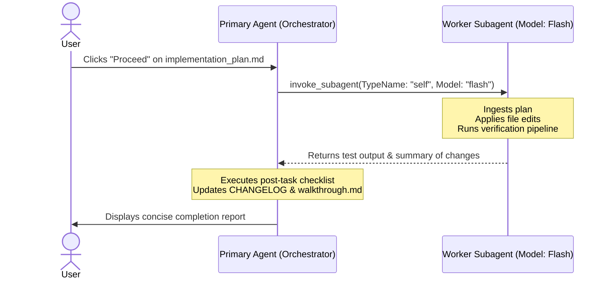

# ⚡ Execute-Plan Protocol (Subagent Direct Implementation)

**Path Policy:** Use repository-relative paths (`src/engine/`, `docs/`, `tests/`) for all local project files. Never use personal filesystem paths, drive-letter paths, `file:///` links, or `vscode://` links.

**Command Execution Policy:** Execute CLI commands natively directly in PowerShell without wrapping in `powershell -Command "..."` or `powershell -NoProfile -Command "..."`.

---

## 🎯 Purpose & Philosophy

Once an `implementation_plan.md` has been reviewed and approved by the user, the deliberative planning phase is complete. To minimize turn latency, eliminate redundant reasoning loops, and avoid repetitive meta-analysis:

1. **Mandatory Subagent Execution:** Execution is **always delegated by default** to a dedicated worker subagent operating at the faster `'flash'` model tier.
2. **Zero Meta-Analysis:** The worker subagent strictly applies the approved code modifications and runs verification tests.
3. **Reactive Wakeup:** The primary orchestrator agent steps aside while the subagent runs, resuming automatically upon completion to perform post-task hygiene and present results.

---

## 📋 The Delegation Lifecycle



---

## 🛠️ Step-by-Step Instructions

### Step 1: Read the Approved Plan (Primary Agent)

When the user clicks "Proceed" or approves:

1. View `<appDataDir>\brain\<conversation-id>/implementation_plan.md`.
2. Extract only the explicit file list (`[NEW]`, `[MODIFY]`, `[DELETE]`), edits, UI/Card Editor impact statement, test inventory, acceptance criteria, and verification commands. Do **not** infer omitted behavior, expand scope, choose between alternatives, or reinterpret requirements from surrounding repository context.
3. Run the ambiguity gate before delegating. Treat the plan as ambiguous when any required behavior, file-level change, acceptance criterion, verification command, dependency, migration choice, or conflict with the current worktree is unspecified or admits more than one reasonable interpretation.

- The plan is also blocked if it lacks an explicit `UI and Card Editor` section. It must either list the affected UI/Card Editor files and tests, or state `No change required.` with supporting evidence.
- The plan is also blocked if its test inventory omits a changed behavior or lacks Card Editor tests for an affected editor surface.

4. When ambiguity exists, halt execution. Present a concise user-facing validation request with exactly these headings:

```markdown
### Why This Is Blocking

<the specific decision or missing information that prevents faithful execution>

### What I Need From You

<the concrete choice, confirmation, or plan revision required>
```

Do not invoke a subagent, edit files, or continue implementation until the user resolves the ambiguity. A prior approval authorizes only the plan's unambiguous, explicitly stated work; it does not authorize interpretation. 5. Delegate only after every ambiguity is resolved explicitly by the user or by a revised plan that removes it.

### Step 2: Spawn Worker Subagent (`invoke_subagent`)

Immediately invoke the implementation subagent with `Model: 'flash'`:

```typescript
invoke_subagent({
  Subagents: [
    {
      TypeName: 'self',
      Role: 'Plan Implementation Worker',
      Model: 'flash',
      Prompt: `Execute the approved implementation plan exactly as written:
1. Apply the file modifications specified in the implementation plan:
   - Target files and changes from the plan.
2. Run the automated verification commands:
   - npm test -- <relevant_tests> (enforcing 0 failures and 0 skipped tests)
   - npm run typecheck
   - npm run lint
    3. Do not infer missing requirements, select between plausible designs, expand scope, or modify files not explicitly authorized by the plan. If ambiguity, a conflict, or a missing decision is discovered, stop before editing the affected work and report the precise blocker using "Why This Is Blocking" and "What I Need From You" headings.
    4. Conclude with a concise diff summary and verification pass/fail status. Avoid meta-analysis or multi-step retrospectives.`,
    },
  ],
});
```

_Note: Stop calling tools immediately after launching the subagent to end the turn and let the subagent execute._

### Step 3: Worker Subagent Execution (`Model: 'flash'`)

The subagent executes the plan:

1. Applies code changes using `replace_file_content` and `write_to_file`.
2. Executes the test suite and typechecks via `run_command` (confirming 0 failed and 0 skipped tests).
3. Reports completion and test logs back to the primary agent.

### Step 4: Post-Task Hygiene & Walkthrough (Primary Agent)

Upon receiving the subagent's completion message:

1. Verify that all tests succeeded with **0 failures and 0 skipped tests** (Zero Skipped Tests Invariant).
2. Update `CHANGELOG.md` under `[Unreleased]` with what was implemented.
3. If card supplemental JSON was modified, run `npm run report:declarations`.
4. Create or update the walkthrough/recap in the host's user-facing artifact location when available.
5. Present the walkthrough, verification results, and proposed commit to the user. Ask for confirmation before committing; do not push without separate authorization.

---

## 🛑 Circuit Breaker & Guardrails

- **Plan Fidelity:** User approval is not permission to interpret an ambiguous plan. Stop and request validation using the required **Why This Is Blocking** / **What I Need From You** format before any delegation or edit that depends on an unstated decision.
- **Subagent Errors:** If the worker subagent reports unexpected compile errors or broken test contracts that cannot be resolved in 2 iterations, the primary agent resumes control, inspects the failure, and prompts the user with an actionable diagnosis.
- **Merge Conflicts:** If files specified in the plan have drifted significantly, halt and inform the user before attempting unguided structural refactoring.
