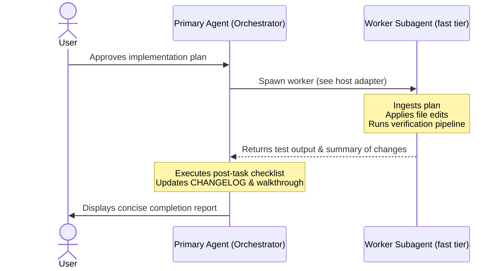

# ⚡ Execute-Plan Protocol (Subagent Direct Implementation)

**Shared rules:** Apply [`.agents/rules/shared-quality-gates.md`](../../rules/shared-quality-gates.md), including path, command, verification, and delivery authorization policies.

**Needs:** `rtk` (see [`antigravity-rtk-rules.md`](../../rules/antigravity-rtk-rules.md)) and Node.js with `npm ci`.

## 🛑 Hard rules (read first)

- **Plan fidelity:** User approval is not permission to interpret an ambiguous plan. Stop and request validation using the **Why This Is Blocking** / **What I Need From You** format before any delegation or edit that depends on an unstated decision.
- **Always delegate:** Execution goes to a worker subagent on a fast, low-reasoning model tier. The worker designs and decides nothing; it only applies the plan and runs tests.
- **Worker never commits or pushes.**
- **Circuit breaker:** If the worker reports compile errors or broken test contracts that cannot be resolved in 2 iterations, the primary agent resumes control, inspects the failure, and gives the user an actionable diagnosis.
- **Drift:** If files named in the plan have drifted significantly, halt and inform the user before attempting any unguided structural refactor.

## 🔌 Host adapter

Spawn the worker with the file for the host you are running in:

- Claude Code: [`hosts/claude-code.md`](hosts/claude-code.md)
- Google Antigravity: [`hosts/antigravity.md`](hosts/antigravity.md)

Both use the worker instructions in Step 2 below.

---

## 📋 The Delegation Lifecycle


```mermaid
sequenceDiagram
    actor User
    participant Primary as Primary Agent (Orchestrator)
    participant Subagent as Worker Subagent (fast tier)

    User->>Primary: Approves implementation plan
    Primary->>Subagent: Spawn worker (see host adapter)
    Note over Subagent: Ingests plan<br/>Applies file edits<br/>Runs verification pipeline
    Subagent-->>Primary: Returns test output & summary of changes
    Note over Primary: Executes post-task checklist<br/>Updates CHANGELOG & walkthrough
    Primary->>User: Displays concise completion report
```

The primary agent steps aside while the worker runs and resumes when it finishes.

---

## 🛠️ Step-by-Step Instructions

### Step 1: Read the Approved Plan (Primary Agent)

When the user clicks "Proceed" or approves:

1. Read the approved plan from wherever it was written: the host's user-facing artifact or plan location (e.g. Claude Code's plan file or a published artifact), or the repository-relative plan file. If more than one candidate exists, use the one the user approved; if unclear, ask.
2. Extract only the explicit file list (`[NEW]`, `[MODIFY]`, `[DELETE]`), edits, UI/Card Editor impact statement, test inventory, acceptance criteria, and verification commands. Do **not** infer omitted behavior, expand scope, choose between alternatives, or reinterpret requirements from surrounding repository context.
3. Run the ambiguity gate before delegating. Treat the plan as ambiguous when any required behavior, file-level change, acceptance criterion, verification command, dependency, migration choice, or conflict with the current worktree is unspecified or admits more than one reasonable interpretation.

- The plan is also blocked if it lacks an explicit `UI and Card Editor` section. It must either list the affected UI/Card Editor files and tests, or state `No change required.` with supporting evidence.
- The plan is also blocked if its test inventory omits a changed behavior or lacks Card Editor tests for an affected editor surface.

4. When ambiguity exists, halt execution. Present a concise user-facing validation request with exactly these headings:

```markdown
### Why This Is Blocking

<the specific decision or missing information that prevents faithful execution>

### What I Need From You

<the concrete choice, confirmation, or plan revision required>
```

Do not invoke a subagent, edit files, or continue implementation until the user resolves the ambiguity. A prior approval authorizes only the plan's unambiguous, explicitly stated work; it does not authorize interpretation.

5. Delegate only after every ambiguity is resolved explicitly by the user or by a revised plan that removes it.

### Step 2: Spawn Worker Subagent

Use the spawn call from your host file. Paste the full approved plan after these worker instructions, since the worker starts with no context:

```text
Execute the approved implementation plan exactly as written. The full plan follows at the end of this prompt.
1. Apply the file modifications specified in the plan (target files and changes only).
2. Run the automated verification commands using `rtk` to condense output:
   - rtk npm test -- <relevant_tests> (enforcing 0 failures and 0 skipped tests)
   - rtk npm run typecheck
   - rtk npm run lint
3. Do not infer missing requirements, select between plausible designs, expand scope, or modify files not explicitly authorized by the plan. If ambiguity, a conflict, or a missing decision is discovered, stop before editing the affected work and report the precise blocker using "Why This Is Blocking" and "What I Need From You" headings.
4. Do not commit or push.
5. Conclude with a concise diff summary and verification pass/fail status. Avoid meta-analysis or multi-step retrospectives.

<approved plan>
```

The worker runs in the background. End the turn after launching it; do not poll or duplicate its work.

### Step 3: Worker Subagent Execution

The worker applies the code changes with the host's file tools, runs the test suite, typecheck, and lint through the shell using `rtk` (0 failed and 0 skipped tests), and reports completion and test logs back to the primary agent.

### Step 4: Post-Task Hygiene & Walkthrough (Primary Agent)

Upon receiving the worker's completion message:

1. Verify that all tests succeeded with **0 failures and 0 skipped tests** (Zero Skipped Tests Invariant).
2. Update `CHANGELOG.md` under `[Unreleased]` with what was implemented.
3. If card supplemental JSON was modified, run `rtk npm run report:declarations`.
4. Create or update the walkthrough/recap in the host's user-facing artifact location when available.
5. Present the walkthrough and verification results to the user. If the user's original request already authorized delivery (e.g. "implement and commit/push this plan"), proceed directly through commit and push; otherwise wait for an explicit commit/push request before delivering.
