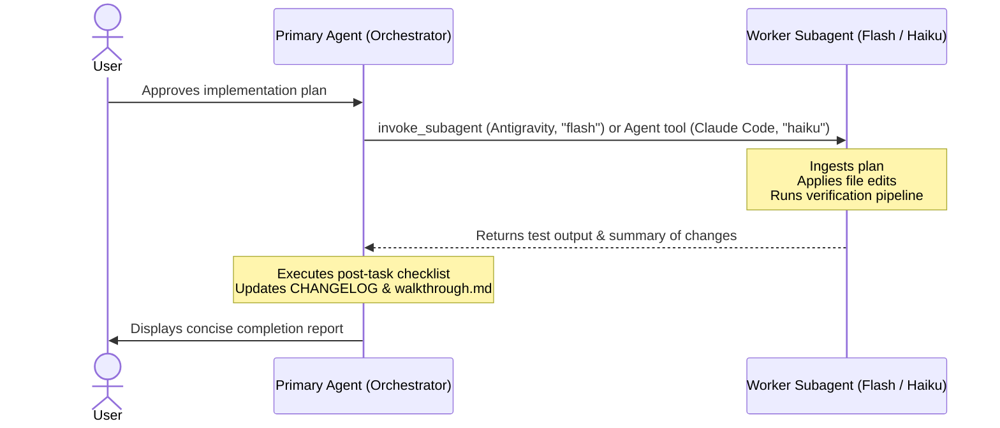

# ⚡ Execute-Plan Protocol (Subagent Direct Implementation)

**Shared rules:** Apply [`.agents/rules/shared-quality-gates.md`](../../rules/shared-quality-gates.md), including path, command, verification, and delivery authorization policies.


---

## 🎯 Purpose & Philosophy

Once an `implementation_plan.md` has been reviewed and approved by the user, the deliberative planning phase is complete. To minimize turn latency, eliminate redundant reasoning loops, and avoid repetitive meta-analysis:

1. **Mandatory Subagent Execution:** Execution is **always delegated by default** to a dedicated worker subagent running on a fast, low-reasoning model tier (the "worker": the `'flash'` Flash subagent on Google Antigravity, a `haiku` subagent on Claude Code). The worker does not design or decide anything: it only creates/updates code and runs tests exactly as the plan states.
2. **Zero Meta-Analysis:** The worker strictly applies the approved code modifications and runs verification tests.
3. **Reactive Wakeup:** The primary orchestrator agent steps aside while the worker runs, resuming automatically upon completion to perform post-task hygiene and present results.

---

## 📋 The Delegation Lifecycle


```mermaid
sequenceDiagram
    actor User
    participant Primary as Primary Agent (Orchestrator)
    participant Subagent as Worker Subagent (Flash / Haiku)

    User->>Primary: Approves implementation plan
    Primary->>Subagent: invoke_subagent (Antigravity, "flash") or Agent tool (Claude Code, "haiku")
    Note over Subagent: Ingests plan<br/>Applies file edits<br/>Runs verification pipeline
    Subagent-->>Primary: Returns test output & summary of changes
    Note over Primary: Executes post-task checklist<br/>Updates CHANGELOG & walkthrough.md
    Primary->>User: Displays concise completion report
```

---

## 🛠️ Step-by-Step Instructions

### Step 1: Read the Approved Plan (Primary Agent)

When the user clicks "Proceed" or approves:

1. Read the approved plan from wherever it was written: the host's user-facing artifact or plan location (e.g. Claude Code's plan file or a published artifact), or the repository-relative plan file. If more than one candidate exists, use the one the user approved; if unclear, ask.
2. Extract only the explicit file list (`[NEW]`, `[MODIFY]`, `[DELETE]`), edits, UI/Card Editor impact statement, test inventory, acceptance criteria, and verification commands. Do **not** infer omitted behavior, expand scope, choose between alternatives, or reinterpret requirements from surrounding repository context.
3. Run the ambiguity gate before delegating. Treat the plan as ambiguous when any required behavior, file-level change, acceptance criterion, verification command, dependency, migration choice, or conflict with the current worktree is unspecified or admits more than one reasonable interpretation.

- The plan is also blocked if it lacks an explicit `UI and Card Editor` section. It must either list the affected UI/Card Editor files and tests, or state `No change required.` with supporting evidence.
- The plan is also blocked if its test inventory omits a changed behavior or lacks Card Editor tests for an affected editor surface.

4. When ambiguity exists, halt execution. Present a concise user-facing validation request with exactly these headings:

```markdown
### Why This Is Blocking

<the specific decision or missing information that prevents faithful execution>

### What I Need From You

<the concrete choice, confirmation, or plan revision required>
```

Do not invoke a subagent, edit files, or continue implementation until the user resolves the ambiguity. A prior approval authorizes only the plan's unambiguous, explicitly stated work; it does not authorize interpretation. 5. Delegate only after every ambiguity is resolved explicitly by the user or by a revised plan that removes it.

### Step 2: Spawn Worker Subagent

Use the variant for the host you are running in. Both use the same worker instructions.

#### Google Antigravity (`invoke_subagent`, Flash)

```typescript
invoke_subagent({
  Subagents: [
    {
      TypeName: 'self',
      Role: 'Plan Implementation Worker',
      Model: 'flash',
      Prompt: `<the shared worker instructions from the prompt in the Claude Code block below, followed by the approved plan>`,
    },
  ],
});
```

_Note: Stop calling tools immediately after launching the subagent to end the turn and let the subagent execute._

#### Claude Code (`Agent` tool, Haiku)

Use `subagent_type: "general-purpose"` and `model: "haiku"` (the fast tier; use `"sonnet"` only if the plan involves many interdependent edits). Paste the full approved plan into the prompt, since the worker starts with no context:

```text
Agent({
  description: "Execute approved plan",
  subagent_type: "general-purpose",
  model: "haiku",
  prompt: `Execute the approved implementation plan exactly as written. The full plan follows at the end of this prompt.
1. Apply the file modifications specified in the plan (target files and changes only).
2. Run the automated verification commands using `rtk` to condense output:
   - rtk npm test -- <relevant_tests> (enforcing 0 failures and 0 skipped tests)
   - rtk npm run typecheck
   - rtk npm run lint
3. Do not infer missing requirements, select between plausible designs, expand scope, or modify files not explicitly authorized by the plan. If ambiguity, a conflict, or a missing decision is discovered, stop before editing the affected work and report the precise blocker using "Why This Is Blocking" and "What I Need From You" headings.
4. Do not commit or push.
5. Conclude with a concise diff summary and verification pass/fail status. Avoid meta-analysis or multi-step retrospectives.

<approved plan>`,
})
```

_Note: The worker runs in the background and notifies the primary agent when it finishes. End the turn after launching it; do not poll or duplicate its work._

### Step 3: Worker Subagent Execution

The worker executes the plan:

1. Applies code changes using the host's file tools (`replace_file_content` / `write_to_file` on Antigravity; `Edit` / `Write` on Claude Code).
2. Runs the test suite, typecheck, and lint through the shell using `rtk` (`run_command` on Antigravity) (confirming 0 failed and 0 skipped tests).
3. Reports completion and test logs back to the primary agent.

### Step 4: Post-Task Hygiene & Walkthrough (Primary Agent)

Upon receiving the subagent's completion message:

1. Verify that all tests succeeded with **0 failures and 0 skipped tests** (Zero Skipped Tests Invariant).
2. Update `CHANGELOG.md` under `[Unreleased]` with what was implemented.
3. If card supplemental JSON was modified, run `rtk npm run report:declarations`.
4. Create or update the walkthrough/recap in the host's user-facing artifact location when available.
5. Present the walkthrough and verification results to the user. If the user's original request already authorized delivery (e.g. "implement and commit/push this plan"), proceed directly through commit and push; otherwise wait for an explicit commit/push request before delivering.

---

## 🛑 Circuit Breaker & Guardrails

- **Plan Fidelity:** User approval is not permission to interpret an ambiguous plan. Stop and request validation using the required **Why This Is Blocking** / **What I Need From You** format before any delegation or edit that depends on an unstated decision.
- **Subagent Errors:** If the worker subagent reports unexpected compile errors or broken test contracts that cannot be resolved in 2 iterations, the primary agent resumes control, inspects the failure, and prompts the user with an actionable diagnosis.
- **Merge Conflicts:** If files specified in the plan have drifted significantly, halt and inform the user before attempting unguided structural refactoring.
