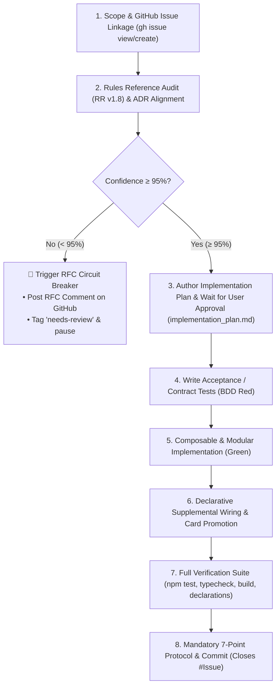

# 🚀 Feature Delivery Protocol (Specification-Driven Development & Milestone Lifecycle)

**Path Policy:** Use paths relative to the MCD repository root for all local project files. Never use personal filesystem paths, drive-letter paths, `file:///` links, or `vscode://` links.

This skill guides the agent through an authoritative, rules-verified, specification-first, and milestone-tracked protocol to deliver new features, capabilities, and primitives cleanly, composably, and with zero regressions.

---

## 📝 Execution Logging Requirement (`logs/skills/`)

Whenever a feature delivery begins (triggered explicitly via `feature-delivery: <description>` or through conversational roadmap execution), append timestamped progress entries to `logs/skills/feature_delivery_{YYYY-MM-DD}.log`:

```text
YYYY-MM-DDTHH:mm:ss.sssZ [SCOPE] Feature scoped: "<title>" (Milestone: <Phase/Milestone>, Subsystem: <Engine|UI|Data|Setup>)
YYYY-MM-DDTHH:mm:ss.sssZ [ISSUE] Linked/Created GitHub Issue #<NUM>: "<title>" (<URL>)
YYYY-MM-DDTHH:mm:ss.sssZ [RULES_AUDIT] Audited RR v1.8 (Section: "<section>"), Confidence: <XX>% (Threshold: >=95%)
YYYY-MM-DDTHH:mm:ss.sssZ [ADR] Aligned with ADR-<XXXX> and validated Zod schema in src/data/supplemental/schema.ts
YYYY-MM-DDTHH:mm:ss.sssZ [SPEC_TEST] Added acceptance/contract tests in tests/<subsystem>/<feature>.test.ts (BDD Red)
YYYY-MM-DDTHH:mm:ss.sssZ [BUILD] Implemented modular capability in src/<path> (Green)
YYYY-MM-DDTHH:mm:ss.sssZ [VERIFY] Full suite passing (258+ tests, 0 typecheck errors, clean build, declarations valid)
YYYY-MM-DDTHH:mm:ss.sssZ [AUDIT] Completed 7-point post-task protocol & updated roadmap_and_milestones.md
YYYY-MM-DDTHH:mm:ss.sssZ [CLOSE] Pushed commit "feat(...): ... (Closes #<NUM>)" & verified issue closed
```

---

## 🚦 Architectural Pre-Conditions & Rules Authority

Before writing any implementation code or tests for a new feature, verify the following four architectural prerequisites:

1. **📖 Authoritative Rules Reference Audit (RR v1.8):**
   - Consult [`mc_rulesreference_v18_compressed.pdf`](../../references/mc_rulesreference_v18_compressed.pdf) and official FFG Rulings for every rule, timing window, cost interaction, and state transition involved.
   - **Strict Confidence Threshold ($\ge 95\%$):** If confidence in how the rules operate is $< 95\%$, **STOP IMMEDIATELY** and trigger the **Ambiguity RFC Circuit Breaker** (see below). Never implement speculative or guessed heuristics.
2. **Approved Architecture Decision Record (ADR):**
   - Check [`docs/decisions/`](../../docs/decisions/) to identify the controlling ADR (e.g. ADR-0030 for Ability Sequences, ADR-0031 for Combat/Defense, ADR-0032 for Resolution Stack, ADR-0033 for Scenario Setup, ADR-0034 for Player Side Schemes, ADR-0035 for Multi-Form/Counters, ADR-0036 for Status Scaling).
   - If the feature introduces a new major paradigm not covered by an existing ADR, draft a **Proposed ADR** first before coding.
   - **Mandatory template:** every new or edited ADR **MUST** be created by copying [`docs/decisions/template.md`](../../../docs/decisions/template.md) and filling it in. Keep the `# [ADR-XXXX] Title` heading, the `Status` / `Date` / `Authors` / `Deciders` metadata block, and the standard section order (Context and Problem Statement → Decision Drivers → Considered Options → Decision Outcome → Evaluation of Options → Consequences). Do not invent alternative headings or status formats. Register the ADR in the `docs/decisions/README.md` log table in ascending ID order, and if it supersedes an earlier ADR, update **both** directions (old ADR's `Status` → `Superseded by [ADR-XXXX](...)`, new ADR names what it supersedes).
3. **Schema & Model Design Alignment:**
   - If the feature introduces new effect primitives or supplemental fields, update [`src/data/supplemental/schema.ts`](../../src/data/supplemental/schema.ts) with strict Zod types and update [`docs/specifications/`](../../docs/specifications/).
   - If the feature extends game state, update [`src/engine/models/state.ts`](../../src/engine/models/state.ts) and export all relevant interfaces.
4. **Headless & Decoupled Invariant:**
   - Pure engine logic belongs strictly in `src/engine/`. Never import React, DOM, `window`, `document`, or CSS into engine modules.
5. **Declarative Data-First & Generic Primitive Invariant:**
   - Never create bespoke, hardcoded card functions in `src/engine/` (e.g. `resolveSpiderSense()`, `executeGammaSlam()`).
   - All card abilities must be composed of universal, reusable effect primitives in `src/engine/effects/index.ts` parameterized purely via `src/data/supplemental/`. If a capability is missing, implement it as a generic, reusable primitive.

---

## 🛑 Ambiguity RFC / Peer Review Circuit Breaker (When Confidence $< 95\%$)

If the rules interpretation, timing trigger sequence, or card interactions are ambiguous or disputed (confidence $< 95\%$):

1. **Halt Execution:** Do NOT proceed to writing acceptance tests or modifying code.
2. **Post RFC Peer Review Comment on GitHub Issue:**
   Use `gh issue comment <NUM> --body "..."` with this structured template:

   ```markdown
   ### 📢 RFC / Peer Review Request: Rules Ambiguity on Feature #<NUM>

   **Confidence Level:** <XX>% (< 95% threshold required for automated implementation)

   #### ❓ The Ambiguity / Edge Case

   <Detailed description of the conflicting rules interpretations, timing windows, or underspecified state interactions>

   #### 📜 Rules Reference Citations

   - Marvel Champions Rules Reference v1.8 Section: `<Citation>`
   - Official Rulings / Precedents: `<Citation or N/A>`

   #### ⚖️ Architectural Options for Review

   - **Option A (<Short Title>):**
     - _Implementation:_ <How it works mechanically>
     - _Pros:_ <Advantages>
     - _Cons / Risks:_ <Drawbacks / Potential edge cases>
   - **Option B (<Short Title>):**
     - _Implementation:_ <How it works mechanically>
     - _Pros:_ <Advantages>
     - _Cons / Risks:_ <Drawbacks / Potential edge cases>

   #### 💡 Architect Recommendation

   <Clear recommendation with underlying rationale>

   ---

   _Awaiting peer review and alignment before proceeding with implementation._
   ```

3. **Tag GitHub Issue:**
   ```bash
   gh issue edit <NUM> --add-label "needs-review,status:blocked-by-rfc"
   ```
4. **Log Ambiguity:** Append `[AMBIGUITY_RFC]` entry in `logs/skills/feature_delivery_{YYYY-MM-DD}.log`. If card-specific, create or update a 1-file report in `docs/ambiguities/`.
5. **End Turn Safely:** Report the RFC link to the user and pause until alignment is reached.

---

## 🔄 The 8-Step Feature Delivery Lifecycle



---

### Step 1: Scope & GitHub Issue Linkage

1. Identify the controlling Roadmap Milestone in [`docs/roadmap_and_milestones.md`](../../docs/roadmap_and_milestones.md) (e.g. Milestone 2C, Milestone 2D, Phase 3).
2. Check existing open GitHub issues (`gh issue list`) or create a new tracked feature issue:

   ```bash
   gh issue create \
     --title "feat(<subsystem>): <concise feature title>" \
     --label "feature,priority:P1-high,impact:high,subsystem:<engine|ui|data>" \
     --body "### 🚀 Feature Scope & Objectives
   <Detailed description of the new capability and rules requirements>

   ### 📜 Rules Reference / Spec
   - Marvel Champions Rules Reference v1.8: <citation>
   - Controlling ADR: [ADR-XXXX](docs/decisions/00XX-....md)

   ### 🎯 Deliverables
   1. Acceptance tests in \`tests/<subsystem>/...\`
   2. Engine / UI modular implementation
   3. Supplemental schema integration and card promotion"
   ```

3. Record the issue number `#<NUM>` for commit auto-closing.

---

### Step 2: Rules Reference Audit (RR v1.8) & ADR Alignment

1. **Audit Rules Reference:** Thoroughly inspect `references/mc_rulesreference_v18_compressed.pdf` for all timing, cost, and trigger definitions.
2. **Evaluate Confidence:** Assess confidence level ($0–100\%$). If $< 95\%$, trigger the **Ambiguity RFC Circuit Breaker** and stop.
3. **Audit ADR & Schemas:**
   - Read the controlling ADR in `docs/decisions/`.
   - Update `src/data/supplemental/schema.ts` with strict Zod types if introducing new primitives.
   - Update `src/engine/models/abilities.ts` or `src/engine/models/state.ts`.
   - Run schema tests: `npm test tests/data/supplemental-validation.test.ts`.

---

### Step 3: Author Implementation Plan & Wait for User Approval 🛑

- **MANDATORY REVIEW GATE:** Because of the complexity of Marvel Champions rules and state invariants, you MUST always create an `implementation_plan.md` artifact detailing:
  1. **Rules Reference & Spec Analysis:** Exact citations from RR v1.8, timing priority, and active ADRs.
  2. **Proposed Changes:** File-by-file breakdown (`[NEW]`, `[MODIFY]`) across engine pipelines, effect primitives, and supplemental data.
  3. **Verification Plan:** Planned unit/acceptance tests covering happy path and edge cases.
  4. **Open Questions & Design Decisions:** Any trade-offs or design choices highlighted for user review.
- **STOP AND WAIT:** Set `request_feedback: true` in the artifact metadata. You MUST NOT proceed to writing code or modifying files until the user explicitly reviews and approves the implementation plan.

---

### Step 4: Write Acceptance & Contract Tests (BDD Red)

- **Golden Rule:** NEVER implement a feature before writing comprehensive, contract-defining tests demonstrating all intended behaviors and edge cases.
- Create a dedicated test file in `tests/engine/`, `tests/ui/`, or `tests/scenarios/` (e.g. `tests/engine/feature-name.test.ts`).
- Write unit and integration tests covering:
  - **Happy Path:** Standard execution and expected state transitions.
  - **Edge Cases:** Boundary conditions, 0-amount scenarios, empty decks, defeated characters.
  - **Rules Invariants:** Unicity checks, form restrictions, timing priorities.
- Run the test suite (`npx vitest run tests/<file>.test.ts`) and confirm it fails because the capability is not yet implemented (**Red**).

---

### Step 5: Composable & Modular Implementation (Green)

- Implement the capability cleanly in the appropriate subsystem:
  - **Phase Pipelines:** `src/engine/pipeline/` (`player-phase.ts`, `villain-phase.ts`, `round-upkeep.ts`, `combat-pipeline.ts`).
  - **Effect Primitives:** `src/engine/effects/index.ts` (parameterized, composable functions).
  - **Cost & Legality:** `src/engine/pipeline/cost-engine.ts` and `legality-checker.ts`.
  - **Scenario Plugins:** `src/engine/scenarios/` (`ScenarioPlugin` implementations).
  - **UI Components:** `src/ui/components/` (React presentation, Tailwind styling, Pop-Art aesthetic).
- Run the acceptance test suite to confirm all tests pass cleanly (**Green**).

---

### Step 6: Declarative Supplemental Retrofit, Wiring & Audit Metadata Update 🃏

- Whenever a feature, primitive, keyword, or mechanic is implemented or modified:
  1. **Search Supplemental Data:** Search all pack files in `src/data/supplemental/pack/*.json` for every card that utilizes or is affected by the new capability.
  2. **Retrofit Card Definitions:** Apply the new declarative schema and primitives to all affected card entries.
  3. **Update Audit Metadata:** For every modified card entry, update:
     - `"updatedAt"`: Current ISO timestamp with `HH:MM` (e.g. `2026-09-01T09:48:00Z`).
     - `"reviewedAt"`: Current ISO timestamp with `HH:MM`.
     - `"reviewedBy"`: `"antigravity"` (or current agent identity).
  4. **Card Promotion & Ambiguity Pruning:** If previously blocked, promote `audit.confidence: 1.0` and prune resolved ambiguity files in `docs/ambiguities/` (Inbox Zero).
  5. **Run Declarations Analyzer:** Execute `npm run report:declarations` to ensure zero schema violations.

---

### Step 7: Full Verification Suite & Quality Gate

Execute the full multi-tier verification suite:

```bash
npm test && npm run typecheck && npm run build && npm run report:declarations
```

- **Vitest Suite:** All test files and suites pass with 0 failures.
- **TypeScript:** 0 compilation errors (`tsc --noEmit`).
- **Vite Production Build:** Production bundle compiles cleanly without warnings.
- **Declarations Analyzer:** `docs/reports/supplemental_declarations_usage_report.md` compiles with 0 schema violations.

---

### Step 7: Mandatory Post-Task Protocol (8-Point Audit Checklist)

Before completing the turn, execute the 8 mandatory checks from `AGENTS.md`:

1. **Check CHANGELOG.md:** Add entry under `[Unreleased]` detailing the new feature, affected subsystems, and clickable GitHub issue link (`[#<NUM>](https://github.com/SteveRodrigue/MCD/issues/<NUM>)`).
2. **Check Documentation:** Update relevant docs in `docs/` or `README.md`.
3. **Check Specifications:** Update `docs/specifications/` or schemas when mechanics or primitives change.
4. **Check Guidelines:** Update `docs/coding_guidelines.md` if new design patterns were introduced.
5. **Check ADRs:** Ensure referenced ADRs are linked and updated to **Accepted** status, and that every ADR you created or edited still conforms to [`docs/decisions/template.md`](../../../docs/decisions/template.md).
6. **Check Ambiguities & Git Issues:** Verify resolved ambiguity cards are removed and issues linked.
7. **Check Roadmap & Milestones:** Check off completed tasks, update active milestone status badges, and keep [`docs/roadmap_and_milestones.md`](../../docs/roadmap_and_milestones.md) synchronized.
8. **Check Card Supplemental Retrofit, Integration Protocol & Usage Report:** If any mechanic, keyword, effect primitive, cost, or timing logic was added or modified, search supplemental data, retrofit affected cards, update audit timestamps, and run `npm run report:declarations`.

---

### Step 8: Git Commit (Auto-Close Issue), Push & Verification

1. **Stage & Commit with Auto-Close Syntax:**

   ```bash
   git add -A
   git commit -m "feat(<scope>): <concise feature description> (Closes #<NUM>)"
   ```

   - **Scopes:** `feat(engine)`, `feat(ui)`, `feat(data)`, `feat(setup)`, `feat(combat)`, `feat(schema)`.
   - The `(Closes #<NUM>)` trailer automatically links the commit and closes the GitHub issue upon push.

2. **Push to Remote:**

   ```bash
   git push origin main
   ```

3. **Post Verification Comment on GitHub:**
   If `gh` CLI is available, post a completion comment with test suite verification proof:
   ```bash
   gh issue comment <NUM> --body "✅ **Delivered & Verified**: Acceptance test suite \`tests/<subsystem>/<feature>.test.ts\` passing. Full verification suite clean (0 typecheck errors, 0 build warnings). Milestone updated in \`docs/roadmap_and_milestones.md\`."
   gh issue close <NUM> --comment "Resolved and closed via automated Feature Delivery protocol."
   ```

---

## 💡 Prompt Examples

- `feature-delivery: Implement SEARCH_AND_SELECT two-pile destination routing primitive (Issue #10)`
- `feature-delivery: Enforce Max 1 per player and global unicity board invariants (Issue #3)`
- `feature-delivery: Implement Wakanda Forever! Special ability execution sequence (Issue #18)`
- `feature-delivery: Build modular encounter set customizer in ScenarioSelector.tsx (Milestone 2C)`
- `feature-delivery: Implement PLAY_FROM_DISCARD primitive for Make the Call (Issue #25)`
