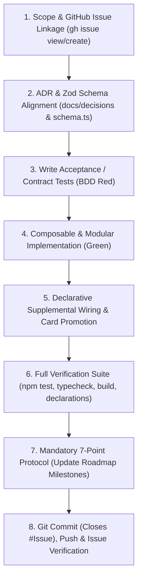

# 🚀 Feature Delivery Protocol (Specification-Driven Development & Milestone Lifecycle)

This skill guides the agent through an authoritative, specification-first, and milestone-tracked protocol to deliver new features, capabilities, and primitives cleanly, composably, and with zero regressions.

---

## 📝 Execution Logging Requirement (`logs/skills/`)

Whenever a feature delivery begins (triggered explicitly via `feature-delivery: <description>` or through conversational roadmap execution), append timestamped progress entries to `logs/skills/feature_delivery_{YYYY-MM-DD}.log`:

```text
YYYY-MM-DDTHH:mm:ss.sssZ [SCOPE] Feature scoped: "<title>" (Milestone: <Phase/Milestone>, Subsystem: <Engine|UI|Data|Setup>)
YYYY-MM-DDTHH:mm:ss.sssZ [ISSUE] Linked/Created GitHub Issue #<NUM>: "<title>" (<URL>)
YYYY-MM-DDTHH:mm:ss.sssZ [ADR] Aligned with ADR-<XXXX> and validated Zod schema in src/data/supplemental/schema.ts
YYYY-MM-DDTHH:mm:ss.sssZ [SPEC_TEST] Added acceptance/contract tests in tests/<subsystem>/<feature>.test.ts (BDD Red)
YYYY-MM-DDTHH:mm:ss.sssZ [BUILD] Implemented modular capability in src/<path> (Green)
YYYY-MM-DDTHH:mm:ss.sssZ [VERIFY] Full suite passing (258+ tests, 0 typecheck errors, clean build, declarations valid)
YYYY-MM-DDTHH:mm:ss.sssZ [AUDIT] Completed 7-point post-task protocol & updated roadmap_and_milestones.md
YYYY-MM-DDTHH:mm:ss.sssZ [CLOSE] Pushed commit "feat(...): ... (Closes #<NUM>)" & verified issue closed
```

---

## 🚦 Architectural Pre-Conditions & ADR Alignment

Before writing any implementation code for a new feature, verify the following three architectural prerequisites:

1. **Approved Architecture Decision Record (ADR):**
   * Check [`docs/decisions/`](../../docs/decisions/) to identify the controlling ADR (e.g. ADR-0030 for Ability Sequences, ADR-0031 for Combat/Defense, ADR-0032 for Resolution Stack, ADR-0033 for Scenario Setup, ADR-0034 for Player Side Schemes, ADR-0035 for Multi-Form/Counters, ADR-0036 for Status Scaling).
   * If the feature introduces a new major paradigm not covered by an existing ADR, draft a **Proposed ADR** first before coding.
2. **Schema & Model Design Alignment:**
   * If the feature introduces new effect primitives or supplemental fields, update [`src/data/supplemental/schema.ts`](../../src/data/supplemental/schema.ts) with strict Zod types and update [`docs/specifications/`](../../docs/specifications/).
   * If the feature extends game state, update [`src/engine/models/state.ts`](../../src/engine/models/state.ts) and export all relevant interfaces.
3. **Headless & Decoupled Invariant:**
   * Pure engine logic belongs strictly in `src/engine/`. Never import React, DOM, `window`, `document`, or CSS into engine modules.

---

## 🔄 The 8-Step Feature Delivery Lifecycle



---

### Step 1: Scope & GitHub Issue Linkage
1. Identify the controlling Roadmap Milestone in [`docs/roadmap_and_milestones.md`](../../docs/roadmap_and_milestones.md) (e.g. Milestone 2C, Milestone 2D, Phase 3).
2. Check existing open GitHub issues (`gh issue list`) or create a new tracked feature issue:
   ```bash
   gh issue create \
     --title "feat(<subsystem>): <concise feature title>" \
     --label "feature,priority:P1-high,impact:high,subsystem:<engine|ui|data>" \
     --body "### 🚀 Feature Scope & Objectives
   <Detailed description of the new capability and rules requirements>

   ### 📜 Rules Reference / Spec
   - Marvel Champions Rules Reference v1.8: <citation>
   - Controlling ADR: [ADR-XXXX](docs/decisions/00XX-....md)

   ### 🎯 Deliverables
   1. Acceptance tests in \`tests/<subsystem>/...\`
   2. Engine / UI modular implementation
   3. Supplemental schema integration and card promotion"
   ```
3. Record the issue number `#<NUM>` for commit auto-closing.

---

### Step 2: ADR & Schema Alignment Check
1. Read the controlling ADR in `docs/decisions/` to review design decisions, invariants, and edge cases.
2. If introducing new effect primitives, conditions, or card types:
   * Update `src/data/supplemental/schema.ts` with strict Zod types.
   * Update `src/engine/models/abilities.ts` or `src/engine/models/state.ts`.
   * Run schema tests: `npm test tests/data/supplemental-validation.test.ts`.

---

### Step 3: Write Acceptance & Contract Tests (BDD Red)
* **Golden Rule:** NEVER implement a feature before writing comprehensive, contract-defining tests demonstrating all intended behaviors and edge cases.
* Create a dedicated test file in `tests/engine/`, `tests/ui/`, or `tests/scenarios/` (e.g. `tests/engine/feature-name.test.ts`).
* Write unit and integration tests covering:
  - **Happy Path:** Standard execution and expected state transitions.
  - **Edge Cases:** Boundary conditions, 0-amount scenarios, empty decks, defeated characters.
  - **Rules Invariants:** Unicity checks, form restrictions, timing priorities.
* Run the test suite (`npx vitest run tests/<file>.test.ts`) and confirm it fails because the capability is not yet implemented (**Red**).

---

### Step 4: Composable & Modular Implementation (Green)
* Implement the capability cleanly in the appropriate subsystem:
  * **Phase Pipelines:** `src/engine/pipeline/` (`player-phase.ts`, `villain-phase.ts`, `round-upkeep.ts`, `combat-pipeline.ts`).
  * **Effect Primitives:** `src/engine/effects/index.ts` (parameterized, composable functions).
  * **Cost & Legality:** `src/engine/pipeline/cost-engine.ts` and `legality-checker.ts`.
  * **Scenario Plugins:** `src/engine/scenarios/` (`ScenarioPlugin` implementations).
  * **UI Components:** `src/ui/components/` (React presentation, Tailwind styling, Pop-Art aesthetic).
* Run the acceptance test suite to confirm all tests pass cleanly (**Green**).

---

### Step 5: Declarative Supplemental Wiring & Card Promotion (if applicable)
* If the feature enables cards that were previously blocked or listed in `docs/ambiguities/`:
  1. Update card supplemental definitions in `src/data/supplemental/pack/*.json` to utilize the new primitive/schema.
  2. Add dedicated card unit tests verifying real card execution.
  3. Promote the card confidence to $\ge 98\%$ in the supplemental JSON (`audit.confidence: 1.0`).
  4. Prune resolved ambiguity files from `docs/ambiguities/` (Inbox Zero).

---

### Step 6: Full Verification Suite & Quality Gate
Execute the full multi-tier verification suite:
```bash
npm test && npm run typecheck && npm run build && npm run report:declarations
```
* **Vitest Suite:** All 49+ test files (260+ tests) pass with 0 failures.
* **TypeScript:** 0 compilation errors (`tsc --noEmit`).
* **Vite Production Build:** Production bundle compiles cleanly without warnings.
* **Declarations Analyzer:** `docs/reports/supplemental_declarations_usage_report.md` compiles with 0 schema violations.

---

### Step 7: Mandatory Post-Task Protocol (7-Point Audit Checklist)
Before completing the turn, execute the 7 mandatory checks from `AGENTS.md`:
1. **Check CHANGELOG.md:** Add entry under `[Unreleased]` detailing the new feature, affected subsystems, and clickable GitHub issue link (`[#<NUM>](https://github.com/SteveRodrigue/MCD/issues/<NUM>)`).
2. **Check Documentation:** Update relevant docs in `docs/` or `README.md`.
3. **Check Specifications:** Update `docs/specifications/` or schemas when mechanics or primitives change.
4. **Check Guidelines:** Update `docs/coding_guidelines.md` if new design patterns were introduced.
5. **Check ADRs:** Ensure referenced ADRs are linked and updated to **Accepted** status.
6. **Check Ambiguities & Git Issues:** Verify resolved ambiguity cards are removed and issues linked.
7. **Check Roadmap & Milestones:** Check off completed tasks in [`docs/roadmap_and_milestones.md`](../../docs/roadmap_and_milestones.md).

---

### Step 8: Git Commit (Auto-Close Issue), Push & Verification
1. **Stage & Commit with Auto-Close Syntax:**
   ```bash
   git add -A
   git commit -m "feat(<scope>): <concise feature description> (Closes #<NUM>)"
   ```
   * **Scopes:** `feat(engine)`, `feat(ui)`, `feat(data)`, `feat(setup)`, `feat(combat)`, `feat(schema)`.
   * The `(Closes #<NUM>)` trailer automatically links the commit and closes the GitHub issue upon push.

2. **Push to Remote:**
   ```bash
   git push origin main
   ```

3. **Post Verification Comment on GitHub:**
   If `gh` CLI is available, post a completion comment with test suite verification proof:
   ```bash
   gh issue comment <NUM> --body "✅ **Delivered & Verified**: Acceptance test suite \`tests/<subsystem>/<feature>.test.ts\` passing. Full verification suite clean (0 typecheck errors, 0 build warnings). Milestone updated in \`docs/roadmap_and_milestones.md\`."
   gh issue close <NUM> --comment "Resolved and closed via automated Feature Delivery protocol."
   ```

---

## 💡 Prompt Examples

* `feature-delivery: Implement SEARCH_AND_SELECT two-pile destination routing primitive (Issue #10)`
* `feature-delivery: Enforce Max 1 per player and global unicity board invariants (Issue #3)`
* `feature-delivery: Implement Wakanda Forever! Special ability execution sequence (Issue #18)`
* `feature-delivery: Build modular encounter set customizer in ScenarioSelector.tsx (Milestone 2C)`
* `feature-delivery: Implement PLAY_FROM_DISCARD primitive for Make the Call (Issue #25)`
