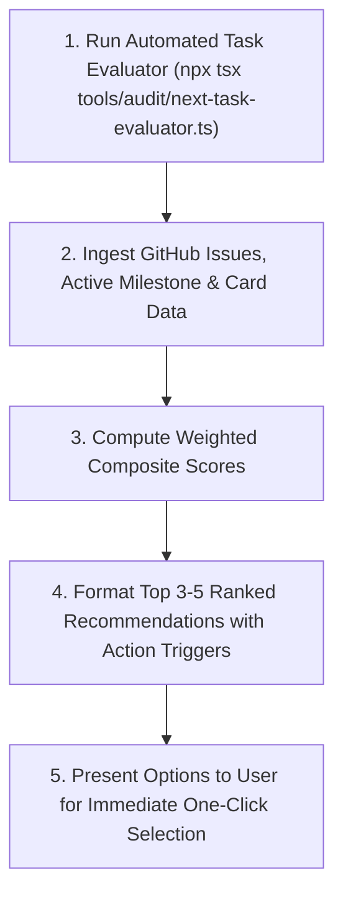

# 🎯 Next-Task Prioritization & Dispatch Protocol

This skill acts as the **Automated Release Orchestrator & Technical Product Manager** for MCD. It computes real-time, data-driven recommendations for what the developer or agent should implement next by balancing:
1. **GitHub Issue Priority:** P0 (Blocker) vs P1 (High) vs P2 (Medium) vs P3 (Low).
2. **Active Roadmap Milestone:** Focuses on current sprint deliverables in [`docs/roadmap_and_milestones.md`](../../docs/roadmap_and_milestones.md).
3. **Card Catalog ROI:** Calculates exact card counts unblocked/enabled across all 170 expansion packs.
4. **Architectural Blast Radius:** High-impact engine invariants vs localized data definitions.

---

## 🚀 Execution Workflow

Whenever invoked (`next-task`, `"What should we work on next?"`, or `"prioritize work"`), execute the following steps:



### Step 1: Execute Automated Evaluator
Run the dynamic evaluator tool:
```bash
npx tsx tools/audit/next-task-evaluator.ts
```

### Step 2: Weighted Composite Scoring Formula
The evaluator calculates a score out of **100 points** using:
$$\text{Score} = \text{Priority (40 pts)} + \text{Milestone (30 pts)} + \text{Card ROI (20 pts)} + \text{Architectural Impact (10 pts)}$$

* **Priority:** `P0` = 40 pts, `P1` = 30 pts, `P2` = 20 pts, `P3` = 10 pts.
* **Milestone Alignment:** Active Milestone (e.g. Milestone 2D) = 30 pts, Next Phase = 20 pts, Future = 10 pts.
* **Card ROI:** $\min(20, \lfloor \text{Card Count} \times 0.4 \rfloor)$.
* **Architectural Impact:** `impact:high` = 10 pts, `impact:medium` = 5 pts, `impact:low` = 2 pts.

---

## 📊 Standard Presentation Template

Format the output cleanly for the user:

```markdown
### 🎯 Next-Task Recommendations: Ranked Priority & Card ROI

Here are the Top ranked candidates evaluated against active roadmap milestones, issue priorities, and card catalog ROI:

| Rank | Issue | Priority & Impact | Target Milestone | Card ROI / Impact | Score |
| :---: | :--- | :---: | :---: | :--- | :---: |
| 🥇 **#1** | **[#XX](https://github.com/SteveRodrigue/MCD/issues/XX)**: *Title* | `P1` / `impact:high` | Milestone 2D | 43 cards across 170 packs | **90 pts** |
| 🥈 **#2** | **[#YY](https://github.com/SteveRodrigue/MCD/issues/YY)**: *Title* | `P1` / `impact:high` | Milestone 2D | 100 cards (Deck exhaustion) | **90 pts** |
| 🥉 **#3** | **[#ZZ](https://github.com/SteveRodrigue/MCD/issues/ZZ)**: *Title* | `P1` / `impact:high` | Milestone 2D | 28 cards (Search/look) | **81 pts** |

---

### 🚀 Ready-to-Run Action Options:

1. **Option 1 (Top Pick):**
   * **Prompt:** \`feature-delivery: <Title> (Issue #XX)\`
   * **Why:** <Concise rationale explaining milestone and card value>

2. **Option 2 (Runner-Up):**
   * **Prompt:** \`feature-delivery: <Title> (Issue #YY)\`
   * **Why:** <Concise rationale>

3. **Option 3 (High Value):**
   * **Prompt:** \`feature-delivery: <Title> (Issue #ZZ)\`
   * **Why:** <Concise rationale>

*Reply with your choice (e.g., "1" or "Let's do Option 1") to start execution immediately!*
```

---

## 💡 Prompt Examples

* `"What should we work on next?"`
* `"next-task"`
* `"next-task --milestone 2D"`
* `"next-task --max-cards"`
