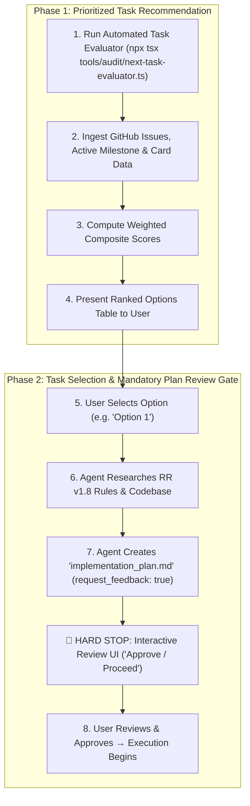

# 🎯 Next-Task Prioritization & Dispatch Protocol

**Path Policy:** Use paths relative to the MCD repository root for all local project files. Never use personal filesystem paths, drive-letter paths, `file:///` links, or `vscode://` links.

This skill acts as the **Automated Release Orchestrator & Technical Product Manager** for MCD. It computes real-time, data-driven recommendations for what the developer or agent should implement next by balancing:

1. **GitHub Issue Priority:** P0 (Blocker) vs P1 (High) vs P2 (Medium) vs P3 (Low).
2. **Active Roadmap Milestone:** Focuses on current sprint deliverables in [`docs/roadmap_and_milestones.md`](../../docs/roadmap_and_milestones.md).
3. **Card Catalog ROI:** Calculates exact card counts unblocked/enabled across all 170 expansion packs.
4. **Architectural Blast Radius:** High-impact engine invariants vs localized data definitions.

---

## 🔄 Dual-Phase Execution Workflow



---

### Phase 1: Evaluation & Recommendation

1. Run the dynamic evaluator tool:
   ```bash
   npx tsx tools/audit/next-task-evaluator.ts
   ```
2. Present the Top 3 to 5 ranked candidates to the user in a clean table with medals (🥇, 🥈, 🥉), scores, card impact, and clickable option triggers.

---

### Phase 2: Selection & Mandatory Implementation Plan Gate 🛑

When the user selects an option (e.g., replying `"Option 1"`, `"1"`, or triggering `feature-delivery: ...`):

1. **Do NOT write or modify code yet.**
2. **Research Rules & Codebase:** Audit `references/mc_rulesreference_v18_compressed.pdf`, relevant ADRs, and related engine pipelines.
3. **Create `implementation_plan.md` Artifact:**
   Create `<appDataDir>\brain\<conversation-id>/implementation_plan.md` with:
   - **`ArtifactMetadata: { RequestFeedback: true, UserFacing: true }`**
   - Detailed Rules Reference analysis
   - Proposed file changes (`[NEW]`, `[MODIFY]`)
   - Acceptance / contract tests plan
   - Open questions or design decisions
4. **STOP AND WAIT:** Conclude the turn immediately so the interactive "Approve / Proceed" review modal is presented to the user. Do not begin implementation until explicit user approval is granted.

---

## 📊 Standard Presentation Template

```markdown
### 🎯 Next-Task Recommendations: Ranked Priority & Card ROI

Here are the Top ranked candidates evaluated against active roadmap milestones, issue priorities, and card catalog ROI:

|   Rank    | Issue                                                              |  Priority & Impact   | Target Milestone | Card ROI / Impact           |   Score    |
| :-------: | :----------------------------------------------------------------- | :------------------: | :--------------: | :-------------------------- | :--------: |
| 🥇 **#1** | **[#XX](https://github.com/SteveRodrigue/MCD/issues/XX)**: _Title_ | `P1` / `impact:high` |   Milestone 2D   | 43 cards across 170 packs   | **90 pts** |
| 🥈 **#2** | **[#YY](https://github.com/SteveRodrigue/MCD/issues/YY)**: _Title_ | `P1` / `impact:high` |   Milestone 2D   | 100 cards (Deck exhaustion) | **90 pts** |
| 🥉 **#3** | **[#ZZ](https://github.com/SteveRodrigue/MCD/issues/ZZ)**: _Title_ | `P1` / `impact:high` |   Milestone 2D   | 28 cards (Search/look)      | **81 pts** |

---

### 🚀 Ready-to-Run Action Options:

1. **Option 1 (Top Pick):**
   - **Prompt:** \`feature-delivery: <Title> (Issue #XX)\`
   - **Why:** <Concise rationale explaining milestone and card value>

2. **Option 2 (Runner-Up):**
   - **Prompt:** \`feature-delivery: <Title> (Issue #YY)\`
   - **Why:** <Concise rationale>

3. **Option 3 (High Value):**
   - **Prompt:** \`feature-delivery: <Title> (Issue #ZZ)\`
   - **Why:** <Concise rationale>

_Reply with your choice (e.g. "1" or "Let's do Option 1"). I will immediately author the detailed \`implementation_plan.md\` and prompt you for review and approval before modifying any code!_
```

---

## 💡 Prompt Examples

- `"What should we work on next?"`
- `"next-task"`
- `"next-task --milestone 2D"`
- `"next-task --max-cards"`
