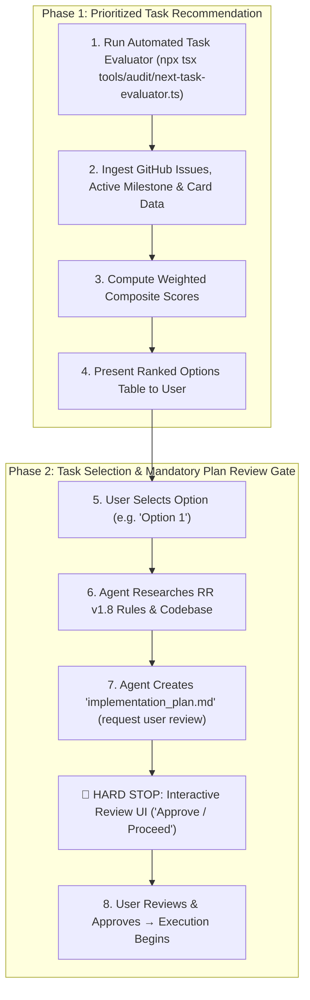

# 🎯 Next-Task Prioritization & Dispatch Protocol

**Shared rules:** Apply [`.agents/rules/shared-quality-gates.md`](../../rules/shared-quality-gates.md), including path, scope, plan, verification, and delivery policies.

**Needs:** `rtk` (see [`antigravity-rtk-rules.md`](../../rules/antigravity-rtk-rules.md)), Node.js with `npm ci`, Python 3 (for `npm run rule`), and the GitHub CLI authenticated via `gh auth login` (check with `gh auth status`).

This skill computes real-time, data-driven recommendations for what the developer or agent should implement next by balancing:

1. **Gate 1 Scope Boundary (Rhino Release):** Focuses strictly on the Core Set player cards and Rhino scenario encounters defined in the roadmap. Expansion tasks are flagged as post-Rhino deferred.
2. **GitHub Issue Priority:** P0 (Rhino Blocker) vs P1 (High) vs P2 (Medium) vs P3 (Low).
3. **Active Roadmap Milestone:** Focuses on current Gate 1 deliverables in [`docs/roadmap_and_milestones.md`](../../../docs/roadmap_and_milestones.md).
4. **Architectural Blast Radius:** High-impact engine invariants vs localized supplemental data definitions.

---

## 🔄 Dual-Phase Execution Workflow


```mermaid
flowchart TD
    subgraph Phase1["Phase 1: Prioritized Task Recommendation"]
        S1["1. Run Automated Task Evaluator (npx tsx tools/audit/next-task-evaluator.ts)"]
        S1 --> S2["2. Ingest GitHub Issues, Active Milestone & Card Data"]
        S2 --> S3["3. Compute Weighted Composite Scores"]
        S3 --> S4["4. Present Ranked Options Table to User"]
    end

    subgraph Phase2["Phase 2: Task Selection & Mandatory Plan Review Gate"]
        S4 --> S5["5. User Selects Option (e.g. 'Option 1')"]
        S5 --> S6["6. Agent Researches RR v1.8 Rules & Codebase"]
        S6 --> S7["7. Agent Creates 'implementation_plan.md' (request user review)"]
        S7 --> S8["🛑 HARD STOP: Interactive Review UI ('Approve / Proceed')"]
        S8 --> S9["8. User Reviews & Approves → Execution Begins"]
    end
```

---

### Phase 1: Evaluation & Recommendation

1. Run the dynamic evaluator tool:
   ```bash
   npx tsx tools/audit/next-task-evaluator.ts
   ```
2. Present the Top 3 to 5 ranked candidates to the user in a clean table with medals (🥇, 🥈, 🥉), scores, card impact, and clickable option triggers.

---

### Phase 2: Selection & Mandatory Implementation Plan Gate 🛑

When the user selects an option (e.g., replying `"Option 1"`, `"1"`, or triggering `feature-delivery: ...`):

1. **Do NOT write or modify code yet.**
2. **Research Rules & Codebase:** Use `npm run rule -- <term>` and `references/rules/` (raw PDF only if confidence stays below 95%), relevant ADRs, and related engine pipelines.
3. **Create `implementation_plan.md` Artifact:**
   Create `implementation_plan.md` in the host's plan location (see `AGENTS.md`) and request user review there, with:
   - Detailed Rules Reference analysis
   - Proposed file changes (`[NEW]`, `[MODIFY]`)
   - Acceptance / contract tests plan
   - Open questions or design decisions
4. **STOP AND WAIT:** Conclude the turn immediately so the interactive "Approve / Proceed" review modal is presented to the user. Do not begin implementation until explicit user approval is granted.

---

## 📊 Presentation

Present the ranked candidates and ready-to-run options using [`presentation-template.md`](presentation-template.md) (default format: keep the table columns and the option list; adapt the wording).

---

## 💡 Prompt Examples

- `"What should we work on next?"`
- `"next-task"`
- `"next-task --milestone 2D"`
- `"next-task --max-cards"`
