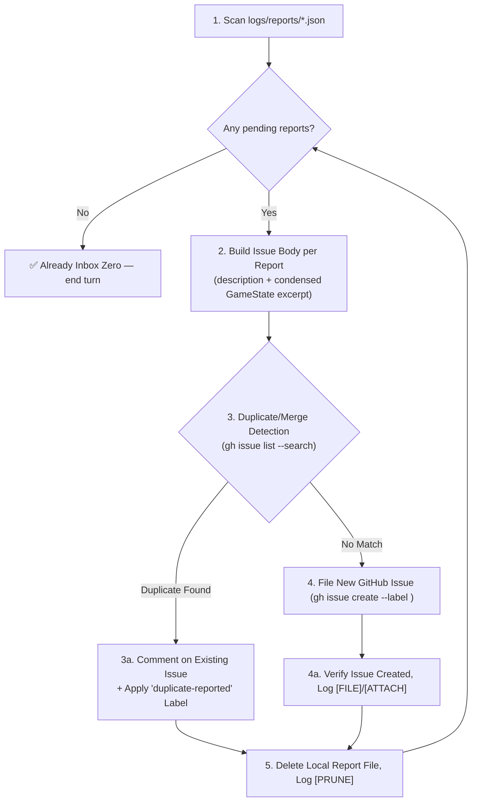

# 🗂️ Problem Report Triage Protocol (Local Report → GitHub Issue, Inbox Zero)

**Path Policy:** Use paths relative to the MCD repository root for all local project files. Never use personal filesystem paths, drive-letter paths, `file:///` links, or `vscode://` links.

This skill converts locally-captured Dev Mode problem reports (`logs/reports/*.json`, produced by the in-game "Report a Problem" feature) into tracked GitHub Issues — merging into an existing issue instead of filing a duplicate when one is detected — then prunes the local file, mirroring the Inbox Zero pattern already used for `docs/ambiguities/`.

---

## 📝 Execution Logging Requirement (`logs/skills/`)

Whenever this skill runs, append timestamped progress entries to `logs/skills/problem_report_triage_{YYYY-MM-DD}.log`:

```text
YYYY-MM-DDTHH:mm:ss.sssZ [SCAN] Found <N> pending report(s) in logs/reports/
YYYY-MM-DDTHH:mm:ss.sssZ [DUPLICATE] report_<timestamp>_<type>.json matches existing Issue #<NUM> (Confidence: <XX>%) — merging instead of filing
YYYY-MM-DDTHH:mm:ss.sssZ [MERGE] Commented on Issue #<NUM> and applied 'duplicate-reported' label (Report Count: <N>)
YYYY-MM-DDTHH:mm:ss.sssZ [FILE] Created GitHub Issue #<NUM>: "<title>" (<URL>) from report_<timestamp>_<type>.json
YYYY-MM-DDTHH:mm:ss.sssZ [ATTACH] Attached GameState snapshot excerpt to Issue #<NUM> (Round <N>, Phase <PHASE>)
YYYY-MM-DDTHH:mm:ss.sssZ [PRUNE] Deleted local report_<timestamp>_<type>.json after successful filing/merging
YYYY-MM-DDTHH:mm:ss.sssZ [DONE] logs/reports/ is Inbox Zero (<N> issues filed, <N> merged as duplicates, 0 pending)
```

---

## 📄 Report File Shape

Each `logs/reports/report_{timestamp}_{type}.json` file (written by [src/ui/services/problem-report-service.ts](../../../src/ui/services/problem-report-service.ts) via the Vite dev-server middleware in [vite.config.ts](../../../vite.config.ts)) has this shape:

```jsonc
{
  "type": "bug" | "improvement" | "feature",
  "priority": "P0-critical" | "P1-high" | "P2-medium" | "P3-low",
  "title": "string (user-entered, truncated)",
  "description": "string (user-entered free text)",
  "labels": ["bug", "triage", "priority:P1-high"], // pre-computed, ready to use as-is
  "gameState": { /* full GameState tree at time of report */ },
  "timestamp": 1234567890123
}
```

---

## 🔄 The 6-Step Triage Lifecycle



### Step 1: Scan Pending Reports

List all files matching `logs/reports/report_*.json` (ignore `logs/reports/processed/` if present from prior runs). If none exist, log `[DONE]` and end the turn immediately — do not create empty issues or fabricate reports.

### Step 2: Build the GitHub Issue Body per Report

For each report file, construct the issue body from the **actual file contents only** (never invent details):

```markdown
### 📋 Report Details (Filed via Dev Mode "Report a Problem")

<description>

### 🎮 GameState Snapshot at Time of Report

- **Round:** <gameState.roundNumber>
- **Phase:** <gameState.phase>
- **Active Player Index:** <gameState.activePlayerIndex>
- **Villain:** <gameState.villain?.name ?? 'N/A'>
- **Main Scheme:** <gameState.mainScheme?.name ?? 'N/A'>

<details>
<summary>Full GameState JSON (click to expand)</summary>

\`\`\`json
<condensed or full gameState JSON — attach only if it materially aids reproduction; for large states, include the full JSON as it is the only diagnostic artifact available>
\`\`\`

</details>

---

_Filed automatically by the `problem-report-triage` skill from `logs/reports/report_<timestamp>_<type>.json`._
```

Only attach the GameState JSON when it plausibly aids reproduction (i.e. always for `bug` reports; optional for `improvement`/`feature` reports where the snapshot is not directly relevant — use judgment, but default to attaching it since it is cheap and lossless).

### Step 3: Duplicate / Merge Detection 🔍

**Before filing anything new**, search existing GitHub issues for a likely duplicate or near-match, scoped to the same report `type`:

```bash
gh issue list --search "<key terms from report.title/description> in:title,body" --state all --limit 15
```

Compare each candidate against the current report using **title similarity, overlapping key terms (card names, scenario names, phase/action names), and matching report type** — never rely on title string equality alone, and never guess when evidence is thin.

- **Confidence ≥ 80% match (same underlying problem, same card/mechanic/scenario):** Treat as a **duplicate** and proceed to Step 3a (Merge) instead of Step 4 (File New).
- **Confidence < 80% or no plausible candidate:** Treat as **not a duplicate** and proceed to Step 4 (File New).

Log the outcome either way: `[DUPLICATE]` with the matched issue number and confidence when merging, or a note in `[SCAN]` that no match was found.

#### Step 3a: Merge into the Existing Issue

When a duplicate is detected, do **not** create a new issue. Instead:

1. **Comment on the existing issue** with the new report's details, so the issue thread reflects that multiple people/sessions hit the same problem:

   ```bash
   gh issue comment <NUM> --body "### 🔁 Duplicate Report Received

   **Priority of this report:** <report.priority>
   **Type:** <report.type>

   <report.description>

   <GameState excerpt from Step 2, if it adds new reproduction detail not already on the issue>

   ---
   _Merged automatically by the \`problem-report-triage\` skill from \`report_<timestamp>_<type>.json\`. This issue has now been reported more than once — consider raising its priority._"
   ```

2. **Apply a `duplicate-reported` label** (creating it first if it doesn't exist yet) so downstream skills (`next-task`, `bug-fix`, `feature-delivery`) can see at a glance that an issue has multiple independent reports and should be weighted higher in prioritization:

   ```bash
   gh label create "duplicate-reported" --color "B60205" --description "Reported more than once via Dev Mode" --force
   gh issue edit <NUM> --add-label "duplicate-reported"
   ```

3. **If the new report's priority is higher** than the existing issue's current `priority:P?-*` label, swap the priority label up (e.g. remove `priority:P2-medium`, add `priority:P1-high`) so the escalated severity is visible without manual triage.
4. Log `[MERGE]` with the issue number and running report count, then proceed directly to Step 5 (Prune) — a merged report is fully accounted for once its comment is confirmed posted.

### Step 4: File a New GitHub Issue (No Duplicate Found)

Use the `labels` array already present in the report file verbatim — it was pre-computed by `mapReportToLabels()` and matches the repo's existing label conventions (`bug`/`triage`, `enhancement`, `enhancement`+`feature`, `priority:P0-critical`…`P3-low`).

```bash
gh issue create \
  --title "<report.title>" \
  --label "<report.labels joined by comma>" \
  --body-file <temp-body-file>.md
```

If any label does not yet exist in the repository (e.g. a `priority:P?-*` label has never been created), create it first so `gh issue create` does not fail:

```bash
gh label create "priority:P1-high" --color "D93F0B" --description "High priority" --force
```

### Step 4a: Verify & Log

Confirm the issue was created (`gh issue view <NUM>` or inspect the `gh issue create` output URL). Append `[FILE]` and `[ATTACH]` log lines with the real issue number and URL.

### Step 5: Prune the Local Report (Inbox Zero)

Once — and only once — the outcome is confirmed (either a **new GitHub Issue was created**, Step 4a, or an **existing issue was successfully commented on and re-labeled**, Step 3a), delete the local report file:

```bash
rm logs/reports/report_<timestamp>_<type>.json
```

Never delete a report file before its outcome (new issue or merge comment) is confirmed. If `gh issue create`, `gh issue comment`, or `gh issue edit` fails (e.g. no network, no `gh` auth), leave the file in place, log the failure, and continue to the next report — do not stop the whole batch on one failure.

Repeat Steps 2–5 for every pending report, then confirm `logs/reports/` contains zero `report_*.json` files and log `[DONE]`.

---

## 🛑 Safety Notes

- This skill only ever reads `logs/reports/*.json` and calls `gh issue list` / `gh issue create` / `gh issue comment` / `gh issue edit` / `gh label create` / deletes the already-filed local JSON file. It never modifies `src/`, `tests/`, or any card supplemental data.
- Never fabricate report content — if a report's `description` is empty or the file is malformed, skip it, log a `[SCAN]` warning, and leave it in place for manual review rather than guessing at intent.
- **Never guess at a duplicate match.** If duplicate-detection confidence is below the 80% threshold, always file a new issue rather than risk silently burying a distinct problem inside an unrelated thread.
- Deleting a local report file is irreversible; always confirm the outcome first — either the new Issue exists (Step 4a) or the merge comment/label was applied (Step 3a) — before Step 5.

---

## 💡 Prompt Examples

- `problem-report-triage: file all pending reports`
- `problem-report-triage: clear logs/reports/`
- "Triage the problem reports, merge duplicates, and open GitHub issues for the rest"
