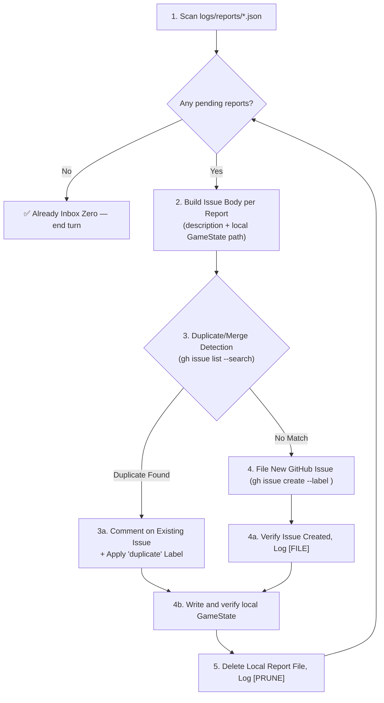

# 🗂️ Problem Report Triage Protocol (Local Report → GitHub Issue, Inbox Zero)

**Shared rules:** Apply [`.agents/rules/shared-quality-gates.md`](../../rules/shared-quality-gates.md), including path, preservation, and delivery policies.

This skill converts locally-captured Dev Mode problem reports (`logs/reports/*.json`, produced by the in-game "Report a Problem" feature) into tracked GitHub Issues formatted exactly like the repo's **official issue templates** ([`.github/ISSUE_TEMPLATE/bug_report.md`](../../../.github/ISSUE_TEMPLATE/bug_report.md) and [`feature_request.md`](../../../.github/ISSUE_TEMPLATE/feature_request.md)) — merging into an existing issue instead of filing a duplicate when one is detected — then prunes the local file, mirroring the Inbox Zero pattern already used for `docs/ambiguities/`.

**Every filed or merged issue must clearly identify itself as a player-submitted Dev Mode report and preserve the reporter's exact original text**, since the person triaging it later (a maintainer or another skill) was not present when it was written and must be able to read precisely what was reported, not a paraphrase.

---

## 📄 Report File Shape

Each `logs/reports/report_{timestamp}_{type}.json` file (written by [src/ui/services/problem-report-service.ts](../../../src/ui/services/problem-report-service.ts) via the Vite dev-server middleware in [vite.config.ts](../../../vite.config.ts)) has this shape:

```jsonc
{
  "type": "bug" | "improvement" | "feature",
  "priority": "P0-critical" | "P1-high" | "P2-medium" | "P3-low",
  "title": "string (user-entered, truncated)",
  "description": "string (user-entered free text — this is the reporter's ORIGINAL TEXT and must be preserved verbatim in the issue body, never paraphrased)",
  "labels": ["bug", "triage", "priority:P1-high"], // pre-computed by mapReportToLabels(); DO NOT use verbatim — see Step 4 for the repo's actual label taxonomy
  "gameState": { /* full GameState tree at time of report */ },
  "timestamp": 1234567890123
}
```

> [!IMPORTANT]
> The `labels` array in the report file was pre-computed client-side by `mapReportToLabels()` in [problem-report-service.ts](../../../src/ui/services/problem-report-service.ts) using an older, invented taxonomy (`priority:P0-critical`, `enhancement`+`feature`). **Do not use it verbatim.** The repository's actual GitHub label taxonomy (verified via `gh label list`) uses `priority:P0-blocker` (not `P0-critical`), `bug`/`triage` (not `bug`+`triage` for enhancements), `enhancement` for feature requests, and a plain `duplicate` label (not `duplicate-reported`). Always re-derive labels per Step 4 below.

---

## 🔄 The 6-Step Triage Lifecycle



### Step 1: Scan Pending Reports

List all files matching `logs/reports/report_*.json` (ignore `logs/reports/processed/` if present from prior runs). If none exist, log `[DONE]` and end the turn immediately — do not create empty issues or fabricate reports.

### Step 2: Build the Issue Title & Body per Report (Official Template Format)

Construct the title and body using the repo's **official issue templates** as the exact model — never invent new section headings. Pick the template that matches `report.type`:

- `report.type == "bug"` → mirror [`bug_report.md`](../../../.github/ISSUE_TEMPLATE/bug_report.md).
- `report.type == "improvement"` or `"feature"` → mirror [`feature_request.md`](../../../.github/ISSUE_TEMPLATE/feature_request.md).

**Title:** `[BUG]: <short summary>` or `[FEAT]: <short summary>` — reuse `report.title` (already truncated by the UI) with its internal `[BUG]`/`[IMPROVEMENT]`/`[FEATURE]` tag normalized to the official `[BUG]: `/`[FEAT]: ` prefix. Never rewrite the reporter's wording beyond this prefix normalization.

**Bug body:**

```markdown
> 🎮 **Filed via Dev Mode "Report a Problem"** — this issue was submitted directly by a player from the live game table, not pre-triaged by a maintainer. Reproduction context below is inferred automatically from the local GameState snapshot; verify it against the original report before acting.

### 🐛 Describe the Bug

<1–2 sentence neutral restatement of the problem, derived only from the original text below — if unclear, write "See original report below.">

### 📋 Steps to Reproduce

1. Start Scenario: `<gameState.scenarioId>` (Difficulty: `<gameState.difficulty>`, Heroic: `<gameState.heroicLevel>`)
2. Hero Selection: `<players[].hero.name / alterEgo.name>` (`<N>` player(s))
3. State at time of report: Round `<gameState.roundNumber>`, Phase `<gameState.phase>`, Active Player Index `<gameState.activePlayerIndex>`
4. See error: as described in the original report below

### 🎯 Expected Behavior vs Actual Behavior

- **Expected:** Not stated by the reporter — pending triage.
- **Actual:** See the original report below.

### 📖 Official Rules Citation (If Applicable)

N/A — filed via Dev Mode; no rules citation was captured. Add one during triage if relevant.

### 💻 Environment

- **OS:** Not captured via Dev Mode
- **Browser / Runtime:** Not captured via Dev Mode (dev/preview server only per [ADR-0042](../../../docs/decisions/0042-local-first-developer-problem-reporting.md))
- **MCD Version / Commit:** Not captured via Dev Mode

---

### 📝 Original User Report (Verbatim — Preserved for Review)

> <report.description, character-for-character, unedited — this is the single source of truth for what the reporter actually said>

### 💾 Local GameState Snapshot

- **Path:** `logs/gamestates/gamestate_<timestamp>_<type>.json`
- **Notice:** This snapshot is retained locally in the developer environment and is gitignored. It is unavailable to public GitHub readers; a maintainer must retrieve the local file to inspect the exact state.

---

_Filed automatically via Dev Mode "Report a Problem" by the `problem-report-triage` skill from `logs/reports/report_<timestamp>_<type>.json`._
```

**Feature/Improvement body:**

```markdown
> 🎮 **Filed via Dev Mode "Report a Problem"** — this issue was submitted directly by a player from the live game table, not pre-triaged by a maintainer.

### 💡 Is your feature request related to a problem?

<1–2 sentence neutral restatement derived only from the original text below — if unclear, write "See original report below.">

### 🚀 Proposed Solution

See the original report below for the reporter's own description of what they'd like to see.

### 🎨 Visual / UI Mockup (If Applicable)

N/A — no mockup was captured via Dev Mode.

### 🔄 Alternatives Considered

N/A — not captured via Dev Mode; explore during triage.

### 📚 Additional Context

- Captured live in-game via Dev Mode at Round `<gameState.roundNumber>`, Phase `<gameState.phase>`, Scenario `<gameState.scenarioId>` (`<N>` player(s): `<players[].hero.name>`).

---

### 📝 Original User Report (Verbatim — Preserved for Review)

> <report.description, character-for-character, unedited>

### 💾 Local GameState Snapshot

- **Path:** `logs/gamestates/gamestate_<timestamp>_<type>.json`
- **Notice:** This snapshot is retained locally in the developer environment and is gitignored. It is unavailable to public GitHub readers; a maintainer must retrieve the local file to inspect the exact state.

---

_Filed automatically via Dev Mode "Report a Problem" by the `problem-report-triage` skill from `logs/reports/report_<timestamp>_<type>.json`._
```

Never invent Expected Behavior, Rules Citations, Environment details, or Alternatives that the reporter did not state — always mark them "Not stated" / "N/A" and defer to the verbatim section.

#### 🛡️ Local GameState Retention Guardrail

Full serialized `gameState` trees are debugging evidence and must remain local under `logs/gamestates/`.

1. **Never publish GameState JSON on GitHub:** Do not include full or excerpted GameState JSON in issue bodies or comments.
2. **Use a collision-safe filename:** Start with `logs/gamestates/gamestate_<timestamp>_<type>.json`; add a numeric suffix if that path exists.
3. **Write atomically:** Write to a temporary sibling file, rename it to the final path, then parse the final JSON to verify it.
4. **Preserve before pruning:** Do not delete the report until both GitHub filing or merge confirmation and local snapshot verification succeed.

### Step 3: Duplicate / Merge Detection 🔍

**Before filing anything new**, search existing GitHub issues for a likely duplicate or near-match, scoped to the same report `type`:

```bash
gh issue list --search "<key terms from report.title/description> in:title,body" --state all --limit 15
```

Compare each candidate against the current report using **title similarity, overlapping key terms (card names, scenario names, phase/action names), and matching report type** — never rely on title string equality alone, and never guess when evidence is thin.

- **Confidence ≥ 80% match (same underlying problem, same card/mechanic/scenario):** Treat as a **duplicate** and proceed to Step 3a (Merge) instead of Step 4 (File New).
- **Confidence < 80% or no plausible candidate:** Treat as **not a duplicate** and proceed to Step 4 (File New).

Log the outcome either way: `[DUPLICATE]` with the matched issue number and confidence when merging, or a note in `[SCAN]` that no match was found.

#### Step 3a: Merge into the Existing Issue

When a duplicate is detected, do **not** create a new issue. Instead:

1. **Comment on the existing issue** with the new report's verbatim text, so the issue thread reflects that another player independently hit the same problem — the comment must preserve the reporter's original words, not a paraphrase:

```bash
 gh issue comment <NUM> --body "> 🎮 **Another Dev Mode report was received for this issue** (Priority: <report.priority>, Type: <report.type>).

 ### 📝 Original User Report (Verbatim — Preserved for Review)

 > <report.description, character-for-character, unedited>

### 💾 Local GameState Snapshot

- **Path:** `logs/gamestates/gamestate_<timestamp>_<type>.json`
- **Notice:** This snapshot is retained locally in the developer environment and is gitignored. It is unavailable to public GitHub readers; a maintainer must retrieve the local file to inspect the exact state.

---

_Merged automatically by the \`problem-report-triage\` skill from \`report_<timestamp>_<type>.json\`. This issue has now been reported more than once — consider raising its priority._"

```

2. **Apply the repository's existing `duplicate` label** (already defined — `gh label list` confirms it exists, so no `gh label create` is needed) so downstream skills (`next-task`, `bug-fix`, `feature-delivery`) can see at a glance that an issue has multiple independent reports and should be weighted higher in prioritization:

```bash
gh issue edit <NUM> --add-label "duplicate"
```

3. **If the new report's priority is higher** than the existing issue's current `priority:P?-*` label, swap the priority label up (e.g. remove `priority:P2-medium`, add `priority:P1-high`) so the escalated severity is visible without manual triage.
4. Log `[MERGE]` with the issue number and running report count, then proceed to Step 4b to write and verify the local GameState before pruning.

### Step 4: File a New GitHub Issue (No Duplicate Found)

**Do not use `report.labels` verbatim.** Re-derive the label set from `report.type` and `report.priority` against the repository's real, existing taxonomy (verified with `gh label list` — all of these labels already exist, so `gh label create` is never needed for a standard report):

| `report.type` | Title Prefix | Labels                                             |
| ------------- | ------------ | -------------------------------------------------- |
| `bug`         | `[BUG]: `    | `bug`, `priority:<mapped>`, `needs-review`         |
| `improvement` | `[FEAT]: `   | `enhancement`, `priority:<mapped>`, `needs-review` |
| `feature`     | `[FEAT]: `   | `enhancement`, `priority:<mapped>`, `needs-review` |

Priority mapping (`report.priority` → repo label — note `P0` renames from `critical` to `blocker`):

| `report.priority` | Repo Label            |
| ----------------- | --------------------- |
| `P0-critical`     | `priority:P0-blocker` |
| `P1-high`         | `priority:P1-high`    |
| `P2-medium`       | `priority:P2-medium`  |
| `P3-low`          | `priority:P3-low`     |

```bash
gh issue create \
  --title "[BUG]: <report.title, tag normalized>" \
  --label "bug,priority:P1-high,needs-review" \
  --body-file <temp-body-file>.md
```

### Step 4a: Verify And Log

1. Confirm the issue was created (`gh issue view <NUM>` or inspect the `gh issue create` output URL).
2. Append a `[FILE]` log line with the real issue number and URL.

### Step 4b: Write And Verify The Local GameState

1. Reserve a collision-safe path under `logs/gamestates/` using `gamestate_<timestamp>_<type>.json` with a numeric suffix when needed.
2. Write the complete `report.gameState` JSON to a temporary sibling file, then rename it to the reserved final path.
3. Verify the final file exists, is readable, and parses as JSON. Log `[SNAPSHOT]` with the exact repository-relative path.
4. Never upload any part of the GameState to GitHub.

### Step 5: Prune the Local Report (Inbox Zero)

Once — and only once — both the GitHub outcome is confirmed and the local GameState snapshot is written and verified, delete the local report file:

```bash
rm logs/reports/report_<timestamp>_<type>.json
```

Never delete a report file before both outcomes are complete. If GitHub filing, duplicate merge, local snapshot writing, or snapshot verification fails, leave the file in place, log the failure, and continue to the next report — do not stop the whole batch on one failure.

Repeat Steps 2–5 for every pending report, then confirm `logs/reports/` contains zero `report_*.json` files and log `[DONE]`.

---

## 🛑 Safety Notes

- This skill only ever reads `logs/reports/*.json` and calls `gh issue list` / `gh issue create` / `gh issue comment` / `gh issue edit` / deletes the already-filed local JSON file. It never modifies `src/`, `tests/`, or any card supplemental data. `gh label create` should not be needed for a standard run since `bug`, `enhancement`, `needs-review`, `duplicate`, and all `priority:P?-*` labels already exist in the repository — if `gh issue create` reports a missing label, stop and treat it as a `[SCAN]`-logged anomaly rather than silently inventing a new label taxonomy.
- **Never publish GameState JSON on GitHub:** Do not put GameState JSON, full or abbreviated, into an issue body or comment. Reference only the verified local `logs/gamestates/` path and local-only availability warning.
- **Atomic local persistence gate:** Write to a temporary sibling file and rename only after complete serialization. Verify the final file parses as JSON before pruning the report.
- **Never fabricate or paraphrase the reporter's words.** The `### 📝 Original User Report (Verbatim — Preserved for Review)` section must always contain `report.description` character-for-character. Any restatement elsewhere in the body (e.g. "Describe the Bug") must be clearly a _summary of the section below_, never a substitute for it — a later triager must be able to trust the verbatim block as ground truth.
- If a report's `description` is empty or the file is malformed, skip it, log a `[SCAN]` warning, and leave it in place for manual review rather than guessing at intent.
- **Never guess at a duplicate match.** If duplicate-detection confidence is below the 80% threshold, always file a new issue rather than risk silently burying a distinct problem inside an unrelated thread.
- Deleting a local report file is irreversible; always confirm the outcome first — either the new Issue exists (Step 4a) or the merge comment/label was applied (Step 3a) — before Step 5.
- **Historic issues #129–#139:** Retain the 291 GameState comments already published. Exact local reconstruction is not proven, so do not delete or claim local replacement snapshots. Add a transparent policy note that future reports retain GameState only locally.

---

## 💡 Prompt Examples

- `problem-report-triage: file all pending reports`
- `problem-report-triage: clear logs/reports/`
- "Triage the problem reports, merge duplicates, and open GitHub issues for the rest"
