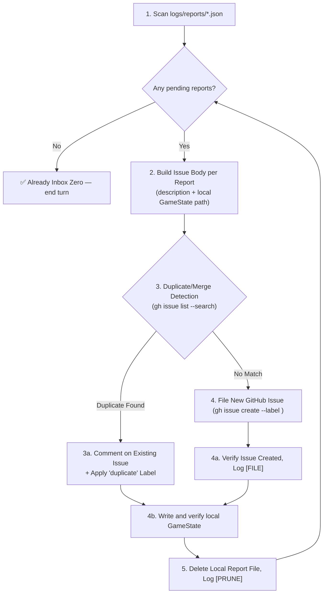

# 🗂️ Problem Report Triage Protocol (Local Report → GitHub Issue, Inbox Zero)

**Shared rules:** Apply [`.agents/rules/shared-quality-gates.md`](../../rules/shared-quality-gates.md), including path, preservation, and delivery policies.

**Needs:** `rtk` (see [`antigravity-rtk-rules.md`](../../rules/antigravity-rtk-rules.md)), Node.js with `npm ci`, and the GitHub CLI authenticated via `gh auth login` (check with `gh auth status`).

This skill converts locally-captured Dev Mode problem reports (`logs/reports/*.json`, produced by the in-game "Report a Problem" feature) into tracked GitHub Issues formatted exactly like the repo's **official issue templates** ([`.github/ISSUE_TEMPLATE/bug_report.md`](../../../.github/ISSUE_TEMPLATE/bug_report.md) and [`feature_request.md`](../../../.github/ISSUE_TEMPLATE/feature_request.md)) — merging into an existing issue instead of filing a duplicate when one is detected — then prunes the local file, mirroring the Inbox Zero pattern already used for `docs/ambiguities/`.

**Every filed or merged issue must clearly identify itself as a player-submitted Dev Mode report and preserve the reporter's exact original text**, since the person triaging it later (a maintainer or another skill) was not present when it was written and must be able to read precisely what was reported, not a paraphrase.

## 🛑 Hard rules (read first)

- Keep the reporter's `description` verbatim in the issue; summaries elsewhere never replace it.
- GameState JSON never goes to GitHub; it is saved locally under `logs/gamestates/` (hook-enforced).
- Delete a report only after the GitHub outcome is confirmed and the snapshot is saved and valid (snapshot check is hook-enforced).
- Duplicates need the same root problem and mechanic, not just the same card or title; when unsure, file a new issue.
- Use the templates in [`templates.md`](templates.md); one failed report never stops the batch.

---

## 📄 Report File Shape

Each `logs/reports/report_{timestamp}_{type}.json` file (written by [src/ui/services/problem-report-service.ts](../../../src/ui/services/problem-report-service.ts) via the Vite dev-server middleware in [vite.config.ts](../../../vite.config.ts)) has this shape:

```jsonc
{
  "type": "bug" | "improvement" | "feature",
  "priority": "P0-critical" | "P1-high" | "P2-medium" | "P3-low",
  "title": "string (user-entered, truncated)",
  "description": "string (user-entered free text — this is the reporter's ORIGINAL TEXT and must be preserved verbatim in the issue body, never paraphrased)",
  "labels": ["bug", "triage", "priority:P1-high"], // pre-computed by mapReportToLabels(); DO NOT use verbatim — see Step 4 for the repo's actual label taxonomy
  "gameState": { /* full GameState tree at time of report */ },
  "timestamp": 1234567890123
}
```

> [!IMPORTANT]
> The `labels` array in the report file was pre-computed client-side by `mapReportToLabels()` in [problem-report-service.ts](../../../src/ui/services/problem-report-service.ts) using an older, invented taxonomy (`priority:P0-critical`, `enhancement`+`feature`). **Do not use it verbatim.** The repository's actual GitHub label taxonomy (verified via `gh label list`) uses `priority:P0-blocker` (not `P0-critical`), `bug`/`triage` (not `bug`+`triage` for enhancements), `enhancement` for feature requests, and a plain `duplicate` label (not `duplicate-reported`). Always re-derive labels per Step 4 below.

---

## 🔄 The 6-Step Triage Lifecycle


```mermaid
flowchart TD
    S1["1. Scan logs/reports/*.json"] --> S2{"Any pending reports?"}
    S2 -- "No" --> DONE["✅ Already Inbox Zero — end turn"]
    S2 -- "Yes" --> S3["2. Build Issue Body per Report<br/>(description + local GameState path)"]
    S3 --> S3B{"3. Duplicate/Merge Detection<br/>(gh issue list --search)"}
    S3B -- "Duplicate Found" --> M1["3a. Comment on Existing Issue<br/>+ Apply 'duplicate' Label"]
    M1 --> S4B["4b. Write and verify local GameState"]
    S3B -- "No Match" --> S4["4. File New GitHub Issue (gh issue create --label <labels>)"]
    S4 --> S5["4a. Verify Issue Created, Log [FILE]"]
    S5 --> S4B
    S4B --> S6["5. Delete Local Report File, Log [PRUNE]"]
    S6 --> S2
```

### Step 1: Scan Pending Reports

List all files matching `logs/reports/report_*.json` (ignore `logs/reports/processed/` if present from prior runs). If none exist, log `[DONE]` and end the turn immediately — do not create empty issues or fabricate reports.

### Step 2: Build the Issue Title & Body per Report (Official Template Format)

Construct the title and body using the repo's **official issue templates** as the exact model (strict templates: never invent new section headings). Pick the template that matches `report.type`:

- `report.type == "bug"` → mirror [`bug_report.md`](../../../.github/ISSUE_TEMPLATE/bug_report.md).
- `report.type == "improvement"` or `"feature"` → mirror [`feature_request.md`](../../../.github/ISSUE_TEMPLATE/feature_request.md).

**Title:** `[BUG]: <short summary>` or `[FEAT]: <short summary>` — reuse `report.title` (already truncated by the UI) with its internal `[BUG]`/`[IMPROVEMENT]`/`[FEATURE]` tag normalized to the official `[BUG]: `/`[FEAT]: ` prefix. Never rewrite the reporter's wording beyond this prefix normalization.

Use the body in [`templates.md`](templates.md): [bug body](templates.md#bug-body) for `bug`, [feature body](templates.md#feature--improvement-body) for `improvement`/`feature`. Both are strict templates.

Never invent Expected Behavior, Rules Citations, Environment details, or Alternatives that the reporter did not state — always mark them "Not stated" / "N/A" and defer to the verbatim section.

#### 🛡️ Local GameState Retention Guardrail

Full serialized `gameState` trees are debugging evidence and must remain local under `logs/gamestates/`.

1. **GameState JSON stays off GitHub:** A hook blocks `gh` calls whose body contains it; GameState is gitignored debugging evidence that public readers must not see.
2. **Use a collision-safe filename:** Start with `logs/gamestates/gamestate_<timestamp>_<type>.json`; add a numeric suffix if that path exists.
3. **Write atomically:** Write to a temporary sibling file, rename it to the final path, then parse the final JSON to verify it.
4. **Preserve before pruning:** Do not delete the report until both GitHub filing or merge confirmation and local snapshot verification succeed.

### Step 3: Duplicate / Merge Detection 🔍

**Before filing anything new**, search existing GitHub issues for a likely duplicate or near-match, scoped to the same report `type`:

```bash
gh issue list --search "<key terms from report.title/description> in:title,body" --state all --limit 15
```

Compare each candidate against the current report. **Card name, card code, and issue title similarity alone are NOT enough to declare a duplicate.** A single card can have multiple independent bugs across its various abilities, costs, keywords, stat calculations, or choice options (e.g., an error in damage target selection vs. an error in threat placement, or a missing trigger prompt vs. an incorrect exhaust cost).

To declare a duplicate, you must verify that the **underlying root problem and failure mode** are identical:

- **Inspect the specific mechanic / trigger / branch:** Does the new report describe the exact same effect branch, timing window, interaction, or rule calculation as the existing issue?
- **Separate different symptoms on the same card:** If the existing issue targets a damage calculation bug on Card X and the new report describes a scheming/threat, cost, or trigger bug on Card X, they are **separate bugs** and must NOT be merged.
- **Confidence ≥ 80% match (same root problem, same specific mechanic/branch on the card/scenario):** Treat as a **duplicate** and proceed to Step 3a (Merge) instead of Step 4 (File New).
- **Confidence < 80% (different failure mode, different ability branch, or uncertain):** Treat as **not a duplicate** and proceed to Step 4 (File New) to ensure every distinct defect has its own isolated TDD lifecycle.

Log the outcome either way: `[DUPLICATE]` with the matched issue number and confidence when merging, or a note in `[SCAN]` that no match was found.

#### Step 3a: Merge into the Existing Issue

When a duplicate is detected, do **not** create a new issue. Instead:

1. **Comment on the existing issue** with the new report's verbatim text, so the thread shows another player independently hit the same problem. Use the [merge comment template](templates.md#merge-comment-duplicate-found) (strict; preserve the reporter's original words, never a paraphrase).

2. **Apply the repository's existing `duplicate` label** (already defined — `gh label list` confirms it exists, so no `gh label create` is needed) so downstream skills (`next-task`, `bug-fix`, `feature-delivery`) can see at a glance that an issue has multiple independent reports and should be weighted higher in prioritization:

```bash
gh issue edit <NUM> --add-label "duplicate"
```

3. **If the new report's priority is higher** than the existing issue's current `priority:P?-*` label, swap the priority label up (e.g. remove `priority:P2-medium`, add `priority:P1-high`) so the escalated severity is visible without manual triage.
4. Log `[MERGE]` with the issue number and running report count, then proceed to Step 4b to write and verify the local GameState before pruning.

### Step 4: File a New GitHub Issue (No Duplicate Found)

**Do not use `report.labels` verbatim.** Re-derive the label set from `report.type` and `report.priority` against the repository's real, existing taxonomy (verified with `gh label list` — all of these labels already exist, so `gh label create` is never needed for a standard report):

| `report.type` | Title Prefix | Labels                                             |
| ------------- | ------------ | -------------------------------------------------- |
| `bug`         | `[BUG]: `    | `bug`, `priority:<mapped>`, `needs-review`         |
| `improvement` | `[FEAT]: `   | `enhancement`, `priority:<mapped>`, `needs-review` |
| `feature`     | `[FEAT]: `   | `enhancement`, `priority:<mapped>`, `needs-review` |

Priority mapping (`report.priority` → repo label — note `P0` renames from `critical` to `blocker`):

| `report.priority` | Repo Label            |
| ----------------- | --------------------- |
| `P0-critical`     | `priority:P0-blocker` |
| `P1-high`         | `priority:P1-high`    |
| `P2-medium`       | `priority:P2-medium`  |
| `P3-low`          | `priority:P3-low`     |

```bash
gh issue create \
  --title "[BUG]: <report.title, tag normalized>" \
  --label "bug,priority:P1-high,needs-review" \
  --body-file <temp-body-file>.md
```

### Step 4a: Verify And Log

1. Confirm the issue was created (`gh issue view <NUM>` or inspect the `gh issue create` output URL).
2. Append a `[FILE]` log line with the real issue number and URL.

### Step 4b: Write And Verify The Local GameState

1. Reserve a collision-safe path under `logs/gamestates/` using `gamestate_<timestamp>_<type>.json` with a numeric suffix when needed.
2. Write the complete `report.gameState` JSON to a temporary sibling file, then rename it to the reserved final path.
3. Verify the final file exists, is readable, and parses as JSON. Log `[SNAPSHOT]` with the exact repository-relative path.
4. Never upload any part of the GameState to GitHub.

### Step 5: Prune the Local Report (Inbox Zero)

Once — and only once — both the GitHub outcome is confirmed and the local GameState snapshot is written and verified, delete the local report file:

```bash
Remove-Item logs/reports/report_<timestamp>_<type>.json
```

A hook blocks deleting a report whose valid GameState snapshot is missing (the GitHub outcome is still your check); a deleted report is lost for good. If GitHub filing, duplicate merge, local snapshot writing, or snapshot verification fails, leave the file in place, log the failure, and continue to the next report — do not stop the whole batch on one failure.

Repeat Steps 2–5 for every pending report, then confirm `logs/reports/` contains zero `report_*.json` files and log `[DONE]`.

---

## 🛑 Safety Notes

- This skill only ever reads `logs/reports/*.json` and calls `gh issue list` / `gh issue create` / `gh issue comment` / `gh issue edit` / deletes the already-filed local JSON file. It never modifies `src/`, `tests/`, or any card supplemental data. `gh label create` should not be needed for a standard run since `bug`, `enhancement`, `needs-review`, `duplicate`, and all `priority:P?-*` labels already exist in the repository — if `gh issue create` reports a missing label, stop and treat it as a `[SCAN]`-logged anomaly rather than silently inventing a new label taxonomy.
- **GameState and report deletion:** Enforced by hooks (see Step 2 guardrail and Step 5). Reference only the verified local `logs/gamestates/` path and local-only warning.
- **Never fabricate or paraphrase the reporter's words.** The `### 📝 Original User Report (Verbatim — Preserved for Review)` section must always contain `report.description` character-for-character. Any restatement elsewhere in the body (e.g. "Describe the Bug") must be clearly a _summary of the section below_, never a substitute for it — a later triager must be able to trust the verbatim block as ground truth.
- **Never guess at a duplicate match:** Card name, card code, and issue title similarity alone are NEVER sufficient to declare a duplicate. Multiple independent bugs can affect the same card. If the reported symptom, ability branch, rule calculation, or mechanic differs, always file a new issue rather than risk silently burying a distinct problem inside an unrelated thread. Every distinct bug requires its own isolated TDD lifecycle and reproduction test.
- Deleting a local report file is irreversible; always confirm the outcome first — either the new Issue exists (Step 4a) or the merge comment/label was applied (Step 3a) — before Step 5.
- **Historic issues #129–#139:** Retain the 291 GameState comments already published. Exact local reconstruction is not proven, so do not delete or claim local replacement snapshots. Add a transparent policy note that future reports retain GameState only locally.

---

## 💡 Prompt Examples

- `problem-report-triage: file all pending reports`
- `problem-report-triage: clear logs/reports/`
- "Triage the problem reports, merge duplicates, and open GitHub issues for the rest"
