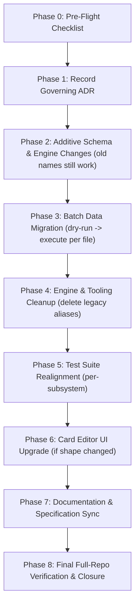

# 🏷️ Schema Taxonomy Migration Protocol (Phase 0–8 Consolidation Workflow)

**Shared rules:** Apply [`.agents/rules/shared-quality-gates.md`](../../rules/shared-quality-gates.md), including path, scope, plan, verification, and delivery policies.

This skill governs any change to the _vocabulary_ of the declarative supplemental layer — renaming, merging, or retiring `TriggerTypeSchema` / `EffectTypeSchema` / `TargetSelectorSchema` enum members (and their `AbilityStep`/`params` shapes) — as distinct from adding a genuinely new capability (which is `feature-delivery`'s job) or integrating a single card (`card-integration-protocol`'s job). Reference invocation: **ADR-0058** and [docs/reports/card_editor_and_supplemental_schema_audit_report.md](../../../docs/reports/card_editor_and_supplemental_schema_audit_report.md).

---

## The Sequencing Invariant (Never Violate)

Data migrates **before** code is deleted. Concretely: **update code (additive) → test the new code → rewrite supplemental data → retest against the new data → remove old code → retest again.** Old and new names must be simultaneously valid for the entire window between "first supplemental file rewritten" and "last legacy `case`/enum member deleted" — there must never be a commit where a card fails to parse because its trigger/effect name was renamed out from under it before the rewrite landed. This is why Phase 2 (additive) always precedes Phase 3 (migrate data), which always precedes Phase 4 (cleanup).

A sub-phase is not complete until **its own** quality gate passes independently:

```bash
npm run format:check && npm run lint && npm run typecheck && npm test && npm run build && npm run report:declarations
```

Do not proceed to the next numbered sub-phase in the same session if the current one fails. Do not merge two sub-phases into one commit to save time — each sub-phase's checkbox and commit are 1:1.

---

## 🔄 The 0-to-8 Phase Workflow



### Phase 0 — Pre-Flight Checklist

Before touching any file, confirm all of the following (see Section "Phase 0" in the governing audit report for the canonical checklist item wording):

- The governing report/plan is flipped from draft to `Approved — In Execution`.
- A tracking GitHub issue exists and is referenced by every subsequent commit.
- `git status` is clean and `main` is up to date with `origin`.
- `docs/ambiguities/` is Inbox Zero (no card mid-review references a name being renamed).
- No other in-flight issue/PR/session is editing `schema.ts`, `effects/index.ts`, `cost-engine.ts`, `action-dispatcher.ts`, `trigger-dispatcher.ts`, or `src/data/supplemental/pack/*.json`. Re-check this immediately before Phase 2 and again before Phase 3.
- `npm run schema:generate` and `npm run report:declarations` both run cleanly against current `main`.
- The new migration script's filename doesn't collide with anything in `tools/audit/` or `tools/`.
- A baseline metrics snapshot (test counts, `report:declarations` summary) is captured and logged.
- The branch strategy for the Phase 3→5 red-test window is explicitly decided and recorded (single uninterrupted session vs. dedicated branch).
- Progress-tracking ownership is agreed: the governing report's checkboxes are the single source of truth, ticked and committed per sub-phase.

### Phase 1 — Record the Governing ADR

- Copy `docs/decisions/template.md` to the next `docs/decisions/XXXX-*.md`. Populate Context, naming/consolidation rationale, Decision Drivers, Considered Options.
- Embed the full old→new mapping tables (triggers, effects, selectors, or whatever taxonomy is being consolidated) directly in the ADR's Decision Outcome — self-contained, not just a link back to a report that may later be pruned.
- Register in `docs/decisions/README.md` log table and the relevant Mermaid lineage graph.

### Phase 2 — Additive Schema & Engine Changes (Zero Breakage)

- Add every new canonical enum member to `schema.ts` **alongside** existing legacy members — never replace in this phase.
- Implement any genuinely new capability introduced by the consolidation (e.g. a merged primitive gaining a new optional param) as its own isolated, tested addition.
- If explicitly approved in the migration plan, temporarily support both labels in engine switch dispatchers: `case 'NEW': case 'OLD': { ...unchanged body... }`. Delete the old label during cleanup.
- Regenerate `schema.json` (`npm run schema:generate`).
- Add new contract tests for the _new_ behavior only. Full suite must remain green with zero changes to existing test assertions.

### Phase 3 — Batch Data Migration

- Author a deterministic, re-runnable script under `tools/audit/` (follow the existing pattern in `tools/migrate-supplemental-to-steps.ts`) with a hard-coded rename map sourced from the ADR, not re-derived ad hoc.
- Support a `--dry-run` flag that prints a per-card, per-field before/after diff before any file is written.
- Execute file-by-file (smallest/most-reviewed pack first), reviewing the diff each time, not all packs in one blind pass.
- Decompose any legacy single-use/bespoke primitive into composable steps via a dedicated hand-written transform, not the generic rename map.
- Re-validate every migrated card against the Zod schema (`npm run report:declarations` or equivalent full-catalog parse).
- **Expected state at the end of this phase: `npm run typecheck` passes, but `npm test` may fail** on test files still asserting legacy string literals — this is tracked, not fixed, in Phase 3. Do not attempt test fixes here.

### Phase 4 — Engine & Tooling Cleanup

- Delete the legacy enum members from `schema.ts` and any hand-duplicated TS union types (e.g. `src/engine/models/abilities.ts`).
- Delete the legacy `case` fallthroughs added in Phase 2, keeping only the canonical label.
- Delete any fully-retired bespoke single-use handlers entirely.
- Update remaining string-literal call sites (trigger dispatch calls, card-text-parser pattern maps, locale keys, log formatters) to canonical names.
- Regenerate `schema.json` again so deleted names no longer autocomplete.
- Use the TypeScript compiler's resulting errors as the removal checklist — if `tsc --noEmit` is clean after deletion, no stray reference survived.

### Phase 5 — Test Suite Realignment

- Update test files in small, subsystem-scoped batches (e.g. one commit per: engine triggers, search/retrieve, counters/limits, legacy-primitive decompositions, card-text-parser, editor/tooling) rather than one giant diff.
- Add explicit negative-path tests proving the removed enum values are now rejected by `.safeParse(...).success === false`, locking in that the cleanup is permanent.
- `npm test` must be 100% green with zero skipped tests before Phase 6.

### Phase 6 — Card Editor UI Upgrade (Only If Shape Changed)

- Update `src/ui/components/editor/effect-parameter-registry.ts` descriptor keys/labels to canonical names; remove descriptors for deleted primitives.
- If the consolidation introduced a materially richer param shape (e.g. a new composable filter or dynamic value source), build or extend the corresponding visual sub-builder in `AbilityFormBuilder.tsx` rather than leaving it as raw-JSON-only.
- Add/update component tests covering the editor round-trip (build via UI → resulting JSON matches expected shape → re-load reproduces the same selections).

### Phase 7 — Documentation & Specification Sync

- Update every affected chapter in `docs/specifications/supplemental/` and `docs/specifications/supplemental_data_schema.md`.
- Add the naming/consolidation rule to `docs/coding_guidelines.md` if it establishes a durable convention (not just a one-time fix).
- Single consolidated `CHANGELOG.md` entry under `[Unreleased]` summarizing the full rename/consolidation table.

### Phase 8 — Final Full-Repo Verification & Closure

- Full quality gate: `npm run format:check && npm run lint && npm run typecheck && npm test && npm run build && npm run report:declarations`.
- Repo-wide grep sweep for every retired identifier across `src/`, `tests/`, `docs/`, `tools/` — zero hits outside historical ADR text.
- Manual smoke test in `npm run dev` exercising at least one migrated card per affected category.
- Update `docs/roadmap_and_milestones.md`; close the tracking GitHub issue with a summary comment referencing the governing ADR.

---

## Post-Task Protocol Reminder

Every phase uses the canonical 8-point checklist in [`.agents/rules/post-task-checklist.md`](../../rules/post-task-checklist.md). Prepare each phase's commit and walkthrough, then request user approval before committing; pushing requires separate authorization.

---

## 💡 Prompt Examples

- `schema-taxonomy-migration: Execute Phase 0 pre-flight for ADR-0058`
- `schema-taxonomy-migration: Run Phase 2 additive schema changes for ADR-0058`
- `schema-taxonomy-migration: Execute Phase 3 batch migration dry-run on core.json`
- `schema-taxonomy-migration: Consolidate ADD_COUNTER/ADD_COUNTERS aliases (new consolidation, not ADR-0058)`
