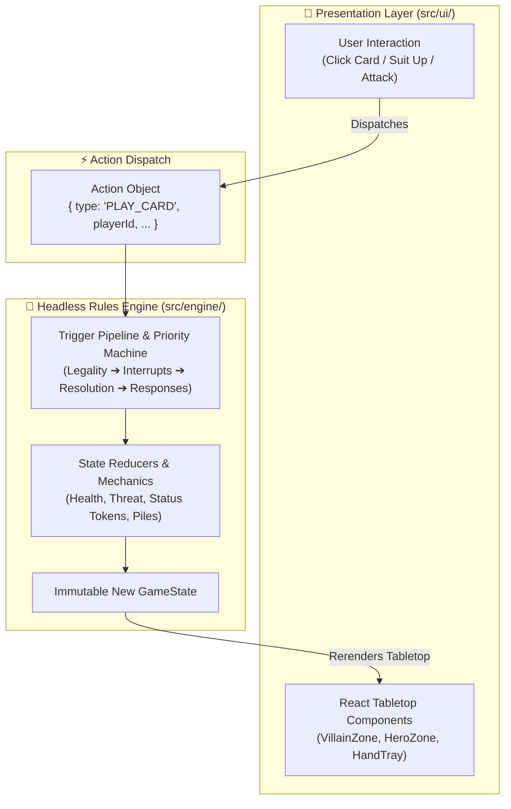

# Marvel Champions Digital (MCD)

[](https://github.com/SteveRodrigue/MCD/actions)
[](LICENSE)
[](https://www.typescriptlang.org/)
[](https://reactjs.org/)
[](https://vitejs.dev/)
[](https://tailwindcss.com/)

An open-source, faithful digital adaptation of **Marvel Champions: The Card Game** (by Fantasy Flight Games), featuring a **deterministic headless rules engine** and a **1960s Silver-Age Comic / Pop-Art aesthetic** (inspired by vintage Marvel comic panels and Batman '66).

---

## 🌟 Key Features

- **Headless & Deterministic Rules Engine:** 100% test-driven core engine decoupled from rendering, ensuring accurate execution of complex timing triggers, interrupts, forced responses, and replacement effects.

- **60s Comic Pop-Art Aesthetic:** Ben-Day halftone dot patterns, comic book panel playmats, speech bubbles, dynamic boundary-aware hover-zoom, and punchy onomatopoeia overlays (_POW!_, _BAM!_, _KAPOW!_, _THWIP!_).

- **Data-Driven Architecture:** Ingests official card metadata directly from [`marvelsdb-json-data`](https://github.com/SteveRodrigue/marvelsdb-json-data).

- **Developer Tooling & Inspectors:** Integrated Dev Mode with search, scrying, and multi-tier sorting for Player and Encounter decks.

- **Cross-Platform:** Runs seamlessly in modern web browsers and packages into lightweight native desktop executables via **Tauri**.

---

## 🏗️ Architecture & Dataflow



- **[Architecture Decision Records (ADRs)](docs/decisions/README.md)** — Comprehensive centralized registry of all architectural, technical, and gameplay design decisions (ADR-0001 through ADR-0041).
- **[Algorithmic Rules Reference](docs/algorithmic_rules_reference.md)** — Precise mathematical state machine and timing pipeline specifications derived from RR v1.8.
- **[Project Roadmap & Milestones](docs/roadmap_and_milestones.md)** — Detailed 5-phase iterative development plan and status.
- **[Coding Guidelines & Standards](docs/coding_guidelines.md)** — Strict architectural boundaries, typing rules, UI layering standards, and TDD requirements.
- **[Installation & Setup Guide](docs/installation_guide.md)** — Comprehensive environment setup, PATH troubleshooting, installation, and run instructions.
- **[Technology Evaluation & Design](docs/technology_evaluation_and_architecture.md)** — Deep architectural analysis, engine evaluation, and state models.
- **[Changelog](CHANGELOG.md)** — Chronological release history and milestone log.

---

## 🚀 Getting Started

### Prerequisites

- **Node.js:** v18.0.0 or higher
- **npm:** v9.0.0 or higher

> [!TIP]
> For detailed platform-specific installation steps, PATH troubleshooting, and execution policy setup, consult the **[Installation & Setup Guide](docs/installation_guide.md)**.

### Installation

```bash
# Clone the repository
git clone https://github.com/SteveRodrigue/MCD.git
cd MCD

# Install dependencies
npm install
```

### Development

```bash
# Start local Vite development server with Hot Module Replacement (HMR)
npm run dev
# Open http://localhost:3000/ in your browser
```

### Running Tests

```bash
# Run unit tests via Vitest
npm test

# Run tests in interactive watch mode
npm run test:watch

# Run test coverage report
npm run test:coverage
```

### Type Checking & Linting

```bash
npm run typecheck
npm run lint
```

---

## 📁 Project Structure

```
MCD/
├── .github/              # CI workflows, Issue & PR templates
├── .vscode/              # Recommended IDE extensions and workspace settings
├── docs/                 # Architectural documentation and Decision Records
│   ├── decisions/        # Architecture Decision Records (ADRs & Index)
│   ├── guidelines/       # Hero Creation Guide & Scenario Plugin Creation Guide
│   ├── specifications/   # Modular Supplemental Data Schema Specification Suite
│   └── ambiguities/      # Isolated card ambiguity reports & tracking issues
├── references/           # Official rulebooks and JSON schema references
├── src/
│   ├── assets/           # Fonts, Ben-Day dot textures, comic style assets
│   ├── data/             # Upstream importer & declarative supplemental packs
│   │   ├── supplemental/ # Enriched executable card abilities & Zod validation schema
│   │   └── importer/     # Normalized Card Catalog loader
│   ├── engine/           # 100% Headless Rules Engine (State tree, Triggers, Phases)
│   │   ├── decks/        # Starter deck definitions & deck utilities
│   │   ├── effects/      # Reusable composable effect primitives
│   │   ├── models/       # Core TypeScript interfaces (Card, Hero, Villain, Effect)
│   │   ├── pipeline/     # Action pipeline, Legality checker & Villain phase
│   │   ├── scenarios/    # Modular Scenario Plugin Architecture (Official & Fan-Made)
│   │   ├── simulation/   # Headless match simulator & player bot
│   │   ├── specials/     # Hero Special ability plugin registry
│   │   ├── state/        # Immutable GameState, Reducers & Setup
│   │   └── triggers/     # Trigger dispatcher & lifecycle event routing
│   └── ui/               # React UI & 60s Comic Pop-Art presentation layer
│       ├── components/   # Card components, Tabletop zones, Modal dialogs
│       ├── context/      # Persistent UI settings and Dev Mode state
│       ├── hooks/        # Card art, edge scrolling & hand fan layout hooks
│       ├── services/     # Card image cache & gamestate logger services
│       ├── styles/       # Global stylesheet (index.css)
│       └── utils/        # Presentation helpers (comic log formatter)
└── tests/                # Automated Vitest test suites (TDD rules & schema validation)
```

---

## 🤝 Contributing

We welcome community contributions! Please read our **[Contributing Guide](CONTRIBUTING.md)**, **[Code of Conduct](CODE_OF_CONDUCT.md)**, and **[Security Policy](SECURITY.md)** before submitting pull requests or reporting issues.

---

## ⚖️ Legal Disclaimer

_Marvel Champions: The Card Game_ is © Fantasy Flight Games and © MARVEL.
This project is an unofficial, open-source, non-commercial fan-made software intended purely for personal enjoyment. All card text, mechanics, and trademarks are the intellectual property of their respective owners. No monetization or commercial use is permitted.
