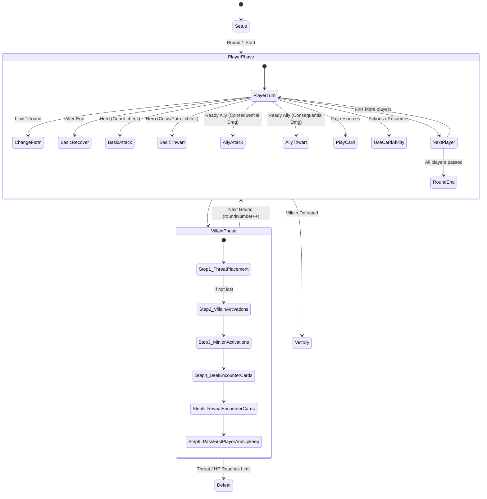

# Marvel Champions Digital (MCD) — Algorithmic Rules Reference

This document provides a **distilled, mathematically precise, and algorithmic specification** of the rules of *Marvel Champions: The Card Game*, strictly derived from **Rules Reference v1.8** and validated against the MCD codebase implementation.

---

## 1. Document Hierarchy & Invariant Principles

```
+-------------------------------------------------------------------------+
|                  1. Card Text (The Golden Rule)                         |
|     - If a card explicitly contradicts general rules, the card wins.    |
+------------------------------------+------------------------------------+
                                     |
                                     v
+-------------------------------------------------------------------------+
|                  2. Rules Reference v1.8 (DEFINITIVE LAW)               |
|     - Strictly supersedes & corrects Learn to Play in all cases.        |
+------------------------------------+------------------------------------+
                                     |
                                     v
+-------------------------------------------------------------------------+
|                  3. Learn to Play Guide (TUTORIAL ONLY)                 |
+-------------------------------------------------------------------------+
```

---

## 2. Core Game Loop & State Machine



---

## 3. Formal Play Areas & Zones Architecture (RR v1.8 p. 22-23)

The MCD rules engine strictly partitions all card instances into deterministic, immutable zones:

```
┌────────────────────────────────────────────────────────────────────────────────────────┐
│                                 SHARED IN-PLAY AREA                                    │
├────────────────────────────────────────┬───────────────────────────────────────────────┤
│ 1. SCENARIO / VILLAIN ZONE             │ 2. ENCOUNTER DRAW & DISCARD ZONES             │
│    • state.villain (Card, HP, Status)  │    • state.encounterDeck (Draw pile)          │
│    • state.villain.attachments         │    • state.encounterDiscard (Discard pile)    │
│    • state.mainScheme (Active Stage)   │    • state.activeBoostCard (Revealed boost)   │
│    • state.sideSchemes[] (Active)      │                                               │
│    • state.environments[]              │                                               │
└────────────────────────────────────────┴───────────────────────────────────────────────┘
┌────────────────────────────────────────────────────────────────────────────────────────┐
│                           INDIVIDUAL PLAYER PLAY AREA (per player)                     │
├──────────────────────────┬─────────────────────────────┬───────────────────────────────┤
│ 3. IDENTITY & HAND ZONE  │ 4. TABLEAU & ALLIES ZONE    │ 5. ENGAGED & DEALT CARDS ZONE │
│    • player.activeFormCard│   • player.tableau (Upgrades│   • player.engagedMinions[]   │
│    • player.availableForms│     & Supports in play)     │     (Minions on this player)  │
│    • player.currentForm  │   • player.allies[] (Allies │   • player.dealtEncounterCards│
│    • player.hand[]       │     in play, ally limit 3)  │     (Face-down Step 4 queue)  │
│    • player.deck[]       │                             │                               │
│    • player.discard[]    │                             │                               │
└──────────────────────────┴─────────────────────────────┴───────────────────────────────┘
┌────────────────────────────────────────────────────────────────────────────────────────┐
│                              OUT-OF-PLAY / SET-ASIDE ZONES                             │
├────────────────────────────────────────────────────────────────────────────────────────┤
│ • player.setAsideCards[]    (Set-aside Nemesis set waiting for Shadow of the Past)     │
│ • state.victoryDisplay[]    (Defeated cards with Victory keyword)                      │
│ • state.removedFromGame[]   (Removed cards e.g. resolved Obligation)                   │
└────────────────────────────────────────────────────────────────────────────────────────┘
```

### Zone Transition Invariants:
1. **Entering Play:** Upgrades & Supports $\rightarrow$ `player.tableau`; Allies $\rightarrow$ `player.allies`; Minions $\rightarrow$ `player.engagedMinions`; Side Schemes $\rightarrow$ `state.sideSchemes`.
2. **Defeat / Discard:** Player cards $\rightarrow$ `player.discard`; Encounter cards $\rightarrow$ `state.encounterDiscard`; Cards with Victory $\rightarrow$ `state.victoryDisplay`.
3. **Empty Deck Recycling:**
   * **Player Deck empty:** Immediately shuffle `player.discard` $\rightarrow$ `player.deck` and deal 1 facedown encounter card to player (RR v1.8 p. 12).
   * **Encounter Deck empty:** Immediately shuffle `state.encounterDiscard` $\rightarrow$ `state.encounterDeck` and place 1 Acceleration token on Main Scheme (RR v1.8 p. 13).

---

## 4. The 7-Stage Timing Pipeline Algorithm

Whenever an in-game event occurs, it passes through 7 distinct timing windows in strict sequential order:

```typescript
function ProcessEventPipeline(event: GameEvent, state: GameState): GameState {
  // 1. FORCED INTERRUPTS (Mandatory, executed in First Player order)
  state = ExecuteForcedInterrupts(event, state);
  if (event.cancelled) return state;

  // 2. INTERRUPTS (Optional player decision windows)
  state = ExecuteInterrupts(event, state); // e.g. Spider-Sense, Backflip
  if (event.cancelled) return state;

  // 3. EVENT RESOLUTION (Primary action or effect executes)
  state = ExecuteEventResolution(event, state);

  // 4. REPLACEMENT EFFECTS (Substitutes the outcome)
  state = ApplyReplacementEffects(event, state); // e.g. Tough replaces taking damage

  // 5. FORCED RESPONSES (Mandatory, executed immediately post-resolution)
  state = ExecuteForcedResponses(event, state);

  // 6. RESPONSES (Optional player post-resolution triggers)
  state = ExecuteResponses(event, state);

  // 7. CONSTANT RE-EVALUATION (Recalculate Guard, Patrol, Crisis, Hazard)
  state = ReevaluateActiveInvariants(state);

  return state;
}
```

---

## 5. Formal Player Action State Reducers (`src/engine/pipeline/action-dispatcher.ts`)

### Algorithm 5.1: `CHANGE_FORM` (RR v1.8 p. 13–14)
* **Preconditions:**
  1. `state.phase === GamePhase.PLAYER_PHASE`
  2. `player.formChangedThisRound === false`
  3. `targetFormCode` exists in `player.availableForms` and $\neq \text{activeFormCard.code}$.
* **State Mutations:**
  1. `player.activeFormCard = targetFormCard`
  2. `player.currentForm = (targetFormCard.type === 'hero') ? 'hero' : 'alter_ego'`
  3. `player.formChangedThisRound = true`
  4. Emit Event: `IDENTITY_FORM_CHANGED`

---

### Algorithm 5.2: `BASIC_RECOVER` (RR v1.8 p. 23)
* **Preconditions:**
  1. `player.currentForm === 'alter_ego'`
  2. `player.exhausted === false`
* **State Mutations:**
  1. `player.exhausted = true`
  2. `player.recoveryUsedThisRound = true`
  3. $\text{healedAmount} = \min(\text{player.maxHealth} - \text{player.health}, \text{player.alterEgo.recover})$
  4. $\text{player.health} \leftarrow \text{player.health} + \text{healedAmount}$
  5. Emit Event: `CHARACTER_HEALED`

---

### Algorithm 5.3: `BASIC_ATTACK` (RR v1.8 p. 5–6, 15, 26, 27)
* **Preconditions:**
  1. `player.currentForm === 'hero'`
  2. `player.exhausted === false`
  3. Target is `villain` OR an engaged `minion`.
  4. **Guard Check:** If target is `villain`, `player.engagedMinions` must contain **0** minions with the `Guard` keyword.
* **State Mutations:**
  1. `player.exhausted = true`
  2. **Stun Replacement Check:** If `player.statusCards` contains `STUNNED`:
     * Discard 1 `STUNNED` card.
     * Attack ends (0 damage dealt).
  3. **Damage Calculation:** $\text{damage} = \text{player.hero.attack}$
  4. **Tough Replacement Check on Target:** If target has `TOUGH`:
     * Discard 1 `TOUGH` card from target.
     * Damage dealt is replaced by 0.
  5. **Apply Damage:**
     * Target HP $\leftarrow \text{Target HP} - \text{damage}$.
     * If Minion HP $\le 0 \rightarrow$ Move minion to `state.encounterDiscard`.
     * If Villain HP $\le 0 \rightarrow$ Advance Villain Stage or trigger `state.winner = 'HEROES'`.

---

### Algorithm 5.4: `BASIC_THWART` (RR v1.8 p. 29, 11, 20, 10)
* **Preconditions:**
  1. `player.currentForm === 'hero'`
  2. `player.exhausted === false`
  3. Target is `main_scheme` OR a `side_scheme`.
  4. **Crisis Check:** If target is `main_scheme`, `state.sideSchemes` must contain **0** schemes with the `Crisis` icon.
  5. **Patrol Check:** If target is `main_scheme`, `player.engagedMinions` must contain **0** minions with the `Patrol` keyword.
* **State Mutations:**
  1. `player.exhausted = true`
  2. **Confused Replacement Check:** If `player.statusCards` contains `CONFUSED`:
     * Discard 1 `CONFUSED` card.
     * Thwart ends (0 threat removed).
  3. **Threat Removal:** $\text{threatToRemove} = \text{player.hero.thwart}$
  4. **Apply Threat Removal:**
     * If Main Scheme: $\text{threat} \leftarrow \max(0, \text{threat} - \text{threatToRemove})$.
     * If Side Scheme: $\text{threat} \leftarrow \text{threat} - \text{threatToRemove}$. If threat $\le 0 \rightarrow$ Discard side scheme to `encounterDiscard`.

---

### Algorithm 5.5: `ALLY_ATTACK` (RR v1.8 p. 6, 9)
* **Preconditions:**
  1. Ally instance is in `player.allies` and `ally.exhausted === false`.
  2. Guard Check satisfied if targeting Villain.
* **State Mutations:**
  1. `ally.exhausted = true`
  2. Deal `ally.card.attack` damage to target (evaluating target Tough status).
  3. **Consequential Damage:** Apply `ally.card.attackCost` (default 1) damage to ally.
  4. **Ally Defeat Check:** If `ally.tokens.damage >= ally.card.health` $\rightarrow$ discard to `player.discard`.

---

### Algorithm 5.6: `ALLY_THWART` (RR v1.8 p. 6, 9)
* **Preconditions:**
  1. Ally instance is in `player.allies` and `ally.exhausted === false`.
  2. Crisis / Patrol Check satisfied if targeting Main Scheme.
* **State Mutations:**
  1. `ally.exhausted = true`
  2. Compute thwart value (including bonuses like Jessica Jones +1 per Side Scheme).
  3. Remove threat from target scheme.
  4. **Consequential Damage:** Apply `ally.card.thwartCost` (default 1) damage to ally.
  5. **Ally Defeat Check:** If `ally.tokens.damage >= ally.card.health` $\rightarrow$ discard to `player.discard`.

---

### Algorithm 5.7: `PLAY_CARD` & Cost Payment (RR v1.8 p. 16, 20, 24)
* **Preconditions:**
  1. Card instance is in `player.hand`.
  2. Form requirement satisfied (Hero card $\rightarrow$ in Hero form; Alter-Ego card $\rightarrow$ in Alter-Ego form).
  3. Selected payment cards $\text{totalResources} \ge \text{card.cost}$.
* **State Mutations:**
  1. Remove payment cards from `player.hand` $\rightarrow$ move to `player.discard`.
  2. Remove played card from `player.hand`:
     * If `Upgrade` or `Support` $\rightarrow$ move to `player.tableau` (initializing counters if `uses` declared).
     * If `Ally` $\rightarrow$ move to `player.allies` $\rightarrow$ trigger `CARD_PLAYED` abilities (e.g. Mockingbird stun).
     * If `Event` $\rightarrow$ resolve declarative effect $\rightarrow$ move to `player.discard`.

---

### Algorithm 5.8: `USE_CARD_ABILITY` (RR v1.8 p. 24, 30)
* **Preconditions:**
  1. Card instance is ready in `player.tableau` (or active Identity).
  2. Form requirements met (e.g. Alter-Ego Action $\rightarrow$ Alter-Ego form).
  3. Ability costs available (e.g. `exhaustSelf`, `removeCounter >= 1`).
* **State Mutations:**
  1. Apply costs (`card.exhausted = true`, `card.tokens.counters -= 1`).
  2. Execute attached declarative effect primitive.
  3. If `discardOnEmpty === true` and `counters === 0` $\rightarrow$ discard card to `player.discard`.

---

## 6. The 6-Step Villain Phase State Machine (`src/engine/pipeline/villain-phase.ts`)

```
Step 1: Main Scheme Threat
   threatToAdd = (EscalationThreat * playerCount) + AccelerationTokens + SideSchemeAccelerationIcons
   MainScheme.threat += threatToAdd
   IF MainScheme.threat >= MainScheme.targetThreat THEN state.winner = 'VILLAIN'

Step 2: Villain Activations (In player order)
   FOR EACH player IN players (starting at firstPlayerIndex):
     IF player.currentForm == 'hero' THEN
        // Villain Attacks
        DispatchTrigger(VILLAIN_INITIATES_ATTACK) // Spider-Sense draws 1 card
        IF Villain has STUNNED THEN Discard STUNNED; End Activation
        Draw BoostCard; totalAttack = Villain.attack + BoostCard.boostIcons; Discard BoostCard
        DispatchTrigger(TAKE_ATTACK_DAMAGE) // Backflip damage prevention
        IF player has TOUGH THEN Discard TOUGH; 0 damage
        ELSE player.health -= totalAttack; IF player.health <= 0 THEN state.winner = 'VILLAIN'
     ELSE
        // Villain Schemes
        IF Villain has CONFUSED THEN Discard CONFUSED; End Activation
        Draw BoostCard; totalThreat = Villain.scheme + BoostCard.boostIcons; Discard BoostCard
        MainScheme.threat += totalThreat
        IF MainScheme.threat >= MainScheme.targetThreat THEN state.winner = 'VILLAIN'

Step 3: Minion Activations
   FOR EACH player IN players:
     FOR EACH minion IN player.engagedMinions:
        IF player.currentForm == 'hero' THEN
           player.health -= minion.attack
        ELSE
           MainScheme.threat += minion.scheme

Step 4: Deal Encounter Cards
   hazardCount = Count of Hazard icons across active side schemes & attachments
   FOR EACH player: Deal 1 face-down encounter card to player.dealtEncounterCards
   Deal hazardCount additional face-down cards to First Player

Step 5: Reveal Encounter Cards
   FOR EACH player (in player order):
     WHILE player.dealtEncounterCards.length > 0:
        card = player.dealtEncounterCards.pop()
        IF card is MINION -> Enter play engaged with player
        IF card is SIDE_SCHEME -> Enter play with baseThreat * playerCount
        IF card is TREACHERY / ATTACHMENT -> Execute WHEN_REVEALED declarative effect -> Discard

Step 6: First Player Token & End of Round Upkeep
   firstPlayerIndex = (firstPlayerIndex + 1) % playerCount
   FOR EACH player:
     Discard round-end allies (e.g. Nick Fury 01084)
     player.exhausted = false
     player.formChangedThisRound = false
     player.recoveryUsedThisRound = false
     Ready all tableau cards & allies
     Draw cards until player.hand.length == player.printedHandSize
   roundNumber += 1
   phase = 'PLAYER_PHASE'
```

---

## 7. Data-Driven Trigger Dispatcher & Reusable Effect Primitives

In accordance with **ADR-0008**, the rules engine operates with **ZERO hardcoded card codes**. All abilities are declared in `src/data/supplemental/pack/`, enriched onto cards during normalization, and resolved via generic algorithms:

### Algorithm 7.1: Generic `TriggerDispatcher` (`src/engine/triggers/trigger-dispatcher.ts`)
```
function DispatchTrigger(state, triggerType, context):
  1. Scan Target Player's Active Identity for abilities matching triggerType
     FOR EACH ability IN activeIdentity.abilities:
       ExecuteEffect(state, ability, context)
  2. Scan Target Player's In-Play Tableau & Allies (if ready)
     FOR EACH card IN tableau + allies WHERE NOT card.exhausted:
       FOR EACH ability IN card.abilities WHERE ability.trigger == triggerType:
         ExecuteEffect(state, ability, context)
  3. Scan Target Player's Hand for Interrupt abilities (e.g. TAKE_ATTACK_DAMAGE)
     FOR EACH card IN hand:
       IF card has ability with (zone == 'HAND' AND trigger == triggerType):
         PayCost(card.cost) // e.g. discardSelf
         ExecuteEffect(state, ability, context)
```

### Algorithm 7.2: Reusable Effect Primitives (`src/engine/effects/index.ts`)
* **`DRAW_CARDS`:** `player.deck.shift()` $\times$ `count` $\rightarrow$ `player.hand.push()`
* **`DEAL_DAMAGE`:** Checks `TOUGH` status $\rightarrow$ reduces target HP $\rightarrow$ checks defeat / victory
* **`PREVENT_DAMAGE`:** Replaces incoming attack damage with 0
* **`HEAL_DAMAGE`:** Heals target character up to `maxHealth`
* **`GENERATE_RESOURCE`:** Produces specified resource type (`wild`, `mental`, `physical`, `energy`)
* **`REMOVE_THREAT`:** Reduces threat on target scheme (minimum 0)
* **`ADD_STATUS`:** Adds `TOUGH`, `STUNNED`, or `CONFUSED` to target character
* **`DISCARD_TOP_DECK_FILTER`:** Discards top $N$ cards and filters matching resources into hand
* **`FORM_BRANCH_VILLAIN_ATTACK_OR_SURGE`:** Executes Villain Attack if Hero, or Surges if Alter-Ego
* **`NICK_FURY_CHOICE`:** Evaluates dynamic 3-option choice (threat removal, card draw, or 4 damage)
* **`DISCARD_UPGRADE_OR_SUPPORT_OR_SURGE`:** Discards 1 tableau card, or Surges if none

---

## 8. Keywords & Status Cards Rules Reference

| Keyword / Status | Exact RR v1.8 Rule Behavior |
| :--- | :--- |
| **Tough (Status)** | Replaces taking any amount of damage by discarding the Tough card (0 damage dealt). |
| **Stunned (Status)** | Replaces the character's next attack by discarding the Stunned card (0 damage dealt). |
| **Confused (Status)** | Replaces the character's next thwart or scheme by discarding the Confused card (0 threat modified). |
| **Guard (Keyword)** | While engaged with a player, that player cannot target the Villain with basic attacks or attack events. |
| **Patrol (Keyword)** | While engaged with a player, that player cannot remove threat from the Main Scheme. |
| **Crisis (Icon)** | While active on any Side Scheme, threat cannot be removed from the Main Scheme by any player. |
| **Hazard (Icon)** | During Step 4 of the Villain Phase, deals +1 additional encounter card to the first player per Hazard icon. |
| **Acceleration (Icon/Token)** | During Step 1 of the Villain Phase, places +1 additional threat on the Main Scheme per icon/token. |
| **Overkill (Keyword)** | Excess damage beyond a minion's/ally's remaining HP is dealt to the enemy controller/Hero. |
| **Piercing (Keyword)** | Discards a Tough status card from the target *before* damage is calculated and dealt. |
| **Retaliate X (Keyword)** | After this character is attacked and takes damage, deal X damage to the attacking character. |
| **Surge (Keyword)** | After resolving this encounter card, the player draws and reveals an additional encounter card. |
| **Permanent (Keyword)** | This card cannot leave play and cannot be discarded by card effects. |

---

## 9. Mapping to MCD Codebase

* 📁 **Models & Enums:** [`src/engine/models/`](file:///c:/Users/steve/OneDrive/Documents/Coding/MCD/src/engine/models/)
* 📁 **Supplemental Pack Data:** [`src/data/supplemental/pack/`](file:///c:/Users/steve/OneDrive/Documents/Coding/MCD/src/data/supplemental/pack/)
* 📁 **Legality Checker:** [`src/engine/pipeline/legality-checker.ts`](file:///c:/Users/steve/OneDrive/Documents/Coding/MCD/src/engine/pipeline/legality-checker.ts)
* 📁 **Action Dispatcher:** [`src/engine/pipeline/action-dispatcher.ts`](file:///c:/Users/steve/OneDrive/Documents/Coding/MCD/src/engine/pipeline/action-dispatcher.ts)
* 📁 **Villain Phase Automation:** [`src/engine/pipeline/villain-phase.ts`](file:///c:/Users/steve/OneDrive/Documents/Coding/MCD/src/engine/pipeline/villain-phase.ts)
* 📁 **Effect Primitives:** [`src/engine/effects/index.ts`](file:///c:/Users/steve/OneDrive/Documents/Coding/MCD/src/engine/effects/index.ts)
* 📁 **Trigger Dispatcher:** [`src/engine/triggers/trigger-dispatcher.ts`](file:///c:/Users/steve/OneDrive/Documents/Coding/MCD/src/engine/triggers/trigger-dispatcher.ts)
* 📁 **Simulation Runner:** [`src/engine/simulation/match-simulator.ts`](file:///c:/Users/steve/OneDrive/Documents/Coding/MCD/src/engine/simulation/match-simulator.ts)
* 📁 **Automated Test Suites:** [`tests/engine/`](file:///c:/Users/steve/OneDrive/Documents/Coding/MCD/tests/engine/)
