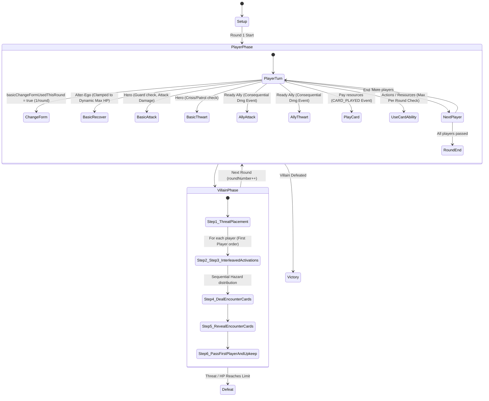
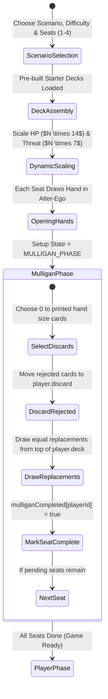
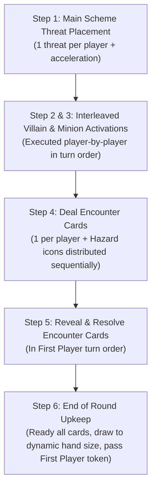

# Marvel Champions Digital (MCD) — Algorithmic Rules Reference

This document provides a **distilled, mathematically precise, and algorithmic specification** of the rules of *Marvel Champions: The Card Game*, strictly derived from **Rules Reference v1.8** and validated against the MCD codebase implementation.

---

## 1. Document Hierarchy & Invariant Principles

```
+-------------------------------------------------------------------------+
|                  1. Card Text (The Golden Rule)                         |
|     - If a card explicitly contradicts general rules, the card wins.    |
+------------------------------------+------------------------------------+
                                     |
                                     v
+-------------------------------------------------------------------------+
|                  2. Rules Reference v1.8 (DEFINITIVE LAW)               |
|     - Strictly supersedes & corrects Learn to Play in all cases.        |
+------------------------------------+------------------------------------+
                                     |
                                     v
+-------------------------------------------------------------------------+
|                  3. Learn to Play Guide (TUTORIAL ONLY)                 |
+-------------------------------------------------------------------------+
```

---

## 2. Core Game Loop & State Machine



---

### 2.1 Setup Phase & Multi-Hero Scaling State Machine (RR v1.8 p. 23–24)



> [!IMPORTANT]
> **Mulligan Rule Invariant (RR v1.8 p. 23):** On mulligan, rejected cards are placed directly into the player's **discard pile** and replacement cards are drawn from the top of the draw deck. The player deck is **NOT** shuffled during mulligan.

* **Multi-Hero Scaling Formulae ($N = \text{playerCount}$):**
  * $\text{Villain.MaxHealth} = \begin{cases} N \times \text{Card.Health} & \text{if } \text{healthPerHero} = \text{true} \\ \text{Card.Health} & \text{otherwise} \end{cases}$
  * $\text{MainScheme.TargetThreat} = N \times \text{Card.TargetThreat}$
  * $\text{MainScheme.StartingThreat} = \begin{cases} \text{Card.BaseThreat} & \text{if } \text{baseThreatFixed} = \text{true} \\ N \times \text{Card.BaseThreat} & \text{otherwise} \end{cases}$

---

## 3. Formal Play Areas & Zones Architecture (RR v1.8 p. 22-23)

> [!NOTE]
> This represents the **standard base game layout**. Complex modular scenarios (e.g. Tower Defense, Kang, Mutagen Formula) may dynamically register additional custom zones, decks, and side displays via the `ScenarioPlugin` interface.

```
┌────────────────────────────────────────────────────────────────────────────────────────┐
│                                 SHARED IN-PLAY AREA                                    │
├────────────────────────────────────────┬───────────────────────────────────────────────┤
│ 1. SCENARIO / VILLAIN ZONE             │ 2. ENCOUNTER DRAW & DISCARD ZONES             │
│    • state.villain (Card, HP, Status)  │    • state.encounterDeck (Draw pile)          │
│    • state.villain.attachments         │    • state.encounterDiscard (Discard pile)    │
│    • state.mainScheme (Active Stage)   │    • state.activeBoostCard (Revealed boost)   │
│    • state.sideSchemes[] (Active)      │                                               │
│    • state.environments[]              │                                               │
└────────────────────────────────────────┴───────────────────────────────────────────────┘
┌────────────────────────────────────────────────────────────────────────────────────────┐
│                           INDIVIDUAL PLAYER PLAY AREA (per player)                     │
├──────────────────────────┬─────────────────────────────┬───────────────────────────────┤
│ 3. IDENTITY & HAND ZONE  │ 4. TABLEAU & ALLIES ZONE    │ 5. ENGAGED & DEALT CARDS ZONE │
│    • player.activeFormCard│   • player.tableau (Upgrades│   • player.engagedMinions[]   │
│    • player.availableForms│     & Supports in play)     │     (Minions on this player)  │
│    • player.currentForm  │   • player.allies[] (Allies │   • player.dealtEncounterCards│
│    • player.hand[]       │     in play, ally limit 3)  │     (Face-down Step 4 queue)  │
│    • player.deck[]       │                             │                               │
│    • player.discard[]    │                             │                               │
└──────────────────────────┴─────────────────────────────┴───────────────────────────────┘
┌────────────────────────────────────────────────────────────────────────────────────────┐
│                              OUT-OF-PLAY / SET-ASIDE ZONES                             │
├────────────────────────────────────────────────────────────────────────────────────────┤
│ • player.setAsideCards[]    (Set-aside Nemesis set waiting for Shadow of the Past)     │
│ • state.victoryDisplay[]    (Defeated cards with Victory keyword)                      │
│ • state.removedFromGame[]   (Removed cards e.g. resolved Obligation)                   │
└────────────────────────────────────────────────────────────────────────────────────────┘
```

### 3.1 Card Physical Orientation & Exhaustion Visuals

* **Exhaustion State vs Visual Layout:**
  * In the game engine state, `card.exhausted = true`.
  * In the UI presentation layer, exhausted cards use a **subtle 15-degree tilt and/or a desaturated (greyed-out) overlay** with interactive disabled state, rather than an intrusive $90^\circ$ rotation that causes board horizontal sprawl.

---

## 4. The 7-Stage Timing Pipeline & Nested Resolution Stack

Whenever an in-game event or activation occurs, it executes within a **Nested Resolution Stack** to ensure uninterrupted state tracking:

```typescript
function ProcessEventPipeline(event: GameEvent, state: GameState): GameState {
  // 1. FORCED INTERRUPTS (Mandatory, executed in First Player order / Player-selected order if simultaneous)
  state = ExecuteForcedInterrupts(event, state);
  if (event.cancelled) return state;

  // 2. VOLUNTARY INTERRUPTS (Player decision prompt with explicit "Pass / Do Nothing" option)
  state = ExecuteInterrupts(event, state); // e.g. Spider-Sense, Backflip
  if (event.cancelled) return state;

  // 3. EVENT RESOLUTION (Primary action or effect executes)
  state = ExecuteEventResolution(event, state);

  // 4. REPLACEMENT EFFECTS (e.g. Tough status card absorption)
  state = ExecuteReplacementEffects(event, state);

  // 5. POST-RESOLUTION STATE MUTATION (Check character defeat, threat thresholds)
  state = CheckStateBasedEffects(event, state);

  // 6. FORCED RESPONSES (Mandatory reactions to event completion)
  state = ExecuteForcedResponses(event, state);

  // 7. VOLUNTARY RESPONSES (Player decision prompt with "Pass / Do Nothing")
  state = ExecuteResponses(event, state);

  return state;
}
```

### Simultaneous Trigger Ordering (RR v1.8 p. 16)
If multiple `FORCED` triggers or multiple voluntary reactions are eligible at the same step, the active/first player chooses the sequence of resolution.

---

## 5. Algorithmic Player Turn Actions (RR v1.8)

### Algorithm 5.0: RESOLVE_MULLIGAN (RR v1.8 p. 23–24)
1. Player selects $k$ cards from opening hand to reject ($0 \le k \le \text{hand.length}$).
2. Rejected cards move to `player.discard` (**NOT shuffled into deck**).
3. Draw $k$ cards from the top of `player.deck`.
4. Set `player.mulliganCompleted = true`.

### Algorithm 5.1: CHANGE_FORM (RR v1.8 p. 13–14)
* A player may flip their identity form **once per round as a basic turn action**:
  $$\text{if } \text{player.basicChangeFormUsedThisRound} = \text{false} \rightarrow \text{Flip Form}, \text{basicChangeFormUsedThisRound} = \text{true}.$$
* Card effects that instruct the player to change form (e.g. *Split Personality*) do **NOT** count against or require `basicChangeFormUsedThisRound`.

### Algorithm 5.2: BASIC_RECOVER (RR v1.8 p. 23)
* Alter-Ego exhausts to heal $\text{REC}$ points.
* Health is strictly clamped to dynamic maximum health:
  $$\text{player.health} = \min(\text{player.maxHealth}, \text{player.health} + \text{player.activeFormCard.rec}).$$

### Algorithm 5.3: BASIC_ATTACK vs DIRECT_DAMAGE (RR v1.8 p. 5–6, 26)
* **Attack Action (`isAttack: true`):**
  * Target must be a legal enemy (checks `Guard` keyword on engaged minions).
  * Triggers Defense reactions, *Retaliate* keywords, and *Overkill* calculations.
  * Emits `ENEMY_ATTACKED` and `OVERKILL_OCCURRED(excessDamage)` events.
* **Direct Damage (`isAttack: false`):**
  * Ignores `Guard` and does not trigger *Retaliate* or attack-specific interrupts (e.g. *Ground Stomp*, *Energy Channel*).

---

## 6. The 6-Step Villain Phase State Machine (RR v1.8 p. 22)



### Interleaved Step 2 & 3 Activation Algorithm:
```typescript
for (const player of state.playersInTurnOrder) {
  // 1. Villain activates against player
  if (player.currentForm === 'alter_ego') {
    executeVillainSchemeAgainstPlayer(state, player);
  } else {
    executeVillainAttackAgainstPlayer(state, player);
  }

  // 2. All minions engaged with player activate against player
  for (const minion of player.engagedMinions) {
    if (player.currentForm === 'alter_ego') {
      executeMinionSchemeAgainstPlayer(state, minion, player);
    } else {
      executeMinionAttackAgainstPlayer(state, minion, player);
    }
  }
}
```

### Sequential Hazard Icon Distribution (Step 4):
Encounter cards from Hazard icons are distributed sequentially in turn order starting from the First Player:
$$\text{Extra Card } h \rightarrow \text{Player } ((\text{firstPlayerIndex} + h) \pmod{\text{playerCount}}).$$

### Phase & Round Lifecycle Triggers:
The engine pipeline dispatches discrete lifecycle triggers across turn and round boundaries:
* `ROUND_BEGAN` / `ROUND_ENDED` (Round counter increments, First Player token passes)
* `PLAYER_PHASE_BEGAN` / `PLAYER_PHASE_ENDED` (Player turn loop starts/ends, `basicChangeFormUsedThisRound` resets)
* `VILLAIN_PHASE_BEGAN` / `VILLAIN_PHASE_ENDED` (Step 1 threat starts / Step 5 reveals complete)

---

## 7. Form Change Invariants (RR v1.8 p. 8 "Change Form")

* **Basic Form Change (1/Round):**
  $$\text{Player.basicChangeFormUsedThisRound} = \begin{cases} \text{true} & \text{after basic flip action} \\ \text{false} & \text{upon } \text{ROUND\_BEGAN} \end{cases}$$
* **Card-Driven Form Flips (*Split Personality* `01025`):**
  Card abilities flip `Player.currentForm` directly and are **completely independent of** the basic 1/round limit.

---

## 8. Reusable Effect Primitives Reference (`src/engine/effects/index.ts`)

| Primitive Name | Target Selector | Description |
| :--- | :--- | :--- |
| `DEAL_DAMAGE` | `CHOSEN_ENEMY` \| `ALL_ENEMIES` \| `ALL_HEROES` | Damage resolution with Tough card discard, armor counters, and overkill. |
| `REMOVE_THREAT` | `MAIN_SCHEME` \| `CHOSEN_SCHEME` | Threat removal enforcing Crisis keyword restrictions. |
| `DRAW_CARDS` | `SELF_IDENTITY` \| `ACTIVE_PLAYER` \| `ALL_PLAYERS` | Draws cards from draw deck into hand. |
| `CHANGE_FORM_DRAW_TO_HAND_SIZE` | `SELF` | Flips identity card form without consuming basic flip, then draws up to new form's printed hand size limit (*Split Personality* `01025`). |
| `MODIFY_HAND_SIZE` | `SELF_IDENTITY` | Dynamic aura modifying hand size based on in-play tableau upgrades. |
| `PLAYER_CHOICE` | `SELF_IDENTITY` | Renders Pop-Art decision prompt modal (*Nick Fury* `01084` choose 1 of 3, *Hydra Bomber*). |
| `SPAWN_NEMESIS` | `ACTIVE_PLAYER` | Isolates player nemesis set from set-aside pool and puts minion/scheme into play (*Shadow of the Past* `01190`). |
| `VILLAIN_SCHEMES` | `ACTIVE_PLAYER` | Immediate villain scheme activation against player (*Advance* `01186`). |
| `VILLAIN_ATTACKS` | `ACTIVE_PLAYER` | Immediate villain attack activation against player (*Assault* `01187`). |
| `ALLY_LIMIT_BONUS` | `SELF_IDENTITY` \| `ALL_PLAYERS` | Increases maximum ally limit by $N$ (*The Triskelion* `01073`). |
