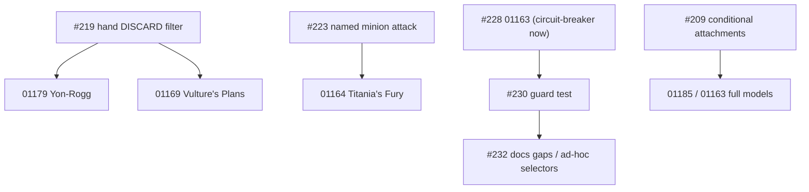

# MCD Backlog: Status and Work Queue

> **Last updated:** 2026-10-10 (item 4e, #297)
> **Repository state:** `main`; everything through item 4e part 1 (#296, `ef701c7`) is committed and pushed; item 4e part 2 (#297) is done in the working tree, not committed yet. Check `git log -1` and `git status` first.
> **Release gate:** Gate 1 ("Rhino Release" vertical slice: the 5 core heroes against Rhino).
> **Verification baseline:** 🟢 2,505 tests passing (0 failed, 0 skipped), 0 TypeScript diagnostics, 0 ESLint warnings, Prettier clean. No known flaky test (#217 fixed, `72bced3`).
> **This file is the entry point for anyone (person or agent) picking the work up.** Read sections 1 to 4, then pick the first ready item of section 3.

---

## 1. Where we are

Phases 1 to 4 (combat flow, ability legality, shared gating, audit cleanups) are complete. **Phase 5** (core set card correctness, the Gate 1 gate) has two tracks:

- **Track A, reported card bugs: complete.** Hydra Bomber, Imminent Overload, Rocket Boots, Wakanda Forever!.
- **Track B, correctness of the core player and encounter cards.** Driven by GitHub issues: the `effectParams` audit (#228, #230, #231, #232) and the line-by-line review of the core player cards (#253 to #261). Each issue carries its own evidence and acceptance; there are no tracker files.

Done since 2026-10-03 (each has a changelog entry; plans were deleted after their commits):

| Item                                                        | What                                                                                                                                                                                                                                                                                                                                                                                                    | Commit                     |
| :---------------------------------------------------------- | :------------------------------------------------------------------------------------------------------------------------------------------------------------------------------------------------------------------------------------------------------------------------------------------------------------------------------------------------------------------------------------------------------ | :------------------------- |
| Energy Daggers A1, Wakanda Forever! #207                    | target set, resumable special sequence                                                                                                                                                                                                                                                                                                                                                                  | `a6c5397`, `df01659`       |
| Rocket Boots A3 / #131                                      | timed trait modifiers                                                                                                                                                                                                                                                                                                                                                                                   | `32aa400`                  |
| Counter-Punch A2                                            | cost 0, in-hand reaction scan (shared `scanHandReactions`), "that enemy", `triggerFilter.defenderType`                                                                                                                                                                                                                                                                                                  | `647f435`                  |
| Med Team B7                                                 | friendly characters only                                                                                                                                                                                                                                                                                                                                                                                | `8dc2fe7`                  |
| Mark V Helmet WP1 / #226, Jessica Jones C1                  | new gate `IF_CONDITION_NOT_MET`, Patrol for multi-scheme removal, cap removed                                                                                                                                                                                                                                                                                                                           | `8762323`                  |
| Iron Man WP2 / #227                                         | hand size cap per official errata, 1..10 clamp removed                                                                                                                                                                                                                                                                                                                                                  | `2a3aeb2`                  |
| Kree Manipulator WP4 / #229, Electric Whip Attack WP8 boost | condition `UNDEFENDED_ATTACK`                                                                                                                                                                                                                                                                                                                                                                           | `b2ab514`                  |
| #222 and #241                                               | `SELF_HERO` selector; Sweeping Swoop (When Revealed), Electric Whip Attack (When Revealed), Ritual Combat; selector hygiene                                                                                                                                                                                                                                                                             | `28fa59a`                  |
| #218                                                        | Surge keyword, one shared surge path, strict printed-keyword detection for Surge                                                                                                                                                                                                                                                                                                                        | `9a0830d`                  |
| #244 (first row)                                            | Heart-Shaped Herb `01158`: tough status cards (When Revealed and Boost) replace the invented heal                                                                                                                                                                                                                                                                                                       | `4d200a5`                  |
| #242                                                        | False Alarm `01112`: surge when already confused (`IF_ALREADY_HAS_STATUS`)                                                                                                                                                                                                                                                                                                                              | `7686171`                  |
| Triage of #233 to #240                                      | 8 in-app reports diagnosed; #235, #236, #239 closed as duplicates of #234; #245, #246 filed from two new reports                                                                                                                                                                                                                                                                                        | GitHub only                |
| #234                                                        | Chosen target vs event target (ADR-0077); "an enemy" / "a scheme" let the player choose (Daredevil, Interrogation Room, Mockingbird, She-Hulk, Nick Fury, Panther Claws); Superhuman Strength `TRIGGERING_ENEMY`; resolver guesses removed                                                                                                                                                              | `5d01ec3`                  |
| #248                                                        | Pausable `executeSequence`, Hulk `01050`, `pendingSequences` unified, `pendingSpecialSequence` retired                                                                                                                                                                                                                                                                                                  | `ecc52ba`                  |
| #238                                                        | Highway Robbery: real host, `cardsUnderneath`, "When Defeated" before host cleanup, facedown stack UI                                                                                                                                                                                                                                                                                                   | `git log --grep "#238"`    |
| Triage of #249 to #251                                      | 3 in-app reports triaged and filed: #249 Spider-Tracer (01007), #250 Webbed Up (01009), #251 Lead from the Front (01070)                                                                                                                                                                                                                                                                                | GitHub only                |
| #247                                                        | Chase Them Down and Tigra after attack defeats; every ability damage through `applyDamageToTarget` (incl. `TRANSFER_DAMAGE`); `labels: ["ATTACK"]` on 13 cards; defeat source and hand Responses to a defeat                                                                                                                                                                                            | `git log --grep "#247"`    |
| #245                                                        | Masterplan: second sentence declared (`DISCARD` `UNTIL_MATCH` + `REVEAL`, `ZONE_EMPTY`); hidden `ADD_THREAT` fallback removed; empty-deck rule                                                                                                                                                                                                                                                          | `git log --grep "#245"`    |
| #266                                                        | Pausable threat placement: an accepted Emergency / Great Responsibility / "I Object!" changes the threat placed; every eligible card offered, first player first; window closes when nothing is left                                                                                                                                                                                                    | `d40febb`                  |
| #228 (partial)                                              | Genetically Enhanced `01163`: placeholder stripped, blocked with an ambiguity report                                                                                                                                                                                                                                                                                                                    | `git log --grep "#228"`    |
| #221                                                        | Sweeping Swoop `01168` boost: gate `IF_ACTIVATION_DEALT_DAMAGE`, target `DAMAGED_CHARACTER`, boost deferred until damage is known                                                                                                                                                                                                                                                                       | `git log --grep "#221"`    |
| #240                                                        | Emergency only when the villain schemes (`triggerFilter.threatSource`); hands drawn after scenario setup; no player ability during setup                                                                                                                                                                                                                                                                | `9985c4f`                  |
| #219                                                        | Hand `DISCARD`: `filter`, every target player, `discardedCards`/`value` always returned; Yon-Rogg's Treason `01179` and The Vulture's Plans `01169` modelled (confidence 95)                                                                                                                                                                                                                            | `git log --grep "#219"`    |
| #244                                                        | Weapons Runner boost; minions engaged during step 2 activate in that player's 2b; `PUT_INTO_PLAY` `reveal` (Shadow of the Past now resolves Highway Robbery's When Revealed); dead aliases and `skipBoostDiscard` removed                                                                                                                                                                               | `41a41b0`                  |
| #220                                                        | `CardAbility.forEachPlayer` (whole step list once per player, player order, pausable); Electromagnetic Backlash `01174` modelled (confidence 95); deck `DISCARD` no longer continues into a reshuffled deck; mixed case filed as #272                                                                                                                                                                   | `git log --grep "#220"`    |
| #223                                                        | `ENEMY_ATTACKS` (a specific minion or named villain attacks; the step fails if it did not attack); minion Attack X (`getEffectiveMinionAttack`, `REMAINING_HIT_POINTS`); Titania's Fury `01164` modelled (confidence 95)                                                                                                                                                                                | `git log --grep "#223"`    |
| #225                                                        | `executeSequence` stops on a step that fails with an `error` (also `forEachPlayer`), logs `engine.stepError`; Dev Mode banner and combat log entry; outcomes without an error keep `IF_FAILED` working (ADR-0019 addendum)                                                                                                                                                                              | `git log --grep "#225"`    |
| #231                                                        | `scaling` / `multiplier` / `maxBonus` retired: Jessica Jones, Legal Practice, Energy Channel use `ENTITY_COUNT` / `DISCARDED_CARDS` / `RESOURCES_SPENT`; cost results (`discardedCards`, `resourcesSpent`) in the effect context; "up to N" discard cap enforced; `uses.max` removed (dead); Legal Practice played from hand is broken: [#277](https://github.com/SteveRodrigue/MCD/issues/277)         | `git log --grep "#231"`    |
| #246                                                        | Player elimination: a defeated hero eliminates that player only, the group loses with the last hero; per-player icon counts the starting players; game-over screen (ADR-0079)                                                                                                                                                                                                                           | `git log --grep "#246"`    |
| #276                                                        | Schema member guard: 20 members removed (7 conditions and triggers, 8 effects, 5 `effectParams` keys, `exhaustCard` and `discardCard.from` narrowed), textual reader and engine-test proof, behaviour tests for every member that had none; `KNOWN_GAPS` tied to #280 / #281                                                                                                                            | `git log --grep "#276"`    |
| #283                                                        | Player Setup abilities: step 16 after the mulligans, through the effect pipeline (`PLAYER_SETUP`), T'Challa asks which upgrade; mulligan screen shows the prompt; Luke Cage `01076` invented `SETUP` removed and Toughness for allies (`applyToughnessOnEntry`; part of #253) (ADR-0033 addendum)                                                                                                       | `git log --grep "#283"`    |
| #277                                                        | Legal Practice `01023` played from hand: an event pays its declared extra cost on `PLAY_CARD` (`resolveEventAbilities`, shared with the target-choice resolution), `maxCount` = choose 1 to N (`getDiscardCostBounds`), payment modal "up to N", confidence 95                                                                                                                                          | `git log --grep "#277"`    |
| #232                                                        | Decorative `effectParams` keys removed (`ATTACHMENT_DAMAGE_SHIELD.mode/target`, `TRANSFER_DAMAGE.from/to`, `target` of `PREVENT_DAMAGE` / `RETURN_TO_HAND` / `VILLAIN_ATTACKS`), `maxAbsorb` required (no default, `threshold` alias and `attackOnly` removed), specs document every honored key                                                                                                        | `git log --grep "#232"`    |
| #243                                                        | Keyword tags only for printed keywords (`hasPrintedKeyword` for all text keywords, `getPrintedKeywordValue`); Crisis is an icon count (`getCrisisIconCount`, `countCrisisIconsInPlay`), `Keyword.CRISIS` and `hasCrisis` removed; 4 core phantom tags removed                                                                                                                                           | `git log --grep "#243"`    |
| Triage of #282, #283                                        | 2 new Dev Mode reports: #283 T'Challa setup prompt (P1, queued as 3i), #282 removed-from-game pile (P2)                                                                                                                                                                                                                                                                                                 | GitHub only                |
| #258                                                        | Core player cards Tier 1: Indomitable Response / `SELF_HERO`, Jennifer id `i_object`, prompt strings, Vision `THWART` / `ATTACK`; stat aliases `ATK` / `THW` / `DEF` / `REC` and the `PLAYER_CHOICE` shortcut removed; closes #253 (done by #283)                                                                                                                                                       | `git log --grep "#258"`    |
| #254                                                        | `EXECUTE_WAKANDA_FOREVER` removed; `01043a-d` use `EXECUTE_SPECIAL` with a required `specialId` (ADR-0038 addendum)                                                                                                                                                                                                                                                                                     | `git log --grep "#254"`    |
| #255                                                        | Black Widow `01075` reacts to any revealed encounter card (interrupt window for every card, cancelled card discarded); step flag `cannotBeCanceled`, `canCancelEncounterReveal`, proof card Eternity `21054` (ADR-0019 addendum); whole-card flag [#286](https://github.com/SteveRodrigue/MCD/issues/286)                                                                                               | `git log --grep "#255"`    |
| #255 follow-up                                              | Every player's in-play cards and hand cards (`01075`, `01004`, `01078`) can react to a reveal; the replacement card goes to the active player; several queued cancels: accepting one removes the others, a card resolves only after all its prompts are answered; fixed queue order, ordering by the first player is [#287](https://github.com/SteveRodrigue/MCD/issues/287)                            | `git log --grep "#255"`    |
| #255 follow-up (modal)                                      | Generic decision modal: TRIGGERING panel plus ABILITY CARD panel (`PromptCardPanel`, `sm` icon, full printed text), provenance banner removed; engine gating (exhausted, no mental/wild) pinned by tests                                                                                                                                                                                                | `git log --grep "#255"`    |
| #256                                                        | Backflip `01003`: `triggerFilter.damageSource: 'ATTACK'` (evaluated; the attack path sends it); Card Editor select, spec `02`                                                                                                                                                                                                                                                                           | `git log --grep "#256"`    |
| #257                                                        | Superhuman Strength `01028`: `triggerFilter.attackedBy: 'YOUR_HERO'` reads the new `context.attackSource` set by every `ATTACK_RESOLVED` dispatch (ADR-0078 addendum); forced abilities with no valid target do not initiate or pay (Superhuman Strength keeps its upgrade when the enemy dies, is stunned or Stalwart); Tigra `01051` needed no change                                                 | `git log --grep "#257"`    |
| #259 (Relentless Assault, attach timing)                    | `GRANT_ATTACK_KEYWORD` (ephemeral, ability context): `01053` = gated Overkill grant + 5 damage, three `DEAL_DAMAGE` Overkill params removed; `USE_CARD_ABILITY` no longer re-runs the attach ability of an attached upgrade; the `TARGET_TRAIT_MATCH` / gate redesign is split into [#289](https://github.com/SteveRodrigue/MCD/issues/289) and [#290](https://github.com/SteveRodrigue/MCD/issues/290) | `6bed872`, `e930208`       |
| #260                                                        | Core player cards re-verified: One-Two Punch / Arc Reactor `SELF_HERO`, `READY` without target is a no-op, Nick Fury single round-end path (`edccdc8`); Ancestral Knowledge `01042` "up to 3 different cards": `SEARCH` `minimumTake` (default 1) / `distinctBy`, multi-select prompt and modal, `SEARCH.isVoluntary` retired, `card.search.nothingFound` log, `isForcedTiming` (ADR-0032 addendum)     | `edccdc8`, `e8efab9`       |
| #289, #290                                                  | Step gates and result facts: `step.condition` retired, 9 canonical `StepGate` definitions with strict schemas, `StepResolutionResult.facts` engine pipeline, dynamic `GateParamsPanel`, compact summaries                                                                                                                                                                                               | `e930208`                  |
| #209                                                        | Conditional encounter attachments: card field `attachTo` (`host` / `superlative` / `withoutCopyAttached` / `otherwise` SURGE or host), `resolveAttachmentHost`, first-player prompt on ties, `getEffectiveMinionHitPoints` (8 raw reads replaced), `defeatMinionsBeyondHitPoints`; Genetically Enhanced `01163` modelled (confidence 95), Card Editor panel, ADR-0040 addendum                          | `git log --grep "#209"`    |
| #288                                                        | Voluntary discard and setup choice modals show cards with thumbnail, hover zoom preview (`CardView`), dynamic cost badge, and formatted card text via `FormattedCardText` (no raw tags or bracket tokens)                                                                                                                                                                                               | `a4f5962`                  |
| #263                                                        | One boost resolution (`boost-resolution.ts`) for attack, villain scheme and minion scheme; `GIVE_ADDITIONAL_BOOST_CARD` in every activation; enemy-held `facedownBoostCards`; `drawEncounterCardForCombat` removed; producer effect filed as [#291](https://github.com/SteveRodrigue/MCD/issues/291)                                                                                                    | `67aed3f`                  |
| #295                                                        | Attack steps report `damageDealt` and `damagedCharacter` (`IF_RESULT` `DAMAGE_DEALT`); steps after a paused attack resume with the facts; Stampede `01106` stuns the damaged character (ADR-0019 addendum)                                                                                                                                                                                              | `git log --grep "#295"`    |
| #297                                                        | Killmonger `01157`: CONSTANT `CANNOT_TAKE_DAMAGE` (`sourceCardType`, `sourceTrait`), pipeline step 0, not a valid target of `DEAL_DAMAGE` / `TRANSFER_DAMAGE` (Wakanda Forever! cannot target him), invented tough removed, confidence 95 (ADR-0078 addendum); board conditions (Madame Hydra, Ultron) not covered                                                                                      | `git log --grep "#297"`    |
| #296                                                        | Explosion `01111`: first player assigns X damage among heroes and allies (`DISTRIBUTE_AMOUNT`), cap at remaining HP, one `applyDistributedDamage` path, `capRule` and the test-only prompt flags removed (ADR-0064 addendum)                                                                                                                                                                            | `git log --grep "#296"`    |
| Item 14                                                     | Core encounter read-through: 108 cards, 20 reports; Sandman `01102` and Whiplash `01172` invented abilities removed; engine defects [#294](https://github.com/SteveRodrigue/MCD/issues/294) to [#297](https://github.com/SteveRodrigue/MCD/issues/297)                                                                                                                                                  | `git log --grep "item 14"` |

---

## 2. Rules of this repository (digest; the sources are authoritative)

Sources: [AGENTS.md](../../AGENTS.md), `.agents/rules/*.md` (shared quality gates, command execution, RTK, post-task checklist), the skills in `.claude/skills/` (`card-integration-protocol`, `bug-fix`, `feature-delivery`, `commit-and-push`, `next-task`, `problem-report-triage`).

1. **Plan first, stop for approval.** For any change to `src/`, `tests/`, supplemental data, dependencies or config: write `docs/backlog/plan_<topic>.md` (rules analysis, printed text, original data, proposed data, why, tests, files, open decisions, UI/Card Editor impact) and wait for the owner's approval. A plan may be pre-authorised for follow-ups only when the owner says so.
2. **TDD.** Write the failing test first and watch it fail for the right reason. Never add skipped or todo tests.
3. **Cards are read literally.** "Your hero" is never the alter-ego (selector `SELF_HERO`); "take damage" or "you" is the identity in either form (`SELF_IDENTITY`). Never interpret card text. **Never add or edit `audit.comment`.**
4. **Official errata beat the printed text** (`references/rules/appendices/05_card_errata.md`). Do not open the raw PDF; use `npm run rule -- <term>` or `references/rules/`.
5. **Engine stays headless; card behaviour stays declarative.** Engine primitives are generic, never named after a card (ADR-0021). No legacy shims or aliases.
6. **Schema change rule.** Any new or renamed effect, condition, gate, selector, filter or parameter updates in the same change: `schema.ts`, regenerated `schema.json` (`npm run schema:generate`), the spec in `docs/specifications/supplemental/`, the Card Editor (`src/ui/components/editor/`, mainly `effect-parameter-registry.ts`), and a test. Add an ADR or ADR addendum for design decisions.
7. **Circuit-breaker.** If a card cannot be modelled faithfully (missing primitive, ambiguity), strip its executable ability, set `audit.confidence` below 95, write `docs/ambiguities/<pack>_<code>_<slug>.md`, set `audit.ambiguityFile`, and file the engine issue. Never ship a placeholder that contradicts the printed text.
8. **Out-of-scope gaps become GitHub issues** (with printed text, evidence, acceptance criteria), not silent notes.
9. **Gates before reporting done:** `npm test`, `npm run typecheck`, `npm run lint`, `npx prettier --check "src/**/*.{ts,tsx}" "tests/**/*.{ts,tsx}"` (all green), then `npm run report:declarations` after any supplemental change.
10. **After each item:** update `CHANGELOG.md` `[Unreleased]`, the relevant plan file (then delete it after the commit) and this file.
11. **Commit and push only when the owner asks.** Conventional Commits, one commit per issue where possible, `Fixes #N` only when the issue is fully done (`Refs #N` otherwise), end with the `Co-Authored-By` line used in recent commits. Verify the issue state after pushing.

### Practical pitfalls

Formatting, CRLF pack JSON, deterministic tests and commit mechanics are in `.agents/rules/coding-and-testing-rules.md`; PowerShell syntax in `.agents/rules/command-execution.md`.

- Shell commands start with `rtk` where the RTK policy applies (`rtk git status`, `rtk npm test`).
- Heredocs that contain apostrophes can break in the shell tool. Write multi-line files and scripts with the file-writing tool.
- A supplemental `target` value must be a member of `TargetSelectorSchema` (a data test enforces it); keys inside `effectParams` are **not** validated yet (see WP5), so check by hand that the engine really reads every key you use.
- Importer keyword tags are substring-based except Surge (see #243): do not trust `hasKeyword` for the other keywords on cards that merely mention them.
- Quick data lookups: `npm run card:get -- <code>` (upstream plus supplemental), `npm run rule -- <term>`.
- Test helpers worth reusing: reveal path `step4_revealEncounterCards` (see `tests/engine/self-hero-cards.test.ts`), attack path `executeEnemyAttackSynchronously` (see `tests/engine/kree-manipulator-boost.test.ts`), ability use `dispatchAction({ type: 'USE_CARD_ABILITY' })` (see `tests/engine/mark-v-helmet.test.ts`).

---

## 3. Work queue (ordered; the first ready item is the next task)

"Ready" means every prerequisite is done. Every item needs a plan file and the owner's approval before code (rule 1). Items marked **owner decision** wait for an answer in chat.

### 3.1 Cards that execute wrong behaviour today (do these first)

| #   | Item                                                                                                                         | Issue                                                                                                            | Why now                                                                                                                                                                | Notes                                                                                                                                                                                                                                                   |
| :-- | :--------------------------------------------------------------------------------------------------------------------------- | :--------------------------------------------------------------------------------------------------------------- | :--------------------------------------------------------------------------------------------------------------------------------------------------------------------- | :------------------------------------------------------------------------------------------------------------------------------------------------------------------------------------------------------------------------------------------------------ |
| 1   | `01121` Weapons Runner boost; step 2 minion activation order; `PUT_INTO_PLAY` reveal                                         | [#244](https://github.com/SteveRodrigue/MCD/issues/244)                                                          | missing abilities in real games                                                                                                                                        | 🟢 **Done** 2026-10-05; `01185` moved to [#262](https://github.com/SteveRodrigue/MCD/issues/262) (needs #209), boost loops [#263](https://github.com/SteveRodrigue/MCD/issues/263)                                                                      |
| 2   | Resumable `executeSequence` so a mid-sequence prompt pauses the later steps; finishes Hulk `01050` after #234                | [#248](https://github.com/SteveRodrigue/MCD/issues/248)                                                          | Hulk resolves steps out of order when it must choose an enemy                                                                                                          | 🟢 **Done** 2026-10-05; `pendingSpecialSequence` retired                                                                                                                                                                                                |
| 3   | Highway Robbery `01166` loses the card taken from each hand (orphaned attachment, discarded before "return to hand")         | [#238](https://github.com/SteveRodrigue/MCD/issues/238)                                                          | **P1**, cards removed from the game                                                                                                                                    | 🟢 **Done** 2026-10-05; seeded RNG filed as [#252](https://github.com/SteveRodrigue/MCD/issues/252)                                                                                                                                                     |
| 3b  | Emergency `01085` offered for every threat placement, setup included, not only "when the villain schemes"                    | [#240](https://github.com/SteveRodrigue/MCD/issues/240)                                                          | wrong prompts during setup                                                                                                                                             | 🟢 **Done** 2026-10-05; no player ability during setup                                                                                                                                                                                                  |
| 3b2 | Accepting a threat interrupt prompt (Emergency, Great Responsibility, "I Object!") does not reduce the threat already placed | [#266](https://github.com/SteveRodrigue/MCD/issues/266)                                                          | **Gate 1**: the card is spent for nothing                                                                                                                              | 🟢 **Done** 2026-10-05; other hand triggers: [#267](https://github.com/SteveRodrigue/MCD/issues/267)                                                                                                                                                    |
| 3c  | Masterplan `01192` second sentence (no side scheme → discard until one, reveal it)                                           | [#245](https://github.com/SteveRodrigue/MCD/issues/245)                                                          | card does nothing without side schemes                                                                                                                                 | 🟢 **Done** 2026-10-05; the fallback was hidden in `ADD_THREAT`, now declared and a real reveal                                                                                                                                                         |
| 3d  | Chase Them Down `01052` never offered (no hand Response scan after a defeat, filter too narrow)                              | [#247](https://github.com/SteveRodrigue/MCD/issues/247)                                                          | card unusable                                                                                                                                                          | 🟢 **Done** 2026-10-06; one damage pipeline (ADR-0078), attack label; follow-ups [#269](https://github.com/SteveRodrigue/MCD/issues/269) (enemy damage), [#270](https://github.com/SteveRodrigue/MCD/issues/270) (thwart/defense labels, status cancel) |
| 3e  | Player elimination not implemented (one identity at 0 HP ends the game) and no game-over screen                              | [#246](https://github.com/SteveRodrigue/MCD/issues/246)                                                          | **Gate 1** (owner decision 2026-10-06): a defeated hero eliminates that player only; the game is lost when **all** heroes are defeated, in solo multi-handed games too | 15 direct `winner` writes; 🟢 **Done** 2026-10-06 (`eliminatePlayer`, `getPerPlayerCount`, `GameOverScreen`, ADR-0079); permanent cards: [#274](https://github.com/SteveRodrigue/MCD/issues/274)                                                        |
| 3f  | Spider-Tracer `01007` removes threat and discards side scheme prematurely (Crowd Control 4-3=1 threat remaining)             | [#249](https://github.com/SteveRodrigue/MCD/issues/249)                                                          | incorrect scheme defeat                                                                                                                                                | 🟢 **Closed** 2026-10-06, not reproduced; 16 regression tests added; reopen with steps or a snapshot                                                                                                                                                    |
| 3g  | Webbed Up `01009` does not trigger / replace properly when villain is already Stunned                                        | [#250](https://github.com/SteveRodrigue/MCD/issues/250)                                                          | replacement timing bug                                                                                                                                                 | 🟢 **Closed** 2026-10-06, not a bug: status cards have timing priority (RR Status Cards), Test 3 asserts it                                                                                                                                             |
| 3h  | Lead from the Front `01070` did not prompt to choose a player                                                                | [#251](https://github.com/SteveRodrigue/MCD/issues/251)                                                          | missing player choice prompt                                                                                                                                           | 🟢 **Done** 2026-10-06; `MODIFY_STAT` `targetPlayer: CHOSEN_PLAYER`, `ALL_CONTROLLED_CHARACTERS`                                                                                                                                                        |
| —   | Caught Off Guard "no prompt" (needs the reporter's detail), Card Editor delete feature                                       | [#233](https://github.com/SteveRodrigue/MCD/issues/233), [#237](https://github.com/SteveRodrigue/MCD/issues/237) | waiting / enhancement                                                                                                                                                  |                                                                                                                                                                                                                                                         |
| 3i  | T'Challa `01040b` (Black Panther): no prompt to choose an upgrade on setup                                                   | [#283](https://github.com/SteveRodrigue/MCD/issues/283)                                                          | **P1, Gate 1**                                                                                                                                                         | 🟢 **Done** 2026-10-07; Setup abilities resolve after the mulligan through `executeEffect` (`PLAYER_SETUP`), Luke Cage `01076` invented `SETUP` removed                                                                                                 |
| 4b  | Legal Practice `01023` played from hand pays no discard cost and removes no threat                                           | [#277](https://github.com/SteveRodrigue/MCD/issues/277)                                                          | **P1**, card does nothing in a real game                                                                                                                               | 🟢 **Done** 2026-10-07; confidence 95                                                                                                                                                                                                                   |
| 4   | Genetically Enhanced `01163` (invented `bonusAttack`)                                                                        | [#228](https://github.com/SteveRodrigue/MCD/issues/228)                                                          | blocks the guard test                                                                                                                                                  | 🟢 **Done** 2026-10-07 with #209: `attachTo` (highest printed HP, tie: first player chooses, else surge) + `MODIFY_MAX_HEALTH` +3 (`a1a4e7d`)                                                                                                           |
| 4c  | Charge `01099` is never discarded; Rhino keeps +3 ATK and Overkill                                                           | [#294](https://github.com/SteveRodrigue/MCD/issues/294)                                                          | **P1, Gate 1**                                                                                                                                                         | 🟢 **Done** 2026-10-10 (`8de3178`); trigger `HOST_ATTACK_ENDED`                                                                                                                                                                                         |
| 4d  | Stampede `01106` lacks the stun; attack steps do not report damage dealt                                                     | [#295](https://github.com/SteveRodrigue/MCD/issues/295)                                                          | **P1, Gate 1**                                                                                                                                                         | 🟢 **Done** 2026-10-10; `damageDealt` / `damagedCharacter` facts, `DAMAGE_DEALT`; serves `01118`, `01122`, `01145` when modelled                                                                                                                        |
| 4e  | Explosion `01111` assigns X; Killmonger `01157` invented tough, no source immunity                                           | [#296](https://github.com/SteveRodrigue/MCD/issues/296), [#297](https://github.com/SteveRodrigue/MCD/issues/297) | P2                                                                                                                                                                     | 🟡 #296 🟢 **Done** 2026-10-10 (first player assigns, cap at remaining HP, `capRule` removed); #297 🟢 **Done** 2026-10-10                                                                                                                              | item 14 findings |

### 3.2 Engine prerequisites that unblock stripped cards

| #   | Item                                                                          | Issue                                                   | Unblocks                                     | Notes                                                                                                                                                                  |
| :-- | :---------------------------------------------------------------------------- | :------------------------------------------------------ | :------------------------------------------- | :--------------------------------------------------------------------------------------------------------------------------------------------------------------------- |
| 5   | Hand `DISCARD` with filter, each-player targets and discarded-card results    | [#219](https://github.com/SteveRodrigue/MCD/issues/219) | `01179` Yon-Rogg's Treason, `01169`, `01174` | 🟢 **Done** 2026-10-06; `01179` and `01169` modelled                                                                                                                   |
| 6   | Per-player iteration inside one ability                                       | [#220](https://github.com/SteveRodrigue/MCD/issues/220) | `01174` Electromagnetic Backlash             | 🟢 **Done** 2026-10-06; ability-level `forEachPlayer`; mixed per-player / run-once abilities: [#272](https://github.com/SteveRodrigue/MCD/issues/272) (`01148`)        |
| 7   | Gate "this activation dealt damage"                                           | [#221](https://github.com/SteveRodrigue/MCD/issues/221) | `01168` Sweeping Swoop boost                 | 🟢 **Done** 2026-10-06; gate `IF_ACTIVATION_DEALT_DAMAGE` + selector `DAMAGED_CHARACTER`, deferred boost resolved in `applyCalculatedAttackDamage` (ADR-0019 addendum) |
| 8   | Named minion in play attacks a hero, with an attacked / did-not-attack result | [#223](https://github.com/SteveRodrigue/MCD/issues/223) | `01164` Titania's Fury                       | 🟢 **Done** 2026-10-06; effect `ENEMY_ATTACKS`, minion Attack X (`01162`), `HEAL_DAMAGE` `amount: ALL`                                                                 |
| 9   | `executeSequence` swallows step failures and always reports success           | [#225](https://github.com/SteveRodrigue/MCD/issues/225) | visibility of every ability failure          | 🟢 **Done** 2026-10-06; stop on error, outcomes continue, Dev Mode banner                                                                                              |

### 3.3 The `effectParams` remediation (evidence: [../reports/effect_params_orphan_audit.md](../reports/effect_params_orphan_audit.md))

| #   | Item                                                                                                                           | Issue                                                   | Depends on                                                                                                                                                                                                                                                                                                                                               |
| :-- | :----------------------------------------------------------------------------------------------------------------------------- | :------------------------------------------------------ | :------------------------------------------------------------------------------------------------------------------------------------------------------------------------------------------------------------------------------------------------------------------------------------------------------------------------------------------------------- |
| 10  | WP5: guard test, unknown `effectParams` key fails the data test (the `target` slice is already done)                           | [#230](https://github.com/SteveRodrigue/MCD/issues/230) | 🟢 **Done** 2026-10-06; table `src/data/supplemental/effect-params.ts`, guard `tests/data/effect-params-keys.test.ts`; `REMOVE_THREAT.aerialAllSchemes` left out (owner decision)                                                                                                                                                                        |
| 11  | WP6: retire `PER_SIDE_SCHEME` / `PER_DISCARDED_CARD` / `PER_RESOURCE_SPENT` pseudo-primitives                                  | [#231](https://github.com/SteveRodrigue/MCD/issues/231) | 🟢 **Done** 2026-10-06                                                                                                                                                                                                                                                                                                                                   |
| 11b | Every schema member needs a reader in code and a test, enforced by `tests/data/schema-member-coverage.test.ts` (#276)          | [#276](https://github.com/SteveRodrigue/MCD/issues/276) | 🟢 **Done** 2026-10-06; follow-ups: [#278](https://github.com/SteveRodrigue/MCD/issues/278) comparison condition, [#279](https://github.com/SteveRodrigue/MCD/issues/279) fake pack and runtime proof, [#280](https://github.com/SteveRodrigue/MCD/issues/280) Toughness, [#281](https://github.com/SteveRodrigue/MCD/issues/281) errata / victoryPoints |
| 12  | WP7: documentation gaps, decorative keys, ad-hoc selector strings (`HERO`, `IDENTITY`, `ALTER_EGO`), `TRIGGERING_HERO` overlap | [#232](https://github.com/SteveRodrigue/MCD/issues/232) | 🟢 **Done** 2026-10-07 (keys and docs); selector strings and `TRIGGERING_HERO` were already handled by #222 / #241 / #276                                                                                                                                                                                                                                |

### 3.4 Core player cards review

Tier 1 (#258, #253) is done. Tier 2 (#254, #255 done; new: [#286](https://github.com/SteveRodrigue/MCD/issues/286) whole-card "cannot be canceled", [#287](https://github.com/SteveRodrigue/MCD/issues/287) ordering of simultaneous abilities): [#256](https://github.com/SteveRodrigue/MCD/issues/256) (Backflip attack filter, done), [#257](https://github.com/SteveRodrigue/MCD/issues/257) (Tigra and Superhuman Strength attacker guard, done), [#259](https://github.com/SteveRodrigue/MCD/issues/259) (Relentless Assault and attach timing done; the player-trait condition moved to #289 / #290, design analysis first); Emergency is [#240](https://github.com/SteveRodrigue/MCD/issues/240), Lead from the Front is [#251](https://github.com/SteveRodrigue/MCD/issues/251). Re-verification of low-confidence entries: [#260](https://github.com/SteveRodrigue/MCD/issues/260). Owner questions: [#261](https://github.com/SteveRodrigue/MCD/issues/261).

### 3.5 Importer and data quality

| #   | Item                                                                                               | Issue                                                   | Notes                                                                                                                                                                                                                                                                                                                                                                                                                                                                         |
| :-- | :------------------------------------------------------------------------------------------------- | :------------------------------------------------------ | :---------------------------------------------------------------------------------------------------------------------------------------------------------------------------------------------------------------------------------------------------------------------------------------------------------------------------------------------------------------------------------------------------------------------------------------------------------------------------- |
| 13  | Keyword tags are detected by substring for 15 keywords (hundreds of phantom tags across all packs) | [#243](https://github.com/SteveRodrigue/MCD/issues/243) | 🟢 **Done** 2026-10-07; core sets: 4 phantom tags removed, other packs tested on real texts; Crisis counted from `scheme_crisis`                                                                                                                                                                                                                                                                                                                                              |
| 14  | One-off read-through of every core encounter card's data against its printed text                  | _(not filed)_                                           | 🟢 **Done** 2026-10-09 (`ed950b4`): 108 cards, 20 reports in `docs/reports/core_encounter_read_through/`. 6 data defects: engine issues [#294](https://github.com/SteveRodrigue/MCD/issues/294) `01099`, [#295](https://github.com/SteveRodrigue/MCD/issues/295) `01106`, [#296](https://github.com/SteveRodrigue/MCD/issues/296) `01111`, [#297](https://github.com/SteveRodrigue/MCD/issues/297) `01157`; data-only `01102`, `01172` fixed; 1 spec defect (`IF_RESULT` doc) |

### 3.6 Smaller engine defects

[#216](https://github.com/SteveRodrigue/MCD/issues/216) `STAT_VALUE DAMAGE` reads a nonexistent field (🟢 **Done** 2026-10-08); [#224](https://github.com/SteveRodrigue/MCD/issues/224) acceleration icons outside side schemes; [#206](https://github.com/SteveRodrigue/MCD/issues/206) identity printed traits ignore the form; [#263](https://github.com/SteveRodrigue/MCD/issues/263) three copies of the boost loop (🟢 **Done** 2026-10-08; amplify icons never applied: [#293](https://github.com/SteveRodrigue/MCD/issues/293); conditional additional boost forms: [#292](https://github.com/SteveRodrigue/MCD/issues/292)); [#264](https://github.com/SteveRodrigue/MCD/issues/264) villain attack may not resume after declining Spider-Sense (stepped flow, not reproduced yet; owner: later); [#267](https://github.com/SteveRodrigue/MCD/issues/267) non-threat hand reactions offer one card per player in seat order; [#282](https://github.com/SteveRodrigue/MCD/issues/282) a visible "removed from game" pile (Dev Mode request, P2); [#288](https://github.com/SteveRodrigue/MCD/issues/288) discard-at-end-of-round and T'Challa setup modals show no cards and leave `card.text` mark-up (🟢 **Done** 2026-10-07); [#271](https://github.com/SteveRodrigue/MCD/issues/271) events go to the discard pile intrinsically (no `cost.discardSelf`); [#273](https://github.com/SteveRodrigue/MCD/issues/273) reset an empty player deck immediately (P3); [#275](https://github.com/SteveRodrigue/MCD/issues/275) scenario packaging, one generic setup instead of three ~400-line plugins; [#268](https://github.com/SteveRodrigue/MCD/issues/268) pausable damage for prevention prompts, replacing the attack-only `pendingDamage` (do with or after #267).

### 3.7 Deferred (do not start without the owner)

- **Wrecking Crew (MC03) chain:** [#210](https://github.com/SteveRodrigue/MCD/issues/210), [#211](https://github.com/SteveRodrigue/MCD/issues/211), [#212](https://github.com/SteveRodrigue/MCD/issues/212), [#213](https://github.com/SteveRodrigue/MCD/issues/213), [#214](https://github.com/SteveRodrigue/MCD/issues/214), [#215](https://github.com/SteveRodrigue/MCD/issues/215). No effect on Gate 1.
- **#209 conditional encounter attachments:** 🟢 done 2026-10-07 for the engine and `01163`. The other 41 cards stay outside Gate 1 (8 need Civil War leaders); each needs its own supplemental approval. The Fittest `45109` was imported (`aoa_encounter.json`) to complement the tests.
- **Other features and cleanups:** [#262](https://github.com/SteveRodrigue/MCD/issues/262) Biomechanical Upgrades `01185` (needs #209 and a defeat replacement interrupt), [#208](https://github.com/SteveRodrigue/MCD/issues/208) player-deck obligations, [#109](https://github.com/SteveRodrigue/MCD/issues/109) observer-scoped reaction triggers, [#37](https://github.com/SteveRodrigue/MCD/issues/37) Alliance payment and Team-Up, [#126](https://github.com/SteveRodrigue/MCD/issues/126), [#127](https://github.com/SteveRodrigue/MCD/issues/127), [#27](https://github.com/SteveRodrigue/MCD/issues/27).
- **Follow-ups of #276 (none in Gate 1):** [#278](https://github.com/SteveRodrigue/MCD/issues/278) generic value-comparison condition (first needed by Absorbing Man in The Rise of the Red Skull, roadmap Gate 4 "Official Pack Integration Pipeline"), [#279](https://github.com/SteveRodrigue/MCD/issues/279) fake card pack with runtime read tracking, [#280](https://github.com/SteveRodrigue/MCD/issues/280) `Toughness` vs `Tough` keyword (with Luke Cage data), [#281](https://github.com/SteveRodrigue/MCD/issues/281) consume `errata` / `victoryPoints`, [#284](https://github.com/SteveRodrigue/MCD/issues/284) remove `REDUCE_NEXT_CARD_COST.cardFilter` unless a card needs it. `KNOWN_GAPS` in `tools/audit/schema-member-coverage.ts` ties #280 and #281 to the guard.
- **Not scheduled (owner, 2026-10-07):** [#285](https://github.com/SteveRodrigue/MCD/issues/285) reverse guard for effect parameters: every key the engine reads must be in the table, the spec and the editor; triage 16 engine-read keys missing from the table; no hidden defaults; no `as any` on `effectParams`.
- **Phase 6, [#100](https://github.com/SteveRodrigue/MCD/issues/100):** the full supplemental data pass, postponed until Phase 5 is finished and the engine contract is stable.
- **Known gap outside Gate 1:** [#265](https://github.com/SteveRodrigue/MCD/issues/265), 53 core encounter cards with rules text and no supplemental entry (Klaw, Ultron, Masters of Evil, Under Attack, Legions of Hydra, Doomsday Chair sets: `01113` to `01154` except `01121`, `01180` to `01184`). `01121` Weapons Runner is modelled since #244 (an exception in `tests/data/card-loader.test.ts`); `01185` is #262.

### Dependency picture (open work only)

---

## 4. Handoff protocol

See [README.md](README.md) (session start, plan anatomy, owner preferences, where to find things). Read sections 1 to 4 of this file, then take the first ready item of section 3.

---

## 5. Open decisions waiting for the owner

- [#261](https://github.com/SteveRodrigue/MCD/issues/261): 🟢 **Decided and applied 2026-10-07** (`a300d7c`): `DEFEATED` alias removed, identity timings plain, Alpha Flight Station `01010b` only, deck limits from upstream `deck_limit`, Repulsor Blast one instance.
- [#233](https://github.com/SteveRodrigue/MCD/issues/233): how many upgrades/supports did the revealing player control when Caught Off Guard showed no prompt?
- 2 moderate Dependabot alerts on `main` are not reviewed yet (`dependabot` skill).
- Next ready item: none in section 3.1; pick from section 3.6 or ask the owner (`next-task` skill).
- Whether to schedule item 14 (data read-through) before the remaining Tier 1 cosmetics.
- **Owner decision, Surge:** should a printed Surge still resolve when a cancel only removes the When Revealed text (option B, supported by the Spider-Man Noir FAQ) or stay cancelled (option A, today)? File the issue once decided.

---

## 6. Archive: resolved history (kept for commit references)

The tables below record the items resolved before 2026-10-04 and are not updated any more. Current status lives in sections 1 and 3.

### 6.1 Domain Classification & Issue Breakdown

#### Domain A: Engine Primitives (Core Rules & Framework)

| Issue #  | Title                                                           | Core Mechanic / Target Area                                                                                                                 | Status & Fix Strategy                                                                                                                                                                                                                                                                                        |
| -------- | --------------------------------------------------------------- | ------------------------------------------------------------------------------------------------------------------------------------------- | ------------------------------------------------------------------------------------------------------------------------------------------------------------------------------------------------------------------------------------------------------------------------------------------------------------ |
| **#183** | **Spider-Man defense not reducing incoming damage**             | Combat Pipeline: Step 3 `DECLARE_DEFENDER` -> Step 6 damage mitigation in `combat-pipeline.ts` & `action-dispatcher.ts`.                    | 🟢 **Closed** (`a8e3e3a`). Preserved DEF reduction across prompt suspensions.                                                                                                                                                                                                                                |
| **#172** | **Cancelled prompt loses card from hand**                       | Prompt Queue & Card Lifecycle: Hand-card splicing in `PLAY_CARD` / `PLAY_CARD_FROM_ZONE` before modal choice.                               | 🟢 **Closed** (`8681c23`). Implemented `cancel_target` / `pass` refund back to hand.                                                                                                                                                                                                                         |
| **#184** | **Caught Off Guard (01188) choice prompt**                      | Encounter Resolution: When Revealed effect discards upgrade/support.                                                                        | 🟢 **Closed** (`052032e`). Enqueues player choice modal when 2+ cards exist in tableau.                                                                                                                                                                                                                      |
| **#181** | **Surveillance Team Crisis icon threat bypass**                 | Threat Pipeline & Legality: `threat-pipeline.ts` and `effects/index.ts`.                                                                    | 🟢 **Closed** (`0d6c235`). Enforces Crisis icon and Patrol minion blocks in `CHOSEN_SCHEME`.                                                                                                                                                                                                                 |
| **#186** | **For Justice! (01060) Mental resource bonus**                  | Cost Engine & Dynamic Formulas: `context.resourcesSpent` propagation.                                                                       | 🟢 **Closed** (`052032e`). Added `PAID_WITH_RESOURCE` / `RESOURCES_SPENT` dynamicBonus, purged `bonusWithMental`.                                                                                                                                                                                            |
| **#194** | **Replace state.villain/mainScheme legacy pointers [AUD-F003]** | Architecture & State: about 520 references to legacy singleton pointers `state.villain` and `state.mainScheme`.                             | 🟢 **Resolved** (`ba31d33`, `09c80bd`, `1c8a74f`, `a3fc747`, `11067bc`). `villains[]` / `mainSchemes[]` plus `activeVillainId` are canonical, accessors and setters in `models/state.ts`, legacy fields `@deprecated` (ADR-0076). Follow-ups: #215 (field removal), #210-#214 (Wrecking Crew prerequisites). |
| **#122** | **Extract shared step-gate evaluator**                          | Pipeline Unification: Unifies ability step gating (`TARGET_TRAIT_MATCH`, conditions) between effect execution and CONSTANT stat/trait loop. | 🟢 **Resolved** (`0acc25f`). `evaluateStepGate` shared by the effect pipeline and the CONSTANT stat loop (ADR-0019 addendum).                                                                                                                                                                                |
| **#202** | **Tighten customActionHandlers action:any [AUD-OQ-04]**         | Type Safety: Discriminated union contract for custom scenario plugin action handlers in `ScenarioPlugin`.                                   | 🟢 **Resolved** (`7d6bfb1`). Removed the unused `customActionHandlers` member (nothing set or called it) instead of typing it.                                                                                                                                                                               |

---

#### Domain B: Card Fixes (Supplemental Data & Declarative Modeling)

| Issue #  | Title                                                      | Target File / Code                                | Problem Statement & Fix Strategy                                                                                                                                                                                                                                                                                                                                    |
| -------- | ---------------------------------------------------------- | ------------------------------------------------- | ------------------------------------------------------------------------------------------------------------------------------------------------------------------------------------------------------------------------------------------------------------------------------------------------------------------------------------------------------------------- |
| **#175** | **Charge (01099)**                                         | `core_encounter.json` (`01098`, `01099`, `01100`) | 🟢 **Resolved** (`0fc765e`). Removed the `WHEN_REVEALED` attach ability from the three Rhino attachments; the engine attaches intrinsically (data-only fix).                                                                                                                                                                                                        |
| **#154** | **Cosmic Flight Aerial trait in Alter-Ego**                | `core.json` (`01017`)                             | 🟢 **Resolved** (`608a19a`). ADD_TRAIT honors gates; `01017` gated with `IF_FORM: hero`.                                                                                                                                                                                                                                                                            |
| **#158** | **Family Emergency (01175)**                               | `core_encounter.json` (`01175`)                   | 🟢 **Resolved** (`2cc63df`, `b205d7c`). All five core obligations integrated: `PlayerState.obligations` zone, hero-set default recipient + optional `recipient` override (proof card `56128b`), `ENTERS_PLAY` resolution ability with `PLAYER_CHOICE` option `gate`/`cost`, `REMOVE_FROM_GAME`, `ADD_ACCELERATION`, `ALL_CONTROLLED_TABLEAU` + `filter` (ADR-0075). |
| **#133** | **Hydra Bomber (01110)**                                   | `core_encounter.json` (`01110`)                   | 🟢 **Resolved** (`9f8320c`). "Take 2 damage" targets only the revealing player (`SELF_IDENTITY`); the `HERO` target had hit every hero-form player. The same-pattern audit fixed `01191` Exhaustion and stripped six placeholder cards (`01159`, `01164` When Revealed, `01168`, `01169`, `01174`, `01179`) pending engine work #218-#223.                          |
| **#131** | **Rocket Boots (01039)**                                   | `core.json` (`01039`)                             | 🟢 **Resolved** (`32aa400`). `ADD_TRAIT` works as an effect step with timed trait modifiers (default: while the source card is in play, or an explicit `PHASE`/`ROUND`/`TURN`); the Hero Action grants Aerial to the identity until the end of the phase.                                                                                                           |
| **#132** | **Imminent Overload (01171)**                              | `core_encounter.json` (`01171`)                   | 🟢 **Resolved** (`e289645`, validation only). The card prints an Acceleration icon, not Crisis; the engine matches the printed text. Follow-up #224.                                                                                                                                                                                                                |
| **#207** | **Wakanda Forever! sequence ignores mid-sequence prompts** | `specials/wakanda-forever.ts`                     | 🟢 **Resolved** (`a6c5397`, `df01659`). Resumable `pendingSpecialSequence`; dead `01047`-`01049` fallbacks removed (ADR-0038 addendum). Follow-up #225.                                                                                                                                                                                                             |

---

#### Domain C: UI & Code Refactors (Visuals, Test Hygiene & Architecture)

| Issue #             | Title                                                             | Primary Files                                                        | Problem Statement & Remediations                                                                                                              |
| ------------------- | ----------------------------------------------------------------- | -------------------------------------------------------------------- | --------------------------------------------------------------------------------------------------------------------------------------------- |
| **#185**            | **Surveillance Team (01064) modal opens with no threat**          | `HeroZone.tsx`, `TableauActionModal.tsx`, `tableau-card-legality.ts` | 🟢 **Resolved** (`569274c`). Tableau cards whose Action/Resource abilities fail `canInitiateAbility` are grayed and non-clickable (ADR-0074). |
| **#179**            | **Alpha Flight Station (01015) active on empty hand**             | `tableau-card-legality.ts`, `HeroZone.tsx`                           | 🟢 **Resolved**. Covered by the #185 fix (`569274c`, ADR-0074); regression tests added.                                                       |
| **#180** / **#129** | **Captain Marvel Rechannel & Rhino Attachment payment filtering** | `CardPaymentModal.tsx`, `payment-eligibility.ts`                     | 🟢 **Resolved** (`c7d970d`). Modal disables hand cards/generators that cannot pay a typed cost (ADR-0072 addendum).                           |
| **#161**            | **Hero exhausted card layering behind health bar**                | `HeroZone.tsx`, CSS/z-index                                          | 🟢 **Resolved** (`0ed001b`). Stat and HP columns stack above the rotated card (`relative z-10`).                                              |
| **#192**            | **Remove villain-phase step aliases in tests [AUD-F001]**         | `villain-phase.ts`, test files                                       | 🟢 **Resolved** (`c89aed1`). Three aliases removed; 17 test files use canonical names.                                                        |
| **#195**            | **Fix mismatched log key step4->step3 [AUD-F004]**                | `villain-phase.ts`, `locales/`                                       | 🟢 **Resolved** (`c89aed1`). Log key is `villainPhase.step3.encounterCardsDealt`; no locale entry (no engine log key has one).                |
| **#196**            | **Remove ambiguous ScenarioDefinition alias [AUD-F005]**          | `catalog.ts`                                                         | 🟢 **Resolved** (`37e8f43`).                                                                                                                  |
| **#197**            | **Remove dead isFacedown probes in CardView [AUD-F006]**          | `CardView.tsx`                                                       | 🟢 **Resolved** (`4480314`).                                                                                                                  |
| **#198**            | **Remove dead raw field fallbacks in PlayerHandTray [AUD-F007]**  | `PlayerHandTray.tsx`                                                 | 🟢 **Resolved** (`a41f997`).                                                                                                                  |
| **#199**            | **act(...) warnings on CardView image tests [AUD-OQ-01]**         | `CardView.tsx`, test renders                                         | 🟢 **Closed** as not reproducible (0 warnings in the full suite).                                                                             |
| **#200**            | **Main JS bundle exceeds 500 kB [AUD-OQ-02]**                     | `App.tsx`                                                            | 🟢 **Resolved** (`0f97520`). Lazy-loaded screens: main chunk 1,230 kB to 860 kB (it still exceeds 500 kB: engine and card data).              |
| **#201**            | **normalizeCardCodeForArt dead export [AUD-OQ-03]**               | `card-cache-service.ts`                                              | 🟢 **Resolved** (`efcb8a4`). Removed with its test case.                                                                                      |

---

### 6.2 Prioritization & Risk Matrix

| Priority | Issue #              | Title                                                                                                                                                                                 | Domain             | Risk / Blast Radius      | Effort | Status                                            |
| -------- | -------------------- | ------------------------------------------------------------------------------------------------------------------------------------------------------------------------------------- | ------------------ | ------------------------ | ------ | ------------------------------------------------- |
| **P0**   | **#183**             | Spider-Man defense not reducing incoming damage                                                                                                                                       | Engine             | High / Core Combat       | M      | 🟢 **Closed** (`a8e3e3a`)                         |
| **P1**   | **#172**             | Cancelled prompt loses card from hand                                                                                                                                                 | Engine             | Medium / Hand State      | S      | 🟢 **Closed** (`8681c23`)                         |
| **P1**   | **#181**             | Surveillance Team bypasses Crisis icon                                                                                                                                                | Engine             | Medium / Threat Engine   | S      | 🟢 **Closed** (`0d6c235`)                         |
| **P1**   | **#184**             | Caught Off Guard lacks player choice prompt                                                                                                                                           | Engine             | Medium / Encounter Flow  | S      | 🟢 **Closed** (`052032e`)                         |
| **P1**   | **#186**             | For Justice! Mental bonus not applied                                                                                                                                                 | Engine/Data        | Low / Card Effect        | S      | 🟢 **Closed** (`052032e`)                         |
| **P1**   | **#135**             | Duplicate of For Justice! (#186)                                                                                                                                                      | Data               | Low / Card Effect        | S      | 🟢 **Closed** (`052032e`)                         |
| **P1**   | **#180**             | Captain Marvel Rechannel resource validation                                                                                                                                          | UI/Engine          | Medium / Payment Flow    | S      | 🟢 **Resolved** (`c7d970d`)                       |
| **P1**   | **#175**             | Charge (01099) incorrect When Revealed                                                                                                                                                | Card Data          | Low / Supplemental Data  | XS     | 🟢 **Resolved** (`0fc765e`)                       |
| **P2**   | **#185**             | Surveillance Team clickable with no threat                                                                                                                                            | UI/Engine          | Low / Board UI           | S      | 🟢 **Resolved** (`569274c`)                       |
| **P2**   | **#179**             | Alpha Flight Station active with empty hand                                                                                                                                           | UI/Engine          | Low / Board UI           | S      | 🟢 **Resolved** (`569274c` + tests)               |
| **P2**   | **#129**             | Discard Rhino attachment allows invalid resources                                                                                                                                     | UI                 | Low / Payment Modal      | S      | 🟢 **Resolved** (`c7d970d`)                       |
| **P2**   | **#122**             | Extract shared step-gate evaluator                                                                                                                                                    | Engine             | Medium / Stat Calculator | M      | 🟢 **Resolved** (`0acc25f`)                       |
| **P2**   | **#154**             | Cosmic Flight Aerial trait active in Alter-Ego                                                                                                                                        | Card Data          | Low / Trait Engine       | S      | 🟢 **Resolved** (`608a19a`)                       |
| **P2**   | **#194**             | Replace state.villain legacy pointers [AUD-F003]                                                                                                                                      | Engine             | High / ~520 Call Sites   | L      | 🟢 **Resolved** (`ba31d33`..`5612170`)            |
| **P2**   | **#100**             | New pass on card supplemental data (postponed, was P0)                                                                                                                                | Card Data          | High / all cards         | L      | ⏸️ **Postponed** (Phase 6)                        |
| **P2**   | **#218**             | Surge keyword is parsed but never applied (6 core cards)                                                                                                                              | Engine             | Medium                   | M      | 🟡 **Open** (Phase 5)                             |
| **P2**   | **#219**             | Hand DISCARD: filter, each player, discarded-card results                                                                                                                             | Engine             | Medium                   | M      | 🟡 **Open** (Phase 5)                             |
| **P2**   | **#222**             | Form-literal "your hero" target selector                                                                                                                                              | Engine             | Medium                   | M      | 🟡 **Open** (Phase 5)                             |
| **P2**   | **#225**             | `executeSequence` swallows step failures                                                                                                                                              | Engine             | Medium                   | M      | 🟡 **Open**                                       |
| **P2**   | **#133**             | Hydra Bomber (01110) damages both heroes                                                                                                                                              | Card Data          | Low / Supplemental Data  | XS     | 🟢 **Resolved** (`9f8320c`, data fix + audit)     |
| **P2**   | **#132**             | Imminent Overload (01171) Crisis validation                                                                                                                                           | Card Data          | Low / Crisis legality    | S      | 🟢 **Resolved** (`e289645`, validated: no defect) |
| **P2**   | **#131**             | Rocket Boots (01039), same as review item A3                                                                                                                                          | Card Data + Engine | Medium / Tier 2-3        | M      | 🟢 **Resolved** (`32aa400`)                       |
| **P2**   | **#207**             | Wakanda Forever! sequence pausing                                                                                                                                                     | Engine             | Medium / Special handler | M      | 🟢 **Resolved** (`a6c5397`, `df01659`)            |
| **P3**   | **#220, #221, #223** | Per-player iteration, damage-dealt gate, named-minion attack (unblock `01174`/`01169`, `01168`, `01164`)                                                                              | Engine             | Medium                   | M each | 🟡 **Open** (#220, #221 done; #223 open)          |
| **P3**   | **#210-#215**        | Multi-villain follow-ups for MC03 Wrecking Crew (encounter decks, side schemes and scheme threat, targeting/Guard/win, active counter effects, scenario plugin, legacy field removal) | Engine/Data        | Medium                   | M-L    | 🟡 **Open** (no immediate impact)                 |
| **P3**   | **#216**             | STAT_VALUE DAMAGE reads nonexistent villain/minion `damage`                                                                                                                           | Engine             | Low                      | XS     | 🟢 **Resolved**                                   |
| **P3**   | **#217**             | Flaky obligation rule 2 test (shuffle-dependent)                                                                                                                                      | Tests              | Low                      | XS     | 🟡 **Open**                                       |
| **P3**   | **#224**             | Acceleration icons on non-side-scheme cards ignored in step 1                                                                                                                         | Engine             | Low (outside Core Set)   | S      | 🟡 **Open**                                       |
| **P3**   | **#192**             | Remove villain-phase step aliases in tests [AUD-F001]                                                                                                                                 | Refactor           | Low / Tests Only         | S      | 🟢 **Resolved** (`c89aed1`)                       |
| **P3**   | **#195**             | Fix mismatched log key step4->step3 [AUD-F004]                                                                                                                                        | Refactor           | Low / Log Locale         | XS     | 🟢 **Resolved** (`c89aed1`)                       |
| **P3**   | **#196**             | Remove ambiguous ScenarioDefinition alias [AUD-F005]                                                                                                                                  | Refactor           | Low / Catalog Types      | XS     | 🟢 **Resolved** (`37e8f43`)                       |
| **P3**   | **#197**             | Remove dead isFacedown probes in CardView [AUD-F006]                                                                                                                                  | Refactor           | Low / UI Only            | XS     | 🟢 **Resolved** (`4480314`)                       |
| **P3**   | **#198**             | Remove dead raw field fallbacks in PlayerHandTray [AUD-F007]                                                                                                                          | Refactor           | Low / UI Only            | XS     | 🟢 **Resolved** (`a41f997`)                       |
| **P3**   | **#161**             | Exhausted hero card layering behind health bar                                                                                                                                        | UI                 | Low / CSS Stacking       | XS     | 🟢 **Resolved** (`0ed001b`)                       |
| **P3**   | **#199**             | act(...) warnings in CardView image tests [AUD-OQ-01]                                                                                                                                 | Refactor           | Low / Vitest Output      | S      | 🟢 **Closed** (not reproducible)                  |
| **P3**   | **#200**             | Main JS bundle exceeds 500 kB [AUD-OQ-02]                                                                                                                                             | UI/Perf            | Medium / Bundler         | M      | 🟢 **Resolved** (`0f97520`)                       |
| **P3**   | **#201**             | normalizeCardCodeForArt dead export [AUD-OQ-03]                                                                                                                                       | Refactor           | Low / Service            | XS     | 🟢 **Resolved** (`efcb8a4`)                       |
| **P3**   | **#202**             | Tighten customActionHandlers action:any [AUD-OQ-04]                                                                                                                                   | Engine             | Low / Types              | S      | 🟢 **Resolved** (`7d6bfb1`)                       |

---

### 6.3 Execution Roadmap & Phase Plan

#### Phase 1: Core Combat & Card Play Flow (Completed ✅)

- ✅ **#183** (Spider-Man defense damage mitigation in combat pipeline)
- ✅ **#172** (Voluntary decision prompt cancellation & hand refund)
- ✅ **#181** (Scheme targeting Crisis icon & Patrol legality)
- ✅ **#184** (Caught Off Guard player choice modal)
- ✅ **#186 / #135** (For Justice! declarative resource payment kicker)

#### Phase 2: Ability Usability & Action Legality Pre-checks (Completed ✅)

- ✅ **#185**: _Surveillance Team_ (`01064`) — gray out action when total removable threat across legal schemes is 0.
- ✅ **#179**: _Alpha Flight Station_ (`01015`) — gray out action when hand is empty.
- ✅ **#180 / #129**: _Captain Marvel_ (`01010a` Rechannel) & Rhino attachment — payment modal resource type enforcement.
- ✅ **#175**: _Charge_ (`01099`) — change attachment timing from When Revealed to constant attachment.

#### Phase 3: Architectural Foundation & Shared Gating (Completed ✅)

- ✅ **#122**: Shared step-gate evaluator extracted.
- ✅ **#154**: Gate Cosmic Flight _Aerial_ trait on Hero form.
- ✅ **#158**: Obligation engine for the five core obligations (zone, recipient, ability-based resolution).
  - Deferred follow-up: **#208** (player-deck obligations go to the play area on draw; depends on #158).
  - Deferred follow-up: **#209** (conditional encounter attachments, "Attach to X. Otherwise …", 42 cards; independent of #158).
- ✅ **#194**: Migration of the legacy `state.villain` / `state.mainScheme` pointers to accessor helpers (7 batches, ADR-0076).
  - Deferred follow-ups for Wrecking Crew (MC03): **#210** (per-villain encounter decks), **#211** (side schemes and scheme threat), **#212** (multi-villain targeting, Guard, win), **#213** (active counter effects), **#214** (scenario plugin and data), **#215** (remove the legacy fields and migrate test fixtures).

#### Phase 4: Code Audit Cleanups & Polish (Completed ✅)

- ✅ **#192, #195, #196, #197, #198**: Removed dead aliases, fixed the log key, and eliminated dead `as any` probes.
- ✅ **#161, #199, #200, #201, #202**: UI layering fix, #199 closed as not reproducible, lazy-loaded screens (main chunk 1,230 kB to 860 kB), removal of two unused exports. Phase 4 is complete.
