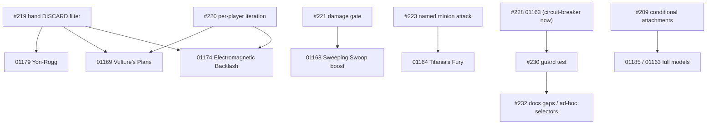

# MCD Backlog: Status, Work Queue and Handoff

> **Last updated:** 2026-10-05
> **Repository state:** `main`, last work commit `9a0830d` (Surge keyword). Check `git log -1` and `git status` first: commits after `28fa59a` may not be pushed yet.
> **Release gate:** Gate 1 ("Rhino Release" vertical slice: the 5 core heroes against Rhino).
> **Verification baseline:** 🟢 1,830 tests passing (0 failed, 0 skipped), 0 TypeScript diagnostics, 0 ESLint warnings, Prettier clean. One known flaky test: #217.
> **This file is the entry point for anyone (person or agent) picking the work up.** Read sections 1 to 4, then pick the first ready item of section 3.

---

## 1. Where we are

Phases 1 to 4 (combat flow, ability legality, shared gating, audit cleanups) are complete. **Phase 5** (core set card correctness, the Gate 1 gate) has two tracks:

- **Track A, reported card bugs: complete.** Hydra Bomber, Imminent Overload, Rocket Boots, Wakanda Forever!.
- **Track B, correctness of the core player and encounter cards.** Driven by two living trackers:
  - [plan_core_player_cards_review.md](plan_core_player_cards_review.md): the line-by-line review of every core player card against its printed text (items A, B, C, D).
  - [plan_effect_params_remediation.md](plan_effect_params_remediation.md): the audit of untyped `effectParams` keys (WP1 to WP8) and its fixes.

Done since 2026-10-03 (each has a plan file in this folder and a changelog entry):

| Item | What | Commit |
| :-- | :-- | :-- |
| Energy Daggers A1, Wakanda Forever! #207 | target set, resumable special sequence | `a6c5397`, `df01659` |
| Rocket Boots A3 / #131 | timed trait modifiers | `32aa400` |
| Counter-Punch A2 | cost 0, in-hand reaction scan (shared `scanHandReactions`), "that enemy", `triggerFilter.defenderType` | `647f435` |
| Med Team B7 | friendly characters only | `8dc2fe7` |
| Mark V Helmet WP1 / #226, Jessica Jones C1 | new gate `IF_CONDITION_NOT_MET`, Patrol for multi-scheme removal, cap removed | `8762323` |
| Iron Man WP2 / #227 | hand size cap per official errata, 1..10 clamp removed | `2a3aeb2` |
| Kree Manipulator WP4 / #229, Electric Whip Attack WP8 boost | condition `UNDEFENDED_ATTACK` | `b2ab514` |
| #222 and #241 | `SELF_HERO` selector; Sweeping Swoop (When Revealed), Electric Whip Attack (When Revealed), Ritual Combat; selector hygiene | `28fa59a` |
| #218 | Surge keyword, one shared surge path, strict printed-keyword detection for Surge | `9a0830d` |

---

## 2. Rules of this repository (digest; the sources are authoritative)

Sources: [AGENTS.md](../../AGENTS.md), `.agents/rules/*.md` (shared quality gates, command execution, RTK, post-task checklist), the skills in `.claude/skills/` (`card-integration-protocol`, `bug-fix`, `feature-delivery`, `commit-and-push`, `next-task`, `problem-report-triage`).

1. **Plan first, stop for approval.** For any change to `src/`, `tests/`, supplemental data, dependencies or config: write `docs/backlog/plan_<topic>.md` (rules analysis, printed text, original data, proposed data, why, tests, files, open decisions, UI/Card Editor impact) and wait for the owner's approval. A plan may be pre-authorised for follow-ups only when the owner says so.
2. **TDD.** Write the failing test first and watch it fail for the right reason. Never add skipped or todo tests.
3. **Cards are read literally.** "Your hero" is never the alter-ego (selector `SELF_HERO`); "take damage" or "you" is the identity in either form (`SELF_IDENTITY`). Never interpret card text. **Never add or edit `audit.comment`.**
4. **Official errata beat the printed text** (`references/rules/appendices/05_card_errata.md`). Do not open the raw PDF; use `npm run rule -- <term>` or `references/rules/`.
5. **Engine stays headless; card behaviour stays declarative.** Engine primitives are generic, never named after a card (ADR-0021). No legacy shims or aliases.
6. **Schema change rule.** Any new or renamed effect, condition, gate, selector, filter or parameter updates in the same change: `schema.ts`, regenerated `schema.json` (`npm run schema:generate`), the spec in `docs/specifications/supplemental/`, the Card Editor (`src/ui/components/editor/`, mainly `effect-parameter-registry.ts`), and a test. Add an ADR or ADR addendum for design decisions.
7. **Circuit-breaker.** If a card cannot be modelled faithfully (missing primitive, ambiguity), strip its executable ability, set `audit.confidence` below 95, write `docs/ambiguities/<pack>_<code>_<slug>.md`, set `audit.ambiguityFile`, and file the engine issue. Never ship a placeholder that contradicts the printed text.
8. **Out-of-scope gaps become GitHub issues** (with printed text, evidence, acceptance criteria), not silent notes.
9. **Gates before reporting done:** `npm test`, `npm run typecheck`, `npm run lint`, `npx prettier --check "src/**/*.{ts,tsx}" "tests/**/*.{ts,tsx}"` (all green), then `npm run report:declarations` after any supplemental change.
10. **After each item:** update `CHANGELOG.md` `[Unreleased]`, the relevant plan file, the two living trackers and this file.
11. **Commit and push only when the owner asks.** Conventional Commits, one commit per issue where possible, `Fixes #N` only when the issue is fully done (`Refs #N` otherwise), end with the `Co-Authored-By` line used in recent commits. Verify the issue state after pushing.

### Practical pitfalls

- Shell commands start with `rtk` where the RTK policy applies (`rtk git status`, `rtk npm test`).
- **Never run Prettier on whole folders** such as `src/engine` (it reformats unrelated JSON and README files). Format only files you changed.
- Heredocs that contain apostrophes can break in the shell tool. Write multi-line files and scripts with the file-writing tool.
- Pack JSON round trip: `core_encounter.json` and `core.json` use CRLF in the working tree. Either edit textually or load with `json`, change, and dump with `indent=2, ensure_ascii=False` plus a trailing newline and the original line endings. Keep canonical card-id order. Check `git diff --stat` is small.
- A supplemental `target` value must be a member of `TargetSelectorSchema` (a data test enforces it); keys inside `effectParams` are **not** validated yet (see WP5), so check by hand that the engine really reads every key you use.
- Importer keyword tags are substring-based except Surge (see #243): do not trust `hasKeyword` for the other keywords on cards that merely mention them.
- Quick data lookups: `npm run card:get -- <code>` (upstream plus supplemental), `npm run rule -- <term>`.
- Test helpers worth reusing: reveal path `step4_revealEncounterCards` (see `tests/engine/self-hero-cards.test.ts`), attack path `executeEnemyAttackSynchronously` (see `tests/engine/kree-manipulator-boost.test.ts`), ability use `dispatchAction({ type: 'USE_CARD_ABILITY' })` (see `tests/engine/mark-v-helmet.test.ts`).

---

## 3. Work queue (ordered; the first ready item is the next task)

"Ready" means every prerequisite is done. Every item needs a plan file and the owner's approval before code (rule 1). Items marked **owner decision** wait for an answer in chat.

### 3.1 Cards that execute wrong behaviour today (do these first)

| # | Item | Issue | Why now | Notes |
| :-- | :-- | :-- | :-- | :-- |
| 1 | Heart-Shaped Herb `01158` has an **active invented placeholder** (heals the villain 2); `01185` and `01121` have no entry | [#244](https://github.com/SteveRodrigue/MCD/issues/244) | misplays a card in real games | correct or strip `01158` first; `01185` needs conditional attachment (#209) |
| 2 | False Alarm `01112` never surges when already confused | [#242](https://github.com/SteveRodrigue/MCD/issues/242) | small, uses the `SURGE` effect and `IF_ALREADY_HAS_STATUS` | Tier 1 |
| 3 | **Untriaged in-app bug reports** from 2026-10-04: [#233](https://github.com/SteveRodrigue/MCD/issues/233) Caught Off Guard, [#234](https://github.com/SteveRodrigue/MCD/issues/234) and [#239](https://github.com/SteveRodrigue/MCD/issues/239) Daredevil, [#235](https://github.com/SteveRodrigue/MCD/issues/235) Interrogation Room, [#236](https://github.com/SteveRodrigue/MCD/issues/236) Mockingbird, [#237](https://github.com/SteveRodrigue/MCD/issues/237) Yon-Rogg's Treason, [#238](https://github.com/SteveRodrigue/MCD/issues/238) Highway Robbery, [#240](https://github.com/SteveRodrigue/MCD/issues/240) Emergency | listed | real play reports, not yet read by the agents who did the work above | use the `problem-report-triage` and `bug-fix` skills; deduplicate against existing issues (#234 and #239 look like duplicates; #237 overlaps #219) |
| 4 | Genetically Enhanced `01163` (invented `bonusAttack`) | [#228](https://github.com/SteveRodrigue/MCD/issues/228) | blocks the guard test | blocked on #209 for a faithful model: **apply the circuit-breaker now** (strip, ambiguity report) so WP5 can pass with zero exemptions |

### 3.2 Engine prerequisites that unblock stripped cards

| # | Item | Issue | Unblocks | Notes |
| :-- | :-- | :-- | :-- | :-- |
| 5 | Hand `DISCARD` with filter, each-player targets and discarded-card results | [#219](https://github.com/SteveRodrigue/MCD/issues/219) | `01179` Yon-Rogg's Treason, `01169`, `01174` | ready |
| 6 | Per-player iteration inside one ability | [#220](https://github.com/SteveRodrigue/MCD/issues/220) | `01169` The Vulture's Plans, `01174` Electromagnetic Backlash | needs #219 first for the two cards |
| 7 | Gate "this activation dealt damage" | [#221](https://github.com/SteveRodrigue/MCD/issues/221) | `01168` Sweeping Swoop boost | ready; the boost data is in its ambiguity report |
| 8 | Named minion in play attacks a hero, with an attacked / did-not-attack result | [#223](https://github.com/SteveRodrigue/MCD/issues/223) | `01164` Titania's Fury | ready (its hero selector exists: `SELF_HERO`) |
| 9 | `executeSequence` swallows step failures and always reports success | [#225](https://github.com/SteveRodrigue/MCD/issues/225) | visibility of every ability failure | cross-cutting, Tier 2; do before adding more complex sequences |

### 3.3 The `effectParams` remediation ([plan_effect_params_remediation.md](plan_effect_params_remediation.md))

| # | Item | Issue | Depends on |
| :-- | :-- | :-- | :-- |
| 10 | WP5: guard test, unknown `effectParams` key fails the data test (the `target` slice is already done) | [#230](https://github.com/SteveRodrigue/MCD/issues/230) | item 4 (so it passes with zero exemptions) |
| 11 | WP6: retire `PER_SIDE_SCHEME` / `PER_DISCARDED_CARD` / `PER_RESOURCE_SPENT` pseudo-primitives (`MODIFY_HAND_SIZE` already done) | [#231](https://github.com/SteveRodrigue/MCD/issues/231) | WP5 not required, but CONSTANT `MODIFY_STAT` must evaluate dynamic amounts |
| 12 | WP7: documentation gaps, decorative keys, ad-hoc selector strings (`HERO`, `IDENTITY`, `ALTER_EGO`), `TRIGGERING_HERO` overlap | [#232](https://github.com/SteveRodrigue/MCD/issues/232) | WP5 |

### 3.4 Core player cards review ([plan_core_player_cards_review.md](plan_core_player_cards_review.md))

Remaining, in the tracker's order: Tier 1 data-only items C2 to C5, C8, C11 and the A6 test (Luke Cage Toughness); Tier 2 helpers A5, B1/B3, B6, B8, C6, C7; items needing the owner first: B4 (canonical defeat trigger), C9 (Alpha Flight Station form), C10 (identity timing convention), C13 (`maxPerDeck`), and the Repulsor Blast FAQ question. Read the item text in the tracker; each still needs its own plan.

### 3.5 Importer and data quality

| # | Item | Issue | Notes |
| :-- | :-- | :-- | :-- |
| 13 | Keyword tags are detected by substring for 15 keywords (hundreds of phantom tags across all packs) | [#243](https://github.com/SteveRodrigue/MCD/issues/243) | high impact; reuse `hasPrintedKeyword`; run the corpus comparison as a test |
| 14 | One-off read-through of every core encounter card's data against its printed text | _(not filed)_ | recommended after the items above; the key audit cannot catch semantic errors (found `01173`, `01178`, `01112`, `01158` this way) |

### 3.6 Smaller engine defects

[#216](https://github.com/SteveRodrigue/MCD/issues/216) `STAT_VALUE DAMAGE` reads a nonexistent field; [#217](https://github.com/SteveRodrigue/MCD/issues/217) flaky obligation test (shuffle-dependent); [#224](https://github.com/SteveRodrigue/MCD/issues/224) acceleration icons outside side schemes; [#206](https://github.com/SteveRodrigue/MCD/issues/206) identity printed traits ignore the form.

### 3.7 Deferred (do not start without the owner)

- **Wrecking Crew (MC03) chain:** [#210](https://github.com/SteveRodrigue/MCD/issues/210), [#211](https://github.com/SteveRodrigue/MCD/issues/211), [#212](https://github.com/SteveRodrigue/MCD/issues/212), [#213](https://github.com/SteveRodrigue/MCD/issues/213), [#214](https://github.com/SteveRodrigue/MCD/issues/214), [#215](https://github.com/SteveRodrigue/MCD/issues/215). No effect on Gate 1.
- **Other features and cleanups:** [#209](https://github.com/SteveRodrigue/MCD/issues/209) conditional encounter attachments (42 cards), [#208](https://github.com/SteveRodrigue/MCD/issues/208) player-deck obligations, [#109](https://github.com/SteveRodrigue/MCD/issues/109) observer-scoped reaction triggers, [#37](https://github.com/SteveRodrigue/MCD/issues/37) Alliance payment and Team-Up, [#126](https://github.com/SteveRodrigue/MCD/issues/126), [#127](https://github.com/SteveRodrigue/MCD/issues/127), [#27](https://github.com/SteveRodrigue/MCD/issues/27).
- **Phase 6, [#100](https://github.com/SteveRodrigue/MCD/issues/100):** the full supplemental data pass, postponed until Phase 5 is finished and the engine contract is stable.
- **Known gap outside Gate 1:** 53 core encounter cards with rules text and no supplemental entry (Klaw, Ultron, Masters of Evil, Hydra, Doomsday Chair sets: `01113` to `01154`, `01180` to `01183`). Their scenario plugins exist under `src/engine/scenarios/built-in/`, but no card abilities are modelled. Tracked with the Surge cards in #244.

### Dependency picture (open work only)



---

## 4. Handoff protocol (start here)

1. **Sync and verify**
   ```powershell
   rtk git pull origin main
   rtk git status
   rtk npm test
   ```
   Expect the baseline of the header. If a test fails, check whether it is #217 (rerun) before assuming your change broke it.
2. **Read**, in order: [AGENTS.md](../../AGENTS.md), this file, the plan file of the item you pick (and the living tracker it belongs to), the issue text.
3. **Pick** the first *ready* item of section 3 that nobody else is working on. Say which one in chat (or comment on the issue).
4. **Plan** (`docs/backlog/plan_<topic>.md`, follow the structure of any recent plan, for example [plan_issue_222_self_hero_selector.md](plan_issue_222_self_hero_selector.md) or [plan_issue_218_surge_keyword.md](plan_issue_218_surge_keyword.md)) and **stop for approval**.
5. **Implement with TDD**, then run the gates of rule 9, regenerate the report if data changed, and update the changelog, plan, trackers and this file.
6. **Hand back**: summarise what changed, what you verified, what you found, and which GitHub issues you filed. Commit and push only when asked.

A ready-to-paste prompt for a new agent is in [handoff_prompt.md](handoff_prompt.md).

---

## 5. Open decisions waiting for the owner

- B4 (which defeat trigger is canonical), C9 (does Alpha Flight Station match Captain Marvel's hero form), C10 (one timing naming convention for identity abilities), C13 (where deck limits like "Max 1 per deck" live), Repulsor Blast single-hit versus two-hit question: see [plan_core_player_cards_review.md](plan_core_player_cards_review.md).
- Whether to schedule item 14 (data read-through) and #243 before the remaining Tier 1 cosmetics.

---

## 6. Archive: resolved history (kept for commit references)

The tables below record the items resolved before 2026-10-04 and are not updated any more. Current status lives in sections 1 and 3.

### 6.1 Domain Classification & Issue Breakdown

#### Domain A: Engine Primitives (Core Rules & Framework)

| Issue # | Title | Core Mechanic / Target Area | Status & Fix Strategy |
|---|---|---|---|
| **#183** | **Spider-Man defense not reducing incoming damage** | Combat Pipeline: Step 3 `DECLARE_DEFENDER` -> Step 6 damage mitigation in `combat-pipeline.ts` & `action-dispatcher.ts`. | 🟢 **Closed** (`a8e3e3a`). Preserved DEF reduction across prompt suspensions. |
| **#172** | **Cancelled prompt loses card from hand** | Prompt Queue & Card Lifecycle: Hand-card splicing in `PLAY_CARD` / `PLAY_CARD_FROM_ZONE` before modal choice. | 🟢 **Closed** (`8681c23`). Implemented `cancel_target` / `pass` refund back to hand. |
| **#184** | **Caught Off Guard (01188) choice prompt** | Encounter Resolution: When Revealed effect discards upgrade/support. | 🟢 **Closed** (`052032e`). Enqueues player choice modal when 2+ cards exist in tableau. |
| **#181** | **Surveillance Team Crisis icon threat bypass** | Threat Pipeline & Legality: `threat-pipeline.ts` and `effects/index.ts`. | 🟢 **Closed** (`0d6c235`). Enforces Crisis icon and Patrol minion blocks in `CHOSEN_SCHEME`. |
| **#186** | **For Justice! (01060) Mental resource bonus** | Cost Engine & Dynamic Formulas: `context.resourcesSpent` propagation. | 🟢 **Closed** (`052032e`). Added `PAID_WITH_RESOURCE` / `RESOURCES_SPENT` dynamicBonus, purged `bonusWithMental`. |
| **#194** | **Replace state.villain/mainScheme legacy pointers [AUD-F003]** | Architecture & State: about 520 references to legacy singleton pointers `state.villain` and `state.mainScheme`. | 🟢 **Resolved** (`ba31d33`, `09c80bd`, `1c8a74f`, `a3fc747`, `11067bc`). `villains[]` / `mainSchemes[]` plus `activeVillainId` are canonical, accessors and setters in `models/state.ts`, legacy fields `@deprecated` (ADR-0076). Follow-ups: #215 (field removal), #210-#214 (Wrecking Crew prerequisites). |
| **#122** | **Extract shared step-gate evaluator** | Pipeline Unification: Unifies ability step gating (`TARGET_TRAIT_MATCH`, conditions) between effect execution and CONSTANT stat/trait loop. | 🟢 **Resolved** (`0acc25f`). `evaluateStepGate` shared by the effect pipeline and the CONSTANT stat loop (ADR-0019 addendum). |
| **#202** | **Tighten customActionHandlers action:any [AUD-OQ-04]** | Type Safety: Discriminated union contract for custom scenario plugin action handlers in `ScenarioPlugin`. | 🟢 **Resolved** (`7d6bfb1`). Removed the unused `customActionHandlers` member (nothing set or called it) instead of typing it. |

---

#### Domain B: Card Fixes (Supplemental Data & Declarative Modeling)

| Issue # | Title | Target File / Code | Problem Statement & Fix Strategy |
|---|---|---|---|
| **#175** | **Charge (01099)** | `core_encounter.json` (`01098`, `01099`, `01100`) | 🟢 **Resolved** (`0fc765e`). Removed the `WHEN_REVEALED` attach ability from the three Rhino attachments; the engine attaches intrinsically (data-only fix). |
| **#154** | **Cosmic Flight Aerial trait in Alter-Ego** | `core.json` (`01017`) | 🟢 **Resolved** (`608a19a`). ADD_TRAIT honors gates; `01017` gated with `IF_FORM: hero`. |
| **#158** | **Family Emergency (01175)** | `core_encounter.json` (`01175`) | 🟢 **Resolved** (`2cc63df`, `b205d7c`). All five core obligations integrated: `PlayerState.obligations` zone, hero-set default recipient + optional `recipient` override (proof card `56128b`), `ENTERS_PLAY` resolution ability with `PLAYER_CHOICE` option `gate`/`cost`, `REMOVE_FROM_GAME`, `ADD_ACCELERATION`, `ALL_CONTROLLED_TABLEAU` + `filter` (ADR-0075). |
| **#133** | **Hydra Bomber (01110)** | `core_encounter.json` (`01110`) | 🟢 **Resolved** (`9f8320c`). "Take 2 damage" targets only the revealing player (`SELF_IDENTITY`); the `HERO` target had hit every hero-form player. The same-pattern audit (`plan_hero_target_audit.md`) fixed `01191` Exhaustion and stripped six placeholder cards (`01159`, `01164` When Revealed, `01168`, `01169`, `01174`, `01179`) pending engine work #218-#223. |
| **#131** | **Rocket Boots (01039)** | `core.json` (`01039`) | 🟢 **Resolved** (`32aa400`). `ADD_TRAIT` works as an effect step with timed trait modifiers (default: while the source card is in play, or an explicit `PHASE`/`ROUND`/`TURN`); the Hero Action grants Aerial to the identity until the end of the phase. |
| **#132** | **Imminent Overload (01171)** | `core_encounter.json` (`01171`) | 🟢 **Resolved** (`e289645`, validation only). The card prints an Acceleration icon, not Crisis; the engine matches the printed text. Follow-up #224. |
| **#207** | **Wakanda Forever! sequence ignores mid-sequence prompts** | `specials/wakanda-forever.ts` | 🟢 **Resolved** (`a6c5397`, `df01659`). Resumable `pendingSpecialSequence`; dead `01047`-`01049` fallbacks removed (ADR-0038 addendum). Follow-up #225. |

---

#### Domain C: UI & Code Refactors (Visuals, Test Hygiene & Architecture)

| Issue # | Title | Primary Files | Problem Statement & Remediations |
|---|---|---|---|
| **#185** | **Surveillance Team (01064) modal opens with no threat** | `HeroZone.tsx`, `TableauActionModal.tsx`, `tableau-card-legality.ts` | 🟢 **Resolved** (`569274c`). Tableau cards whose Action/Resource abilities fail `canInitiateAbility` are grayed and non-clickable (ADR-0074). |
| **#179** | **Alpha Flight Station (01015) active on empty hand** | `tableau-card-legality.ts`, `HeroZone.tsx` | 🟢 **Resolved**. Covered by the #185 fix (`569274c`, ADR-0074); regression tests added. |
| **#180** / **#129** | **Captain Marvel Rechannel & Rhino Attachment payment filtering** | `CardPaymentModal.tsx`, `payment-eligibility.ts` | 🟢 **Resolved** (`c7d970d`). Modal disables hand cards/generators that cannot pay a typed cost (ADR-0072 addendum). |
| **#161** | **Hero exhausted card layering behind health bar** | `HeroZone.tsx`, CSS/z-index | 🟢 **Resolved** (`0ed001b`). Stat and HP columns stack above the rotated card (`relative z-10`). |
| **#192** | **Remove villain-phase step aliases in tests [AUD-F001]** | `villain-phase.ts`, test files | 🟢 **Resolved** (`c89aed1`). Three aliases removed; 17 test files use canonical names. |
| **#195** | **Fix mismatched log key step4->step3 [AUD-F004]** | `villain-phase.ts`, `locales/` | 🟢 **Resolved** (`c89aed1`). Log key is `villainPhase.step3.encounterCardsDealt`; no locale entry (no engine log key has one). |
| **#196** | **Remove ambiguous ScenarioDefinition alias [AUD-F005]** | `catalog.ts` | 🟢 **Resolved** (`37e8f43`). |
| **#197** | **Remove dead isFacedown probes in CardView [AUD-F006]** | `CardView.tsx` | 🟢 **Resolved** (`4480314`). |
| **#198** | **Remove dead raw field fallbacks in PlayerHandTray [AUD-F007]** | `PlayerHandTray.tsx` | 🟢 **Resolved** (`a41f997`). |
| **#199** | **act(...) warnings on CardView image tests [AUD-OQ-01]** | `CardView.tsx`, test renders | 🟢 **Closed** as not reproducible (0 warnings in the full suite). |
| **#200** | **Main JS bundle exceeds 500 kB [AUD-OQ-02]** | `App.tsx` | 🟢 **Resolved** (`0f97520`). Lazy-loaded screens: main chunk 1,230 kB to 860 kB (it still exceeds 500 kB: engine and card data). |
| **#201** | **normalizeCardCodeForArt dead export [AUD-OQ-03]** | `card-cache-service.ts` | 🟢 **Resolved** (`efcb8a4`). Removed with its test case. |

---

### 6.2 Prioritization & Risk Matrix

| Priority | Issue # | Title | Domain | Risk / Blast Radius | Effort | Status |
|---|---|---|---|---|---|---|
| **P0** | **#183** | Spider-Man defense not reducing incoming damage | Engine | High / Core Combat | M | 🟢 **Closed** (`a8e3e3a`) |
| **P1** | **#172** | Cancelled prompt loses card from hand | Engine | Medium / Hand State | S | 🟢 **Closed** (`8681c23`) |
| **P1** | **#181** | Surveillance Team bypasses Crisis icon | Engine | Medium / Threat Engine | S | 🟢 **Closed** (`0d6c235`) |
| **P1** | **#184** | Caught Off Guard lacks player choice prompt | Engine | Medium / Encounter Flow | S | 🟢 **Closed** (`052032e`) |
| **P1** | **#186** | For Justice! Mental bonus not applied | Engine/Data | Low / Card Effect | S | 🟢 **Closed** (`052032e`) |
| **P1** | **#135** | Duplicate of For Justice! (#186) | Data | Low / Card Effect | S | 🟢 **Closed** (`052032e`) |
| **P1** | **#180** | Captain Marvel Rechannel resource validation | UI/Engine | Medium / Payment Flow | S | 🟢 **Resolved** (`c7d970d`) |
| **P1** | **#175** | Charge (01099) incorrect When Revealed | Card Data | Low / Supplemental Data | XS | 🟢 **Resolved** (`0fc765e`) |
| **P2** | **#185** | Surveillance Team clickable with no threat | UI/Engine | Low / Board UI | S | 🟢 **Resolved** (`569274c`) |
| **P2** | **#179** | Alpha Flight Station active with empty hand | UI/Engine | Low / Board UI | S | 🟢 **Resolved** (`569274c` + tests) |
| **P2** | **#129** | Discard Rhino attachment allows invalid resources | UI | Low / Payment Modal | S | 🟢 **Resolved** (`c7d970d`) |
| **P2** | **#122** | Extract shared step-gate evaluator | Engine | Medium / Stat Calculator | M | 🟢 **Resolved** (`0acc25f`) |
| **P2** | **#154** | Cosmic Flight Aerial trait active in Alter-Ego | Card Data | Low / Trait Engine | S | 🟢 **Resolved** (`608a19a`) |
| **P2** | **#194** | Replace state.villain legacy pointers [AUD-F003] | Engine | High / ~520 Call Sites | L | 🟢 **Resolved** (`ba31d33`..`5612170`) |
| **P2** | **#100** | New pass on card supplemental data (postponed, was P0) | Card Data | High / all cards | L | ⏸️ **Postponed** (Phase 6) |
| **P2** | **#218** | Surge keyword is parsed but never applied (6 core cards) | Engine | Medium | M | 🟡 **Open** (Phase 5) |
| **P2** | **#219** | Hand DISCARD: filter, each player, discarded-card results | Engine | Medium | M | 🟡 **Open** (Phase 5) |
| **P2** | **#222** | Form-literal "your hero" target selector | Engine | Medium | M | 🟡 **Open** (Phase 5) |
| **P2** | **#225** | `executeSequence` swallows step failures | Engine | Medium | M | 🟡 **Open** |
| **P2** | **#133** | Hydra Bomber (01110) damages both heroes | Card Data | Low / Supplemental Data | XS | 🟢 **Resolved** (`9f8320c`, data fix + audit) |
| **P2** | **#132** | Imminent Overload (01171) Crisis validation | Card Data | Low / Crisis legality | S | 🟢 **Resolved** (`e289645`, validated: no defect) |
| **P2** | **#131** | Rocket Boots (01039), same as review item A3 | Card Data + Engine | Medium / Tier 2-3 | M | 🟢 **Resolved** (`32aa400`) |
| **P2** | **#207** | Wakanda Forever! sequence pausing | Engine | Medium / Special handler | M | 🟢 **Resolved** (`a6c5397`, `df01659`) |
| **P3** | **#220, #221, #223** | Per-player iteration, damage-dealt gate, named-minion attack (unblock `01174`/`01169`, `01168`, `01164`) | Engine | Medium | M each | 🟡 **Open** (Phase 5) |
| **P3** | **#210-#215** | Multi-villain follow-ups for MC03 Wrecking Crew (encounter decks, side schemes and scheme threat, targeting/Guard/win, active counter effects, scenario plugin, legacy field removal) | Engine/Data | Medium | M-L | 🟡 **Open** (no immediate impact) |
| **P3** | **#216** | STAT_VALUE DAMAGE reads nonexistent villain/minion `damage` | Engine | Low | XS | 🟡 **Open** |
| **P3** | **#217** | Flaky obligation rule 2 test (shuffle-dependent) | Tests | Low | XS | 🟡 **Open** |
| **P3** | **#224** | Acceleration icons on non-side-scheme cards ignored in step 1 | Engine | Low (outside Core Set) | S | 🟡 **Open** |
| **P3** | **#192** | Remove villain-phase step aliases in tests [AUD-F001] | Refactor | Low / Tests Only | S | 🟢 **Resolved** (`c89aed1`) |
| **P3** | **#195** | Fix mismatched log key step4->step3 [AUD-F004] | Refactor | Low / Log Locale | XS | 🟢 **Resolved** (`c89aed1`) |
| **P3** | **#196** | Remove ambiguous ScenarioDefinition alias [AUD-F005] | Refactor | Low / Catalog Types | XS | 🟢 **Resolved** (`37e8f43`) |
| **P3** | **#197** | Remove dead isFacedown probes in CardView [AUD-F006] | Refactor | Low / UI Only | XS | 🟢 **Resolved** (`4480314`) |
| **P3** | **#198** | Remove dead raw field fallbacks in PlayerHandTray [AUD-F007] | Refactor | Low / UI Only | XS | 🟢 **Resolved** (`a41f997`) |
| **P3** | **#161** | Exhausted hero card layering behind health bar | UI | Low / CSS Stacking | XS | 🟢 **Resolved** (`0ed001b`) |
| **P3** | **#199** | act(...) warnings in CardView image tests [AUD-OQ-01] | Refactor | Low / Vitest Output | S | 🟢 **Closed** (not reproducible) |
| **P3** | **#200** | Main JS bundle exceeds 500 kB [AUD-OQ-02] | UI/Perf | Medium / Bundler | M | 🟢 **Resolved** (`0f97520`) |
| **P3** | **#201** | normalizeCardCodeForArt dead export [AUD-OQ-03] | Refactor | Low / Service | XS | 🟢 **Resolved** (`efcb8a4`) |
| **P3** | **#202** | Tighten customActionHandlers action:any [AUD-OQ-04] | Engine | Low / Types | S | 🟢 **Resolved** (`7d6bfb1`) |

---

### 6.3 Execution Roadmap & Phase Plan

#### Phase 1: Core Combat & Card Play Flow (Completed ✅)
- ✅ **#183** (Spider-Man defense damage mitigation in combat pipeline)
- ✅ **#172** (Voluntary decision prompt cancellation & hand refund)
- ✅ **#181** (Scheme targeting Crisis icon & Patrol legality)
- ✅ **#184** (Caught Off Guard player choice modal)
- ✅ **#186 / #135** (For Justice! declarative resource payment kicker)

#### Phase 2: Ability Usability & Action Legality Pre-checks (Completed ✅)
- ✅ **#185**: *Surveillance Team* (`01064`) — gray out action when total removable threat across legal schemes is 0.
- ✅ **#179**: *Alpha Flight Station* (`01015`) — gray out action when hand is empty.
- ✅ **#180 / #129**: *Captain Marvel* (`01010a` Rechannel) & Rhino attachment — payment modal resource type enforcement.
- ✅ **#175**: *Charge* (`01099`) — change attachment timing from When Revealed to constant attachment.

#### Phase 3: Architectural Foundation & Shared Gating (Completed ✅)
- ✅ **#122**: Shared step-gate evaluator extracted.
- ✅ **#154**: Gate Cosmic Flight *Aerial* trait on Hero form.
- ✅ **#158**: Obligation engine for the five core obligations (zone, recipient, ability-based resolution).
  - Deferred follow-up: **#208** (player-deck obligations go to the play area on draw; depends on #158).
  - Deferred follow-up: **#209** (conditional encounter attachments, "Attach to X. Otherwise …", 42 cards; independent of #158).
- ✅ **#194**: Migration of the legacy `state.villain` / `state.mainScheme` pointers to accessor helpers (7 batches, ADR-0076).
  - Deferred follow-ups for Wrecking Crew (MC03): **#210** (per-villain encounter decks), **#211** (side schemes and scheme threat), **#212** (multi-villain targeting, Guard, win), **#213** (active counter effects), **#214** (scenario plugin and data), **#215** (remove the legacy fields and migrate test fixtures).

#### Phase 4: Code Audit Cleanups & Polish (Completed ✅)
- ✅ **#192, #195, #196, #197, #198**: Removed dead aliases, fixed the log key, and eliminated dead `as any` probes (plan: `plan_phase4_audit_cleanups_a.md`).
- ✅ **#161, #199, #200, #201, #202**: UI layering fix, #199 closed as not reproducible, lazy-loaded screens (main chunk 1,230 kB to 860 kB), removal of two unused exports (plan: `plan_phase4_audit_cleanups_b.md`). Phase 4 is complete.
