# MCD Backlog Dependency, Prioritization Map & Teamwork Status

> **Last Updated:** 2026-10-04 (Phases 1-4 and Phase 5 Track A complete)  
> **Repository Commit:** `df01659` (`origin/main`)  
> **Release Gate:** Gate 1 ("Rhino Release" Vertical Slice — 100% Core 5 Heroes vs. Rhino)  
> **Verification Status:** 🟢 All 1,706 tests passing (0 failed, 0 skipped), 0 TS diagnostics, 0 ESLint warnings

---

## 1. Executive Summary

**State at `df01659`:** 32 open issues on GitHub (25 plus #226-#232, the `effectParams` remediation packages). Phases 1-4 are complete and Phase 5 Track A (reported Core Set card bugs) is complete. The Rhino vertical slice (Gate 1) work that remains is Phase 5 Track B (the core player cards review) plus the engine prerequisites that unblock six core encounter cards whose placeholder abilities were removed.

The 25 open issues group as follows:
1. **Engine prerequisites for stripped core encounter cards (7):** #218 Surge keyword, #219 hand discard, #220 per-player iteration, #221 "damage dealt" gate, #222 form-literal "your hero" selector, #223 named-minion attack, #225 `executeSequence` swallows step failures.
2. **Wrecking Crew (MC03) chain (6):** #210 per-villain encounter decks, #211 side schemes and scheme threat, #212 multi-villain targeting/Guard/win, #213 active counter effects, #214 scenario plugin and data, #215 remove the legacy villain fields. No immediate impact on Gate 1.
3. **Small defects and test hygiene (3):** #216 (`STAT_VALUE DAMAGE` reads a nonexistent field), #217 (flaky obligation rule 2 test), #224 (acceleration icons outside side schemes).
4. **Unscheduled backlog (9):** #27, #37, #100 (postponed, Phase 6), #109, #126, #127, #206, #208, #209. See section 5, "Unscheduled open issues".

Everything in the original scope (#172-#202, the card fixes #131-#133/#154/#158/#175, the UI items) is resolved; the tables below keep that history with commit references.

---

## 2. Dependency Graph

```mermaid
%%{init: {'theme': 'dark', 'themeVariables': { 'darkMode': true, 'background': '#0b0f19', 'primaryColor': '#1e293b', 'primaryTextColor': '#f8fafc', 'primaryBorderColor': '#475569', 'lineColor': '#64748b', 'secondaryColor': '#0f172a', 'tertiaryColor': '#1e293b' }}}%%
flowchart TD
    subgraph Foundations["1. Foundations (resolved)"]
        I194["#194 Accessor Migration<br/>RESOLVED (ba31d33..5612170)"]
        I122["#122 Step-Gate Evaluator<br/>RESOLVED (0acc25f)"]
        I158["#158 Obligations Engine<br/>RESOLVED (2cc63df, b205d7c)"]
        I172["#172 Prompt Rollback<br/>RESOLVED (8681c23)"]
    end

    subgraph Cards["2. Core Set card fixes (resolved)"]
        I154["#154 Cosmic Flight Gate<br/>RESOLVED (608a19a)"]
        I133["#133 Hydra Bomber + HERO audit<br/>RESOLVED (9f8320c)"]
        I132["#132 Imminent Overload<br/>RESOLVED (e289645)"]
        I131["#131 Rocket Boots / timed traits<br/>RESOLVED (32aa400)"]
        I207["#207 Wakanda sequence pausing<br/>RESOLVED (a6c5397, df01659)"]
    end

    subgraph Prereq["3. Engine prerequisites (open)"]
        I218["#218 Surge keyword"]
        I219["#219 Hand DISCARD filter / each player"]
        I220["#220 Per-player iteration"]
        I221["#221 Damage-dealt gate"]
        I222["#222 'Your hero' selector"]
        I223["#223 Named-minion attack"]
        I225["#225 executeSequence failures"]
    end

    subgraph Stripped["4. Stripped core encounter cards (open)"]
        C01191["01191 Exhaustion (Surge)"]
        C01179["01179 Yon-Rogg's Treason"]
        C01169["01169 Vulture's Plans"]
        C01174["01174 Electromagnetic Backlash"]
        C01159["01159 Ritual Combat"]
        C01168["01168 Sweeping Swoop"]
        C01164["01164 Titania's Fury"]
    end

    subgraph WC["5. Wrecking Crew MC03 (open)"]
        I210["#210 Encounter decks"]
        I211["#211 Side schemes"]
        I212["#212 Targeting / Guard / win"]
        I213["#213 Active counter"]
        I214["#214 Scenario plugin"]
        I215["#215 Remove legacy fields"]
    end

    %% Resolved flows
    I172 --> I158
    I122 --> I154

    %% Prerequisites unblock cards
    I218 --> C01191
    I219 --> C01179
    I219 --> C01169
    I220 --> C01169
    I220 --> C01174
    I219 --> C01174
    I222 --> C01159
    I222 --> C01168
    I222 --> C01164
    I221 --> C01168
    I223 --> C01164

    %% Wrecking Crew chain
    I194 --> I210
    I194 --> I211
    I194 --> I212
    I194 --> I213
    I194 --> I215
    I210 --> I214
    I211 --> I214
    I212 --> I214
    I213 --> I214

    classDef resolved fill:#064e3b,stroke:#059669,stroke-width:2px,color:#ecfdf5;
    classDef open fill:#1e293b,stroke:#475569,stroke-width:1px,color:#cbd5e1;
    classDef stripped fill:#78350f,stroke:#d97706,stroke-width:1px,color:#fffbeb;

    class I194,I122,I158,I172,I154,I133,I132,I131,I207 resolved;
    class I218,I219,I220,I221,I222,I223,I225,I210,I211,I212,I213,I214,I215 open;
    class C01191,C01179,C01169,C01174,C01159,C01168,C01164 stripped;
```



Resolved items from the original scope that are not drawn (#175, #179-#181, #183-#186, #192, #195-#202, #129, #135, #161) are listed in section 3 with their commits.

---

## 3. Domain Classification & Issue Breakdown

### Domain A: Engine Primitives (Core Rules & Framework)

| Issue # | Title | Core Mechanic / Target Area | Status & Fix Strategy |
|---|---|---|---|
| **#183** | **Spider-Man defense not reducing incoming damage** | Combat Pipeline: Step 3 `DECLARE_DEFENDER` -> Step 6 damage mitigation in `combat-pipeline.ts` & `action-dispatcher.ts`. | 🟢 **Closed** (`a8e3e3a`). Preserved DEF reduction across prompt suspensions. |
| **#172** | **Cancelled prompt loses card from hand** | Prompt Queue & Card Lifecycle: Hand-card splicing in `PLAY_CARD` / `PLAY_CARD_FROM_ZONE` before modal choice. | 🟢 **Closed** (`8681c23`). Implemented `cancel_target` / `pass` refund back to hand. |
| **#184** | **Caught Off Guard (01188) choice prompt** | Encounter Resolution: When Revealed effect discards upgrade/support. | 🟢 **Closed** (`052032e`). Enqueues player choice modal when 2+ cards exist in tableau. |
| **#181** | **Surveillance Team Crisis icon threat bypass** | Threat Pipeline & Legality: `threat-pipeline.ts` and `effects/index.ts`. | 🟢 **Closed** (`0d6c235`). Enforces Crisis icon and Patrol minion blocks in `CHOSEN_SCHEME`. |
| **#186** | **For Justice! (01060) Mental resource bonus** | Cost Engine & Dynamic Formulas: `context.resourcesSpent` propagation. | 🟢 **Closed** (`052032e`). Added `PAID_WITH_RESOURCE` / `RESOURCES_SPENT` dynamicBonus, purged `bonusWithMental`. |
| **#194** | **Replace state.villain/mainScheme legacy pointers [AUD-F003]** | Architecture & State: about 520 references to legacy singleton pointers `state.villain` and `state.mainScheme`. | 🟢 **Resolved** (`ba31d33`, `09c80bd`, `1c8a74f`, `a3fc747`, `11067bc`). `villains[]` / `mainSchemes[]` plus `activeVillainId` are canonical, accessors and setters in `models/state.ts`, legacy fields `@deprecated` (ADR-0076). Follow-ups: #215 (field removal), #210-#214 (Wrecking Crew prerequisites). |
| **#122** | **Extract shared step-gate evaluator** | Pipeline Unification: Unifies ability step gating (`TARGET_TRAIT_MATCH`, conditions) between effect execution and CONSTANT stat/trait loop. | 🟢 **Resolved** (`0acc25f`). `evaluateStepGate` shared by the effect pipeline and the CONSTANT stat loop (ADR-0019 addendum). |
| **#202** | **Tighten customActionHandlers action:any [AUD-OQ-04]** | Type Safety: Discriminated union contract for custom scenario plugin action handlers in `ScenarioPlugin`. | 🟢 **Resolved** (`7d6bfb1`). Removed the unused `customActionHandlers` member (nothing set or called it) instead of typing it. |

---

### Domain B: Card Fixes (Supplemental Data & Declarative Modeling)

| Issue # | Title | Target File / Code | Problem Statement & Fix Strategy |
|---|---|---|---|
| **#175** | **Charge (01099)** | `core_encounter.json` (`01098`, `01099`, `01100`) | 🟢 **Resolved** (`0fc765e`). Removed the `WHEN_REVEALED` attach ability from the three Rhino attachments; the engine attaches intrinsically (data-only fix). |
| **#154** | **Cosmic Flight Aerial trait in Alter-Ego** | `core.json` (`01017`) | 🟢 **Resolved** (`608a19a`). ADD_TRAIT honors gates; `01017` gated with `IF_FORM: hero`. |
| **#158** | **Family Emergency (01175)** | `core_encounter.json` (`01175`) | 🟢 **Resolved** (`2cc63df`, `b205d7c`). All five core obligations integrated: `PlayerState.obligations` zone, hero-set default recipient + optional `recipient` override (proof card `56128b`), `ENTERS_PLAY` resolution ability with `PLAYER_CHOICE` option `gate`/`cost`, `REMOVE_FROM_GAME`, `ADD_ACCELERATION`, `ALL_CONTROLLED_TABLEAU` + `filter` (ADR-0075). |
| **#133** | **Hydra Bomber (01110)** | `core_encounter.json` (`01110`) | 🟢 **Resolved** (`9f8320c`). "Take 2 damage" targets only the revealing player (`SELF_IDENTITY`); the `HERO` target had hit every hero-form player. The same-pattern audit (`plan_hero_target_audit.md`) fixed `01191` Exhaustion and stripped six placeholder cards (`01159`, `01164` When Revealed, `01168`, `01169`, `01174`, `01179`) pending engine work #218-#223. |
| **#131** | **Rocket Boots (01039)** | `core.json` (`01039`) | 🟢 **Resolved** (`32aa400`). `ADD_TRAIT` works as an effect step with timed trait modifiers (default: while the source card is in play, or an explicit `PHASE`/`ROUND`/`TURN`); the Hero Action grants Aerial to the identity until the end of the phase. |
| **#132** | **Imminent Overload (01171)** | `core_encounter.json` (`01171`) | 🟢 **Resolved** (`e289645`, validation only). The card prints an Acceleration icon, not Crisis; the engine matches the printed text. Follow-up #224. |
| **#207** | **Wakanda Forever! sequence ignores mid-sequence prompts** | `specials/wakanda-forever.ts` | 🟢 **Resolved** (`a6c5397`, `df01659`). Resumable `pendingSpecialSequence`; dead `01047`-`01049` fallbacks removed (ADR-0038 addendum). Follow-up #225. |

---

### Domain C: UI & Code Refactors (Visuals, Test Hygiene & Architecture)

| Issue # | Title | Primary Files | Problem Statement & Remediations |
|---|---|---|---|
| **#185** | **Surveillance Team (01064) modal opens with no threat** | `HeroZone.tsx`, `TableauActionModal.tsx`, `tableau-card-legality.ts` | 🟢 **Resolved** (`569274c`). Tableau cards whose Action/Resource abilities fail `canInitiateAbility` are grayed and non-clickable (ADR-0074). |
| **#179** | **Alpha Flight Station (01015) active on empty hand** | `tableau-card-legality.ts`, `HeroZone.tsx` | 🟢 **Resolved**. Covered by the #185 fix (`569274c`, ADR-0074); regression tests added. |
| **#180** / **#129** | **Captain Marvel Rechannel & Rhino Attachment payment filtering** | `CardPaymentModal.tsx`, `payment-eligibility.ts` | 🟢 **Resolved** (`c7d970d`). Modal disables hand cards/generators that cannot pay a typed cost (ADR-0072 addendum). |
| **#161** | **Hero exhausted card layering behind health bar** | `HeroZone.tsx`, CSS/z-index | 🟢 **Resolved** (`0ed001b`). Stat and HP columns stack above the rotated card (`relative z-10`). |
| **#192** | **Remove villain-phase step aliases in tests [AUD-F001]** | `villain-phase.ts`, test files | 🟢 **Resolved** (`c89aed1`). Three aliases removed; 17 test files use canonical names. |
| **#195** | **Fix mismatched log key step4->step3 [AUD-F004]** | `villain-phase.ts`, `locales/` | 🟢 **Resolved** (`c89aed1`). Log key is `villainPhase.step3.encounterCardsDealt`; no locale entry (no engine log key has one). |
| **#196** | **Remove ambiguous ScenarioDefinition alias [AUD-F005]** | `catalog.ts` | 🟢 **Resolved** (`37e8f43`). |
| **#197** | **Remove dead isFacedown probes in CardView [AUD-F006]** | `CardView.tsx` | 🟢 **Resolved** (`4480314`). |
| **#198** | **Remove dead raw field fallbacks in PlayerHandTray [AUD-F007]** | `PlayerHandTray.tsx` | 🟢 **Resolved** (`a41f997`). |
| **#199** | **act(...) warnings on CardView image tests [AUD-OQ-01]** | `CardView.tsx`, test renders | 🟢 **Closed** as not reproducible (0 warnings in the full suite). |
| **#200** | **Main JS bundle exceeds 500 kB [AUD-OQ-02]** | `App.tsx` | 🟢 **Resolved** (`0f97520`). Lazy-loaded screens: main chunk 1,230 kB to 860 kB (it still exceeds 500 kB: engine and card data). |
| **#201** | **normalizeCardCodeForArt dead export [AUD-OQ-03]** | `card-cache-service.ts` | 🟢 **Resolved** (`efcb8a4`). Removed with its test case. |

---

## 4. Prioritization & Risk Matrix

| Priority | Issue # | Title | Domain | Risk / Blast Radius | Effort | Status |
|---|---|---|---|---|---|---|
| **P0** | **#183** | Spider-Man defense not reducing incoming damage | Engine | High / Core Combat | M | 🟢 **Closed** (`a8e3e3a`) |
| **P1** | **#172** | Cancelled prompt loses card from hand | Engine | Medium / Hand State | S | 🟢 **Closed** (`8681c23`) |
| **P1** | **#181** | Surveillance Team bypasses Crisis icon | Engine | Medium / Threat Engine | S | 🟢 **Closed** (`0d6c235`) |
| **P1** | **#184** | Caught Off Guard lacks player choice prompt | Engine | Medium / Encounter Flow | S | 🟢 **Closed** (`052032e`) |
| **P1** | **#186** | For Justice! Mental bonus not applied | Engine/Data | Low / Card Effect | S | 🟢 **Closed** (`052032e`) |
| **P1** | **#135** | Duplicate of For Justice! (#186) | Data | Low / Card Effect | S | 🟢 **Closed** (`052032e`) |
| **P1** | **#180** | Captain Marvel Rechannel resource validation | UI/Engine | Medium / Payment Flow | S | 🟢 **Resolved** (`c7d970d`) |
| **P1** | **#175** | Charge (01099) incorrect When Revealed | Card Data | Low / Supplemental Data | XS | 🟢 **Resolved** (`0fc765e`) |
| **P2** | **#185** | Surveillance Team clickable with no threat | UI/Engine | Low / Board UI | S | 🟢 **Resolved** (`569274c`) |
| **P2** | **#179** | Alpha Flight Station active with empty hand | UI/Engine | Low / Board UI | S | 🟢 **Resolved** (`569274c` + tests) |
| **P2** | **#129** | Discard Rhino attachment allows invalid resources | UI | Low / Payment Modal | S | 🟢 **Resolved** (`c7d970d`) |
| **P2** | **#122** | Extract shared step-gate evaluator | Engine | Medium / Stat Calculator | M | 🟢 **Resolved** (`0acc25f`) |
| **P2** | **#154** | Cosmic Flight Aerial trait active in Alter-Ego | Card Data | Low / Trait Engine | S | 🟢 **Resolved** (`608a19a`) |
| **P2** | **#194** | Replace state.villain legacy pointers [AUD-F003] | Engine | High / ~520 Call Sites | L | 🟢 **Resolved** (`ba31d33`..`5612170`) |
| **P2** | **#100** | New pass on card supplemental data (postponed, was P0) | Card Data | High / all cards | L | ⏸️ **Postponed** (Phase 6) |
| **P2** | **#218** | Surge keyword is parsed but never applied (6 core cards) | Engine | Medium | M | 🟡 **Open** (Phase 5) |
| **P2** | **#219** | Hand DISCARD: filter, each player, discarded-card results | Engine | Medium | M | 🟡 **Open** (Phase 5) |
| **P2** | **#222** | Form-literal "your hero" target selector | Engine | Medium | M | 🟡 **Open** (Phase 5) |
| **P2** | **#225** | `executeSequence` swallows step failures | Engine | Medium | M | 🟡 **Open** |
| **P2** | **#133** | Hydra Bomber (01110) damages both heroes | Card Data | Low / Supplemental Data | XS | 🟢 **Resolved** (`9f8320c`, data fix + audit) |
| **P2** | **#132** | Imminent Overload (01171) Crisis validation | Card Data | Low / Crisis legality | S | 🟢 **Resolved** (`e289645`, validated: no defect) |
| **P2** | **#131** | Rocket Boots (01039), same as review item A3 | Card Data + Engine | Medium / Tier 2-3 | M | 🟢 **Resolved** (`32aa400`) |
| **P2** | **#207** | Wakanda Forever! sequence pausing | Engine | Medium / Special handler | M | 🟢 **Resolved** (`a6c5397`, `df01659`) |
| **P3** | **#220, #221, #223** | Per-player iteration, damage-dealt gate, named-minion attack (unblock `01174`/`01169`, `01168`, `01164`) | Engine | Medium | M each | 🟡 **Open** (Phase 5) |
| **P3** | **#210-#215** | Multi-villain follow-ups for MC03 Wrecking Crew (encounter decks, side schemes and scheme threat, targeting/Guard/win, active counter effects, scenario plugin, legacy field removal) | Engine/Data | Medium | M-L | 🟡 **Open** (no immediate impact) |
| **P3** | **#216** | STAT_VALUE DAMAGE reads nonexistent villain/minion `damage` | Engine | Low | XS | 🟡 **Open** |
| **P3** | **#217** | Flaky obligation rule 2 test (shuffle-dependent) | Tests | Low | XS | 🟡 **Open** |
| **P3** | **#224** | Acceleration icons on non-side-scheme cards ignored in step 1 | Engine | Low (outside Core Set) | S | 🟡 **Open** |
| **P3** | **#192** | Remove villain-phase step aliases in tests [AUD-F001] | Refactor | Low / Tests Only | S | 🟢 **Resolved** (`c89aed1`) |
| **P3** | **#195** | Fix mismatched log key step4->step3 [AUD-F004] | Refactor | Low / Log Locale | XS | 🟢 **Resolved** (`c89aed1`) |
| **P3** | **#196** | Remove ambiguous ScenarioDefinition alias [AUD-F005] | Refactor | Low / Catalog Types | XS | 🟢 **Resolved** (`37e8f43`) |
| **P3** | **#197** | Remove dead isFacedown probes in CardView [AUD-F006] | Refactor | Low / UI Only | XS | 🟢 **Resolved** (`4480314`) |
| **P3** | **#198** | Remove dead raw field fallbacks in PlayerHandTray [AUD-F007] | Refactor | Low / UI Only | XS | 🟢 **Resolved** (`a41f997`) |
| **P3** | **#161** | Exhausted hero card layering behind health bar | UI | Low / CSS Stacking | XS | 🟢 **Resolved** (`0ed001b`) |
| **P3** | **#199** | act(...) warnings in CardView image tests [AUD-OQ-01] | Refactor | Low / Vitest Output | S | 🟢 **Closed** (not reproducible) |
| **P3** | **#200** | Main JS bundle exceeds 500 kB [AUD-OQ-02] | UI/Perf | Medium / Bundler | M | 🟢 **Resolved** (`0f97520`) |
| **P3** | **#201** | normalizeCardCodeForArt dead export [AUD-OQ-03] | Refactor | Low / Service | XS | 🟢 **Resolved** (`efcb8a4`) |
| **P3** | **#202** | Tighten customActionHandlers action:any [AUD-OQ-04] | Engine | Low / Types | S | 🟢 **Resolved** (`7d6bfb1`) |

---

## 5. Execution Roadmap & Phase Plan

### Phase 1: Core Combat & Card Play Flow (Completed ✅)
- ✅ **#183** (Spider-Man defense damage mitigation in combat pipeline)
- ✅ **#172** (Voluntary decision prompt cancellation & hand refund)
- ✅ **#181** (Scheme targeting Crisis icon & Patrol legality)
- ✅ **#184** (Caught Off Guard player choice modal)
- ✅ **#186 / #135** (For Justice! declarative resource payment kicker)

### Phase 2: Ability Usability & Action Legality Pre-checks (Completed ✅)
- ✅ **#185**: *Surveillance Team* (`01064`) — gray out action when total removable threat across legal schemes is 0.
- ✅ **#179**: *Alpha Flight Station* (`01015`) — gray out action when hand is empty.
- ✅ **#180 / #129**: *Captain Marvel* (`01010a` Rechannel) & Rhino attachment — payment modal resource type enforcement.
- ✅ **#175**: *Charge* (`01099`) — change attachment timing from When Revealed to constant attachment.

### Phase 3: Architectural Foundation & Shared Gating (Completed ✅)
- ✅ **#122**: Shared step-gate evaluator extracted.
- ✅ **#154**: Gate Cosmic Flight *Aerial* trait on Hero form.
- ✅ **#158**: Obligation engine for the five core obligations (zone, recipient, ability-based resolution).
  - Deferred follow-up: **#208** (player-deck obligations go to the play area on draw; depends on #158).
  - Deferred follow-up: **#209** (conditional encounter attachments, "Attach to X. Otherwise …", 42 cards; independent of #158).
- ✅ **#194**: Migration of the legacy `state.villain` / `state.mainScheme` pointers to accessor helpers (7 batches, ADR-0076).
  - Deferred follow-ups for Wrecking Crew (MC03): **#210** (per-villain encounter decks), **#211** (side schemes and scheme threat), **#212** (multi-villain targeting, Guard, win), **#213** (active counter effects), **#214** (scenario plugin and data), **#215** (remove the legacy fields and migrate test fixtures).

### Phase 4: Code Audit Cleanups & Polish (Completed ✅)
- ✅ **#192, #195, #196, #197, #198**: Removed dead aliases, fixed the log key, and eliminated dead `as any` probes (plan: `plan_phase4_audit_cleanups_a.md`).
- ✅ **#161, #199, #200, #201, #202**: UI layering fix, #199 closed as not reproducible, lazy-loaded screens (main chunk 1,230 kB to 860 kB), removal of two unused exports (plan: `plan_phase4_audit_cleanups_b.md`). Phase 4 is complete.

### Phase 5: Core Set Card Correctness (Gate 1 release gate), Active 🎯

Goal: the Core Set cards used by the Rhino vertical slice do what the printed text says. Two tracks.

- **Track A, reported card bugs: complete ✅**
  1. ✅ **#133** Hydra Bomber (`9f8320c`): damage scoped to the revealing player. The audit of the same `HERO` pattern (`plan_hero_target_audit.md`) fixed `01191` Exhaustion and stripped six placeholder cards with ambiguity reports (`docs/ambiguities/core_encounter_*`).
  2. ✅ **#132** Imminent Overload (`e289645`): validated; the card prints Acceleration, not Crisis.
  3. ✅ **#131** Rocket Boots (`32aa400`): timed trait modifiers; default duration is "while the source card is in play".
  4. ✅ **#207** Wakanda Forever! (`a6c5397`, `df01659`): resumable special sequence; follow-up F1 done.
- **Track A follow-up: engine prerequisites for the stripped cards (open):**

| Card | Blocked by |
|---|---|
| `01191` Exhaustion (Surge) | #218 |
| `01179` Yon-Rogg's Treason | #219 (the conditional surge uses the existing `SURGE` effect) |
| `01169` The Vulture's Plans | #219, #220 |
| `01174` Electromagnetic Backlash | #220, #219 |
| `01159` Ritual Combat | #222 (and confirm choice-time `DISCARDED_CARDS`) |
| `01168` Sweeping Swoop | #222, #221 |
| `01164` Titania's Fury | #222, #223 |

- **Track B, core player cards review** (`plan_core_player_cards_review.md`, living tracker, one item at a time): A1 (`a6c5397`), A2 (Counter-Punch, uncommitted: cost, hand reaction, attacker target, shared in-hand reaction scan), A3 (`32aa400`) and follow-ups F1/F2 are done. B7 (Med Team, uncommitted) is done. Remaining in the approved order of 2026-10-04 (functional bugs before cosmetics): C1, WP1/WP2/WP4, #218 Surge (then #219, #222), WP5, then the Tier 1 cosmetics (C2-C5, C8, C11, A6 test), then Tier 2 helpers (A4, A5, B1/B3, B6, B8, C6, C7), then items needing a decision (B4, C9, C10, C13).
- **`effectParams` remediation** ([plan_effect_params_remediation.md](plan_effect_params_remediation.md), audit: `docs/reports/effect_params_orphan_audit.md`): C1, then WP1-WP7 ([#226](https://github.com/SteveRodrigue/MCD/issues/226) to [#232](https://github.com/SteveRodrigue/MCD/issues/232)). Four core cards ship `effectParams` keys the engine never reads (`01037`, `01029a`, `01163`, `01178`); the permanent fix is a guard test (WP5) after the card fixes.
- **Rules:** each item follows the card-integration protocol and the plan-then-approve rule before any supplemental or engine edit.

### Phase 6: Supplemental Data Pass (postponed), #100

- **#100** "New pass on card supplemental data" is **postponed** (downgraded from P0-blocker to P2-medium).
- **Why:** Phase 5 and the core review tracker may still change primitives, triggers, filters and parameters; a full pass now would be redone. Start it only after Phase 5 is finished, on a stable engine contract.

### Known gap outside Gate 1 (from the #218 audit)

53 core encounter cards with rules text have no supplemental entry: the Klaw, Ultron, Masters of Evil, Hydra and Doomsday Chair sets (`01113`-`01154`, `01180`-`01183`). Their scenario plugins exist under `src/engine/scenarios/built-in/`, but no card abilities are modelled, so those scenarios cannot be played faithfully. Tracked with the three Surge cards in [#244](https://github.com/SteveRodrigue/MCD/issues/244). Substring keyword detection for the other 15 keywords (hundreds of phantom tags across all packs): [#243](https://github.com/SteveRodrigue/MCD/issues/243).

### Unscheduled open issues

Not part of any phase yet; pick them deliberately:

| Issue | Title | Labels | Note |
|---|---|---|---|
| #37 | Multiplayer Alliance collaborative resource payment and Team-Up validators | P2, engine | Feature, no dependency on Phase 5 |
| #126 | Remove deprecated attachment discard action forwarder | P2, needs-review | Cleanup |
| #127 | Replace unsafe dynamic effect and filter contracts with typed boundary adapters | P2, needs-review | Type-safety refactor |
| #206 | Identity printed traits are the union of hero and alter-ego sides regardless of form | bug | Relates to the "cards are literal" rule; triage priority |
| #208 | Player-deck obligations go to the play area on draw | P3 | Depends on #158 (done) |
| #209 | Conditional encounter attachments ("Attach to X. Otherwise ...", 42 cards) | P3 | Independent of #158 |
| #109 | Observer-scoped minion and enemy reaction triggers | P3 | Feature |
| #27 | Calibrate the security response SLA in `SECURITY.md` | P3, docs | Documentation |
| #100 | New pass on card supplemental data | P2 (postponed) | Phase 6 |
| #226-#232 | `effectParams` remediation work packages WP1-WP7 | P2-P3, bug/enhancement | Ordered in `plan_effect_params_remediation.md`; WP1, WP2, WP4 first (independent) |

---

## 6. Handoff Protocol for Resuming Agents & Developers

1. **Verify Clean Working Tree:**
   ```powershell
   rtk git pull origin main
   rtk npm test
   ```
2. **Select Active Target:**
   - Primary: **Phase 5, Track B** in the **approved order of 2026-10-04** (functional bugs before cosmetics), one item at a time, each with a plan first:
     1. ~~**C1** Jessica Jones cap~~ done 2026-10-04, uncommitted ([plan](plan_core_review_c1_jessica_jones.md))
     2. **WP1, WP2, WP4** (WP1 Mark V Helmet done 2026-10-04 (`8762323`): [plan](plan_core_review_wp1_mark_v_helmet.md); WP2 Iron Man hand size done 2026-10-04 (`2a3aeb2`): [plan](plan_core_review_wp2_iron_man_hand_size.md); WP4 Kree Manipulator done 2026-10-04 (`b2ab514`): [plan](plan_core_review_wp4_kree_manipulator.md); WP8 Electric Whip Attack done 2026-10-04 (boost `b2ab514`, When Revealed with #222): [plan](plan_core_review_wp8_electric_whip_attack.md); Mark V Helmet #226, Iron Man hand size #227, Kree Manipulator #229): independent, can run in parallel
     3. **#222 `SELF_HERO` selector** (done 2026-10-04, `28fa59a`: [plan](plan_issue_222_self_hero_selector.md); unblocks `01168` and `01173` When Revealed, maybe `01159`), then **#218 Surge** (done 2026-10-05, uncommitted: [plan](plan_issue_218_surge_keyword.md); the importer fix covers Surge only, the other 15 keywords are [#243](https://github.com/SteveRodrigue/MCD/issues/243); three Surge cards with missing or wrong data are [#244](https://github.com/SteveRodrigue/MCD/issues/244)) and #219
     4. **WP5** guard test #230 (after WP1-WP4, zero exemptions); WP3 #228 after #209 and #218
     5. **Remaining Tier 1 cosmetics** (C2-C5, C8, C11, A6 test), then WP6 #231 and WP7 #232
     Full detail: [plan_effect_params_remediation.md](plan_effect_params_remediation.md).
   - In parallel or next: the engine prerequisites #218 (Surge keyword, six cards) and #219/#222 (two to three cards each) unblock the stripped encounter cards; #225 improves failure visibility for all abilities.
   - Wrecking Crew (#210-#215) is deferred until MC03 is scheduled.
3. **Follow Standard TDD & Quality Gates:**
   - Author reproduction test in `tests/engine/` or `tests/ui/`.
   - Implement declarative data / generic engine logic.
   - Run: `rtk npm test -- <test_file>`, `rtk npm run typecheck`, `rtk npm run lint`.
4. **Delivery:**
   - Update `CHANGELOG.md` under `[Unreleased]` and update status in this document.
   - Run `/commit-and-push` when approved.
