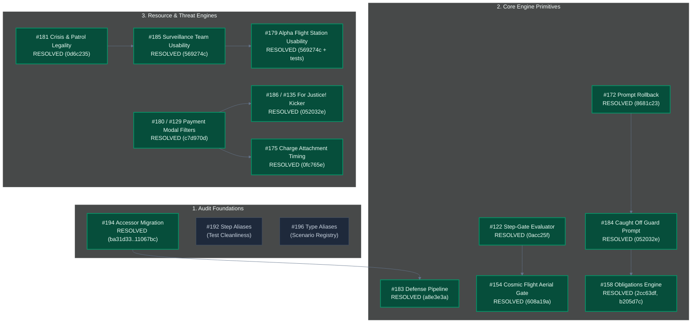

# MCD Backlog Dependency, Prioritization Map & Teamwork Status

> **Last Updated:** 2026-10-03 (#194 resolved)  
> **Repository Commit:** `11067bc` (local `main`, plus the #194 closing commit)  
> **Release Gate:** Gate 1 ("Rhino Release" Vertical Slice — 100% Core 5 Heroes vs. Rhino)  
> **Verification Status:** 🟢 All 1,665 tests passing (0 failed, 0 skipped), 0 TS diagnostics, 0 ESLint warnings

---

## 1. Executive Summary

A comprehensive dependency and risk mapping was performed on all 19 open issues in the primary backlog scope (#172–#202+) as well as cross-cutting connected backlog issues (#100, #109, #122, #126, #127, #129, #132, #135, #154, #158, #161).

The backlog partitions cleanly into three distinct domains:
1. **Engine Primitives (8 issues):** Core combat pipeline mechanics, interactive decision prompt rollbacks, generic cost-and-resource validation, threat legality checks, and type-safe architecture foundations.
2. **Card Fixes (6 issues):** Declarative supplemental data modeling in `src/data/supplemental/pack/` for hero abilities, encounter attachments, and cost kickers.
3. **UI & Refactors (10 issues):** Board action modal filtering, button enabled/disabled state consistency, comic pop-art z-indexing, test hygiene (`act(...)` warnings), dead-code elimination, and code audit cleanups.

---

## 2. Dependency Graph




---

## 3. Domain Classification & Issue Breakdown

### Domain A: Engine Primitives (Core Rules & Framework)

| Issue # | Title | Core Mechanic / Target Area | Status & Fix Strategy |
|---|---|---|---|
| **#183** | **Spider-Man defense not reducing incoming damage** | Combat Pipeline: Step 3 `DECLARE_DEFENDER` -> Step 6 damage mitigation in `combat-pipeline.ts` & `action-dispatcher.ts`. | 🟢 **Closed** (`a8e3e3a`). Preserved DEF reduction across prompt suspensions. |
| **#172** | **Cancelled prompt loses card from hand** | Prompt Queue & Card Lifecycle: Hand-card splicing in `PLAY_CARD` / `PLAY_CARD_FROM_ZONE` before modal choice. | 🟢 **Closed** (`8681c23`). Implemented `cancel_target` / `pass` refund back to hand. |
| **#184** | **Caught Off Guard (01188) choice prompt** | Encounter Resolution: When Revealed effect discards upgrade/support. | 🟢 **Closed** (`052032e`). Enqueues player choice modal when 2+ cards exist in tableau. |
| **#181** | **Surveillance Team Crisis icon threat bypass** | Threat Pipeline & Legality: `threat-pipeline.ts` and `effects/index.ts`. | 🟢 **Closed** (`0d6c235`). Enforces Crisis icon and Patrol minion blocks in `CHOSEN_SCHEME`. |
| **#186** | **For Justice! (01060) Mental resource bonus** | Cost Engine & Dynamic Formulas: `context.resourcesSpent` propagation. | 🟢 **Closed** (`052032e`). Added `PAID_WITH_RESOURCE` / `RESOURCES_SPENT` dynamicBonus, purged `bonusWithMental`. |
| **#194** | **Replace state.villain/mainScheme legacy pointers [AUD-F003]** | Architecture & State: about 520 references to legacy singleton pointers `state.villain` and `state.mainScheme`. | 🟢 **Resolved** (`ba31d33`, `09c80bd`, `1c8a74f`, `a3fc747`, `11067bc`). `villains[]` / `mainSchemes[]` plus `activeVillainId` are canonical, accessors and setters in `models/state.ts`, legacy fields `@deprecated` (ADR-0076). Follow-ups: #215 (field removal), #210-#214 (Wrecking Crew prerequisites). |
| **#122** | **Extract shared step-gate evaluator** | Pipeline Unification: Unifies ability step gating (`TARGET_TRAIT_MATCH`, conditions) between effect execution and CONSTANT stat/trait loop. | 🟢 **Resolved** (`0acc25f`). `evaluateStepGate` shared by the effect pipeline and the CONSTANT stat loop (ADR-0019 addendum). |
| **#202** | **Tighten customActionHandlers action:any [AUD-OQ-04]** | Type Safety: Discriminated union contract for custom scenario plugin action handlers in `ScenarioPlugin`. | 🟡 **Open**. Type safety enhancement. |

---

### Domain B: Card Fixes (Supplemental Data & Declarative Modeling)

| Issue # | Title | Target File / Code | Problem Statement & Fix Strategy |
|---|---|---|---|
| **#175** | **Charge (01099)** | `core_encounter.json` (`01098`, `01099`, `01100`) | 🟢 **Resolved** (`0fc765e`). Removed the `WHEN_REVEALED` attach ability from the three Rhino attachments; the engine attaches intrinsically (data-only fix). |
| **#154** | **Cosmic Flight Aerial trait in Alter-Ego** | `core.json` (`01017`) | 🟢 **Resolved** (`608a19a`). ADD_TRAIT honors gates; `01017` gated with `IF_FORM: hero`. |
| **#158** | **Family Emergency (01175)** | `core_encounter.json` (`01175`) | 🟢 **Resolved** (`2cc63df`, `b205d7c`). All five core obligations integrated: `PlayerState.obligations` zone, hero-set default recipient + optional `recipient` override (proof card `56128b`), `ENTERS_PLAY` resolution ability with `PLAYER_CHOICE` option `gate`/`cost`, `REMOVE_FROM_GAME`, `ADD_ACCELERATION`, `ALL_CONTROLLED_TABLEAU` + `filter` (ADR-0075). |
| **#133** | **Hydra Bomber (01110)** | `core_encounter.json` (`01110`) | Deals 2 damage to all heroes instead of engaging player's hero. Scoping parameter needs adjustment in supplemental data. |
| **#131** | **Rocket Boots (01039)** | `core.json` (`01039`) | Iron Man upgrade: +1 HP and Aerial trait generation. Needs supplemental audit to verify constant HP bonus and active ability. |

---

### Domain C: UI & Code Refactors (Visuals, Test Hygiene & Architecture)

| Issue # | Title | Primary Files | Problem Statement & Remediations |
|---|---|---|---|
| **#185** | **Surveillance Team (01064) modal opens with no threat** | `HeroZone.tsx`, `TableauActionModal.tsx`, `tableau-card-legality.ts` | 🟢 **Resolved** (`569274c`). Tableau cards whose Action/Resource abilities fail `canInitiateAbility` are grayed and non-clickable (ADR-0074). |
| **#179** | **Alpha Flight Station (01015) active on empty hand** | `tableau-card-legality.ts`, `HeroZone.tsx` | 🟢 **Resolved**. Covered by the #185 fix (`569274c`, ADR-0074); regression tests added. |
| **#180** / **#129** | **Captain Marvel Rechannel & Rhino Attachment payment filtering** | `CardPaymentModal.tsx`, `payment-eligibility.ts` | 🟢 **Resolved** (`c7d970d`). Modal disables hand cards/generators that cannot pay a typed cost (ADR-0072 addendum). |
| **#161** | **Hero exhausted card layering behind health bar** | `HeroZone.tsx`, CSS/z-index | When hero rotates on exhaustion, the rotated card frame overlaps HUD stats and health bar. Adjust z-index stacking context. |
| **#192** | **Remove villain-phase step aliases in tests [AUD-F001]** | `villain-phase.ts`, test files | Migrate deprecated exports `step2_villainActivations`, `step4_dealEncounterCards`, `step5_revealEncounterCards` to canonical names. |
| **#195** | **Fix mismatched log key step4->step3 [AUD-F004]** | `villain-phase.ts:305`, `locales/` | Log key `'villainPhase.step4.encounterCardsDealt'` emitted in Step 3. Change to `'villainPhase.step3.encounterCardsDealt'`. |
| **#196** | **Remove ambiguous ScenarioDefinition alias [AUD-F005]** | `catalog.ts:71` | Remove re-export alias `ScenarioDefinition = LegacyScenarioDefinition` from `catalog.ts`. |
| **#197** | **Remove dead isFacedown probes in CardView [AUD-F006]** | `CardView.tsx:80–82` | Remove dead `(instance as any)?.isFacedown` fallback checks. |
| **#198** | **Remove dead raw field fallbacks in PlayerHandTray [AUD-F007]** | `PlayerHandTray.tsx:41–89` | Remove dead MarvelCDB raw field aliases (`faction_code`, `type_code`, `set_code`). |
| **#199** | **act(...) warnings on CardView image tests [AUD-OQ-01]** | `CardView.tsx`, test renders | Wrap async test renders with `act()` or use RTL `waitFor` to eliminate console warning spam. |
| **#200** | **Main JS bundle exceeds 500 kB [AUD-OQ-02]** | `vite.config.ts`, `App.tsx` | Evaluate route lazy loading for `ScenarioSelector`, `MulliganScreen`, and `GameBoard`. |
| **#201** | **normalizeCardCodeForArt dead export [AUD-OQ-03]** | `card-cache-service.ts` | Verify whether `normalizeCardCodeForArt` is used outside tests; remove if dead. |

---

## 4. Prioritization & Risk Matrix

| Priority | Issue # | Title | Domain | Risk / Blast Radius | Effort | Status |
|---|---|---|---|---|---|---|
| **P0** | **#183** | Spider-Man defense not reducing incoming damage | Engine | High / Core Combat | M | 🟢 **Closed** (`a8e3e3a`) |
| **P1** | **#172** | Cancelled prompt loses card from hand | Engine | Medium / Hand State | S | 🟢 **Closed** (`8681c23`) |
| **P1** | **#181** | Surveillance Team bypasses Crisis icon | Engine | Medium / Threat Engine | S | 🟢 **Closed** (`0d6c235`) |
| **P1** | **#184** | Caught Off Guard lacks player choice prompt | Engine | Medium / Encounter Flow | S | 🟢 **Closed** (`052032e`) |
| **P1** | **#186** | For Justice! Mental bonus not applied | Engine/Data | Low / Card Effect | S | 🟢 **Closed** (`052032e`) |
| **P1** | **#135** | Duplicate of For Justice! (#186) | Data | Low / Card Effect | S | 🟢 **Closed** (`052032e`) |
| **P1** | **#180** | Captain Marvel Rechannel resource validation | UI/Engine | Medium / Payment Flow | S | 🟢 **Resolved** (`c7d970d`) |
| **P1** | **#175** | Charge (01099) incorrect When Revealed | Card Data | Low / Supplemental Data | XS | 🟢 **Resolved** (`0fc765e`) |
| **P2** | **#185** | Surveillance Team clickable with no threat | UI/Engine | Low / Board UI | S | 🟢 **Resolved** (`569274c`) |
| **P2** | **#179** | Alpha Flight Station active with empty hand | UI/Engine | Low / Board UI | S | 🟢 **Resolved** (`569274c` + tests) |
| **P2** | **#129** | Discard Rhino attachment allows invalid resources | UI | Low / Payment Modal | S | 🟢 **Resolved** (`c7d970d`) |
| **P2** | **#122** | Extract shared step-gate evaluator | Engine | Medium / Stat Calculator | M | 🟢 **Resolved** (`0acc25f`) |
| **P2** | **#154** | Cosmic Flight Aerial trait active in Alter-Ego | Card Data | Low / Trait Engine | S | 🟢 **Resolved** (`608a19a`) |
| **P2** | **#194** | Replace state.villain legacy pointers [AUD-F003] | Engine | High / ~520 Call Sites | L | 🟢 **Resolved** (`ba31d33`..`11067bc`) |
| **P3** | **#210-#215** | Multi-villain follow-ups for MC03 Wrecking Crew (encounter decks, side schemes and scheme threat, targeting/Guard/win, active counter effects, scenario plugin, legacy field removal) | Engine/Data | Medium | M-L | 🟡 **Open** (no immediate impact) |
| **P3** | **#216** | STAT_VALUE DAMAGE reads nonexistent villain/minion `damage` | Engine | Low | XS | 🟡 **Open** |
| **P3** | **#217** | Flaky obligation rule 2 test (shuffle-dependent) | Tests | Low | XS | 🟡 **Open** |
| **P3** | **#192** | Remove villain-phase step aliases in tests [AUD-F001] | Refactor | Low / Tests Only | S | 🟢 **Resolved** (Phase 4 group A) |
| **P3** | **#195** | Fix mismatched log key step4->step3 [AUD-F004] | Refactor | Low / Log Locale | XS | 🟢 **Resolved** (Phase 4 group A) |
| **P3** | **#196** | Remove ambiguous ScenarioDefinition alias [AUD-F005] | Refactor | Low / Catalog Types | XS | 🟢 **Resolved** (Phase 4 group A) |
| **P3** | **#197** | Remove dead isFacedown probes in CardView [AUD-F006] | Refactor | Low / UI Only | XS | 🟢 **Resolved** (Phase 4 group A) |
| **P3** | **#198** | Remove dead raw field fallbacks in PlayerHandTray [AUD-F007] | Refactor | Low / UI Only | XS | 🟢 **Resolved** (Phase 4 group A) |
| **P3** | **#161** | Exhausted hero card layering behind health bar | UI | Low / CSS Stacking | XS | 🟢 **Resolved** (Phase 4 group B) |
| **P3** | **#199** | act(...) warnings in CardView image tests [AUD-OQ-01] | Refactor | Low / Vitest Output | S | 🟢 **Resolved** (Phase 4 group B) |
| **P3** | **#200** | Main JS bundle exceeds 500 kB [AUD-OQ-02] | UI/Perf | Medium / Bundler | M | 🟢 **Resolved** (Phase 4 group B) |
| **P3** | **#201** | normalizeCardCodeForArt dead export [AUD-OQ-03] | Refactor | Low / Service | XS | 🟢 **Resolved** (Phase 4 group B) |
| **P3** | **#202** | Tighten customActionHandlers action:any [AUD-OQ-04] | Engine | Low / Types | S | 🟢 **Resolved** (Phase 4 group B) |

---

## 5. Execution Roadmap & Phase Plan

### Phase 1: Core Combat & Card Play Flow (Completed ✅)
- ✅ **#183** (Spider-Man defense damage mitigation in combat pipeline)
- ✅ **#172** (Voluntary decision prompt cancellation & hand refund)
- ✅ **#181** (Scheme targeting Crisis icon & Patrol legality)
- ✅ **#184** (Caught Off Guard player choice modal)
- ✅ **#186 / #135** (For Justice! declarative resource payment kicker)

### Phase 2: Ability Usability & Action Legality Pre-checks (Completed ✅)
- ✅ **#185**: *Surveillance Team* (`01064`) — gray out action when total removable threat across legal schemes is 0.
- ✅ **#179**: *Alpha Flight Station* (`01015`) — gray out action when hand is empty.
- ✅ **#180 / #129**: *Captain Marvel* (`01010a` Rechannel) & Rhino attachment — payment modal resource type enforcement.
- ✅ **#175**: *Charge* (`01099`) — change attachment timing from When Revealed to constant attachment.

### Phase 3: Architectural Foundation & Shared Gating (Active 🎯)
- ✅ **#122**: Shared step-gate evaluator extracted.
- ✅ **#154**: Gate Cosmic Flight *Aerial* trait on Hero form.
- ✅ **#158**: Obligation engine for the five core obligations (zone, recipient, ability-based resolution).
  - Deferred follow-up: **#208** (player-deck obligations go to the play area on draw; depends on #158).
  - Deferred follow-up: **#209** (conditional encounter attachments, "Attach to X. Otherwise …", 42 cards; independent of #158).
- ✅ **#194**: Migration of the legacy `state.villain` / `state.mainScheme` pointers to accessor helpers (7 batches, ADR-0076).
  - Deferred follow-ups for Wrecking Crew (MC03): **#210** (per-villain encounter decks), **#211** (side schemes and scheme threat), **#212** (multi-villain targeting, Guard, win), **#213** (active counter effects), **#214** (scenario plugin and data), **#215** (remove the legacy fields and migrate test fixtures).

### Phase 4: Code Audit Cleanups & Polish
- ✅ **#192, #195, #196, #197, #198**: Removed dead aliases, fixed the log key, and eliminated dead `as any` probes (plan: `plan_phase4_audit_cleanups_a.md`).
- ✅ **#161, #199, #200, #201, #202**: UI layering fix, #199 closed as not reproducible, lazy-loaded screens (main chunk 1,230 kB to 860 kB), removal of two unused exports (plan: `plan_phase4_audit_cleanups_b.md`). Phase 4 is complete.

---

## 6. Handoff Protocol for Resuming Agents & Developers

1. **Verify Clean Working Tree:**
   ```powershell
   rtk git pull origin main
   rtk npm test
   ```
2. **Select Active Target:**
   - Phase 4 is complete. Next candidate chain: the open Core Set card bugs #131, #132, #133 (Gate 1 release gate), or #207 (Wakanda Forever sequence).
3. **Follow Standard TDD & Quality Gates:**
   - Author reproduction test in `tests/engine/` or `tests/ui/`.
   - Implement declarative data / generic engine logic.
   - Run: `rtk npm test -- <test_file>`, `rtk npm run typecheck`, `rtk npm run lint`.
4. **Delivery:**
   - Update `CHANGELOG.md` under `[Unreleased]` and update status in this document.
   - Run `/commit-and-push` when approved.
