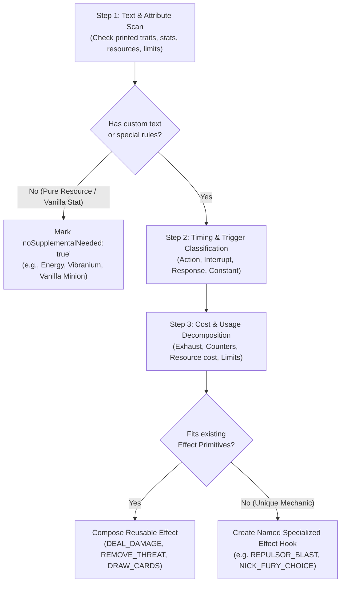

# ADR-0008: Declarative Card Ability & Effect Enrichment Architecture

## Status
Accepted (Updated with Card Analysis Methodology, Scanned-Only Policy & `noSupplementalNeeded` Signal)

## Context
As the engine grows to support hundreds of Marvel Champions cards, hardcoding card IDs (e.g. `if (player.card.code === '01001a')`) directly into the rules engine loops creates tight coupling, severe duplication, and unmaintainable code.

Many cards share identical or parameterized mechanics:
* Drawing cards upon a trigger condition (e.g. *Spider-Sense*, *Avengers Mansion*, *One-Two Punch*).
* Preventing attack damage (e.g. *Backflip*, *Side Step*, *Energy Barrier*).
* Dealing damage to enemies with keywords/tags (e.g. *Swinging Web Kick*, *Haymaker*, *Shield Toss*).
* Healing damage via actions (e.g. *Aunt May*, *First Aid*, *Med Team*).
* Resource generation via counters or tapping (e.g. *Web-Shooter*, *Helicarrier*, *Enhanced Reflexes*).

### The Inherent Complexity of Card Text (Why Pure Automation Fails)
Card game natural language rules cannot be 100% reliably parsed via generic regex or heuristic algorithms. The permutations and nuances of wording across hundreds of cards are virtually infinite:
* Subtle timing distinctions (*Interrupt* vs *Forced Interrupt* vs *Response* vs *Forced Response* vs *Constant*).
* Implicit vs explicit costs (*"Exhaust and spend 1 [mental]"* vs *"Take 1 damage to draw 1 card"*).
* Replacement effects (*"When damage would be dealt... prevent it instead"*).
* Unique card-specific mini-games (*Repulsor Blast discarding top 5 cards and counting Energy icons, Nick Fury choosing from 3 distinct branches, Wakanda Forever executing all upgrades in player-chosen order*).

Therefore, card enrichment requires an **expert human analysis process** that decomposes each card into structured, declarative metadata while reusing shared effect primitives whenever possible.

---

## Decision

We establish a **data-driven ability architecture with strict scanning criteria, a formal card analysis methodology, and runtime missing-supplemental validation**:

### 1. Supplemental Declarative Pack Data (`src/data/supplemental/pack/`)

Supplemental files mirror the upstream **zzorba pack datasets** 1-to-1:

```
src/data/supplemental/
├── index.ts                     # Aggregates and exports supplementalRegistry
└── pack/
    ├── core.json                # Supplemental data for scanned core player cards
    ├── core_encounter.json      # Supplemental data for scanned core encounter sets
    ├── goblin.json              # Future scenario pack supplemental
    └── ...
```

---

### 2. The 4-Step Card Analysis & Enrichment Methodology

When a card is scanned and prepared for engine support, it is evaluated through the following 4-step protocol:



#### Step 1: Text & Attribute Scan (Determine if Supplemental is Needed)
* Check printed attributes: `traits`, `resource_*`, `deck_limit`, `thwart`, `attack`, `defense`, `health`, `cost`.
* **If the card operates 100% on printed stats without rules text or triggers** (e.g. *Energy*, *Genius*, *Strength*, *Energy Absorption*, *Vibranium*, or vanilla schemes/minions), mark `"noSupplementalNeeded": true`.
* **If the card has action text, triggered responses, continuous stat buffs, or counters**, proceed to Step 2.

#### Step 2: Timing Window & Trigger Classification
* Extract the timing keyword:
  * `ACTION` / `HERO_ACTION` / `ALTER_EGO_ACTION`: Activated during the player's turn.
  * `INTERRUPT` / `HERO_INTERRUPT` / `FORCED_INTERRUPT`: Triggers immediately before or during an event (e.g. `VILLAIN_INITIATES_ATTACK`, `TAKE_ATTACK_DAMAGE`, `TREACHERY_REVEALED`).
  * `RESPONSE` / `FORCED_RESPONSE`: Triggers immediately after an event (e.g. `CARD_PLAYED`, `MINION_DEFEATED`, `FORM_CHANGED_TO_HERO`).
  * `CONSTANT`: Passive continuous effect active while the card is in play (e.g. stat bonuses, trait grants, ally limit increases).
  * `RESOURCE`: Activated specifically during resource payment windows (e.g. *Scientist*, *Web-Shooter*, *Pepper Potts*).
  * `SPECIAL`: Triggered indirectly by other cards (e.g. *Wakanda Forever!* executing Black Panther upgrades).

#### Step 3: Cost, Limits & Usage Mechanics Decomposition
* Deconstruct activation costs and constraints:
  * `exhaustSelf`: Card must be ready and exhausts upon activation.
  * `discardSelf`: Card is discarded as part of the cost.
  * `removeCounter`: Decrements counters from `uses` (e.g. *Web-Shooter*, *Tac Team*, *Hawkeye*, *Med Team*).
  * `resourceCost`: Specific printed resource required (e.g. spend 1 [mental]).
  * `limit`: Frequency constraint (`ONCE_PER_ROUND` or `ONCE_PER_PHASE`).
  * `uses`: Configures initial counter capacity, counter type, and whether to discard on empty.

#### Step 4: Effect Composition & Reusability Decision
* **Reusable Primitives:** If the effect maps to a standard game action, use a shared primitive with parameters:
  * `DEAL_DAMAGE` (`amount`, `target`, `tags: ["ATTACK"]`)
  * `REMOVE_THREAT` (`amount`, `target`, `tags: ["THWART"]`)
  * `DRAW_CARDS` (`count`, `target`)
  * `HEAL_DAMAGE` (`amount`, `target`)
  * `ADD_STATUS` (`status: "STUNNED" | "CONFUSED" | "TOUGH"`, `target`)
  * `PREVENT_DAMAGE` (`amount`)
  * `GENERATE_RESOURCE` (`resource`, `amount`)
  * `READY_CHARACTER` (`target`)
* **Unique Specialized Effects:** If the card introduces a distinct bespoke mechanic that cannot be composed via primitives, assign a dedicated specialized effect identifier (e.g. `REPULSOR_BLAST_DAMAGE`, `NICK_FURY_CHOICE`, `TRIGGER_WAKANDA_UPGRADES`, `DOUBLE_RESOURCE_FOR_ASPECT`) and implement its handler in the engine.

---

### 3. Scanned Cards Policy & Explicit `noSupplementalNeeded` Signal

**Cards are ONLY added to supplemental files if they have been actively scanned and evaluated.**

* **Scanned Card with Custom Abilities:** Stores declarative `abilities` (and optional `uses` counters or `isLandscape`).
* **Scanned Card with Standard Rules:** Stores an explicit `"noSupplementalNeeded": true` signal confirming it was scanned and requires no custom rules hooks.
* **Unscanned Card:** Is **omitted entirely** from the supplemental files.

```typescript
export interface CardEnrichment {
  noSupplementalNeeded?: boolean;
  cardName?: string;
  comment?: string;
  isLandscape?: boolean;
  uses?: CardUsesDefinition;
  abilities?: CardAbility[];
}
```

#### Example 1: Enriched Card with Custom Abilities
```json
"01001a": {
  "comment": "Hero Identity: When villain initiates an attack against you, draw 1 card.",
  "abilities": [
    {
      "id": "spider_sense",
      "timing": "INTERRUPT",
      "trigger": "VILLAIN_INITIATES_ATTACK",
      "effect": "DRAW_CARDS",
      "params": { "count": 1, "target": "SELF" }
    }
  ]
}
```

#### Example 2: Evaluated Standard Card (No Supplemental Needed)
```json
"01088": {
  "noSupplementalNeeded": true
}
```

---

### 4. Strict Engine Safety: Missing Supplemental Error

The rules engine strictly enforces that **any card loaded or instantiated into a live game MUST have a corresponding supplemental entry**.

If a card is not present in `supplementalRegistry`, the engine throws an error immediately:
```
Error: Supplemental data is missing for card <CODE> (<NAME>)
```
This guarantees that no unscanned card can silently enter a game and cause runtime bugs or missing triggers.

---

## Consequences

### Positive:
* **Structured, Repeatable Process:** A formal 4-step methodology ensures every card added to MCD is decomposed accurately and consistently.
* **Fail-Safe Game Setup:** Attempting to play or load an unscanned card immediately halts with a descriptive error (`"Supplemental data is missing for card..."`).
* **Maximum Code Reusability:** Standard effects share generic primitives (`DEAL_DAMAGE`, `REMOVE_THREAT`, etc.) while complex cards receive clean dedicated hooks.
* **No False Positives:** `"noSupplementalNeeded": true` is strictly reserved for verified standard/resource cards.
