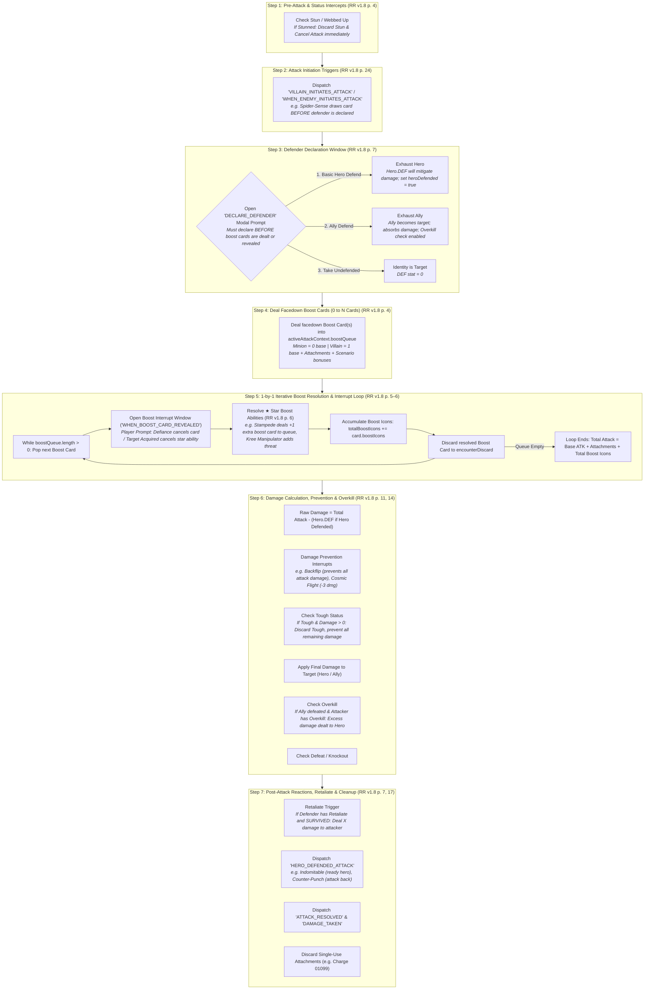

# [ADR-0031] Comprehensive Combat, Enemy Attack & Multi-Window Defense Pipeline

* **Status:** Accepted
* **Date:** 2026-08-31
* **Authors:** MCD Core Team
* **Deciders:** User & Antigravity

---

## Context and Problem Statement
In *Marvel Champions: The Card Game* (Rules Reference v1.8 p. 4 "Attack", p. 7 "Defend, Defense", p. 11 "Damage"), combat is not a simple integer subtraction (`player.health -= attack`). Rather, an enemy attack is a multi-step interactive state machine spanning **5 distinct timing windows**, supporting **Basic Hero/Ally Defense**, **Defense Events**, **In-Play Defense Upgrades**, **Boost Cancellations**, **Damage Prevention**, **Overkill**, **Retaliate**, and **Post-Defense Reactions**.

Previously, the MCD rules engine bypassed the entire defense subsystem:
1. `player.hero.defense` was never subtracted from incoming attacks.
2. Players could not exhaust a ready Hero or Ally to defend.
3. Defense Events (e.g. *Backflip* `01003`) and Defense Responses (e.g. *Indomitable* `01082`, *Counter-Punch* `01077`) lacked formal trigger windows.
4. Direct damage from treacheries and hazards was not formally distinguished from attack damage.

How should we design a complete, rules-accurate, and headless-decoupled Combat & Defense Pipeline that supports all 103+ defense-related cards in the Marvel Champions catalog?

---

## Decision Drivers
* **Driver 1: Official Rules Authority (RR v1.8 p. 4, 7, 11, 24):** Exact compliance with the 4-step enemy attack sequence, defense keyword invariants, overkill routing, and boost timing.
* **Driver 2: Direct Damage Invariant:** Strictly separate *Attack Damage* (defendable with DEF, ally blocks, and attack defense cards) from *Direct / Indirect Damage* (non-attack; DEF and attack defense cards forbidden).
* **Driver 3: Decoupled Headless Engine (ADR-0002):** Support interactive UI prompts (`DECLARE_DEFENDER`) while enabling deterministic automated policies for headless test simulations.
* **Driver 4: Complete Zzorba Catalog Compatibility:** Provide native trigger hooks for all 5 timing windows represented across 103 defense cards in the upstream data packs.

---

## Considered Options
1. **Option 1 (Ad-Hoc Damage Modifiers):** Keep direct state mutation in `villain-phase.ts` and add card-specific `if/else` checks for Backflip and DEF.
2. **Option 2 (5-Phase Reactive Combat State Machine):** Formally model enemy attacks as a 5-phase event pipeline (`AttackExecutionContext`) with discrete trigger windows and interactive prompt delegation.

---

## Decision Outcome

**Chosen Option:** **Option 2: 5-Phase Reactive Combat State Machine**

### The 7-Step Reactive Combat State Machine

---

## Detailed Rules Specifications

### 1. The `(defense)` Trait Invariant (RR v1.8 p. 7)
* Playing any event labeled `(defense)` or triggering an in-play ability labeled `(defense)` automatically designates that player's hero as the **Defender** for that attack (unless an ally was already declared as defender).
* The hero is considered to have **defended the attack** (setting `attackContext.heroDefended = true`), satisfying prerequisite timing for *Indomitable*, *Counter-Punch*, and *Unflappable*.

### 2. Direct Damage vs. Attack Damage Invariant
* **Attack Damage:** Originates from enemy attack activations (Villain/Minion). Enables Hero DEF subtraction, Ally blocking, and attack-specific defense cards (*Backflip*, *Expert Defense*, *Never Back Down*).
* **Direct / Indirect Damage:** Originates from encounter cards (e.g. *Explosion* `01111`, *Hydra Bomber* `01108`, hazard icons) or consequential damage.
  - **Hero DEF CANNOT be used (0 DEF).**
  - **Allies CANNOT block.**
  - **Attack-specific defense cards (`"from an attack"`) are ILLEGAL to play.**
  - **Universal damage-prevention cards** (e.g. *Cosmic Flight* `01017` *"When Captain Marvel would take damage"*, *Forcefield*, or *Tough* status cards) remain fully functional.

### 3. Dual-Mode Execution Architecture
* **Interactive Mode:** Enqueues `DECLARE_DEFENDER` and `DEFENSE_INTERRUPT` prompts into `pendingDecisionQueue`.
* **Headless Simulation Mode:** Evaluates an automated defense policy (`NEVER_DEFEND`, `HERO_ALWAYS`, `ALLY_CHUMP_BLOCK`, or `HEURISTIC_OPTIMAL`) to run deterministic headless simulations at thousands of games per second.

---

## Consequences

### Positive Consequences
* Fully unlocks and implements 8+ Core Set cards (*Backflip*, *Cosmic Flight*, *Indomitable*, *Counter-Punch*, *Armored Vest*, *Get Behind Me!*, *Great Responsibility*, and all Ally blockers).
* Establishes permanent architecture for 103+ defense cards across all 170 official expansion packs.
* Prevents damage-related regressions by routing all attacks through a single deterministic combat pipeline.
