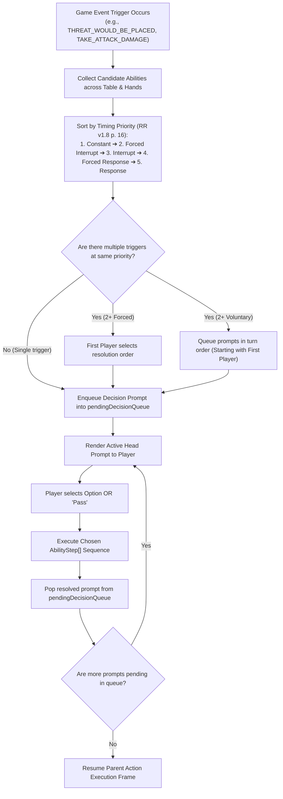

# [ADR-0032] Universal Resolution Stack, Decision Prompt Queue & Nested Interrupt Pipeline

* **Status:** Accepted
* **Date:** 2026-08-31
* **Authors:** MCD Core Team
* **Deciders:** User & Antigravity

---

## Context and Problem Statement
In *Marvel Champions: The Card Game* (Rules Reference v1.8 p. 16 "Priority of Timing", p. 24 "Triggered Abilities"), card abilities trigger during nested timing windows inside ongoing actions:
* **Interrupts:** Trigger *before* a triggering condition completes, allowing players to modify, cancel, or redirect the triggering event (e.g., *Great Responsibility* `01061`, *Get Behind Me!* `01078`, *Backflip* `01003`, *Emergency* `01085`).
* **Responses:** Trigger *after* a triggering condition resolves (e.g., *Counter-Punch* `01077`, *Indomitable* `01082`, *Chase Them Down* `01052`).
* **Simultaneous Triggers:** When multiple abilities trigger at the exact same timing point, RR v1.8 p. 16 dictates strict resolution priority:
  $$\text{Constant Abilities} \longrightarrow \text{Forced Interrupts} \longrightarrow \text{Interrupts} \longrightarrow \text{Forced Responses} \longrightarrow \text{Responses}$$
  *(With the First Player deciding the resolution order among abilities of the same priority level).*

Across all 170 official MarvelsDB / Zzorba packs, there are **318 Interrupt cards** and **451 Response cards**. 

Currently, the MCD engine uses a single `state.pendingDecisionPrompt: PendingDecisionPrompt | undefined` field and synchronous linear effect dispatch. If an interrupt triggers inside an ongoing action that itself spawned a prompt (or in multiplayer when 2+ players both have valid reaction windows), the second prompt overwrites the first prompt, causing state corruption and lost decision frames.

How should we design a rock-solid, fully serializable, and deterministic Resolution Stack & Decision Prompt Queue?

---

## Decision Drivers
* **Driver 1: Exact Rules Precision (RR v1.8 p. 16, 24):** Guarantee strict priority ordering and first-player resolution choice for simultaneous triggers.
* **Driver 2: Zero Prompt Overwrites (Queue Integrity):** Support nested decisions (e.g., *Tony Stark Futurist* scrying prompt nested inside a round turn, or multiplayer defense prompts) without state loss.
* **Driver 3: Headless & Interactive Decoupling (ADR-0002):** Support interactive human modal rendering while allowing automated heuristic resolution for headless test simulations.
* **Driver 4: Complete State Serializability:** Ensure the entire execution stack and prompt queue can be serialized to JSON for save games, action replays, and undo/redo.

---

## Considered Options

### Option 1: JavaScript Coroutines / Async Generators (`yield Prompt`)
Pause the engine loop using async/await or generator functions (`function* runAction() { yield prompt; }`).
* **Pros:** Mimics linear programming style in code.
* **Cons:**
  * Cannot be serialized to JSON (closures and generator iterators cannot be saved or transmitted over WebRTC).
  * Makes headless deterministic simulation and automated unit testing complex and flaky.
  * Violates our pure state machine principle (ADR-0002).

### Option 2: Frame-Based Execution Stack & Multi-Prompt Queue (`ExecutionStack` & `pendingDecisionQueue`) (Chosen)
Model game execution via an explicit stack of `ExecutionFrame` records and a FIFO/LIFO `pendingDecisionQueue: PendingDecisionPrompt[]` on `GameState`.
* **Pros:**
  * 100% pure, deterministic, and serializable to JSON at any micro-step.
  * Native support for prompt queuing across multiplayer seats.
  * Explicit "Pass / Do Nothing" options for voluntary reaction windows.
  * Headless agents can pop and answer prompts deterministically in automated Monte Carlo simulations.
* **Cons:**
  * Requires explicit frame management and prompt resolution dispatchers in `src/engine/pipeline/`.

### Option 3: Event-Emitter Pub/Sub with Asynchronous Callbacks
Use an in-memory Node.js / Browser `EventEmitter` with listener callbacks.
* **Pros:** Familiar decoupled event syntax.
* **Cons:**
  * Asynchronous callback race conditions.
  * Not serializable or deterministic.
  * Hard to inspect in audit logs or step-by-step game history.

---

## Decision Outcome

**Chosen Option:** **Option 2: Frame-Based Execution Stack & Multi-Prompt Queue (`pendingDecisionQueue`)**

### 🏗️ Proposed Architecture Specifications



### 1. The Prompt Queue Model (`GameState`)
```typescript
export interface GameState {
  // Structured FIFO prompt queue replacing single pendingDecisionPrompt
  pendingDecisionQueue: PendingDecisionPrompt[];
  
  // Active execution call stack for nested resolution
  executionStack: ExecutionFrame[];
}

export interface ExecutionFrame {
  frameId: string;
  sourceCardInstanceId: string;
  triggerEvent: TriggerType;
  remainingSteps: AbilityStep[];
  context: EffectExecutionContext;
  parentFrameId?: string;
}
```

### 2. Voluntary Reactions & Explicit "Pass" Support
Every optional response or interrupt prompt generated for a player includes a standard `[Pass / Do Nothing]` action option. When all players have answered or passed, the execution stack resumes parent action resolution.

---

## Consequences

### Positive Consequences
* Completely resolves all nested prompt collisions and race conditions.
* Unblocks 10+ interrupt/response ambiguity cards (*Great Responsibility*, *Emergency*, *Get Behind Me!*, *One-Two Punch*, *Counter-Punch*, *Energy Channel*, *Black Widow*, etc.).
* Enables multiplayer simultaneous trigger resolution strictly matching Rules Reference v1.8 p. 16.
* 100% serializable state for save/load and replay inspection.
