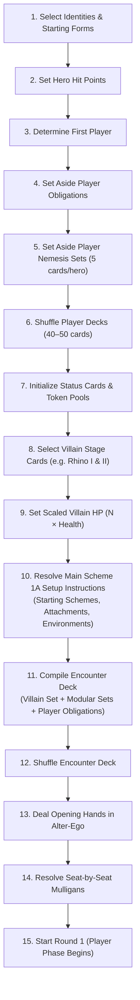
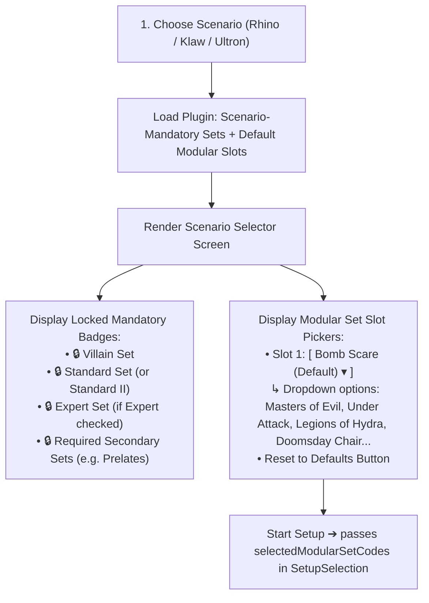

# [ADR-0033] Official 15-Step Scenario Setup Engine & Modular Plugin Pipeline

* **Status:** Proposed
* **Date:** 2026-08-31
* **Authors:** MCD Core Team
* **Deciders:** User & Antigravity

---

## Context and Problem Statement
In *Marvel Champions: The Card Game* (Rules Reference v1.8 p. 27–28 "Appendix I: Setup"), initializing a game requires executing an official **15-step setup protocol** that dynamically compiles player decks, scales villain hit points and scheme target threat based on player seat count ($N = \text{playerCount}$), and executes unique scenario instructions defined on **Main Scheme Stage 1A**.

Across all 170 official MarvelsDB / Zzorba packs, there are **62 distinct Scenario Main Scheme 1A setups** (spanning Rhino, Klaw, Ultron, Green Goblin, Red Skull, Kang, Thanos, Sinister Six, Apocalypse, etc.). These setups include:
* Modular encounter set inclusion (e.g. *Bomb Scare*, *Masters of Evil*, *Legions of Hydra*, *Standard I/II*, *Expert I/II*).
* Starting environment cards (e.g. *Milano*, *Alert Level*, *City Streets*).
* Starting side schemes with base threat calculation (e.g. *Bomb Scare*, *Breakin' & Takin'*).
* Starting villain attachments and stage transitions (e.g. *Armored Rhino Suit*, *Charge*).
* Custom tokens, counters, and auxiliary decks (e.g. *Holding Cell deck*, *Infinity Gauntlet deck*).

Previously, the MCD rules engine initialized scenarios using ad-hoc, imperative TypeScript helper functions in individual test suites (`setupRhinoScenario`). This prevented mixing modular encounter sets, caused duplicate setup code, and made community-created or expansion scenarios impossible to load dynamically.

How should we design a standardized, modular, and 100% data-driven Scenario Setup Pipeline?

---

## Decision Drivers
* **Driver 1: Official Rules Fidelity (RR v1.8 p. 27–28):** Implement the exact 15-step sequence in chronological order.
* **Driver 2: Scenario Plugin Architecture:** Allow scenarios to be declared as modular plugins (`ScenarioPlugin`) that can be loaded, configured, and simulated independently.
* **Driver 3: Strict Encounter Set Taxonomy & Modular Slot Customization:** Distinguish between **Scenario-Mandatory Sets** (Villain set, Standard/Expert set, scenario-required secondary sets) and **Customizable Modular Slots** (where players may replace the recommended default set, e.g. *Bomb Scare*, with other modular sets complying with scenario constraints).
* **Driver 4: Headless Simulation Integration:** Enable instant game creation via `createGame(scenarioConfig, playerConfigs)` for automated headless match testing.

---

## Considered Options

### Option 1: Monolithic Hardcoded Switch-Case (`setupGame(scenarioCode)`)
Hardcode a giant `switch(scenarioCode)` block containing imperative setup logic for each villain.
* **Pros:** Quick to implement for Rhino in isolation.
* **Cons:**
  * Zero extensibility for 62 official scenarios and fan-made custom scenarios.
  * Violates the Open-Closed Principle (SOLID).
  * Hardcodes modular set combinations.

### Option 2: Declarative Scenario Plugin Architecture (`ScenarioPlugin` Interface) (Chosen)
Define a formal `ScenarioPlugin` contract where each scenario defines its metadata, stage scaling, required/recommended modular sets, and declarative Stage 1A setup step hooks.
* **Pros:**
  * Clean, decoupled architecture supporting all 62 official scenarios and custom fan packs.
  * Fully supports hot-swapping modular encounter sets.
  * Provides a single, unified entry point: `createGame(scenarioConfig, playerConfigs)`.
  * Integrates seamlessly with our `PUT_INTO_PLAY` and `SHUFFLE_INTO_DECK` generic zone primitives (ADR-0029).
* **Cons:**
  * Requires authoring scenario definition files in `src/engine/scenarios/`.

### Option 3: Card-Text Scripting Engine
Parse Main Scheme 1A raw text dynamically at runtime to figure out setup steps.
* **Pros:** Theoretical zero-configuration.
* **Cons:**
  * Violates ADR-0019 (Strict Zero Raw-Text Parsing).
  * Highly fragile against translations (i18n) and complex custom rules text.

---

## Decision Outcome

**Chosen Option:** **Option 2: Declarative Scenario Plugin Architecture**

### 🏗️ The 15-Step Setup State Machine (RR v1.8 p. 27–28)



---

### 📦 Encounter Set Taxonomy (RR v1.8 p. 19, 27)

To strictly enforce scenario rules while supporting modular customization, encounter sets are partitioned into two distinct categories:

1. **Scenario-Mandatory Encounter Sets (Fixed & Non-Replaceable):**
   * **Primary Villain Set:** The scenario's core encounter cards (e.g. *Rhino*, *Klaw*, *Ultron*).
   * **Standard Encounter Set:** Mandatory for all games (*Standard I*, *Standard II*, or *Standard III*).
   * **Expert Encounter Set:** Mandatory when difficulty is set to Expert (*Expert I* or *Expert II*).
   * **Scenario-Required Secondary Sets:** Specific secondary sets mandated by the scenario rules (e.g. *Prelates* in Apocalypse, *Temporal* in Kang, *Hydra Patrol* and *Hydra Assault* in Red Skull). These **cannot** be swapped out.
2. **Customizable Modular Slots (Replaceable Defaults):**
   * Defined by the scenario as a required **slot count** (e.g., 1 modular set for Rhino/Klaw/Ultron, 2 for Crossbones, $1 + N$ for Citizen V).
   * Defines a **recommended default set** in parentheses on Main Scheme 1A (e.g. *Bomb Scare* for Rhino, *Masters of Evil* for Klaw, *Under Attack* for Ultron).
   * Players may replace the recommended default with any valid modular encounter set that matches the slot's requirements/filters.

---

### 📋 Scenario Plugin Contract (`src/engine/models/scenarios.ts`)

```typescript
export interface ScenarioPlugin {
  scenarioCode: string;
  name: string;
  difficultyModes: ('standard' | 'expert' | 'heroic')[];
  
  // Non-replaceable encounter sets mandated by scenario rules
  requiredEncounterSets: {
    standardSetCode: string; // 'standard' | 'standard_ii'
    expertSetCode?: string;   // 'expert' | 'expert_ii'
    scenarioSpecificSets?: string[]; // e.g. ['prelates'] or ['hydra_patrol', 'hydra_assault']
  };

  // Modular slot specifications & default recommendations
  modularSlots: {
    slotCount: number | ((playerCount: number) => number);
    recommendedDefaultCodes: string[]; // e.g. ['bomb_scare'] for Rhino, ['masters_of_evil'] for Klaw
    slotFilter?: (encounterSet: ModularEncounterSet) => boolean; // e.g. requires Elite minion
  };
  
  // Dynamic scaling and stage configuration
  getVillainStages(difficulty: 'standard' | 'expert'): CardInstance[];
  getMainSchemeStages(): CardInstance[];
  
  // Main Scheme 1A Declarative Setup Hooks
  resolveStage1ASetup(state: GameState, config: ScenarioConfig): void;
}

export interface ScenarioConfig {
  scenarioPlugin: ScenarioPlugin;
  difficulty: 'standard' | 'expert';
  heroicLevel?: number; // 0 = standard, 1+ = extra encounter cards
  selectedModularSetCodes: string[]; // Must satisfy modularSlots constraints
}
```

---

### 🎨 UI & Presentation Layer: Interactive Modular Set Customizer (`ScenarioSelector.tsx`)

To give players full tactile control over their game setup per official Marvel Champions rules, `ScenarioSelector.tsx` and `SetupSelection` will be updated with an **Encounter Customization Sub-Panel**:



1. **`SetupSelection` Interface Update:**
   ```typescript
   export interface SetupSelection {
     scenarioId: string;
     difficulty: DifficultyMode;
     heroicLevel: number;
     playerCount: number;
     deckIds: string[];
     selectedModularSetCodes: string[]; // Custom modular encounter sets
   }
   ```
2. **Visual Retro Pop-Art Treatment:**
   * **Mandatory Sets:** Displayed with retro black-and-yellow comic badge borders with a locked icon (`🔒 MANDATORY`).
   * **Customizable Slots:** Rendered as interactive Ben-Day halftone selectors showing set icon, card count (e.g. `6 cards`), hazard/boost previews, and a "Defaults" restore trigger.

---

## Consequences

### Positive Consequences
* Completely unifies scenario creation across test suites, interactive UI matches, and headless Monte Carlo simulations.
* Enables mixing and matching all official modular sets across all 3 Core Set villains (Rhino, Klaw, Ultron).
* Centralizes player deck compilation, nemesis set-aside placement, and obligation shuffling in a single tested pipeline.
