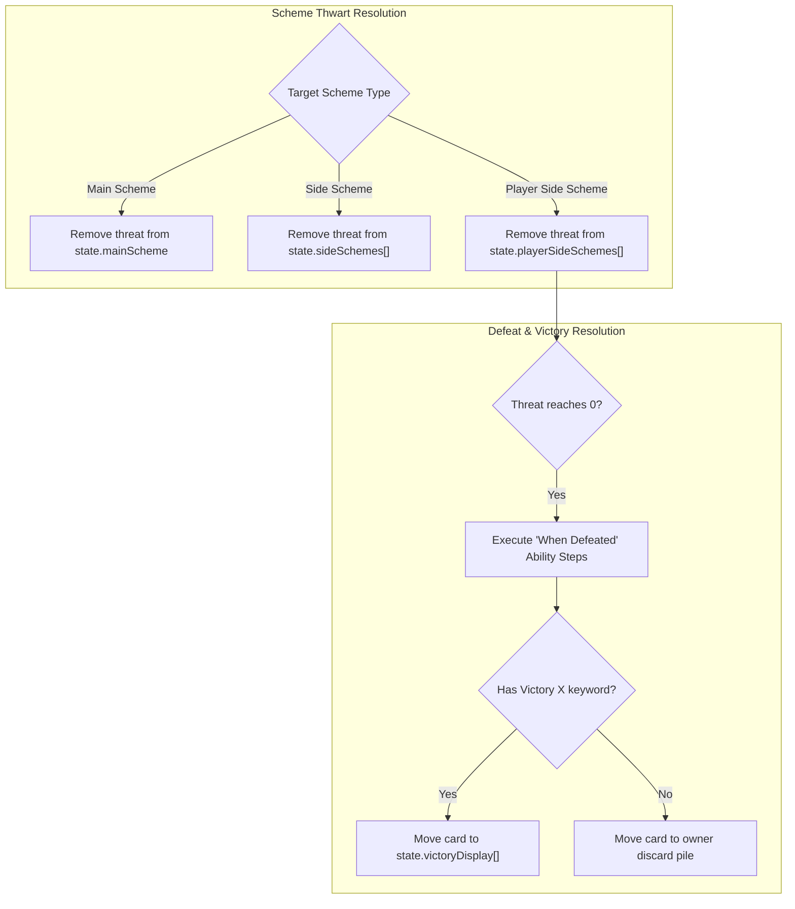

# [ADR-0034] Player Side Schemes, Victory Display & Auxiliary Scenario Decks Architecture

* **Status:** Accepted
* **Date:** 2026-08-31
* **Authors:** MCD Core Team
* **Deciders:** User & Antigravity

---

## Context and Problem Statement
As the game expands beyond the Core Set across official expansions (e.g. *Next Evolution*, *Age of Apocalypse*, *Sinister Motives*, *Mad Titan's Shadow*), new card types and game areas are introduced:
1. **Player Side Schemes (`player_side_scheme` - 35 cards in catalog):** Player cards played during the Player Phase that enter the scheme area with starting threat. When thwarted to 0 threat, they do not discard; they trigger a **"When Defeated"** player reward and enter the **Victory Display**.
2. **Victory Display & Victory Points (RR v1.8 p. 30 "Victory"):** Encounter and player cards with the `Victory X` keyword must be placed in a dedicated `state.victoryDisplay` zone upon defeat rather than their respective discard piles, preventing them from recycling and providing end-game score / trigger counts (e.g. *Cable*, *Plasma Rifle*).
3. **Auxiliary Scenario Decks (RR v1.8 Scenario Rules):** Scenarios such as Thanos (*Infinity Gauntlet Deck*), M.O.D.O.K. (*Holding Cell Deck*), GMW (*Market Deck*), and Agents of S.H.I.E.L.D. (*Evidence Decks*) require distinct face-down draw piles alongside the standard encounter deck.

How should we model these zones, card types, and defeat transitions in the headless engine?

---

## Decision Drivers
* **Driver 1: Official Rules Precision (RR v1.8 p. 26, 30):** Treat Player Side Schemes as legal thwart targets for basic hero thwart, ally thwart, and thwart events (*For Justice!*, *Clear the Area*).
* **Driver 2: Persistent Victory Display Zone:** Ensure defeated victory cards are permanently isolated from draw/discard recycling.
* **Driver 3: Extensible Auxiliary Deck Dictionary:** Avoid hardcoding bespoke deck fields on `GameState` by standardizing on `auxiliaryDecks: Record<string, CardInstance[]>`.

---

## Decision Outcome

**Chosen Option:** **Universal Victory Display & Generic Auxiliary Decks State Architecture**

### 🏗️ State Machine Architecture



### 📋 State Model Extensions (`src/engine/models/state.ts`)

```typescript
export interface GameState {
  // Active player side schemes in play
  playerSideSchemes: CardInstance[];
  
  // Permanent victory display zone for defeated Victory X schemes/minions
  victoryDisplay: CardInstance[];
  
  // Auxiliary scenario decks (e.g., infinity_gauntlet, holding_cell, evidence)
  auxiliaryDecks: Record<string, CardInstance[]>;
  auxiliaryDiscards: Record<string, CardInstance[]>;
}
```

---

## Consequences

### Positive Consequences
* Unlocks all 35 Player Side Scheme cards across expansion packs (*Build Support*, *Superpower Training*, *Call for Backup*).
* Enables full fidelity for campaign scenarios requiring Infinity Gauntlet and Evidence mechanics.
* Prevents Victory cards from incorrectly reshuffling into encounter or player decks.
