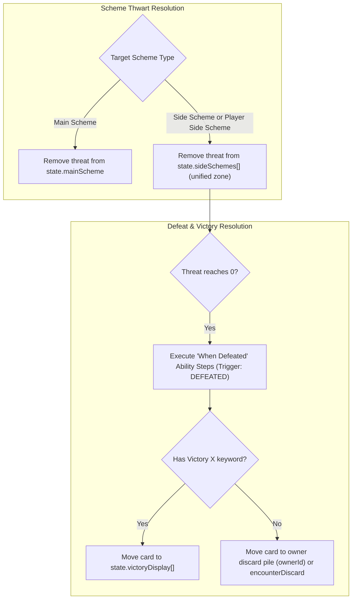

# [ADR-0034] Player Side Schemes, Victory Display & Auxiliary Scenario Decks Architecture

- **Status:** Accepted (Implemented [#34](https://github.com/SteveRodrigue/MCD/issues/34))
* **Date:** 2026-08-31
* **Authors:** MCD Core Team
* **Deciders:** User & Antigravity

---

## Context and Problem Statement
As the game expands beyond the Core Set across official expansions (e.g. *Next Evolution*, *Age of Apocalypse*, *Sinister Motives*, *Mad Titan's Shadow*), new card types and game areas are introduced:
1. **Player Side Schemes (`player_side_scheme` - 35 cards in catalog):** Player cards played during the Player Phase that enter the scheme area with starting threat. When thwarted to 0 threat, they do not discard; they trigger a **"When Defeated"** player reward and enter the **Victory Display**.
2. **Victory Display & Victory Points (RR v1.8 p. 30 "Victory"):** Encounter and player cards with the `Victory X` keyword must be placed in a dedicated `state.victoryDisplay` zone upon defeat rather than their respective discard piles, preventing them from recycling and providing end-game score / trigger counts (e.g. *Cable*, *Plasma Rifle*).
3. **Auxiliary Scenario Decks (RR v1.8 Scenario Rules):** Scenarios such as Thanos (*Infinity Gauntlet Deck*), M.O.D.O.K. (*Holding Cell Deck*), GMW (*Market Deck*), and Agents of S.H.I.E.L.D. (*Evidence Decks*) require distinct face-down draw piles alongside the standard encounter deck.

How should we model these zones, card types, and defeat transitions in the headless engine?

---

## Decision Drivers
* **Driver 1: Official Rules Precision (RR v1.8 p. 26, 30):** Treat Player Side Schemes as legal thwart targets for basic hero thwart, ally thwart, and thwart events (*For Justice!*, *Clear the Area*).
* **Driver 2: Persistent Victory Display Zone:** Ensure defeated victory cards are permanently isolated from draw/discard recycling.
* **Driver 3: Extensible Auxiliary Deck Dictionary:** Avoid hardcoding bespoke deck fields on `GameState` by standardizing on `auxiliaryDecks: Record<string, CardInstance[]>`.

---

## Decision Outcome

**Chosen Option:** **Universal Victory Display & Generic Auxiliary Decks State Architecture**

### 🏗️ State Machine Architecture



### 📋 State Model Extensions (`src/engine/models/state.ts`)

> [!IMPORTANT]
> **Implementation Refinement (2026-09-02):** Player Side Schemes and encounter Side Schemes were unified into the **same** `state.sideSchemes: SideSchemeState[]` array/zone rather than a separate `playerSideSchemes` field, since both already share one visual "Side Scheme area" and one thwart-targeting code path (`targetType: 'side_scheme'`). Each entry gained an optional `ownerId?: string` (set only for player-played schemes) so defeat-without-Victory routes to the owning player's discard pile instead of `encounterDiscard`. This is a pure implementation simplification of the same architectural intent below — no behavior described in this ADR changes.

```typescript
export interface SideSchemeState {
  instanceId: string;
  card: SideSchemeCard | PlayerSideSchemeCard; // distinguished by card.type
  threat: number;
  ownerId?: string; // set when a player played this as a Player Side Scheme
}

export interface GameState {
  sideSchemes: SideSchemeState[]; // shared zone for encounter AND player side schemes

  // Permanent victory display zone for defeated Victory X schemes/minions
  victoryDisplay: CardInstance[];

  // Auxiliary scenario decks (e.g., infinity_gauntlet, holding_cell, evidence)
  auxiliaryDecks: Record<string, CardInstance[]>;
  auxiliaryDiscards: Record<string, CardInstance[]>;
}
```

---

## Consequences

### Positive Consequences
* Unlocks all 35 Player Side Scheme cards across expansion packs (*Build Support*, *Superpower Training*, *Call for Backup*).
* Enables full fidelity for campaign scenarios requiring Infinity Gauntlet and Evidence mechanics.
* Prevents Victory cards from incorrectly reshuffling into encounter or player decks.
* The `moveDefeatedCardToPile()` helper is applied to **every** existing defeat path (minion defeat via basic/ally attack, encounter Side Scheme defeat, Player Side Scheme defeat) instead of only the new Player Side Scheme path, so any future card printed with `Victory X` is routed correctly regardless of how it is defeated.
* As a side effect, this pass also fixed a pre-existing dormant capability: *Highway Robbery* (`01166`) declared a `'DEFEATED'`-triggered "When Defeated" ability that was never dispatched by any pipeline; Side Scheme defeat resolution now executes it.

### Implementation Status Note
* **Zero cards in the currently-loaded Core Set catalog use `player_side_scheme` or the `Victory` keyword** (only Core Set packs are synced per ADR-0006); this delivery is a forward-looking engine capability verified with synthetic test fixtures (`tests/engine/player-side-schemes-and-victory-display.test.ts`), consistent with how ADR-0035/ADR-0036 built primitives ahead of card availability. No `src/data/supplemental/pack/*.json` retrofit was needed or performed.

