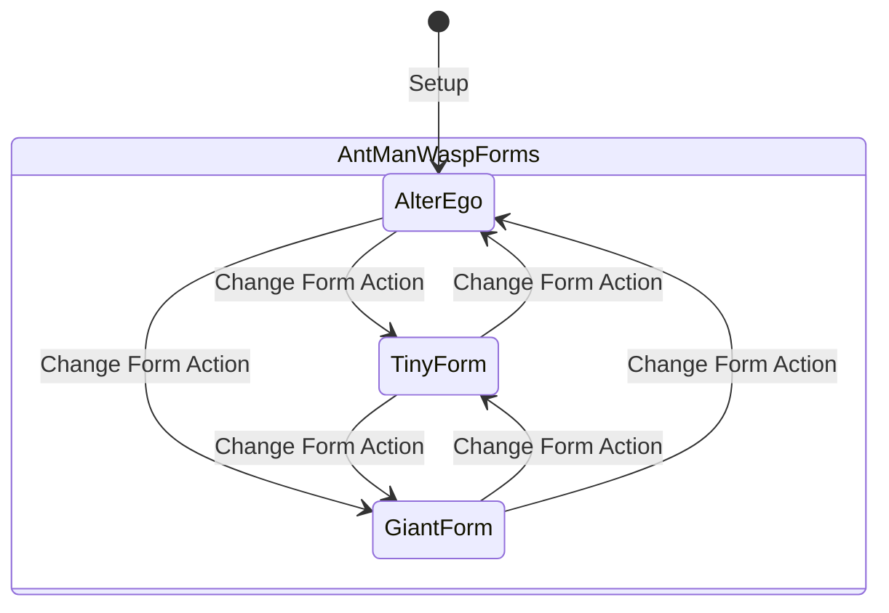

# [ADR-0035] Universal Multi-Form Identities, Mass/Energy States & Generic Counter Engine

* **Status:** Proposed
* **Date:** 2026-08-31
* **Authors:** MCD Core Team
* **Deciders:** User & Antigravity

---

## Context and Problem Statement
Marvel Champions contains several non-binary identity and card state mechanics:
1. **Multi-Form Identities (9 identities in catalog):**
   * *Ant-Man & Wasp:* 3-sided identities (*Tiny*, *Giant*, *Alter-Ego*) where changing to specific hero forms triggers distinct abilities (e.g. dealing damage when entering Giant, removing threat when entering Tiny).
   * *Spectrum:* 3 distinct Energy Form upgrades (*Gamma*, *Photon*, *Pulsar*) modifying basic powers.
   * *Vision & Shadowcat:* Mass form upgrades (*Dense / Intangible*, *Solid / Phased*) granting intangibility, damage immunity, or ATK bonuses.
   * *Ironheart:* Progressive leveling (*Version 1 $\rightarrow$ Version 2 $\rightarrow$ Version 3*).
2. **Universal Counters Subsystem (51 unique counter types in catalog):**
   * Cards enter play with $N$ counters (`Uses (X counters)`: *Charge*, *Ammo*, *Arrow*, *Web*, *Chi*, *Labor*, *Pym*, *Vengeance*, *Time*).
   * Abilities spend or generate counters as costs and effects.

Previously, the identity model assumed a binary `currentForm: 'hero' | 'alter_ego'` toggle, and cards lacked a generic counter dictionary.

How should we design an extensible, data-driven architecture to support arbitrary identity forms and all 51 counter types without hardcoding card-specific fields?

---

## Decision Drivers
* **Driver 1: Open Form Architecture:** Support 2, 3, or $N$ identity forms and persistent form upgrades cleanly on `PlayerState`.
* **Driver 2: Zero Bespoke Counter Fields (ADR-0018):** Never create specific fields like `ammoCounters` or `chargeCounters`. Use a universal `Record<string, number>` map.
* **Driver 3: Form-Change Lifecycle Triggers:** Dispatch discrete `FORM_CHANGED` triggers specifying `previousForm` and `newForm` to activate form-entry responses.

---

## Decision Outcome

**Chosen Option:** **Open Form State Model & Universal `Record<string, number>` Counter Map**

### 🏗️ Multi-Form Architecture



### 📋 Model Specifications (`src/engine/models/state.ts` & `card.ts`)

```typescript
export interface PlayerState {
  // Current active form card instance (e.g. Tiny, Giant, Alter-Ego)
  activeFormCard: CardInstance;
  
  // All available printed form cards for this identity
  availableForms: CardInstance[];
  
  // High-level category for rule checks
  currentFormCategory: 'hero' | 'alter_ego';
  
  // Active mass/energy form attachment (if applicable, e.g. Dense, Intangible, Pulsar)
  activeSubFormCard?: CardInstance;
}

export interface CardInstance {
  instanceId: string;
  card: NormalizedCard;
  exhausted: boolean;
  
  // Universal counter map supporting all 51 counter types (e.g. { charge: 3, ammo: 2, web: 3 })
  counters: Record<string, number>;
}
```

---

## Consequences

### Positive Consequences
* Fully unlocks 3-sided heroes (*Ant-Man*, *Wasp*), form-shifting heroes (*Spectrum*, *Vision*, *Shadowcat*), and leveling heroes (*Ironheart*).
* Standardizes all 51 counter types onto a single atomic primitive pair: `ADD_COUNTERS` and `SPEND_COUNTERS`.
* Preserves 100% deterministic serializability for save/load and headless testing.
