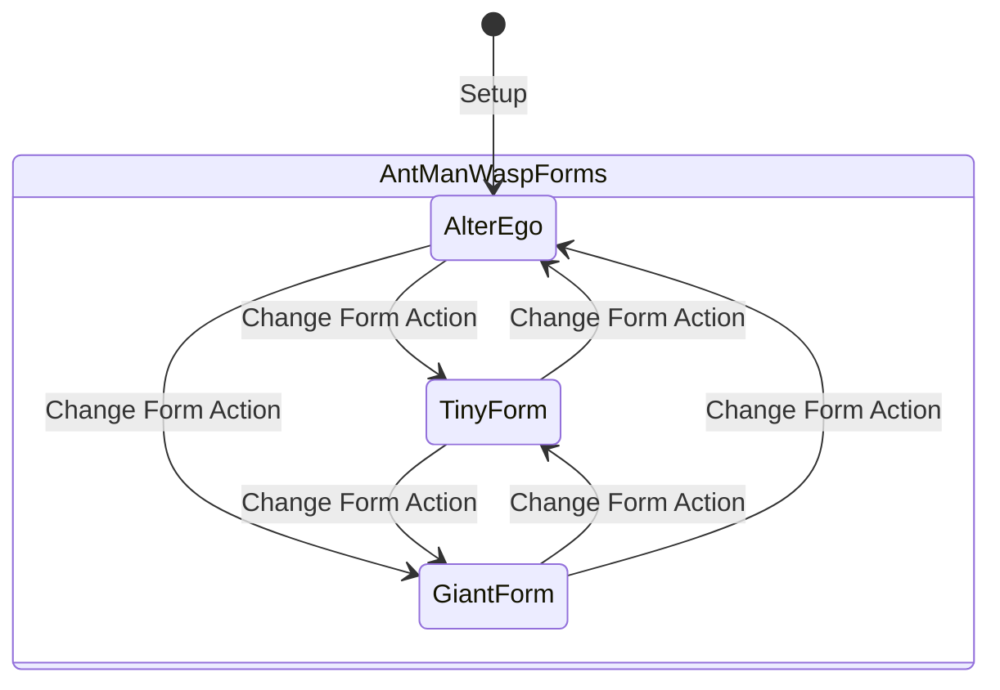

# [ADR-0035] Universal Multi-Form Identities, Mass/Energy States & Generic Counter Engine

* **Status:** Accepted
* **Date:** 2026-08-31
* **Authors:** MCD Core Team
* **Deciders:** User & Antigravity

---

## Context and Problem Statement
Marvel Champions contains several non-binary identity and card state mechanics across its 170 packs:

1. **Multi-Form Identities (9 identities in catalog):**
   * *Ant-Man & Wasp:* 3-sided identities (*Tiny*, *Giant*, *Alter-Ego*) where changing to specific hero forms triggers distinct abilities (e.g. dealing damage when entering Giant, removing threat when entering Tiny).
   * *Spectrum:* 3 distinct Energy Form upgrades (*Gamma*, *Photon*, *Pulsar*) modifying basic powers.
   * *Vision & Shadowcat:* Mass form upgrades (*Dense / Intangible*, *Solid / Phased*) granting intangibility, damage immunity, or ATK bonuses.
   * *Ironheart:* Progressive leveling (*Version 1 $\rightarrow$ Version 2 $\rightarrow$ Version 3*).
   * *Phoenix:* Force alignment (*Restrained $\longleftrightarrow$ Unleashed*).

2. **Universal Counters Subsystem (51 unique named counter types across 1,222 rules lines):**
   * Cards enter play with $N$ counters (`Uses (X counters)`: *Charge*, *Ammo*, *Arrow*, *Web*, *Chi*, *Labor*, *Growth*, *Invocation*, *Pym*, *Vengeance*, *Time*).
   * **Cross-Entity Counter Targeting:** Counters are not always spent from the source card itself:
     - **Identity as Counter Host:** *Gambit* (*Charged Card* removes charge counters from the Hero identity), *Groot* (*Root Spike* and *Vine Shield* remove growth counters from the Hero identity).
     - **Trait-Filtered Counter Removal:** *Ebony Maw* (*Channeling Trance*) removes invocation counters from all cards in play with the `[[Spell]]` trait.
     - **Global Board Counter Purge:** *The Green Gobbler* discards all counters from each card you control.

Previously, the identity model assumed a binary `currentForm: 'hero' | 'alter_ego'` toggle, and cards lacked a generic, cross-target counter dictionary.

How should we design an extensible, data-driven architecture to support arbitrary identity forms, named counter types, and cross-entity counter interactions?

---

## Decision Drivers
* **Driver 1: Open Form Architecture:** Support 2, 3, or $N$ identity forms and persistent form upgrades cleanly on `PlayerState`.
* **Driver 2: Zero Bespoke Counter Fields (ADR-0018):** Never create hardcoded fields like `ammoCounters` or `chargeCounters`. Use a universal `counters: Record<string, number>` map on all in-play entities.
* **Driver 3: Full Cross-Entity Counter Targeting Support:** Provide atomic primitives capable of adding, spending, counting, or purging named counters on self, identities, specific cards, or trait-filtered entities.
* **Driver 4: Form-Change Lifecycle Triggers:** Dispatch discrete `FORM_CHANGED` triggers specifying `previousForm` and `newForm` to activate form-entry responses.

---

## Decision Outcome

**Chosen Option:** **Open Form State Model & Universal `Record<string, number>` Counter Map with Cross-Entity Atomic Primitives**

### 🏗️ Multi-Form Architecture



---

### 📋 Model Specifications (`src/engine/models/state.ts` & `card.ts`)

```typescript
export interface PlayerState {
  // Current active form card instance (e.g. Tiny, Giant, Alter-Ego)
  activeFormCard: CardInstance;
  
  // All available printed form cards for this identity
  availableForms: CardInstance[];
  
  // High-level category for rule checks
  currentFormCategory: 'hero' | 'alter_ego';
  
  // Active mass/energy form attachment (if applicable, e.g. Dense, Intangible, Pulsar)
  activeSubFormCard?: CardInstance;
}

export interface CardInstance {
  instanceId: string;
  card: NormalizedCard;
  exhausted: boolean;
  
  // Universal counter map supporting all 51 counter types (e.g. { charge: 3, ammo: 2, growth: 4 })
  counters: Record<string, number>;
}
```

---

### 🪙 Counter Primitives & Cross-Entity Targeting Contract

To support all cross-card interactions discovered in the catalog audit, counter primitives are standardized with explicit target scopes and counter types:

```typescript
// 1. ADD_COUNTERS
// Adds N counters of type 'counterType' to target (SELF, IDENTITY, or TARGET_CARD)
{
  effect: "ADD_COUNTERS",
  params: {
    target: "SELF" | "IDENTITY" | "TARGET_CARD",
    counterType: "charge" | "growth" | "ammo" | "arrow" | "invocation" | string,
    amount: number | Formula
  }
}

// 2. SPEND_COUNTERS / REMOVE_COUNTERS
// Removes N counters from target as a cost or effect (e.g. Gambit/Groot events spending identity counters)
{
  effect: "SPEND_COUNTERS",
  params: {
    target: "SELF" | "IDENTITY" | "TARGET_CARD",
    counterType: "charge" | "growth" | "ammo" | string,
    amount: number
  }
}

// 3. REMOVE_COUNTERS_MATCHING_FILTER
// Removes counters matching trait/global filters (e.g. Ebony Maw / The Green Gobbler)
{
  effect: "REMOVE_COUNTERS_MATCHING_FILTER",
  params: {
    targetZone: "TABLEAU" | "ALL_CONTROLLED",
    traitFilter?: "Spell", // optional trait filter
    counterType?: "invocation" | "ALL",
    amount: number | "ALL"
  }
}

// 4. COUNT_COUNTERS (Dynamic Modifier / Formula)
// Computes dynamic amounts based on active counters (e.g. Energy Channel deal 2 per energy counter)
{
  formula: "COUNTERS_ON_TARGET",
  params: {
    target: "SELF" | "IDENTITY",
    counterType: "energy" | "growth" | "charge" | string,
    multiplier: number // e.g. 2 damage per counter
  }
}
```

---

## Consequences

### Positive Consequences
* Fully unlocks 3-sided heroes (*Ant-Man*, *Wasp*), form-shifting heroes (*Spectrum*, *Vision*, *Shadowcat*), and leveling heroes (*Ironheart*).
* Unlocks identity-counter heroes (*Gambit*, *Groot*, *Hawkeye*, *Luke Cage*, *Iron Fist*) without hardcoding custom identity counter properties.
* Standardizes all 51 counter types onto a single atomic primitive suite.
* Preserves 100% deterministic serializability for save/load, action replays, and headless simulation.
