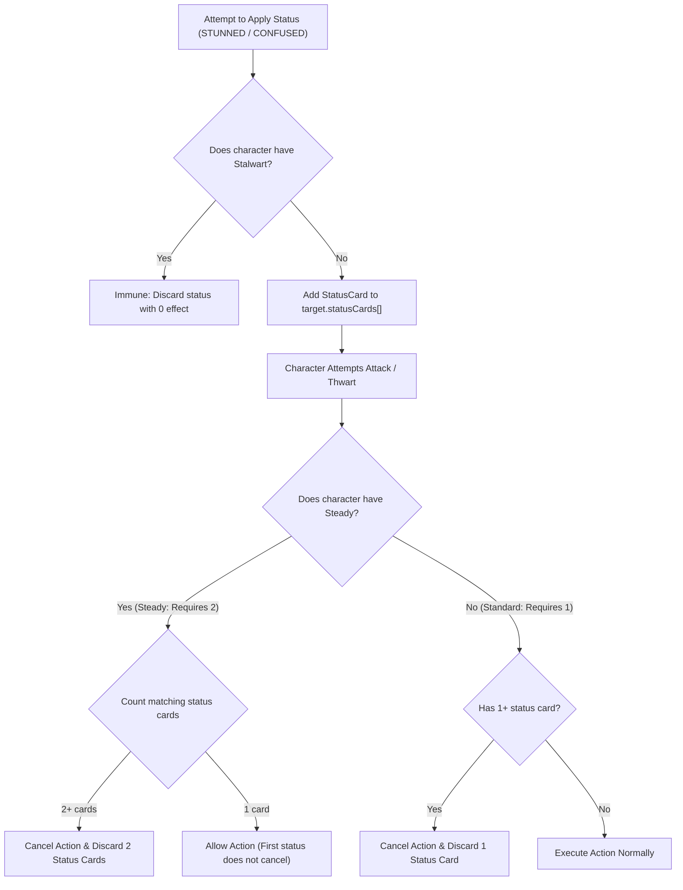

# [ADR-0036] Advanced Status Card Dynamics & Minion Activation Modifiers

* **Status:** Accepted
* **Date:** 2026-08-31
* **Authors:** MCD Core Team
* **Deciders:** User & Antigravity

---

## Context and Problem Statement
Expansion packs introduce deeper tactical dynamics to status cards and enemy activations:
1. **Advanced Status Scaling (`Stalwart` & `Steady` - RR v1.8 p. 28):**
   * **Stalwart:** Character is completely immune to `STUNNED` and `CONFUSED`. Any stun/confuse attempt is discarded without effect.
   * **Steady:** Character requires **2 copies** of a status card to be incapacitated (e.g. 1st Stun does not cancel attacks; 2nd Stun cancels the attack and discards both Stun cards).
2. **Minion Activation Modifiers (`Villainous` & `Quickstrike` - RR v1.8 p. 18, 30):**
   * **Villainous:** When an elite minion attacks or schemes, it deals and resolves a facedown boost card, identical to a villain activation.
   * **Quickstrike:** When a minion engages a Hero (enters play), it immediately triggers an attack activation against that hero.
3. **Encounter Entry Threat Modifiers (`Incite X` & `Hinder X` - RR v1.8 p. 14, 16):**
   * **Incite $X$:** Places $X$ threat on the main scheme immediately upon being revealed.
   * **Hinder $X$:** Enters play with $X \times \text{per\_hero}$ additional threat.

Previously, status cards were modeled as simple boolean flags, minions never drew boost cards, and minion entry did not trigger combat.

How should we model these advanced status thresholds and minion activations in the rules engine?

---

## Decision Drivers
* **Driver 1: Official Rules Invariants (RR v1.8 p. 14, 16, 18, 28, 30):** Full compliance with Stalwart immunity, Steady 2-card thresholds, and Villainous boost mechanics.
* **Driver 2: Unified Combat Pipeline Reuse (ADR-0031):** Reuse the 7-step combat pipeline for both Villainous minion activations and Quickstrike entry attacks.

---

## Decision Outcome

**Chosen Option:** **Count-Based Status Thresholds & Reactive Minion Entry Triggers**

### 🏗️ Status Resolution State Machine

---

## Consequences

### Positive Consequences
* Unlocks elite villains and minions across expansions (*Venom*, *Magneto*, *Juggernaut*, *Ronan*, *Baron Zemo*).
* Integrates Quickstrike attacks seamlessly into the unified 7-step combat engine.
* Prevents status card desynchronization across Standard, Steady, and Stalwart characters.
