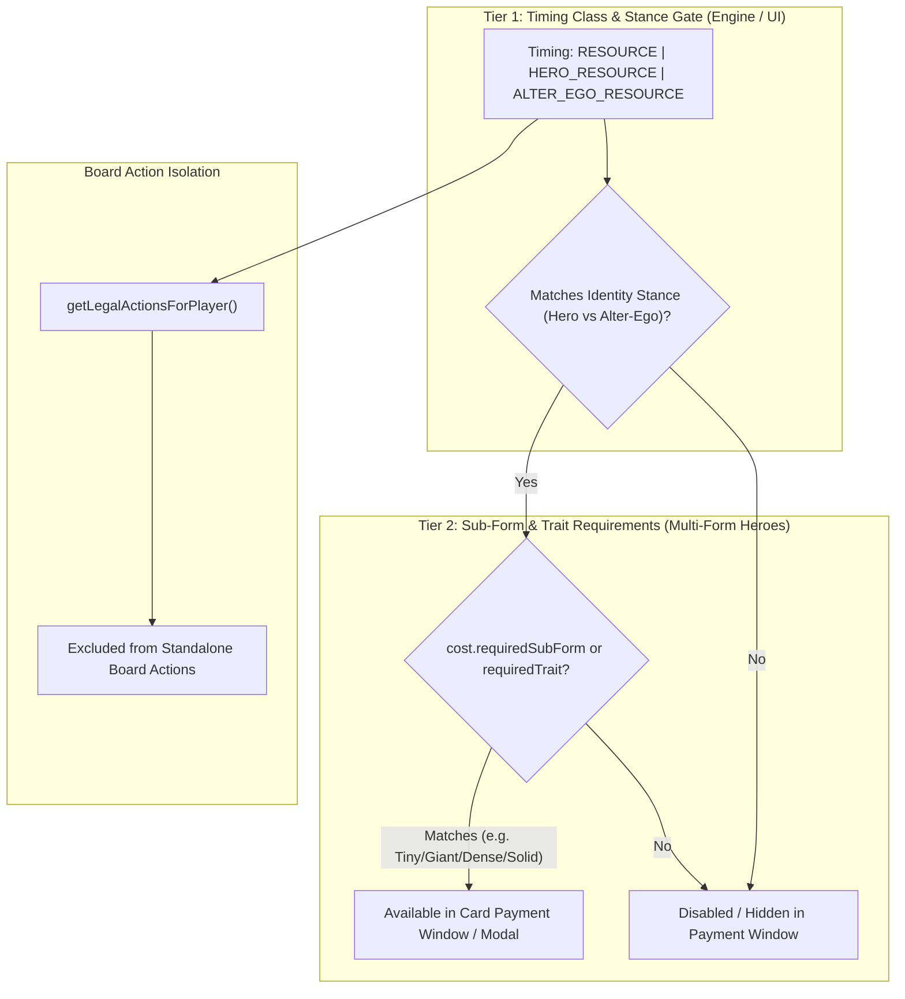

# [ADR-0039] Universal Resource Ability Timing Triad, Stance Isolation, and Multi-Form Extensibility Engine

- **Status:** Accepted
- **Date:** 2026-09-01
- **Authors:** MCD Core Team
- **Deciders:** User & Antigravity

---

## 📜 Context & Problem Statement

In Marvel Champions Rules Reference (RR v1.8 p. 25 "Resource Ability"), a resource ability is a special class of ability that generates resources:

> _"A resource ability is a type of ability that generates resources. A resource ability can be triggered during any window in which the player is paying costs (such as paying the resource cost of a card or an ability)."_
> _"A player cannot trigger a resource ability unless they are actively paying a cost."_

Furthermore, printed cards in the official game have three distinct stance headers:

1. **`Resource:`** (e.g. _Pepper Potts_ `01033`, _Peter Parker (Scientist)_ `01001b`, _The X-Jet_, _Ingenuity_) — Usable in **either** Hero or Alter-Ego stance during cost payment.
2. **`Hero Resource:`** (e.g. _Web-Shooter_ `01008`, _Solid_ `32031a`, _God of Thunder_, _Enhanced Reflexes_) — Usable strictly in **Hero** stance during cost payment.
3. **`Alter-Ego Resource:`** — Usable strictly in **Alter-Ego** stance during cost payment.

Previously, only generic `RESOURCE` was defined in the timing enum. Certain cards like _Web-Shooter_ (`01008`) were inadvertently declared with `HERO_ACTION` timing, causing them to appear in `getLegalActionsForPlayer()` as standalone in-play board actions outside of the cost payment window.

Additionally, multi-form heroes (_Ant-Man_, _Wasp_, _Vision_, _Spectrum_, _Shadowcat_, _Angel_) and custom fan-made cards require both broad stance gating and sub-form state validation (_Tiny_, _Giant_, _Dense_, _Intangible_, _Solid_, _Phased_, _Archangel_, _Photon_).

---

## 🎯 Decision Drivers

1. **Symmetric Timing Taxonomy:** Match the existing 3-way stance pattern used for Actions (`ACTION`, `HERO_ACTION`, `ALTER_EGO_ACTION`), Interrupts (`INTERRUPT`, `HERO_INTERRUPT`, `ALTER_EGO_INTERRUPT`), and Responses (`RESPONSE`, `HERO_RESPONSE`, `ALTER_EGO_RESPONSE`).
2. **Payment Window Isolation:** Ensure resource generation abilities are never presented as generic board actions on the table, but strictly discoverable during cost payment windows.
3. **Multi-Form & Fan-Made Extensibility (2-Tier Architecture):**
   - **Tier 1 (Stance Gate):** Handled directly by the timing enum (`RESOURCE`, `HERO_RESOURCE`, `ALTER_EGO_RESOURCE`).
   - **Tier 2 (Sub-Form / Trait Gate):** Handled declaratively via `cost.requiredSubForm` and `cost.requiredTrait` without bloating the outer timing type.

---

## 🏗️ Architecture & State Machine



---

## 📋 Implementation Details

### 1. Ability Timing Enum Expansion

In `src/engine/models/abilities.ts` and `src/data/supplemental/schema.ts`:

```typescript
export type AbilityTiming =
  | "ACTION"
  | "HERO_ACTION"
  | "ALTER_EGO_ACTION"
  | "RESOURCE"
  | "HERO_RESOURCE"
  | "ALTER_EGO_RESOURCE"
  | "INTERRUPT"
  | "HERO_INTERRUPT"
  | "ALTER_EGO_INTERRUPT"
  | "FORCED_INTERRUPT"
  | "RESPONSE"
  | "HERO_RESPONSE"
  | "ALTER_EGO_RESPONSE"
  | "FORCED_RESPONSE"
  | "WHEN_REVEALED"
  | "BOOST"
  | "CONSTANT"
  | "SPECIAL"
  | "SETUP";
```

### 2. Universal Helpers (`cost-engine.ts`)

```typescript
export function isResourceAbility(timing: AbilityTiming): boolean {
  return (
    timing === "RESOURCE" ||
    timing === "HERO_RESOURCE" ||
    timing === "ALTER_EGO_RESOURCE"
  );
}

export function isAbilityPlayableInForm(
  timing: AbilityTiming,
  currentForm: "hero" | "alter_ego",
): boolean {
  if (timing.startsWith("HERO_") && currentForm !== "hero") return false;
  if (timing.startsWith("ALTER_EGO_") && currentForm !== "alter_ego")
    return false;
  return true;
}
```

### 3. Board Turn Action Isolation (`legal-actions-generator.ts`)

In `getLegalActionsForPlayer()`, filter out any ability satisfying `isResourceAbility(ab.timing)`, ensuring resource abilities are only surfaced when paying costs.

### 4. Payment Window & Modal Integration (`CardPaymentModal.tsx` & `action-dispatcher.ts`)

In `CardPaymentModal.tsx` and `action-dispatcher.ts`, in-play resource generators validate both broad stance requirements (`isAbilityPlayableInForm`) and any specific sub-form traits (`cost.requiredSubForm`).

---

## ⚖️ Consequences & Tradeoffs

### Positive

- **100% Rules Compliance:** Accurately models RR v1.8 p. 25 resource ability timing and payment windows.
- **Symmetric Design:** Consistent 3-stance pattern across all ability types.
- **Extensible Multi-Form Support:** Seamlessly supports official expansion heroes (_Ant-Man_, _Wasp_, _Vision_, _Spectrum_, _Shadowcat_, _Angel_) and custom fan-made content.

### Negative / Mitigations

- Requires adding 2 new literals to the `AbilityTiming` union and Zod schema. Mitigated by automated schema validation tests (`npm test`).
