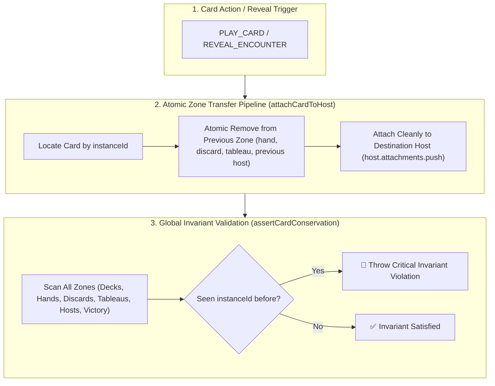

# ADR-0040: Universal Card Conservation, Atomic Zone Transfer & State Invariant Engine

## 🏛️ Status
**Accepted** (2026-09-01)

---

## 📜 Context & Problem Statement
In physical card games like Marvel Champions, physical cards have fixed identities and strict spatial uniqueness:
$$\sum_{\text{All Zones } Z} \mathbb{I}(c \in Z) = 1 \quad \forall \text{ active card instance } c$$

Every instantiated card (`instanceId`) must exist in **exactly one zone** at any given moment in time. A card instance can never be duplicated, cloned, or present in multiple zones or containers simultaneously.

Previously, an architectural flaw existed in attachment handling between `action-dispatcher.ts` and `effects/index.ts`:
1. `action-dispatcher.ts` pre-emptively pushed attachment cards into `host.attachments` during `PLAY_CARD`.
2. `executeEffect()` then ran `ATTACH_TO_HOST` in `effects/index.ts`, which blindly pushed the same card instance into `host.attachments` a second time.
3. This resulted in cards appearing twice on host entities (e.g. 4 cards displayed when attaching 2 cards to Rhino) and violated the Card Conservation Law.

---

## 🎯 Decision Drivers
1. **Physical Card Simulation Fidelity:** Eliminate duplicate card instances across all game states.
2. **Single Responsibility in Zone Transfers:** The declarative primitive (`ATTACH_TO_HOST`, `ZONE_TRANSFER`, `PUT_INTO_PLAY`) must be the **sole authoritative executor** of card movement, eliminating pre-placement side effects.
3. **Atomic Zone Transfers:** Moving a card into any container must automatically remove it from its previous zone.
4. **Automated Invariant Enforcement:** Provide engine-wide validation (`assertCardConservation`) that fails fast if any card instance is ever duplicated in the state tree.

---

## 🏗️ Architecture & State Machine



---

## 📋 Implementation Details

### 1. Atomic Attachment Helper (`src/engine/pipeline/scenario-helpers.ts` or `effects/index.ts`)
```typescript
export function attachCardToHost(
  state: GameState,
  cardInstance: CardInstance,
  targetHostType: 'VILLAIN' | 'HERO' | 'ALLY' | 'MINION' | 'MAIN_SCHEME' | 'SIDE_SCHEME',
  targetHostId?: string,
): void {
  // 1. Remove from all existing zones to prevent ghost duplicates
  removeCardFromAllZones(state, cardInstance.instanceId);

  // 2. Attach to the resolved host entity
  const host = resolveHostEntity(state, targetHostType, targetHostId);
  if (!host.attachments) host.attachments = [];
  host.attachments.push(cardInstance);
}
```

### 2. Elimination of Dispatcher Pre-Placement (`action-dispatcher.ts`)
In `PLAY_CARD`, attachments are removed from `player.hand` and delegated entirely to `ATTACH_TO_HOST` in the effect pipeline.

### 3. Global Card Conservation Invariant Validator (`src/engine/state/state-validator.ts`)
```typescript
export function assertCardConservation(state: GameState): void {
  const seenInstanceIds = new Set<string>();
  for (const card of getAllCardInstances(state)) {
    if (seenInstanceIds.has(card.instanceId)) {
      throw new Error(
        `[CRITICAL INVARIANT VIOLATION] Card '${card.card.name}' (${card.instanceId}) exists in multiple zones simultaneously!`
      );
    }
    seenInstanceIds.add(card.instanceId);
  }
}
```

---

## ⚖️ Consequences & Tradeoffs

### Positive
* **100% Mathematical Conservation:** Guaranteed zero card duplications across all game actions, scenario setups, and attachments.
* **Fail-Fast Safety:** Any regression in card movement triggers an immediate, traceable invariant assertion failure in test runs and dev builds.
* **Clean Separation of Concerns:** Action dispatchers handle player intent; effect primitives handle state mutations and zone transfers.

### Negative / Mitigations
* Invariant checks add minimal scan overhead during test execution ($O(N)$ where $N \le 150$ cards, $\approx 0.05$ ms).
