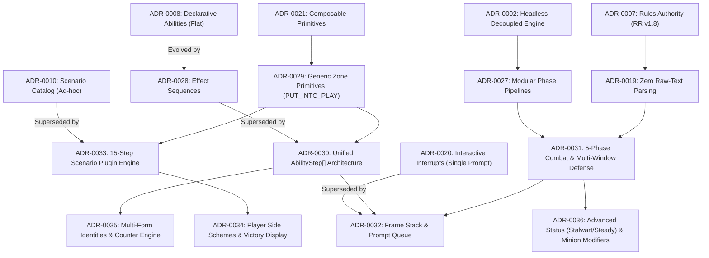

# Architecture Decision Records (ADRs) & Decision Log

This directory captures all key architectural, technical, and gameplay design decisions made for **Marvel Champions Digital (MCD)**, with an emphasis on **the rationale ("the why")**, tradeoffs, and consequences.

## Format
We follow the standard [Architecture Decision Record (ADR)](https://github.com/joelparkerhenderson/architecture-decision-record) format based on Michael Nygard / MADR standards.

Each record documents:
* **Context & Problem Statement:** What situation or challenge we are addressing.
* **Decision Drivers:** What requirements, goals, or constraints matter most.
* **Considered Options:** What alternatives were evaluated.
* **Decision Outcome:** What we chose and **why**.
* **Pros and Cons of the Options:** Explicit tradeoffs.
* **Consequences:** Positive and negative impacts on the project.

---

## 🗺️ Visual ADR Lineage & Evolution Graph

---

## Decision Log Table

| ID | Date | Title | Status | Primary Rationale / Why |
| :--- | :--- | :--- | :--- | :--- |
| [ADR-0001](0001-record-architecture-decisions.md) | 2026-08-26 | Use Architecture Decision Records (ADRs) | **Accepted** | Ensure all technical choices and their underlying "why" are transparent, traceable, and persistent across development. |
| [ADR-0002](0002-decoupled-headless-rules-engine.md) | 2026-08-26 | Decoupled Headless Rules Engine | **Accepted** | Marvel Champions rules and timing triggers require 100% deterministic, test-driven validation independent of any UI or rendering framework. |
| [ADR-0003](0003-technology-stack-selection.md) | 2026-08-26 | Technology Stack Selection | **Accepted** | Evaluate TypeScript/React/Tauri vs Godot vs Unity vs Python with FOSS licensing and rapid UI prototyping. |
| [ADR-0004](0004-visual-art-direction-comic-pop-art.md) | 2026-08-26 | 60s Comic Pop-Art & Batman '66 Aesthetic | **Accepted** | Focus on 2D comic panels, Ben-Day halftone dots, and punchy onomatopoeia (POW! BAM! THWIP!) instead of heavy 3D graphics. |
| [ADR-0005](0005-internationalization-i18n-localization.md) | 2026-08-26 | Internationalization (i18n) & Localization | **Accepted** | Decouple all UI/game text and card data into JSON locale dictionaries (i18next) for easy multi-language translation and community contributions. |
| [ADR-0006](0006-local-first-card-data-architecture.md) | 2026-08-26 | Local-First Card Data & Layered Overrides | **Accepted** | Keep a 100% local copy of all card data with an explicit sync workflow and a supplemental/override layer for engine hooks and errata. |
| [ADR-0007](0007-official-rules-authority-rr-v18.md) | 2026-08-26 | Official Rules Authority (RR v1.8 & Errata) | **Accepted** | All game mechanics, timing windows, and errata must strictly adhere to the official Rules Reference v1.8 and Learn to Play Guide. |
| [ADR-0008](0008-declarative-card-ability-enrichment.md) | 2026-08-26 | Declarative Card Ability & Effect Enrichment | **Accepted** | Declarative supplemental ability layer with reusable effect primitives, 100% card registration, and explicit status signals. |
| [ADR-0009](0009-game-history-and-action-log.md) | 2026-08-26 | In-Game Action History & Real-Time Combat Log | **Accepted** | Implement a strictly ordered, immutable log of game events to support undo mechanics, replayability, and debugging. |
| [ADR-0010](0010-scenario-catalog-and-multi-hero-setup.md) | 2026-08-26 | Scenario Catalog & Multi-Hero Solo Setup Architecture | **Superseded by [ADR-0033](0033-official-15-step-scenario-setup-engine-and-modular-plugin-pipeline.md)** | Initial scenario registry and scaling, superseded by the official 15-step `ScenarioPlugin` pipeline. |
| [ADR-0011](0011-card-orientation-and-art-caching.md) | 2026-08-27 | Card Orientation Metadata & Cache-First Art Resolution | **Accepted** | Model card orientation (Portrait vs Landscape for Schemes), responsive UI dimensions, and cache-first MarvelCDB card art loading. |
| [ADR-0012](0012-z-axis-hover-zoom-and-layering.md) | 2026-08-27 | Z-Axis Unconstrained Elevation & Hover-Zoom Architecture | **Accepted** | Maintain unconstrained Z-axis elevation (`z-50`) without overflow clipping or scrollbar spawning on interactive card docks. |
| [ADR-0013](0013-game-settings-and-dev-mode.md) | 2026-08-27 | Game Settings & Developer Mode State Architecture | **Accepted** | Decouple UI settings into a persistent React Context with a top-bar Dev Mode indicator and Options Menu. |
| [ADR-0014](0014-marvelcdb-deck-schema-and-metadata-decks.md) | 2026-08-27 | MarvelCDB-Compliant Deck Data Schema & Metadata-Driven Decks | **Accepted** | Standardize on official MarvelCDB JSON schema (`slots`, `hero_code`, `meta`) for 100% data-driven deck management without code coupling. |
| [ADR-0015](0015-user-content-and-deck-storage-architecture.md) | 2026-08-27 | User Content & Deck Storage Architecture | **Accepted** | Establish segmented storage hierarchy (`prebuilt_decks/`, `decks/`, `marvelcdb/`, `fan_made_heroes/`, `fan_made_scenarios/`) with cross-environment driver. |
| [ADR-0016](0016-one-file-per-deck-and-collision-safe-naming.md) | 2026-08-27 | 1-File-Per-Deck Storage Strategy & Collision-Resistant Naming | **Accepted** | Adopt 1 file per deck with domain-namespaced semantic slugs (`<pack>_<hero>_<aspect>.json`, `mcdb_<id>_<slug>.json`, `user_<hero>_<slug>_<id>.json`). |
| [ADR-0017](0017-panoramic-horizontal-tabletop-and-edge-scrolling.md) | 2026-08-27 | Panoramic Horizontal Tabletop with Edge and Drag Scrolling | **Accepted** | Panoramic horizontal row for 1–4 heroes with full-sized tableaus/hands, edge-hover auto-panning, and drag-to-scroll cross-table deployment. |
| [ADR-0018](0018-declarative-state-modifiers-and-dynamic-board-limits.md) | 2026-08-27 | Declarative State Modifiers & Zero Card-Code Coupling | **Accepted** | Derive all board limits and state modifiers dynamically from declarative metadata without hardcoding card IDs in the engine. |
| [ADR-0019](0019-strict-metadata-driven-rules-execution-and-zero-raw-text-parsing.md) | 2026-08-27 | Strict Metadata-Driven Rules Execution & Zero Raw-Text Parsing | **Accepted** | Never parse raw card text strings for game rules or legality to prevent breaking on translations (i18n), upstream typos, or complex text edge cases. |
| [ADR-0020](0020-optional-vs-forced-triggers-exact-event-scoping-and-interactive-interrupts.md) | 2026-08-27 | Optional vs Forced Triggers, Exact Event Scoping & Interactive Interrupts | **Superseded by [ADR-0032](0032-universal-resolution-stack-decision-prompt-queue-and-nested-interrupts.md)** | Initial interrupt handling, superseded by the frame execution stack and multi-prompt queue. |
| [ADR-0021](0021-card-integration-workflow-and-composable-primitives.md) | 2026-08-28 | Standard Card Integration Protocol & Composable Primitives Architecture | **Accepted** | Enforce standard 8-step protocol for card translation and composable generic primitives without monolithic card-specific logic. |
| [ADR-0022](0022-authoritative-zod-supplemental-schema-and-cicd-quality-gate.md) | 2026-08-30 | Authoritative Zod Supplemental Schema & CI/CD Quality Gate | **Accepted** | Enforce strict runtime Zod validation (`src/data/supplemental/schema.ts`) and automated Vitest CI/CD tests for 100% of supplemental data packs. |
| [ADR-0023](0023-modular-supplemental-specification-suite-and-implementation-status-badges.md) | 2026-08-30 | Modular Supplemental Specification Suite & Implementation Status Badges | **Accepted** | Decompose monolithic schema documentation into a 10-part modular suite with explicit 🟢 IMPLEMENTED vs 🟡 ROADMAP status badges. |
| [ADR-0024](0024-declarative-action-cost-engine-and-state-mutation-pre-checks.md) | 2026-08-30 | Declarative Action Cost Engine & State Mutation Pre-Checks | **Accepted** | Centralize cost validation and atomic execution (exhaustion, direct damage, hand discard, tokens, and mutation pre-checks) in `cost-engine.ts`. |
| [ADR-0025](0025-architectural-subsystem-completion-and-mandatory-supplemental-review-pipeline.md) | 2026-08-30 | Architectural Subsystem Completion & Mandatory Supplemental Review Pipeline | **Accepted** | Mandate an immediate card review pass upon completing any engine subsystem, promoting blocked cards with unit tests, Inbox Zero pruning, and closing GitHub issues. |
| [ADR-0026](0026-daily-bugle-action-dispatcher-and-dynamic-fan-out-hand.md) | 2026-08-30 | 1960s Daily Bugle Action Dispatcher & Dynamic Fan-Out Hand Architecture | **Accepted** | Provide centralized legal move discovery via retro Daily Bugle newspaper broadsheet, automatic turn-end verification, and responsive zero-overflow fan-out hand stacking. |
| [ADR-0027](0027-modular-phase-pipeline-architecture.md) | 2026-08-30 | Modular Phase Pipelines & Lifecycle Hooks Architecture | **Accepted** | Modularize engine execution into dedicated phase files (`player-phase.ts`, `villain-phase.ts`, `round-upkeep.ts`) with discrete phase/round lifecycle triggers and ability limit resets. |
| [ADR-0028](0028-declarative-effect-sequencing-and-conditional-gates.md) | 2026-08-31 | Declarative Effect Sequencing, Conditional Gates & Contextual Entity Passing | **Superseded by [ADR-0030](0030-unified-ability-step-sequence-architecture.md)** | Initial recursive sequence schema, superseded by unified `steps: AbilityStep[]` architecture. |
| [ADR-0029](0029-generic-zone-transfer-and-deck-manipulation-primitives.md) | 2026-08-31 | Generic Zone Transfer and Deck Manipulation Primitives | **Accepted** | Standardize parameterized semantic primitives (`PUT_INTO_PLAY`, `SHUFFLE_INTO_DECK`, `DISCARD_CARDS`) across all card zones instead of zone-specific effect names. |
| [ADR-0030](0030-unified-ability-step-sequence-architecture.md) | 2026-08-31 | Unified Ability Step Sequence Architecture & Supplemental Normalization | **Accepted** | Unify ability execution by strictly decoupling ability headers (`CardAbility`) from execution steps (`AbilityStep[]`), eliminating schema duality and branching. |
| [ADR-0031](0031-comprehensive-combat-enemy-attack-and-multi-window-defense-pipeline.md) | 2026-08-31 | Comprehensive Combat, Enemy Attack & Multi-Window Defense Pipeline | **Accepted** | Formalize 5-phase attack state machine supporting Basic Hero DEF, Ally blocks, Defense events, Boost cancellation, Overkill, and Direct Damage separation. |
| [ADR-0032](0032-universal-resolution-stack-decision-prompt-queue-and-nested-interrupts.md) | 2026-08-31 | Universal Resolution Stack, Decision Prompt Queue & Nested Interrupt Pipeline | **Accepted** | Model nested interrupts, responses, and voluntary reaction windows using an explicit execution stack and serializable FIFO/LIFO prompt queue per RR v1.8 p. 16. |
| [ADR-0033](0033-official-15-step-scenario-setup-engine-and-modular-plugin-pipeline.md) | 2026-08-31 | Official 15-Step Scenario Setup Engine & Modular Plugin Pipeline | **Accepted** | Replace ad-hoc scenario setup with a declarative `ScenarioPlugin` architecture executing the official 15-step setup protocol per RR v1.8 p. 27–28. |
| [ADR-0034](0034-player-side-schemes-victory-display-and-auxiliary-decks.md) | 2026-08-31 | Player Side Schemes, Victory Display & Auxiliary Scenario Decks Architecture | **Accepted** | Model voluntary player side schemes, the permanent Victory Display zone (`state.victoryDisplay`), and generic auxiliary scenario decks per RR v1.8 p. 26, 30. |
| [ADR-0035](0035-universal-multi-form-identities-and-generic-counter-engine.md) | 2026-08-31 | Universal Multi-Form Identities, Mass/Energy States & Generic Counter Engine | **Accepted** | Support 3-sided identities (Ant-Man/Wasp), Mass/Energy form upgrades (Spectrum/Vision), and universal `counters: Record<string, number>` map. |
| [ADR-0036](0036-advanced-status-card-dynamics-and-minion-activations.md) | 2026-08-31 | Advanced Status Card Dynamics & Minion Activation Modifiers | **Accepted** | Model count-based status thresholds (Stalwart immunity, Steady 2-card threshold) and minion modifiers (Villainous boosts, Quickstrike, Incite, Hinder). |
| [ADR-0037](0037-comic-dialogue-presentation-and-voice-localization-engine.md) | 2026-08-31 | Comic Dialogue Presentation & Character Voice Localization Engine | **Accepted** | Transform technical action logs into a living 1960s comic dialogue stream with 4-tier visual speech balloons, localized character voice quotes, and dynamic on-the-fly language switching per ADR-0005 and ADR-0009. |
| [ADR-0040](0040-universal-card-conservation-and-atomic-zone-transfer.md) | 2026-09-01 | Universal Card Conservation, Atomic Zone Transfer & Invariant Engine | **Accepted** | Enforce physical card conservation laws, atomic zone transfer helpers, and global uniqueness validation assertions. |
| [ADR-0041](0041-cost-arrow-mandatory-resolution-and-self-damage-costs.md) | 2026-09-01 | Cost Arrow Enforcement, Forced Trigger Resolution & Direct Character Damage Costs | **Accepted** | Automate cost execution on forced triggers, dispatch combat/thwart action triggers, and validate direct damage costs on character abilities per RR v1.8. |
| [ADR-0039](0039-universal-resource-ability-timing-triad-and-form-gating.md) | 2026-09-01 | Universal Resource Ability Timing Triad, Stance Isolation & Multi-Form Extensibility | **Accepted** | Standardize 3-way stance resource timings (RESOURCE, HERO_RESOURCE, ALTER_EGO_RESOURCE), payment window isolation, and 2-tier sub-form requirements. |
| [ADR-0038](0038-universal-special-ability-plugin-architecture-and-sequential-ordering.md) | 2026-09-01 | Universal Special Ability Plugin Architecture & Sequential Ordering Engine | **Accepted** | Decouple hero-specific Special abilities (Black Panther *Wakanda Forever!*, Doctor Strange Invocation spells) into an extensible plugin registry with interactive Drag & Drop sequential reordering. |

---

## Adding a New Decision
To propose or record a new decision:
1. Copy [`template.md`](template.md) to a new file named `XXXX-short-title.md`.
2. Fill in all sections thoroughly, especially the **Why / Rationale** and **Tradeoffs**.
3. Add an entry to the log table above.
