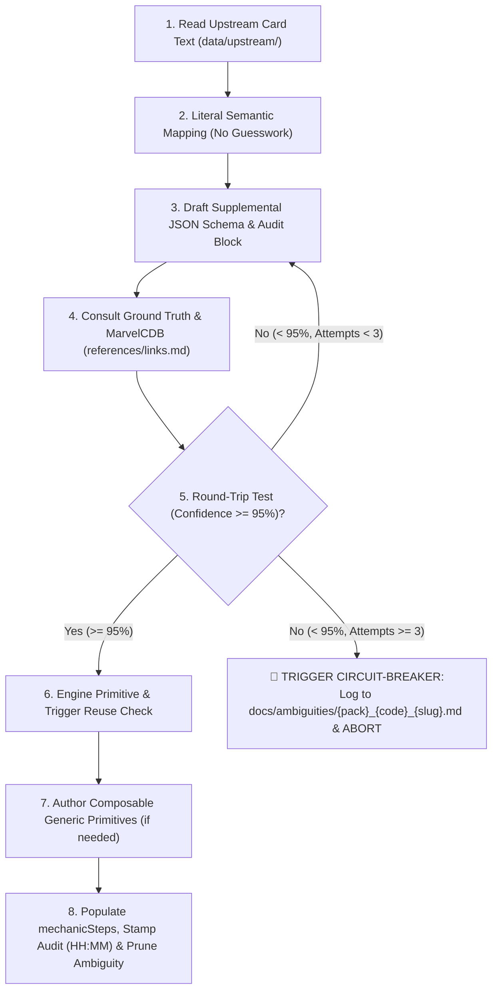

# Card Integration Protocol & Developer Guidelines

**Audience:** All engineers, AI pair programmers, and contributors to Marvel Champions Digital (MCD).  
**Authority:** Marvel Champions Rules Reference v1.8, ADR-0018, ADR-0019, ADR-0020, ADR-0021.

---

## 1. Core Mandates

1. **Zero Text-Scraping / Zero Assumptions (ADR-0019):** Card text is purely presentation data. Rules engine logic must never scrape or parse `card.text`.
2. **Zero Hardcoded Card IDs (ADR-0018):** Never write `if (card.code === '01002')` in the core engine. Always inspect declarative metadata, ability timings, and effect primitives.
3. **Exact Event Scoping (ADR-0020):** Conflating distinct entities (e.g. *Villain Schemes* vs *Minion Schemes*) is strictly prohibited.
4. **Mandatory vs. Optional Distinctions (ADR-0020):** `FORCED_` abilities resolve automatically; `INTERRUPT` and `RESPONSE` abilities are optional and require player choice.
5. **Hard Circuit-Breaker on Refinement Loops (ADR-0021):** If round-trip confidence is $< 95\%$ after 3 refinement iterations, stop immediately and log to `docs/ambiguities/`.
6. **Encapsulated Audit Tracking (ADR-0021):** Every card maintains an `audit` block with ISO timestamps including date and time (`YYYY-MM-DDTHH:mm`).
7. **1-File-Per-Card Ambiguity Queue / Inbox Zero (ADR-0021):** Blocked cards live in `docs/ambiguities/{pack}_{code}_{slug}.md` and are deleted upon resolution.
8. **Composable Generic Primitives (ADR-0021):** New mechanics must be implemented as composable, reusable primitives rather than single-use card functions.

---

## 2. The 8-Step Integration Protocol

### Detailed Steps:

1. **Ingest Upstream Text:** Fetch exact text from `data/upstream/pack/{pack}.json`.
2. **Literal Semantic Mapping:** Identify ability timing, trigger condition, costs, target entities, and form requirements.
3. **Draft Supplemental Schema:** Create structured entry with `comment`, `audit`, `mechanicSteps`, and `abilities`.
4. **Consult Ground Truth:** Review `references/rules_reference_v18.md` and MarvelCDB FAQ (`https://marvelcdb.com/faqs`) and discussion (`https://marvelcdb.com/card/{code}`).
5. **Round-Trip Test & Circuit-Breaker:** Translate JSON schema back into human language; verify 100% equivalence with printed card behavior.
   * If confidence remains $< 95\%$ after 3 attempts, abort integration and write `docs/ambiguities/{pack}_{code}_{slug}.md`.
6. **Engine Reuse Check:** Check `src/engine/effects/` and `src/engine/triggers/` before adding new code.
7. **Composable Primitives:** Build generic building blocks (e.g. Deck Inspection, Card Stack Filtering, Routing).
8. **Stamp Audit Metadata, Codify Specs & Inbox Zero Pruning:**
   * **Stamp Timestamps:** Update `updatedAt` / `reviewedAt` in ISO `YYYY-MM-DDTHH:mm` format.
   * **Codify Specs:** Add entry in `docs/specs/card-mechanics-breakdown.md`.
   * **Delete Ambiguity File:** If an issue existed in `docs/ambiguities/`, delete it.
   * **Verify:** Run automated tests (`npm test`).
