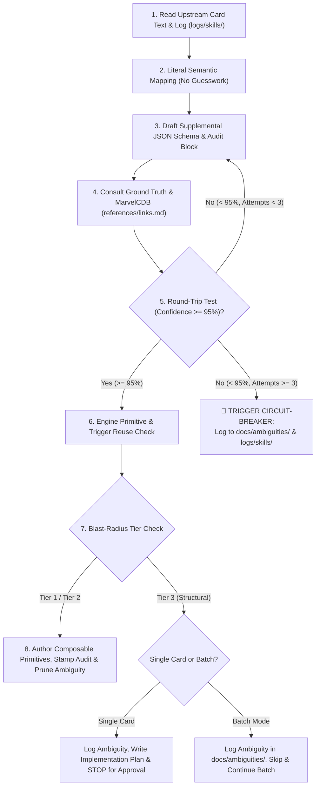

# Card Integration Protocol & Developer Guidelines

**Audience:** All engineers, AI pair programmers, and contributors to Marvel Champions Digital (MCD).  
**Authority:** Marvel Champions Rules Reference v1.8, ADR-0018, ADR-0019, ADR-0020, ADR-0021.

---

## 1. Core Mandates

1. **Zero Text-Scraping / Zero Assumptions (ADR-0019):** Card text is purely presentation data. Rules engine logic must never scrape or parse `card.text`.
2. **Zero Hardcoded Card IDs (ADR-0018):** Never write `if (card.code === '01002')` in the core engine. Always inspect declarative metadata, ability timings, and effect primitives.
3. **Exact Event Scoping (ADR-0020):** Conflating distinct entities (e.g. *Villain Schemes* vs *Minion Schemes*) is strictly prohibited.
4. **Mandatory vs. Optional Distinctions (ADR-0020):** `FORCED_` abilities resolve automatically; `INTERRUPT` and `RESPONSE` abilities are optional and require player choice.
5. **3-Tier Blast-Radius Guardrails (ADR-0021):** Tier 1 (fast-track) and Tier 2 (additive helpers) execute freely. Tier 3 (structural changes) requires formal implementation plan approval in single-card mode, or ambiguity queue isolation during batch mode.
6. **Hard Circuit-Breaker on Refinement Loops (ADR-0021):** If round-trip confidence is $< 95\%$ after 3 refinement iterations, stop immediately and log to `docs/ambiguities/`.
7. **Encapsulated Audit Tracking (ADR-0021):** Every card maintains an `audit` block with ISO timestamps including date and time (`YYYY-MM-DDTHH:mm`).
8. **1-File-Per-Card Ambiguity Queue / Inbox Zero (ADR-0021):** Blocked cards live in `docs/ambiguities/{pack}_{code}_{slug}.md` and are deleted upon resolution.
9. **Execution Logging with Confidence Level (ADR-0021):** Every skill execution logs real-time audit trails with confidence score to `logs/skills/card_integration_{YYYY-MM-DD}.log`.
10. **Composable Generic Primitives (ADR-0021):** New mechanics must be implemented as composable, reusable primitives rather than single-use card functions.

---

## 2. 🚦 Blast-Radius Change Tiers

| Tier | Scope | Approval Policy | Batch-Mode Behavior |
| :--- | :--- | :--- | :--- |
| **Tier 1 (Fast-Track)** | Supplemental JSON edits, new enum/union literals (`TriggerType`), switch `case` branches, unit tests. | Direct execution permitted. | Executes continuously. |
| **Tier 2 (Additive Generic Helpers)** | New pure helpers in `src/engine/effects/` (e.g. deck inspection, stack filtering). | Permitted with 0 regressions (`npm test`). | Executes continuously. |
| **🛑 Tier 3 (Structural Refactor Gate)** | Core state schemas (`GameState`, `PlayerState`), phase loops in `villain-phase.ts`, action dispatch contracts, major subsystem rewrites. | **STOP**: Create `implementation_plan.md` and wait for user approval. | **DO NOT HALT BATCH**: Log to `docs/ambiguities/`, skip card, continue batch scan, and present consolidated plan at the end. |

---

## 3. 📝 Logging Protocol (`logs/skills/`)

Every card inspection and resolution appends a structured entry with its verified confidence level:
```text
YYYY-MM-DDTHH:mm:ss.sssZ [INFO] Looking at card [card_name] #{card_code}
YYYY-MM-DDTHH:mm:ss.sssZ [INFO] Card [card_name] #{card_code} integrated without any code change required (Tier 1, confidence 98%).
YYYY-MM-DDTHH:mm:ss.sssZ [INFO] Card [card_name] #{card_code} integrated with code change (Tier 2, confidence 98%).
YYYY-MM-DDTHH:mm:ss.sssZ [WARN] Card [card_name] #{card_code} card ambiguity: Circuit-Breaker fired (confidence 70%) -> docs/ambiguities/{pack}_{code}_{slug}.md
YYYY-MM-DDTHH:mm:ss.sssZ [WARN] Card [card_name] #{card_code} card ambiguity: Structural Refactor Gate (Tier 3, confidence 80%) -> docs/ambiguities/{pack}_{code}_{slug}.md
```

---

## 4. The 8-Step Integration Protocol


