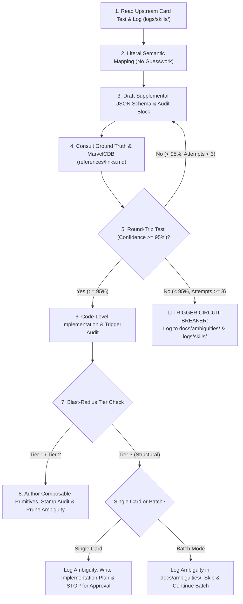

# Card Integration Protocol & Developer Guidelines

**Audience:** All engineers, AI pair programmers, and contributors to Marvel Champions Digital (MCD).  
**Authority:** Marvel Champions Rules Reference v1.8, ADR-0018, ADR-0019, ADR-0020, ADR-0021.

---

## 1. Core Mandates

1. **Zero Text-Scraping / Zero Assumptions (ADR-0019):** Card text is purely presentation data. Rules engine logic must never scrape or parse `card.text`.
2. **Zero Hardcoded Card IDs (ADR-0018):** Never write `if (card.code === '01002')` in the core engine. Always inspect declarative metadata, ability timings, and effect primitives.
3. **8-Point Socratic Q&A Deconstruction (ADR-0021):** Every ability must answer 8 fundamental questions: (1) Trigger & Timing, (2) Costs & Prerequisites, (3) Primary Target, (4) Search Zones & Scope (using Fully Qualified Game Zones: `ENCOUNTER_DECK`, `ENCOUNTER_DISCARD`, `PLAYER_DECK`, `PLAYER_DISCARD`, `SET_ASIDE_NEMESIS`, `SET_ASIDE_OUT_OF_PLAY`, `VICTORY_DISPLAY`), (5) State Mutation, (6) Mandatory Post-Resolution Side-Effects (`shuffleDeck: "ENCOUNTER_DECK" | "PLAYER_DECK"`), (7) Source Destination, (8) Contingencies & Fallback Branches.
4. **100% Parameter Completeness & Fully Qualified Game Zones (ADR-0021):** All parameters identified in the 8-point Q&A checklist MUST be explicitly encoded in `params` with fully qualified zones (e.g. `searchZones: ["ENCOUNTER_DECK", "ENCOUNTER_DISCARD"]`, `shuffleDeck: "ENCOUNTER_DECK"`). Ambiguous unqualified generic strings like `["DECK", "DISCARD"]` are strictly prohibited as engine-breaking.
5. **Mandatory Executable Abilities Schema (ADR-0021):** `mechanicSteps` and `comment` are human documentation. Every card with printed rules text MUST have its logic fully encoded in `abilities: [...]`. If `abilities` is missing or incomplete, confidence CANNOT exceed 50%. `noSupplementalNeeded: true` is strictly reserved for vanilla cards with 0 rules text.
6. **Exact Event Scoping (ADR-0020):** Conflating distinct entities (e.g. *Villain Schemes* vs *Minion Schemes*) is strictly prohibited.
7. **Mandatory vs. Optional Distinctions (ADR-0020):** `FORCED_` abilities resolve automatically; `INTERRUPT` and `RESPONSE` abilities are optional and require player choice.
8. **3-Tier Blast-Radius Guardrails (ADR-0021):** Tier 1 (fast-track) and Tier 2 (additive helpers) execute freely. Tier 3 (structural changes) requires formal implementation plan approval in single-card mode, or ambiguity queue isolation during batch mode.
9. **Round-Trip Decompiler Feedback Loop & Pessimistic Confidence Rubric:** 
   * Decompile **strictly** the structured `abilities: [...]` array into natural language (ignoring `comment` / `mechanicSteps`).
   * Compare against the printed upstream card text.
   * **Pessimistic Engine Support Principle:** In early-stage development, the engine is presumed **incapable** of supporting mechanics unless line-by-line TypeScript implementations and active pipeline trigger dispatches are verified.
   * If any trigger dispatch window is unverified (e.g. `WHEN_REVEALED` on attachments/minions), any secondary side-effect is unhandled (shuffling/exhaustion), or an interactive prompt is needed without UI state machines, confidence CANNOT exceed 80%.
   * If confidence remains $< 95\%$ after 3 refinement iterations, abort integration, strip `abilities: [...]`, and isolate in `docs/ambiguities/{pack}_{code}_{slug}.md` with exhaustive line-by-line engine gap reasoning.
10. **Active Abilities Isolation for Blocked Cards (ADR-0021):** If a card has an open ambiguity ($< 95\%$ confidence or Tier 3 blocker), the **`abilities: [...]` array MUST BE STRIPPED / OMITTED** from `src/data/supplemental/pack/*.json`. The entry retains ONLY `comment`, `audit` (with `ambiguityFile` and `reconstructedText`), and `mechanicSteps`. This guarantees that unsupported or partial abilities are never executed by the rules engine.
11. **Encapsulated Audit Tracking (ADR-0021):** Every card maintains an `audit` block with ISO timestamps including date and time (`YYYY-MM-DDTHH:mm`), confidence score, and **`reconstructedText`** (a machine-derived proof-of-work decompiled strictly from the `abilities: [...]` array to compare against original printed text).
12. **1-File-Per-Card Ambiguity Queue / Inbox Zero (ADR-0021):** Blocked cards live in `docs/ambiguities/{pack}_{code}_{slug}.md` and are deleted upon resolution.
13. **Canonical Card ID Key Sorting (ADR-0021):** When saving supplemental JSON files (`src/data/supplemental/pack/*.json`), always preserve ascending card ID order (e.g. `01001a` -> `01001b` -> `01002`). Never append new keys out-of-order at the bottom of the file.
14. **Real-Time Streaming Execution Logging (ADR-0021):** Every skill execution MUST append real-time audit trails with exact confidence scores to `logs/skills/card_integration_{YYYY-MM-DD}.log` as each individual card is evaluated and processed. **Buffering or logging in batch at the end of a run is strictly prohibited**, ensuring accurate ISO timestamps and live telemetry.
15. **Composable Generic Primitives & Strict Card Name Ban (ADR-0021):** New mechanics must be implemented as composable, reusable primitives rather than single-use card functions. **Effect primitive names must NEVER contain card names** (e.g. `HYDRA_BOMBER_CHOICE` or `NICK_FURY_CHOICE` are prohibited; use composable `PLAYER_CHOICE` with nested option sub-effects). Cards requiring interactive UI modals must be isolated to `docs/ambiguities/` (Tier 3).
16. **Scenario Plugin & Fan-Made Documentation Symmetry (ADR-0022):** Any addition, modification, schema change, or new lifecycle hook added to the Scenario Plugin Architecture (`src/engine/scenarios/`) MUST immediately trigger a corresponding update with explanations and examples in `docs/guidelines/scenario_creation_guide.md`. Community and third-party fan-made developer documentation must never drift from internal engine capabilities.

---

## 2. 🚦 Blast-Radius Change Tiers

| Tier | Scope | Approval Policy | Batch-Mode Behavior |
| :--- | :--- | :--- | :--- |
| **Tier 1 (Fast-Track)** | Supplemental JSON edits, new enum/union literals (`TriggerType`), switch `case` branches, unit tests. | Direct execution permitted. | Executes continuously. |
| **Tier 2 (Additive Generic Helpers)** | New pure helpers in `src/engine/effects/` (e.g. deck inspection, stack filtering). | Permitted with 0 regressions (`npm test`). | Executes continuously. |
| **🛑 Tier 3 (Structural Refactor Gate)** | Core state schemas (`GameState`, `PlayerState`), phase loops in `villain-phase.ts`, action dispatch contracts, major subsystem rewrites. | **STOP**: Create `implementation_plan.md` and wait for user approval. | **DO NOT HALT BATCH**: Log to `docs/ambiguities/`, skip card, continue batch scan, and present consolidated plan at the end. |

---

## 3. 📝 Logging Protocol (`logs/skills/`)

Every card inspection and resolution appends a structured entry with its verified confidence level:
```text
YYYY-MM-DDTHH:mm:ss.sssZ [INFO] Looking at card [card_name] #{card_code}
YYYY-MM-DDTHH:mm:ss.sssZ [INFO] Card [card_name] #{card_code} integrated without any code change required (Tier 1, confidence 98%).
YYYY-MM-DDTHH:mm:ss.sssZ [INFO] Card [card_name] #{card_code} integrated with code change (Tier 2, confidence 98%).
YYYY-MM-DDTHH:mm:ss.sssZ [WARN] Card [card_name] #{card_code} card ambiguity: Circuit-Breaker fired (confidence 70%) -> docs/ambiguities/{pack}_{code}_{slug}.md
YYYY-MM-DDTHH:mm:ss.sssZ [WARN] Card [card_name] #{card_code} card ambiguity: Structural Refactor Gate (Tier 3, confidence 80%) -> docs/ambiguities/{pack}_{code}_{slug}.md
```

---

## 4. The 8-Step Integration Protocol



### Detailed Steps:
1. **Ingest Upstream Text & Log:** Fetch exact printed text and append initial audit log in `logs/skills/`.
2. **Literal Semantic Mapping:** Identify timing, triggers, costs, targets, and constraints without guessing.
3. **Draft Supplemental Schema:** Mandate executable `abilities: [...]` for any active text.
4. **Consult Ground Truth:** Review Rules Reference v1.8 and MarvelCDB FAQ/rulings.
5. **Round-Trip Decompiler Feedback Loop:** Decompile `abilities` into natural language; assert 100% equivalence.
6. **Code-Level Primitive & Trigger Path Audit:** Open `src/engine/effects/index.ts` and `src/engine/pipeline/` to verify code handles all zones (deck/discard), shuffling, scaling, and actual runtime trigger emission.
7. **Composable Primitives & Blast-Radius Check:** If code gaps exist, apply Tier 2 generic fix or isolate as Tier 3 blocker.
8. **Stamp Audit Metadata, Sort Keys & Prune Ambiguities:** Stamp `YYYY-MM-DDTHH:mm`, sort keys canonically, and prune resolved files.
