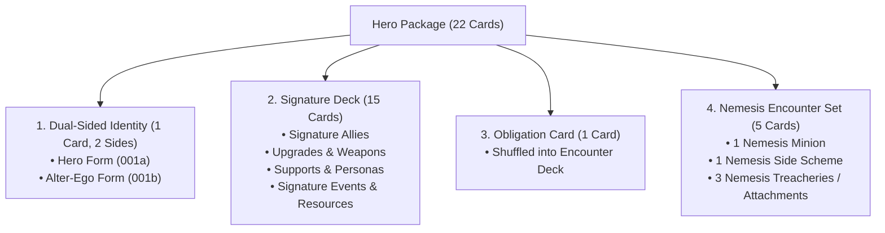

# Hero & Identity Creation Guide

> [!IMPORTANT]
> **Universal Hero Package Standard (ADR-0022 / Mandate #16):**  
> All built-in heroes and community fan-made heroes share the **exact same 22-card package anatomy, supplemental schema, and engine capabilities**.

This guide explains how to design, write, and integrate a custom **Hero Package** into **Marvel Champions Digital**.

---

## 1. The 22-Card Hero Anatomy

Every Hero package consists of exactly **22 cards**:



---

## 2. Step 1: Design the Dual-Sided Identity

The identity consists of two card entries sharing the same base code (`<code>a` for Hero, `<code>b` for Alter-Ego):

### Hero Card (`custom_001a`)
```json
{
  "code": "custom_001a",
  "name": "Daredevil",
  "type_code": "hero",
  "faction_code": "hero",
  "pack_code": "custom",
  "set_code": "daredevil",
  "is_unique": true,
  "health": 11,
  "hand_size": 5,
  "thwart": 2,
  "attack": 2,
  "defense": 2,
  "traits": "Avenger. Defender.",
  "text": "<b>Interrupt</b>: When you defend against an attack, deal 1 damage to the attacking enemy."
}
```

### Alter-Ego Card (`custom_001b`)
```json
{
  "code": "custom_001b",
  "name": "Matt Murdock",
  "type_code": "alter_ego",
  "faction_code": "hero",
  "pack_code": "custom",
  "set_code": "daredevil",
  "is_unique": true,
  "health": 11,
  "hand_size": 6,
  "recover": 3,
  "traits": "Attorney. Civilian.",
  "text": "<b>Action</b>: Exhaust Matt Murdock → remove 1 threat from a scheme."
}
```

### Declarative Supplemental Enrichment (`src/data/supplemental/`)
```json
{
  "custom_001a": {
    "comment": "HERO: Daredevil. Retaliate/Defense trigger.",
    "abilities": [
      {
        "id": "daredevil_defense_interrupt",
        "timing": "INTERRUPT",
        "trigger": "ATTACK",
        "effect": "DEAL_DAMAGE",
        "params": {
          "amount": 1,
          "target": "CHOSEN_ENEMY"
        }
      }
    ],
    "audit": {
      "createdAt": "2026-08-30T15:00",
      "updatedAt": "2026-08-30T15:00",
      "reviewedAt": "2026-08-30T15:00",
      "reviewedBy": "creator",
      "rulesVersion": "v1.8",
      "confidence": 98,
      "reconstructedText": "INTERRUPT (ATTACK while defending) -> DEAL_DAMAGE (amount: 1)"
    },
    "mechanicSteps": [
      "When Daredevil defends against an attack, deal 1 damage to the attacker."
    ]
  },
  "custom_001b": {
    "comment": "ALTER-EGO: Matt Murdock. Exhaust to remove 1 threat.",
    "abilities": [
      {
        "id": "matt_murdock_action",
        "timing": "ALTER_EGO_ACTION",
        "cost": {
          "exhaustSelf": true
        },
        "effect": "REMOVE_THREAT",
        "params": {
          "amount": 1,
          "target": "CHOSEN_SCHEME"
        }
      }
    ],
    "audit": {
      "createdAt": "2026-08-30T15:00",
      "updatedAt": "2026-08-30T15:00",
      "reviewedAt": "2026-08-30T15:00",
      "reviewedBy": "creator",
      "rulesVersion": "v1.8",
      "confidence": 98,
      "reconstructedText": "ALTER_EGO_ACTION: Exhaust -> REMOVE_THREAT (amount: 1)"
    },
    "mechanicSteps": [
      "Exhaust Matt Murdock to remove 1 threat from a scheme."
    ]
  }
}
```

---

## 3. Step 2: Assemble the 15-Card Signature Deck

A hero's 15 signature cards must all have `set_code` matching the hero (`"daredevil"`):

| Card Type | Typical Count | Purpose | Example |
| :--- | :--- | :--- | :--- |
| **Signature Ally** | 1 | Hero's iconic sidekick / partner. | *Elektra* or *Foggy Nelson* |
| **Signature Upgrades** | 2–4 | Weapons, armor, suits, and combat tech. | *Billy Club*, *Baton* |
| **Signature Supports** | 1–2 | Base of operations, personas, vehicles. | *Nelson & Murdock Law Office* |
| **Signature Events** | 6–9 | Signature Attacks, Thwarts, and Defenses. | *Blind Justice*, *Radar Sense* |
| **Signature Resources** | 1–2 | Triple or double wild resources. | *Heightened Senses* |

### Example: Signature Upgrade (*Billy Club*)
```json
{
  "code": "custom_002",
  "name": "Billy Club",
  "type_code": "upgrade",
  "cost": 2,
  "set_code": "daredevil",
  "traits": "Weapon.",
  "text": "<b>Hero Action</b>: Exhaust Billy Club → choose: deal 2 damage to an enemy, or stun an enemy."
}
```

---

## 4. Step 3: Author the Obligation Card

Every hero requires exactly 1 obligation card shuffled into the encounter deck during Step 5 of Game Setup:

```json
{
  "code": "custom_016",
  "name": "Pro Bono Case",
  "type_code": "obligation",
  "set_code": "daredevil",
  "text": "<b><i>Give to the Matt Murdock player.</i></b>\nYou may flip to alter-ego form. Choose:\n• Exhaust Matt Murdock → remove Pro Bono Case from the game.\n• Discard 2 random cards from your hand. Discard this obligation."
}
```

---

## 5. Step 4: Create the 5-Card Nemesis Encounter Set

The Nemesis encounter set provides the nemesis cards set aside at the start of the game:

1. **Nemesis Minion (1 card):** Unique minion entering play engaged with the hero (e.g. *Bullseye*, 4 HP, 2 SCH, 2 ATK, `Quickstrike`).
2. **Nemesis Side Scheme (1 card):** Enters play with base threat (e.g. *Target in Sight*, 3 base threat per player, Hazard icon).
3. **Nemesis Treacheries / Attachments (3 cards):** Thematic hazards shuffled into the encounter deck by *Shadow of the Past* (`01190`).

### Example: Nemesis Minion (*Bullseye*)
```json
{
  "code": "custom_017",
  "name": "Bullseye",
  "type_code": "minion",
  "faction_code": "encounter",
  "set_code": "daredevil_nemesis",
  "is_unique": true,
  "health": 5,
  "scheme": 1,
  "attack": 2,
  "traits": "Assassin. Criminal.",
  "text": "Quickstrike. <b>Forced Response</b>: After Bullseye attacks you, deal 1 damage to your hero."
}
```

---

## 6. Step 5: Verify & Test

Write an automated test suite in `tests/engine/` testing your custom hero:

```typescript
import { describe, it, expect } from 'vitest';
import { cardCatalog } from '@data/card-loader';
import { setupGame } from '@engine/state/game-setup';
import { dispatchAction } from '@engine/pipeline';

describe('Custom Hero: Daredevil', () => {
  it('Initializes Daredevil with full 15-card deck and set-aside nemesis cards', () => {
    const hero = cardCatalog.getCard('custom_001a') as any;
    const alterEgo = cardCatalog.getCard('custom_001b') as any;

    const state = setupGame({
      scenarioId: 'rhino',
      players: [
        {
          id: 'p1',
          name: 'Player 1',
          hero,
          alterEgo,
          deckCards: Array(15).fill(cardCatalog.getCard('custom_002')!),
        },
      ],
      villain: cardCatalog.getCard('01094') as any,
      mainScheme: cardCatalog.getCard('01097b') as any,
      encounterCards: cardCatalog.getCardsBySet('rhino'),
    });

    expect(state.players[0].setAsideCards.length).toBe(5);
    expect(state.players[0].health).toBe(11);
  });
});
```

---

## 7. Related References
* [Supplemental Data Schema Specification](../specifications/supplemental_data_schema.md)
* [Scenario Creation Guide](./scenario_creation_guide.md)
* [Card Integration Protocol (SKILL.md)](../../.agents/skills/card-integration-protocol/SKILL.md)
