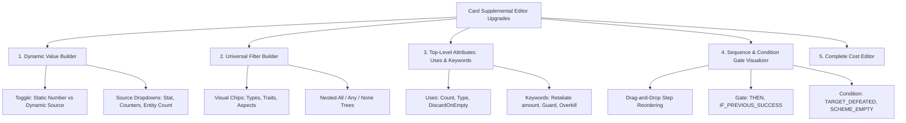

# Card Supplemental Schema, Engine Capabilities & Card Editor Audit Report

* **Date:** 2026-09-13
* **Status:** Draft / Active Discussion
* **Scope:** Supplemental Zod Schema, Headless Engine Handling, Specification Documentation, and Interactive Card Editor UI

---

## Executive Summary

This audit evaluates the declarative supplemental layer, the headless rules engine, the documentation specifications, and the interactive Card Supplemental Editor ([src/ui/components/editor/](src/ui/components/editor/)).

The engine and supplemental schema have evolved rapidly through recent Architecture Decision Records (ADRs):
- Composable Predicate Filtering ([ADR-0046](docs/decisions/0046-universal-declarative-card-filtering-architecture.md))
- Out-of-Hand Zone Plays ([ADR-0047](docs/decisions/0047-playing-cards-from-non-hand-zones.md))
- Timing vs. Trigger Disambiguation ([ADR-0048](docs/decisions/0048-ability-timing-vs-trigger-condition-disambiguation.md))
- Dynamic Value Evaluators & Transformers ([ADR-0049](docs/decisions/0049-composable-value-transformers-and-event-interception.md), [ADR-0052](docs/decisions/0052-centralized-dynamic-formula-and-state-value-evaluator-engine.md))
- Self-Referential In-Play Instance Binding ([ADR-0050](docs/decisions/0050-universal-in-play-self-referential-trigger-instance-binding.md))
- Two-Stage In-Play Action Prompts ([ADR-0051](docs/decisions/0051-universal-two-stage-in-play-card-interaction-and-action-selection.md))
- Infinite Trigger Loop Detection ([ADR-0053](docs/decisions/0053-infinite-trigger-loop-detection-and-prevention-guardrails.md))
- Parameterized Keyword Stacking & Retaliate ([ADR-0054](docs/decisions/0054-parameterized-keyword-stacking-and-retaliate-value-accumulation-engine.md))
- Universal Ability Resource Payment ([ADR-0055](docs/decisions/0055-universal-ability-resource-payment-and-action-verb-unification.md))
- Unified Comic Pop-Art Dialog Design System ([ADR-0056](docs/decisions/0056-unified-comic-pop-art-modal-and-dialog-design-system.md))
- Universal Uses Counter Depletion and Discard Lifecycle ([ADR-0057](docs/decisions/0057-universal-uses-counter-depletion-and-discard-lifecycle-architecture.md))

However, the **Card Supplemental Editor UI** ([src/ui/components/editor/AbilityFormBuilder.tsx](src/ui/components/editor/AbilityFormBuilder.tsx) and [src/ui/components/editor/effect-parameter-registry.ts](src/ui/components/editor/effect-parameter-registry.ts)) currently supports only flat, basic parameters and lacks visual builders for dynamic formulas, composable filters, multi-step sequence condition gates, and comprehensive cost structures.

---

## 🔍 Section 1: Schema Audit ([src/data/supplemental/schema.ts](src/data/supplemental/schema.ts))

### 1.1 Trigger Types (`TriggerTypeSchema`)
Currently defines **40 trigger types**:
- **Strengths:** Comprehensive coverage across player actions, combat pipelines, and villain phase triggers.
- **Identified Issues & Gaps:**
  1. **Duplicate / Overlapping Aliases:**
     - `TAKE_ATTACK_DAMAGE` vs. `TAKE_DAMAGE` vs. `DAMAGE_TAKEN`
     - `ROUND_END` vs. `ROUND_ENDED`
     - `CARD_PLAYED` vs. `PLAYED`
  2. **Missing In-Flight Combat Triggers:**
     - `CHARACTER_DEFEATED` (generalized character defeat, distinct from `MINION_DEFEATED` and `HOST_DEFEATED`)
     - `ATTACK_DECLARED` (distinct from `VILLAIN_INITIATES_ATTACK` for player/ally attacks)

### 1.2 Effect Primitives (`EffectTypeSchema`)
Currently defines **75 effect primitives**:
- **Strengths:** 100% codebase-grounded with direct handlers in [src/engine/effects/index.ts](src/engine/effects/index.ts).
- **Identified Issues & Gaps:**
  1. **Legacy Ad-Hoc Primitives:** Several single-use effects remain from early iterations:
     - `EXPLOSION` (can be expressed via `DEAL_DAMAGE_ALL_ENEMIES` + `DynamicValueSource`)
     - `FORM_BRANCH_VILLAIN_ATTACK_OR_SURGE` (can be expressed via `FORM_BRANCH`)
     - `NICK_FURY_CHOICE` (can be expressed via `PLAYER_CHOICE`)
     - `HULK_DISCARD_RESOLUTION` (can be expressed via `DISCARD` + `DynamicValueSource`)
  2. **Duplicate Naming Aliases:**
     - `ADD_COUNTER` vs. `ADD_COUNTERS`
     - `REMOVE_COUNTER` vs. `REMOVE_COUNTERS`
     - `MODIFY_ALLY_LIMIT` vs. `ALLY_LIMIT_BONUS`

### 1.3 Target Selector Types (`TargetSelectorSchema`)
Currently defines **26 selector types**:
- **Strengths:** Expanded with `TRIGGERING_MINION` and `TRIGGERING_ENEMY`.
- **Identified Issues & Gaps:**
  1. **Side Scheme Target Selectors:** Missing `TRIGGERING_SCHEME` and `CHOSEN_SIDE_SCHEME` (currently mapped generically to `SIDE_SCHEME` or by explicit `cardCode`).

### 1.4 Top-Level Card Attributes (`CardEnrichmentSchema`)
- **Strengths:** Supports `uses`, `playRequirements`, `keywords`, `restrictedSlots`, `additionalBoostCards`, `isLandscape`, and full `audit` metadata.
- **Identified Issues & Gaps:**
  1. `CardUsesSchema` does not have a standardized enum for counter types (`arrow`, `all-purpose`, `web`, `growth`, `charge`, etc.).

---

## ⚙️ Section 2: Engine Supplemental Handling Audit

### 2.1 Dynamic Value Evaluator ([src/engine/effects/dynamic-formula-evaluator.ts](src/engine/effects/dynamic-formula-evaluator.ts))
- **Status:** **High Conformity (ADR-0049 & ADR-0052).**
- Resolves:
  - `INTERCEPTED_VALUE`: Captured value from trigger events (damage, threat).
  - `PREVIOUS_RESULT`: Return value from immediate preceding step in an ability sequence.
  - `DISCARDED_COUNT`: Number of cards discarded in preceding step.
  - `COUNTERS`: Dynamic counter count from a designated entity or card.
  - `STAT_VALUE`: Evaluates character stats (`SUFFERED_DAMAGE`, `ATTACK`, `HERO_ATK`, `THWART`, `DEFENSE`, `RECOVERY`).
  - `ENTITY_COUNT`: Counts entities matching a `filter` across player boards or encounter zones.
  - `CARD_ATTRIBUTE`: Inspects card attributes (`BOOST_ICONS`, `PRINTED_RESOURCES`, `PRINTED_COST`).
- Includes support for `multiplier`, `offset`, and `clamp` (`min`, `max`).

### 2.2 Universal Card Filter Engine ([src/engine/filters/card-filter.ts](src/engine/filters/card-filter.ts))
- **Status:** **Fully Generalized (ADR-0046).**
- Recursively processes atomic filter criteria across `all`, `any`, and `none` branch nodes.

### 2.3 Interactive Prompt & Cost Engines
- **Status:** **Compliant (ADR-0051 & ADR-0055).**
- Requires `paymentCardInstanceIds` when abilities specify `resourceCost`.

---

## 📚 Section 3: Documentation Audit ([docs/specifications/](docs/specifications/))

1. **Stale Schema Specification ([docs/specifications/supplemental_data_schema.md](docs/specifications/supplemental_data_schema.md)):**
   - References legacy flat effect schemas and predates `UniversalCardFilter` (ADR-0046) and `DynamicValueSource` (ADR-0049, ADR-0052).
2. **Supplemental Documentation Chapters ([docs/specifications/supplemental/](docs/specifications/supplemental/)):**
   - Chapters 01 through 11 are well-structured, but need synchronization with recently introduced parameters (`requiresModal`, `targetInstanceId`, `cardCode` targeting in `ADD_THREAT`, `DynamicValueSource`).
3. **ADR Index ([docs/decisions/README.md](docs/decisions/README.md)):**
   - Maintained through ADR-0056 and ADR-0057.

---

## 🛠️ Section 4: Card Supplemental Editor Findings & Gaps

| Component | Current State | Missing Capability / Gap |
| :--- | :--- | :--- |
| **[src/ui/components/editor/effect-parameter-registry.ts](src/ui/components/editor/effect-parameter-registry.ts)** | Maps 75 effect descriptors to UI field types | 1. Missing parameter descriptors for newer fields: `cardCode` on `ADD_THREAT`, `DynamicValueSource` builder on `count`/`amount`, and nested `filter` visual picker. 2. Parameter types restricted to simple primitives (`number`, `text`, `select`, `boolean`). |
| **[src/ui/components/editor/AbilityFormBuilder.tsx](src/ui/components/editor/AbilityFormBuilder.tsx)** | Form for single-step abilities, timing, comments, and play requirements | 1. **No Visual `DynamicValueSource` Builder:** Forces users into raw static numbers or manual JSON editing in [src/ui/components/editor/RawJsonEditor.tsx](src/ui/components/editor/RawJsonEditor.tsx). 2. **No Composable `UniversalCardFilter` Builder:** Only accepts simple trait/type string inputs. 3. **Incomplete Cost Builder:** Missing UI inputs for `damageHero`, `damageSelf`, `spendCounters`, and `discardCard`. 4. **Missing Sequence Condition Gates:** No visual selector for step `gate` (`THEN`, `IF_PREVIOUS_SUCCESS`) or step `condition` (`TARGET_DEFEATED`, `SCHEME_EMPTY`). 5. **Missing `uses` & `keywords` UI:** Top-level card attributes form lacks structured keyword configuration (`{ keyword, amount }`) and `uses` counters configuration. |
| **[src/ui/components/editor/DualCardInspector.tsx](src/ui/components/editor/DualCardInspector.tsx)** | Dual-panel showing upstream card + raw/form supplemental data | Lacks simulated testing or preview of declarative ability resolution. |
| **[src/ui/components/editor/CardFilterToolbar.tsx](src/ui/components/editor/CardFilterToolbar.tsx)** | Filters gallery by pack, hero, aspect, status | Functioning well; could add filters for "Has Multi-Step Ability" and "Missing Audit". |

---

## 💡 Suggestions & Roadmap for Streamlining the Card Editor

### 🎯 Proposition 1: Visual Dynamic Value Builder
Create a dedicated `<DynamicValueBuilder>` form control in [src/ui/components/editor/AbilityFormBuilder.tsx](src/ui/components/editor/AbilityFormBuilder.tsx):
- Toggle between **Static Value** and **Dynamic Formula**.
- Dropdowns for `from` (`STAT_VALUE`, `COUNTERS`, `ENTITY_COUNT`, `DISCARDED_COUNT`, `INTERCEPTED_VALUE`, `PREVIOUS_RESULT`, `CARD_ATTRIBUTE`).
- Parameter inputs for `stat` (`SUFFERED_DAMAGE`, `HERO_ATK`), `counterType`, `multiplier`, `offset`, and `clamp`.

### 🎯 Proposition 2: Visual Composable Card Filter Builder
Create a dedicated `<UniversalCardFilterBuilder>` component:
- Visual chip selectors for `types` (`Ally`, `Upgrade`, `Support`, `Event`, `Minion`, `Treachery`), `traits` (`Avenger`, `Tech`), `aspects`, and cost comparison range (`min`, `max`).
- Visual nesting controls for `all`, `any`, and `none` groups without requiring manual JSON authoring.

### 🎯 Proposition 3: Top-Level Attributes Editor (Uses & Keywords)
Expand the card metadata accordion in [src/ui/components/editor/AbilityFormBuilder.tsx](src/ui/components/editor/AbilityFormBuilder.tsx):
- **Structured Keywords Matrix:** Visual toggle chips for keywords (`Guard`, `Overkill`, `Ranged`, `Toughness`, `Retaliate` with numeric input).
- **Uses (X) Configuration:** Inputs for `count`, `type` (`"arrow"`, `"charge"`), `max`, and `discardOnEmpty` checkbox.
- **Restricted Slots & Boost Cards:** Numeric inputs for `restrictedSlots` and `additionalBoostCards`.

### 🎯 Proposition 4: Multi-Step Sequence & Condition Gate Builder
Add an interactive sequence pipeline editor for multi-step abilities:
- Step reordering and drag handles.
- Visual Condition Gate selector between steps (`THEN`, `IF_PREVIOUS_SUCCESS`, `IF_AMOUNT_ZERO`, `IF_FAILED`).
- Step Milestone Condition selector (`TARGET_DEFEATED`, `SCHEME_EMPTY`, `STATUS_APPLIED`, `RESOURCE_KICKER_MET`).

### 🎯 Proposition 5: Full Cost Specification Builder
Expand the ability cost section:
- Checkboxes for `exhaustSelf`, `discardSelf`.
- Resource cost picker (Physical, Energy, Mental, Wild counts).
- Counter expenditure configuration (`amount`, `counterType`, `target: SELF | IDENTITY`).
- Hero self-damage inputs (`damageHero`, `damageSelf`).

---

## 📌 Phased Implementation Plan

1. **Phase 1: Foundation & GitHub Issues (Current Stage):**
   - Review and refine this audit report.
   - File tracking issues for identified schema redundancies and documentation drift.
2. **Phase 2: Post-ADR-0057 Pass:**
   - Re-verify counter depletion lifecycle and `uses` parameters once ADR-0057 implementation is finalized.
3. **Phase 3: Editor Parameter Registry & Sub-Builders Implementation:**
   - Update [src/ui/components/editor/effect-parameter-registry.ts](src/ui/components/editor/effect-parameter-registry.ts).
   - Implement `<DynamicValueBuilder>` and `<UniversalCardFilterBuilder>`.
   - Implement `<CostBuilder>`, `<SequenceStepBuilder>`, and top-level `<CardAttributesBuilder>`.
4. **Phase 4: Acceptance Testing & Verification:**
   - Add comprehensive component tests in `tests/ui/` covering all new visual builders and form roundtrips.
