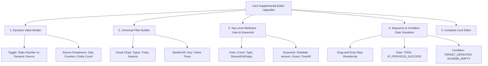
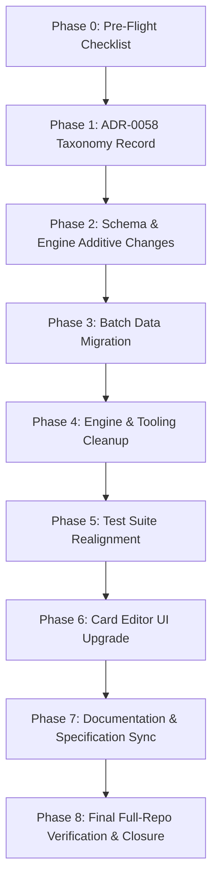

# Card Supplemental Schema, Engine Capabilities & Card Editor Audit Report

- **Date:** 2026-09-13
- **Status:** Approved — In Execution
- **Scope:** Supplemental Zod Schema, Headless Engine Handling, Specification Documentation, and Interactive Card Editor UI

---

## Executive Summary

This audit evaluates the declarative supplemental layer, the headless rules engine, the documentation specifications, and the interactive Card Supplemental Editor ([src/ui/components/editor/](src/ui/components/editor/)).

The engine and supplemental schema have evolved rapidly through recent Architecture Decision Records (ADRs):

- Composable Predicate Filtering ([ADR-0046](docs/decisions/0046-universal-declarative-card-filtering-architecture.md))
- Out-of-Hand Zone Plays ([ADR-0047](docs/decisions/0047-playing-cards-from-non-hand-zones.md))
- Timing vs. Trigger Disambiguation ([ADR-0048](docs/decisions/0048-ability-timing-vs-trigger-condition-disambiguation.md))
- Dynamic Value Evaluators & Transformers ([ADR-0049](docs/decisions/0049-composable-value-transformers-and-event-interception.md), [ADR-0052](docs/decisions/0052-centralized-dynamic-formula-and-state-value-evaluator-engine.md))
- Self-Referential In-Play Instance Binding ([ADR-0050](docs/decisions/0050-universal-in-play-self-referential-trigger-instance-binding.md))
- Two-Stage In-Play Action Prompts ([ADR-0051](docs/decisions/0051-universal-two-stage-in-play-card-interaction-and-action-selection.md))
- Infinite Trigger Loop Detection ([ADR-0053](docs/decisions/0053-infinite-trigger-loop-detection-and-prevention-guardrails.md))
- Parameterized Keyword Stacking & Retaliate ([ADR-0054](docs/decisions/0054-parameterized-keyword-stacking-and-retaliate-value-accumulation-engine.md))
- Universal Ability Resource Payment ([ADR-0055](docs/decisions/0055-universal-ability-resource-payment-and-action-verb-unification.md))
- Unified Comic Pop-Art Dialog Design System ([ADR-0056](docs/decisions/0056-unified-comic-pop-art-modal-and-dialog-design-system.md))
- Universal Uses Counter Depletion and Discard Lifecycle ([ADR-0057](docs/decisions/0057-universal-uses-counter-depletion-and-discard-lifecycle-architecture.md))

While the headless engine and schema are robust, the **Card Supplemental Editor UI** ([src/ui/components/editor/AbilityFormBuilder.tsx](src/ui/components/editor/AbilityFormBuilder.tsx) and [src/ui/components/editor/effect-parameter-registry.ts](src/ui/components/editor/effect-parameter-registry.ts)) currently supports only flat, basic parameters and lacks visual builders for dynamic formulas, composable filters, multi-step sequence condition gates, and comprehensive cost structures.

---

## 🏛️ Foundational Design Principles & Taxonomy Rules

To achieve a clean, maintainable, and mathematically consistent declarative layer across all cards, we establish 5 core naming invariants:

1. **"CARD" is Superfluous:** In a card game engine, `DRAW`, `DISCARD`, `ENTERS_PLAY`, `REVEAL` naturally operate on cards. The token `CARD` is omitted from primitives, triggers, and selectors unless required for disambiguation (e.g. `CARD_ATTRIBUTE` vs `STAT_VALUE`).
2. **Grammatical Structure by Category:**
   - **Triggers (Events):** `[SUBJECT]_[VERB_TENSE]` (e.g. `DAMAGE_TAKEN`, `SCHEME_DEFEATED`, `ROUND_ENDED`).
   - **Effect Primitives (Commands):** `[IMPERATIVE_VERB]_[TARGET_OR_QUALIFIER]` (e.g. `DRAW`, `DEAL_DAMAGE`, `ADD_COUNTERS`, `REMOVE_THREAT`, `MODIFY_STAT`).
3. **Temporal Verb Tenses (RR v1.8 Priority):**
   - **Interrupts (Prospective/Pre-Resolution):** Subjunctive `_WOULD_BE_` or `_INITIATES_` (e.g. `DAMAGE_WOULD_BE_TAKEN`, `THREAT_WOULD_BE_PLACED`, `ENEMY_INITIATES_ATTACK`).
   - **Responses (Post-Resolution):** Past participle (e.g. `DAMAGE_TAKEN`, `THREAT_PLACED`, `CARD_PLAYED`, `DEFEATED`, `ROUND_ENDED`).
4. **Strict Pluralization for Multi-Entity Operations:** Anything that can affect $1$ to $N$ items uses a plural name (e.g. `ADD_COUNTERS`, `REMOVE_COUNTERS`, `DRAW`, `DISCARD`). Dual single/plural variant names are prohibited.
5. **Zero Single-Use / Legacy Tech Debt:** Single-card bespoke primitives are deprecated and decomposed into composable primitives + `DynamicValueSource`.

---

## 🔍 Section 1: Schema Audit & Canonical Naming Taxonomy

### 1.1 Trigger Types (`TriggerTypeSchema`)

#### A. Defeat & Lifecycle Windows

| Canonical Trigger        | Meaning & Supported Context                                                                                                                | Replaces / Consolidates                                                                                      |
| :----------------------- | :----------------------------------------------------------------------------------------------------------------------------------------- | :----------------------------------------------------------------------------------------------------------- |
| **`DEFEATED`**           | Universal root trigger emitted whenever any entity is defeated. Context provides `entityType` (`'CHARACTER'`, `'SCHEME'`, `'ATTACHMENT'`). | `MINION_DEFEATED`, `MINION_DEFEATED_BY_ATTACK`, `ENEMY_DEFEATED_BY_HERO_ATTACK`, `HOST_DEFEATED`, `DEFEATED` |
| **`CHARACTER_DEFEATED`** | Explicit trigger for when a character (Hero, Ally, Minion, Villain) is reduced to 0 HP and defeated.                                       | `MINION_DEFEATED`, `HOST_DEFEATED`                                                                           |
| **`SCHEME_DEFEATED`**    | Explicit trigger for when a scheme (Side Scheme or Main Scheme) is defeated / cleared of threat.                                           | `SCHEME_THREAT_REDUCED_TO_ZERO`                                                                              |
| **`ENTERS_PLAY`**        | Card enters the in-play zone. Context provides entering card instance and controller.                                                      | `ENTERS_PLAY`, `MINION_ENTERS_PLAY`                                                                          |
| **`CARD_PLAYED`**        | Card was actively played from hand or non-hand zone with resources paid.                                                                   | `CARD_PLAYED`, `PLAYED`                                                                                      |

#### B. Combat & Damage Windows

| Canonical Trigger            | Timing / Tense          | Meaning                                                                                                                |
| :--------------------------- | :---------------------- | :--------------------------------------------------------------------------------------------------------------------- |
| **`ENEMY_INITIATES_ATTACK`** | Interrupt (Prospective) | Enemy declares attack against player identity / character. Replaces `VILLAIN_INITIATES_ATTACK`.                        |
| **`DAMAGE_WOULD_BE_TAKEN`**  | Interrupt (Prospective) | Damage calculated and about to be dealt (prevention/replacement window). Replaces `TAKE_ATTACK_DAMAGE`, `TAKE_DAMAGE`. |
| **`DAMAGE_TAKEN`**           | Response (Past)         | Damage was successfully dealt and applied to hit points.                                                               |
| **`ATTACK_DEFENDED`**        | Response (Past)         | Identity or ally successfully exhausted to defend against an attack. Replaces `HERO_DEFENDED_ATTACK`.                  |
| **`ATTACK_RESOLVED`**        | Response (Past)         | Full attack execution pipeline concluded.                                                                              |
| **`THWART_RESOLVED`**        | Response (Past)         | Full thwart execution pipeline concluded.                                                                              |

#### C. Threat & Scheme Windows

| Canonical Trigger            | Timing / Tense          | Meaning                                                                             |
| :--------------------------- | :---------------------- | :---------------------------------------------------------------------------------- |
| **`THREAT_WOULD_BE_PLACED`** | Interrupt (Prospective) | Threat is about to be placed on a scheme (Great Responsibility / Emergency window). |
| **`THREAT_PLACED`**          | Response (Past)         | Threat was successfully added to a scheme.                                          |
| **`MAIN_SCHEME_ADVANCED`**   | Response (Past)         | Main scheme exceeded threshold and advanced to next stage.                          |

#### D. Form, Status, Phase & Encounter Windows

| Canonical Trigger                                 | Timing / Meaning                                                          | Replaces                                                            |
| :------------------------------------------------ | :------------------------------------------------------------------------ | :------------------------------------------------------------------ |
| **`FORM_CHANGED`**                                | Form change completed (context carries `newForm: 'hero' \| 'alter_ego'`). | `FORM_CHANGED_TO_HERO`, `FORM_CHANGED_TO_ALTER_EGO`, `HERO_FLIPPED` |
| **`STATUS_REMOVED`**                              | Status card (Stunned, Confused, Tough) was discarded / cured.             | _New primitive companion trigger_                                   |
| **`WHEN_REVEALED`**                               | When-revealed resolution / interrupt window.                              | `WHEN_REVEALED`, `TREACHERY_REVEALED`                               |
| **`ROUND_BEGAN` / `ROUND_ENDED`**                 | Round lifecycle boundaries.                                               | `ROUND_END`, `ROUND_ENDED`                                          |
| **`PLAYER_PHASE_BEGAN` / `PLAYER_PHASE_ENDED`**   | Player phase boundaries.                                                  | `PHASE_START`                                                       |
| **`VILLAIN_PHASE_BEGAN` / `VILLAIN_PHASE_ENDED`** | Villain phase boundaries.                                                 | —                                                                   |

---

### 1.2 Effect Primitives (`EffectTypeSchema`)

#### A. Card & Zone Operations (No "CARD", Always Plural)

| Canonical Effect        | Parameter Schema & Description                                                                                                                                                                                                                                                                                   | Replaces                                                                                                           |
| :---------------------- | :--------------------------------------------------------------------------------------------------------------------------------------------------------------------------------------------------------------------------------------------------------------------------------------------------------------- | :----------------------------------------------------------------------------------------------------------------- |
| **`DRAW`**              | `{ count?: number \| DynamicValueSource, limit?: 'HAND_SIZE' \| 'PRINTED_HAND_SIZE', target?: TargetSelector }`                                                                                                                                                                                                  | `DRAW_CARDS`                                                                                                       |
| **`DISCARD`**           | `{ count?: number \| 'ALL' \| DynamicValueSource, source?: 'HAND' \| 'DECK' \| 'TABLEAU' \| 'HOST' \| 'SELF', filter?: UniversalCardFilter, mode?: 'CHOSEN' \| 'RANDOM' \| 'TOP' }`                                                                                                                              | `DISCARD`, `DISCARD_CARDS`                                                                                         |
| **`PUT_INTO_PLAY`**     | `{ destination?: 'TABLEAU' \| 'ENGAGED_WITH_PLAYER', engagedWith?: 'SELF' \| 'TARGET', target?: TargetSelector }`                                                                                                                                                                                                | `PUT_INTO_PLAY`, `PUT_INTO_PLAY_ENGAGED`, `SPAWN_MINION_ENGAGED`                                                   |
| **`PLAY_FROM_ZONE`**    | `{ source: 'PLAYER_DISCARD' \| 'ANY_PLAYER_DISCARD' \| 'PLAYER_DECK' \| 'SET_ASIDE', filter?: UniversalCardFilter, costMode?: 'PRINTED_COST' \| 'FREE' \| 'REDUCED' }`                                                                                                                                           | `PLAY_CARD_FROM_ZONE`                                                                                              |
| **`SEARCH`**            | `{ source: 'PLAYER_DECK' \| 'ENCOUNTER_DECK' \| 'PLAYER_DISCARD' \| 'ENCOUNTER_DISCARD' \| 'PLAYER_HAND', lookCount?: number \| DynamicValueSource, takeCount?: number, filter?: UniversalCardFilter, selectedDestination?: 'HAND' \| 'TABLEAU' \| 'DECK_TOP' \| 'DISCARD', autoSelectIfUnambiguous?: boolean }` | `SEARCH_AND_SELECT`, `SEARCH_AND_PLAY_UPGRADE`, `RETRIEVE_CARD_FROM_DISCARD`, `RETRIEVE_TECH_UPGRADE_FROM_DISCARD` |
| **`RETURN_TO_HAND`**    | `{ target?: TargetSelector, filter?: UniversalCardFilter }`                                                                                                                                                                                                                                                      | `RETURN_TO_HAND`, `RETURN_FACEDOWN_CARDS_TO_OWNERS`                                                                |
| **`SHUFFLE_INTO_DECK`** | `{ source?: 'DISCARD' \| 'HAND' \| 'PLAY', target?: TargetSelector }`                                                                                                                                                                                                                                            | `SHUFFLE_DISCARD_INTO_DECK`, `SHUFFLE_INTO_DECK`                                                                   |

> [!NOTE]
> **`SEARCH` Consolidation Rationale:** `RETRIEVE_CARD_FROM_DISCARD` / `RETRIEVE_TECH_UPGRADE_FROM_DISCARD` are a redundant, hand-rolled special case of `SEARCH` with `source: 'PLAYER_DISCARD'` — both scan a zone, apply a `UniversalCardFilter`, and route matches to a destination. The rename from `SEARCH_AND_SELECT` to `SEARCH` aligns with RR v1.8 p. 26 ("Search") and drops the narrative `_AND_SELECT` suffix (selection is implied by every zone-inspection primitive). To preserve the current silent/automatic UX of `RETRIEVE_*` (no prompt when there is only one valid outcome), `SEARCH` gains a new `autoSelectIfUnambiguous?: boolean` param (default `true`): when the number of matching candidates is `<= takeCount`, the effect resolves automatically without a `PendingDecisionPrompt`. This also benefits every other `SEARCH` call with an equivalently unambiguous match set.
>
> **Considered Alternative (Rejected for Now):** Splitting into `SEARCH` (full-zone, `lookCount` omitted, RR p. 26) vs. `LOOK_AT` (top-N, `lookCount` set, RR p. 19 "Look at") would more precisely mirror the two distinct RR phrases, but adds a second enum value for a distinction the existing `lookCount` param already self-documents. Revisit only if Card Editor UX reviewers need the RR terms to be visually separated.

#### B. Combat, Damage & Threat Primitives

| Canonical Effect     | Parameter Schema & Description                                                                             | Replaces                                                              |
| :------------------- | :--------------------------------------------------------------------------------------------------------- | :-------------------------------------------------------------------- |
| **`DEAL_DAMAGE`**    | `{ amount: number \| DynamicValueSource, target: TargetSelector, overkill?: boolean, ranged?: boolean }`   | `DEAL_DAMAGE`, `DEAL_DAMAGE_ALL_ENEMIES`                              |
| **`HEAL_DAMAGE`**    | `{ amount: number \| DynamicValueSource, target: TargetSelector }`                                         | `HEAL_DAMAGE`, `HEAL_DAMAGE_WITH_SURGE`                               |
| **`PREVENT_DAMAGE`** | `{ amount: number \| 'ALL' \| DynamicValueSource, target?: TargetSelector }`                               | `PREVENT_DAMAGE`, `CONSUME_INTERCEPTED_EVENT`                         |
| **`REMOVE_THREAT`**  | `{ amount: number \| DynamicValueSource, target: TargetSelector }`                                         | `REMOVE_THREAT`                                                       |
| **`ADD_THREAT`**     | `{ amount: number \| DynamicValueSource, target: TargetSelector, cardCode?: string, perPlayer?: boolean }` | `ADD_THREAT`, `ADD_THREAT_PER_PLAYER`, `PLACE_THREAT_PER_SIDE_SCHEME` |

#### C. Counters & Status Primitives (Symmetric Status & Strict Plural Counters)

| Canonical Effect      | Parameter Schema & Description                                                                                                                               | Replaces                                                                                 |
| :-------------------- | :----------------------------------------------------------------------------------------------------------------------------------------------------------- | :--------------------------------------------------------------------------------------- |
| **`ADD_COUNTERS`**    | `{ amount: number \| DynamicValueSource, counterType?: string, target?: TargetSelector }`                                                                    | `ADD_COUNTER`, `ADD_COUNTERS`                                                            |
| **`REMOVE_COUNTERS`** | `{ amount: number \| 'ALL' \| DynamicValueSource, counterType?: string, target?: TargetSelector, filter?: UniversalCardFilter, discardWhenEmpty?: boolean }` | `REMOVE_COUNTER`, `REMOVE_COUNTERS`, `SPEND_COUNTERS`, `REMOVE_COUNTERS_MATCHING_FILTER` |
| **`ADD_STATUS`**      | `{ status: 'STUNNED' \| 'CONFUSED' \| 'TOUGH', target: TargetSelector }`                                                                                     | `ADD_STATUS`, `ADD_STATUS_WITH_SURGE`                                                    |
| **`REMOVE_STATUS`**   | `{ status: 'STUNNED' \| 'CONFUSED' \| 'TOUGH' \| 'ALL', target: TargetSelector }`                                                                            | _New Missing Core Primitive_                                                             |

#### D. Stats, Limits & Control Flow Primitives

| Canonical Effect              | Parameter Schema & Description                                                                                                                                                  | Replaces                                                           |
| :---------------------------- | :------------------------------------------------------------------------------------------------------------------------------------------------------------------------------ | :----------------------------------------------------------------- |
| **`MODIFY_STAT`**             | `{ stat: 'ATK' \| 'THW' \| 'DEF' \| 'REC' \| 'SCHEME', amount: number \| DynamicValueSource, target: TargetSelector, duration?: 'UNTIL_END_OF_PHASE' \| 'UNTIL_END_OF_ROUND' }` | `MODIFY_STAT`, `BOOST_STAT_CHOICE`, `BUFF_ALL_FRIENDLY_CHARACTERS` |
| **`MODIFY_ALLY_LIMIT`**       | `{ amount: number, target?: TargetSelector }`                                                                                                                                   | `MODIFY_ALLY_LIMIT`, `ALLY_LIMIT_BONUS`                            |
| **`MODIFY_RESTRICTED_LIMIT`** | `{ amount: number, target?: TargetSelector }`                                                                                                                                   | `RESTRICTED_LIMIT_BONUS`                                           |
| **`MODIFY_HAND_SIZE`**        | `{ amount: number, target?: TargetSelector }`                                                                                                                                   | `MODIFY_HAND_SIZE`                                                 |
| **`MODIFY_MAX_HEALTH`**       | `{ amount: number, target?: TargetSelector }`                                                                                                                                   | `MODIFY_MAX_HEALTH`                                                |
| **`PLAYER_CHOICE`**           | `{ options: Array<{ label: string, steps: AbilityStep[] }> }`                                                                                                                   | `PLAYER_CHOICE`, `NICK_FURY_CHOICE`                                |
| **`FORM_BRANCH`**             | `{ heroSteps?: AbilityStep[], alterEgoSteps?: AbilityStep[] }`                                                                                                                  | `HERO_FORM_BRANCH`, `FORM_BRANCH_VILLAIN_ATTACK_OR_SURGE`          |

#### E. Retirement of Bespoke Legacy Primitives (Tech Debt Decomposition)

| Legacy Single-Use Primitive               | Decomposed Into Composable Architecture                                                                               |
| :---------------------------------------- | :-------------------------------------------------------------------------------------------------------------------- |
| `NICK_FURY_CHOICE`                        | `PLAYER_CHOICE` with 3 options: (1) `DRAW` count 3, (2) `REMOVE_THREAT` amount 2, (3) `DEAL_DAMAGE` amount 4          |
| `EXPLOSION`                               | `DEAL_DAMAGE` (`target: 'ALL_CHARACTERS'`, `amount: 3`) + `DISCARD` (`target: 'SELF'`)                                |
| `HULK_DISCARD_RESOLUTION`                 | `DISCARD` (`count: 1`, `source: 'HAND'`) + `DynamicValueSource` (`attribute: 'PRINTED_RESOURCES'`)                    |
| `FORM_BRANCH_VILLAIN_ATTACK_OR_SURGE`     | `FORM_BRANCH` (`heroSteps: [VILLAIN_ATTACKS]`, `alterEgoSteps: [TRIGGER_SURGE]`)                                      |
| `REPULSOR_BLAST`, `REPULSOR_BLAST_DAMAGE` | `DISCARD` (`count: 3`, `source: 'DECK'`) + `DEAL_DAMAGE` (`amount: DynamicValueSource from DISCARDED_RESOURCE_COUNT`) |

---

### 1.3 Target Selector Types (`TargetSelectorSchema`)

Disambiguates **Controlled** (player's own board area) vs. **Friendly / Table-Wide** (any player's allies/characters across the board):

```typescript
export const TargetSelectorSchema = z.enum([
  // 1. Identity & Self
  'SELF', // The triggering card / ability host itself
  'SELF_IDENTITY', // The active player's Hero or Alter-Ego
  'TRIGGERING_HERO', // Hero that initiated or suffered the trigger

  // 2. Players
  'ACTIVE_PLAYER', // Player whose turn/action it currently is
  'CHOSEN_PLAYER', // Prompted target player
  'ALL_PLAYERS', // Every player at the table

  // 3. Controlled Entities (Own Player Board)
  'CHOSEN_CONTROLLED_ALLY', // "an ally you control"
  'ALL_CONTROLLED_ALLIES', // "all allies you control"
  'CHOSEN_CONTROLLED_CHARACTER', // "a character you control" (Hero or own ally)
  'ALL_CONTROLLED_CHARACTERS', // "all characters you control"

  // 4. Friendly Entities (Table-Wide Player Side)
  'CHOSEN_ALLY', // "an ally" (any player's ally in play)
  'ALL_ALLIES', // "all allies in play"
  'CHOSEN_FRIENDLY_CHARACTER', // "a friendly character" (any hero or ally)
  'ALL_FRIENDLY_CHARACTERS', // "all friendly characters" (all heroes + allies)
  'ALL_HEROES', // "all heroes"

  // 5. Enemies (Villain & Minions)
  'VILLAIN', // Primary scenario villain
  'CHOSEN_ENEMY', // Prompted enemy (Villain or any Minion)
  'ALL_ENEMIES', // Villain + all minions in play
  'ENGAGED_ENEMIES', // Enemies engaged with active player
  'CHOSEN_MINION', // Prompted minion across entire table
  'ALL_MINIONS', // All minions in play
  'CHOSEN_ENGAGED_MINION', // Prompted minion engaged with active player
  'ENGAGED_MINIONS', // All minions engaged with active player
  'TRIGGERING_ENEMY', // Enemy that caused the trigger event
  'TRIGGERING_MINION', // Minion that caused the trigger event

  // 6. Universal Characters (Both Sides)
  'CHOSEN_CHARACTER', // Any character in play (Friend or Foe)
  'ALL_CHARACTERS', // All heroes, allies, villains, minions

  // 7. Schemes (Main & Side)
  'MAIN_SCHEME', // Primary main scheme
  'CHOSEN_SIDE_SCHEME', // Prompted side scheme
  'CHOSEN_SCHEME', // Prompted scheme (Main or Side)
  'ALL_SCHEMES', // Main scheme + all side schemes in play
  'TRIGGERING_SCHEME', // Scheme causing the trigger event

  // 8. Pipeline Context Continuity
  'PREVIOUS_TARGET', // Inherited target from immediate preceding step
  'PREVIOUS_SELECTED_CARD', // Card resolved in previous search/select step
]);
```

---

## ⚙️ Section 2: Engine Supplemental Handling Audit

### 2.1 Dynamic Value Evaluator ([src/engine/effects/dynamic-formula-evaluator.ts](src/engine/effects/dynamic-formula-evaluator.ts))

- **Status:** **High Conformity (ADR-0049 & ADR-0052).**
- Resolves all 7 dynamic data sources:
  1. `INTERCEPTED_VALUE`: Captured value from trigger events (damage, threat).
  2. `PREVIOUS_RESULT`: Return value from immediate preceding step.
  3. `DISCARDED_COUNT`: Number of cards discarded in preceding step.
  4. `COUNTERS`: Dynamic counter count on a target card/entity.
  5. `STAT_VALUE`: Evaluates character stats (`SUFFERED_DAMAGE`, `ATTACK`, `HERO_ATK`, `THWART`, `DEFENSE`, `RECOVERY`).
  6. `ENTITY_COUNT`: Counts entities matching a `UniversalCardFilter` across player boards or encounter zones.
  7. `CARD_ATTRIBUTE`: Inspects printed card attributes (`BOOST_ICONS`, `PRINTED_RESOURCES`, `PRINTED_COST`).
- Supports `multiplier`, `offset`, and `clamp` (`min`, `max`).

### 2.2 Universal Card Filter Engine ([src/engine/filters/card-filter.ts](src/engine/filters/card-filter.ts))

- **Status:** **Fully Generalized (ADR-0046).**
- Evaluates composable criteria trees (`codes`, `names`, `types`, `traits`, `aspects`, `sets`, `isUnique`, `cost`, `resourceIcons`, `hasKeyword`, `hasStatus`, `isExhausted`) combined with boolean branch nodes (`all`, `any`, `none`).

### 2.3 Interactive Prompt & Cost Engines ([src/engine/pipeline/cost-engine.ts](src/engine/pipeline/cost-engine.ts))

- **Status:** **Compliant (ADR-0051, ADR-0055, ADR-0057).**
- Requires `paymentCardInstanceIds` when abilities specify `resourceCost`.
- Automatically evaluates counter depletion and discard lifecycle for "Uses" cards upon cost payment.

---

## 📚 Section 3: Documentation & Specification Audit

1. **Stale Schema Specification ([docs/specifications/supplemental_data_schema.md](docs/specifications/supplemental_data_schema.md)):**
   - References legacy flat effect schemas and predates `UniversalCardFilter` (ADR-0046) and `DynamicValueSource` (ADR-0049, ADR-0052).
2. **Supplemental Documentation Chapters ([docs/specifications/supplemental/](docs/specifications/supplemental/)):**
   - Chapters 01 through 11 require updating to include `REMOVE_STATUS`, controlled vs. friendly target selectors, and the removal of legacy single-use primitives.
3. **ADR Alignment ([docs/decisions/README.md](docs/decisions/README.md)):**
   - Up to date through ADR-0057.

---

## 🛠️ Section 4: Card Supplemental Editor UI Gaps & Propositions



### 🎯 Proposition 1: Visual Dynamic Value Builder

Create a dedicated `<DynamicValueBuilder>` sub-form in [src/ui/components/editor/AbilityFormBuilder.tsx](src/ui/components/editor/AbilityFormBuilder.tsx):

- Toggle between **Static Value** and **Dynamic Formula**.
- Dropdown for `from` (`STAT_VALUE`, `COUNTERS`, `ENTITY_COUNT`, `DISCARDED_COUNT`, `INTERCEPTED_VALUE`, `PREVIOUS_RESULT`, `CARD_ATTRIBUTE`).
- Parameter inputs for `stat` (`SUFFERED_DAMAGE`, `HERO_ATK`), `counterType`, `multiplier`, `offset`, and `clamp`.

### 🎯 Proposition 2: Visual Composable Card Filter Builder

Create a dedicated `<UniversalCardFilterBuilder>` component:

- Visual chip selectors for `types` (`Ally`, `Upgrade`, `Support`, `Event`, `Minion`, `Treachery`), `traits` (`Avenger`, `Tech`), `aspects`, and cost comparison range (`min`, `max`).
- Visual nesting controls for `all`, `any`, and `none` groups without requiring manual JSON authoring.

### 🎯 Proposition 3: Top-Level Attributes Editor (Uses & Keywords)

Expand the card metadata accordion in [src/ui/components/editor/AbilityFormBuilder.tsx](src/ui/components/editor/AbilityFormBuilder.tsx):

- **Structured Keywords Matrix:** Visual toggle chips for keywords (`Guard`, `Overkill`, `Ranged`, `Toughness`, `Retaliate` with numeric input).
- **Uses (X) Configuration:** Inputs for `count`, `type` (`"arrow"`, `"charge"`), `max`, and `discardOnEmpty` checkbox.
- **Restricted Slots & Boost Cards:** Numeric inputs for `restrictedSlots` and `additionalBoostCards`.

### 🎯 Proposition 4: Multi-Step Sequence & Condition Gate Builder

Add an interactive sequence pipeline editor for multi-step abilities:

- Step reordering and drag handles.
- Visual Condition Gate selector between steps (`THEN`, `IF_PREVIOUS_SUCCESS`, `IF_AMOUNT_ZERO`, `IF_FAILED`).
- Step Milestone Condition selector (`TARGET_DEFEATED`, `SCHEME_EMPTY`, `STATUS_APPLIED`, `RESOURCE_KICKER_MET`).

### 🎯 Proposition 5: Full Cost Specification Builder

Expand the ability cost section:

- Checkboxes for `exhaustSelf`, `discardSelf`.
- Resource cost picker (Physical, Energy, Mental, Wild counts).
- Counter expenditure configuration (`amount`, `counterType`, `target: SELF | IDENTITY`).
- Hero self-damage inputs (`damageHero`, `damageSelf`).

---

## 📌 Phased Migration & Implementation Plan

> **How to use this section:** Each phase is split into small, independently shippable sub-phases with a single clear goal, an exact file scope, and a task checklist (`- [ ]`). Check items off as they land so progress is visible directly in this report. Every sub-phase should end green on `npm run format:check && npm run lint && npm run typecheck && npm test && npm run build && npm run report:declarations` before starting the next one — no sub-phase depends on code from a _later_ sub-phase. **Phase 0 must be fully checked off before Phase 1 begins.**



### Phase 0 — Pre-Flight Checklist

**Goal:** Confirm the repository, tracking artifacts, and execution environment are in a safe, unambiguous starting state before any schema/engine/data change is made. Nothing in Phase 1 may start until every item below is checked.

- [x] **0.1 — Approve & Freeze This Report:** Flip the report's header `Status:` line from `Final Proposed Taxonomy & Implementation Roadmap` to `Approved — In Execution` so it is unambiguous (to any future reader or agent) that this is no longer a draft under discussion but the authoritative execution plan.
- [x] **0.2 — File a Tracking GitHub Issue:** Create a `[FEAT]` issue (e.g. "Declarative schema taxonomy consolidation — ADR-0058") covering all 8 phases. Reference it as `(Refs #NNN)` in every commit made during Phases 1–7, and close it with `(Closes #NNN)` in Phase 8.5. Tracking issue: [#111](https://github.com/SteveRodrigue/MCD/issues/111).
- [x] **0.3 — Verify Clean Working Tree & Up-to-Date `main`:** `git status` reports a clean tree and `main` is synchronized with `origin/main` at commit `39ce6cf` after the Phase 0 delivery commit.
- [x] **0.4 — Verify `docs/ambiguities/` is Inbox Zero:** Confirm no card is mid-review with an open ambiguity file that references a primitive/trigger name being renamed — a card resolved using an old name mid-migration would be missed by the Phase 3 rename pass. `docs/ambiguities/` contains only its README.
- [x] **0.5 — Concurrency Guard — No Overlapping In-Flight Work:** Confirm no other open GitHub issue, PR, or active agent session is currently editing `src/data/supplemental/schema.ts`, `src/engine/effects/index.ts`, `src/engine/pipeline/cost-engine.ts`, `src/engine/pipeline/action-dispatcher.ts`, `src/engine/triggers/trigger-dispatcher.ts`, or any file under `src/data/supplemental/pack/`. No open pull requests or other active agent sessions were found; re-check this immediately before starting Phase 2 and again before Phase 3, since new card-integration work could land in between.
- [x] **0.6 — Confirm Required Tooling Exists:** Verify `npm run schema:generate` (JSON Schema export, used in Phase 2.10/4.8) and `npm run report:declarations` (used in every quality gate) both run successfully against the current `main` before any change is made. Both commands passed on 2026-09-13.
- [x] **0.7 — Confirm No Migration Script Name Collision:** Verify `tools/audit/migrate-declarative-taxonomy.ts` (Phase 3.1) does not already exist under a different name/purpose in `tools/audit/` or `tools/`. No matching file or purpose was found.
- [x] **0.8 — Capture Baseline Metrics Snapshot:** Record and log (e.g. in `logs/skills/`) the current `npm test` file/test counts, `npm run typecheck` result, and the full `npm run report:declarations` summary output (Total Cards Scanned, Cards with Abilities, Total Abilities Declared, Unique Effect Types, Unique Trigger Types, etc.) so Phase 8.1's final run can be diffed against a known-good baseline instead of just checked for "still green." Baseline logged in `logs/skills/schema_taxonomy_migration_2026-09-13.log`.
- [x] **0.9 — Decide Branch Strategy for the Phase 3→5 Red-Test Window:** Phase 3 (data migrated) intentionally leaves test assertions red until Phase 5 fixes them (see 3.11). Decide and record here: **(a)** Phases 2–5 will be executed as one uninterrupted session/day before any push to `main` (matches this repo's existing direct-to-`main` convention), **or (b)** the work will happen on a dedicated branch (e.g. `feat/adr-0058-taxonomy`) and only merge once Phase 5.8 is green. Do not begin Phase 3 without having made this choice explicit. Decision: **(a), one uninterrupted session/day before pushing to `main`**.
- [x] **0.10 — Confirm Progress Tracking Ownership:** Agree that the checkboxes in this report file are the single source of truth for cross-session progress — each sub-phase's checkbox is ticked and committed as part of that sub-phase's own commit, not batched at the end. This report is the authoritative progress tracker; each later sub-phase will be checked off with its own commit.

**Phase 0 execution status:** All items 0.1–0.10 are complete. Phase 1 is not started.

---

### Phase 1 — Record ADR-0058 (Taxonomy & Naming Conventions)

**Goal:** Get the naming rules and full old→new mapping tables ratified in a single authoritative ADR before touching any code, so every later phase cites it instead of re-litigating names.

- [x] **1.1 — Draft ADR-0058:** Copy `docs/decisions/template.md` to `docs/decisions/0058-declarative-schema-taxonomy-and-primitive-consolidation.md`. Populate Context, the 5 naming invariants (Section "🏛️ Foundational Design Principles" above), Decision Drivers, and Considered Options (status quo vs. full rename vs. partial rename).
- [x] **1.2 — Embed Full Mapping Tables:** Copy the finalized old→new tables from Sections 1.1–1.3 of this report (Triggers, Effects, Target Selectors) verbatim into the ADR's "Decision Outcome" so the ADR is self-contained and doesn't just link back to a report that may be pruned later.
- [x] **1.3 — Register in ADR Index:** Add the ADR-0058 row to `docs/decisions/README.md` log table and the appropriate Mermaid lineage graph (link from ADR-0046, ADR-0048, ADR-0049 since this supersedes/refines their naming).
- [x] **1.4 — Quality Gate:** `npm run format:check && npm run lint` (docs-only change, no code touched yet). Passed on 2026-09-13.

---

### Phase 2 — Schema & Engine Additive Changes (Zero Breakage, Old Names Still Work)

**Goal:** Introduce every new canonical name as a **valid alias** alongside the existing one, and implement the two genuinely new primitives (`REMOVE_STATUS`, `SEARCH.autoSelectIfUnambiguous`) and new selectors — without removing anything yet. This phase is purely additive so nothing can regress mid-migration.

- [x] **2.1 — Extend `TriggerTypeSchema` ([src/data/supplemental/schema.ts](src/data/supplemental/schema.ts)):** Added the canonical trigger members alongside every legacy member.
- [x] **2.2 — Extend `EffectTypeSchema`:** Added canonical effect members, `REMOVE_STATUS`, `FORM_BRANCH`, and `SEARCH.autoSelectIfUnambiguous?: boolean` without removing legacy members.
- [x] **2.3 — Extend `TargetSelectorSchema`:** Added controlled, friendly, side-scheme, all-scheme, and triggering-scheme selectors.
- [x] **2.4 — Mirror in `src/engine/models/abilities.ts`:** Added the Phase 2 trigger/effect literals to the hand-maintained engine unions while preserving compatibility literals.
- [x] **2.5 — Implement `REMOVE_STATUS` handler ([src/engine/effects/index.ts](src/engine/effects/index.ts)):** Removes selected/all status tokens, resolves supported target classes, and emits `STATUS_REMOVED` for actual removals.
- [x] **2.6 — Implement canonical defeat dispatch ([src/engine/pipeline/combat-pipeline.ts](src/engine/pipeline/combat-pipeline.ts), [src/engine/pipeline/action-dispatcher.ts](src/engine/pipeline/action-dispatcher.ts)):** Added universal/narrow character and scheme defeat dispatches with entity context alongside existing lifecycle handling.
- [x] **2.7 — Implement `autoSelectIfUnambiguous` on `SEARCH` ([src/engine/effects/index.ts](src/engine/effects/index.ts)):** Canonical `SEARCH` auto-resolves unambiguous candidates and retains the existing prompt path for ambiguous searches or explicit opt-out.
- [x] **2.8 — Add backward-compatible aliases:** Added additive `DRAW`, `SEARCH`, `PLAY_FROM_ZONE`, `FORM_BRANCH`, and restricted-limit dispatch aliases; all legacy cases remain available.
- [x] **2.9 — Add controlled-vs-friendly target resolution:** Implemented the new target classes in `REMOVE_STATUS` without changing existing selector behavior.
- [x] **2.10 — Regenerate `schema.json`:** Regenerated with `npm run schema:generate`.
- [x] **2.11 — New Contract Tests:** Added `tests/engine/remove-status-effect.test.ts` and `tests/engine/defeated-trigger-dispatch.test.ts`, plus schema/search/form/combat assertions.
- [x] **2.12 — Quality Gate:** `npm run format:check && npm run lint && npm run typecheck && npm test && npm run build && npm run report:declarations` passed on 2026-09-13. Full suite: 106 files passed, 773 tests passed, 1 existing test skipped.

**Phase 2 execution status:** All items 2.1–2.12 are complete. Phase 3 is not started; legacy vocabulary and supplemental pack data remain intact.

---

### Phase 3 — Batch Data Migration (Supplemental JSON Rewrite)

**Goal:** Rewrite every card's `trigger`/`effect`/`target` string in the supplemental packs to the new canonical names, using a deterministic, re-runnable script — not manual hand-editing — so the migration is auditable and reversible.

- [x] **3.1 — Author Migration Script Skeleton ([tools/audit/migrate-declarative-taxonomy.ts](tools/audit/migrate-declarative-taxonomy.ts)):** Deterministic file selection, stable JSON serialization, explicit dry-run/write modes, and per-card/per-field output implemented.
- [x] **3.2 — Build the Rename Map Constant:** Trigger, effect, target, and reconstructed-text rename maps are hard-coded from ADR-0058.
- [x] **3.3 — Recursive Step/Ability Walker:** Ability triggers, step effects, nested params, choice/branch arrays, and audit reconstructed text are traversed recursively.
- [ ] **3.4 — Decompose the 5 Legacy Single-Use Primitives:** Repulsor Blast, Hulk, and Explosion are explicitly deferred for post-Phase-8 re-integration ([issues #112](https://github.com/SteveRodrigue/MCD/issues/112), [#113](https://github.com/SteveRodrigue/MCD/issues/113), [#114](https://github.com/SteveRodrigue/MCD/issues/114)); their unsupported abilities were removed from active supplemental declarations. The primitive implementations remain open.
- [x] **3.5 — Collapse `RETRIEVE_*` into `SEARCH`:** Dedicated transform implemented and dry-run reviewed; pack write remains pending the blocked Phase 3 migration gate.
- [x] **3.6 — Dry-Run Diff Report:** `--dry-run` prints deterministic per-card/per-field diffs and does not write files; idempotency was verified on the cleaned encounter pack.
- [ ] **3.7 — Execute Migration on `core.json`:** Run script against [src/data/supplemental/pack/core.json](src/data/supplemental/pack/core.json) only first (smallest blast radius, most scrutinized file). Manually review the diff.
- [ ] **3.8 — Execute Migration on `core_encounter.json`:** Repeat for [src/data/supplemental/pack/core_encounter.json](src/data/supplemental/pack/core_encounter.json).
- [ ] **3.9 — Re-run Zod Validation:** `npx tsx tools/audit/supplemental-declarations-analyzer.ts` (or equivalent schema-validate-all script) to confirm every migrated card still parses against `SupplementalPackSchema` with the Phase 2 additive schema.
- [ ] **3.10 — Update `originalText`/`reconstructedText` Audit Fields:** For every migrated ability, regenerate `reconstructedText` to reflect the new primitive names (mechanical string replace is acceptable here since it's a derived/logged field, not gameplay-affecting).
- [ ] **3.11 — Quality Gate:** `npm run typecheck && npm test` — expect **test failures** at this point (tests still assert legacy string literals); this is the expected, tracked handoff into Phase 5. Do not attempt to fix tests inside Phase 3.

**Phase 3 execution status:** Repulsor Blast, Hulk, and Explosion are deferred, not blockers. Their unsupported `abilities` declarations are withheld from the active catalog, with audit metadata, printed text, mechanic steps, and `audit.ambiguityFile` issue links preserved for post-Phase-8 re-integration. Canonical attachment-defeat timing, full-search versus lookCount prompt compatibility, and the Explosion quarantine test are green. A full active-pack migration probe still produced 10 behavioral regressions in setup search, damage interception, minion activation, and legacy prompt compatibility; that migration was rolled back.
**Phase 3 sub-phase status:** 3.1, 3.2, 3.3, 3.5, and 3.6 are complete. 3.4 remains open for deferred primitive implementations; 3.7–3.11 remain open pending the 10 active-catalog regressions being resolved.

---

### Phase 4 — Engine & Tooling Cleanup (Remove Legacy Aliases)

**Goal:** Once active supplemental declarations reference only canonical names, delete the legacy code paths so there is exactly one active name per concept. Cards 01031 and 01050 are deferred post-Phase-8 re-integrations and are not part of the active cleanup catalog.

- [ ] **4.1 — Remove Legacy Enum Members ([src/data/supplemental/schema.ts](src/data/supplemental/schema.ts)):** Delete every superseded `TriggerTypeSchema` / `EffectTypeSchema` / `TargetSelectorSchema` member listed in the "Replaces" columns of Sections 1.1–1.3.
- [ ] **4.2 — Remove Legacy `case` Fallthroughs ([src/engine/effects/index.ts](src/engine/effects/index.ts)):** Delete the old `case 'DRAW_CARDS':`, `case 'SEARCH_AND_SELECT':`, `case 'RETRIEVE_CARD_FROM_DISCARD':`, etc. labels added in 2.8, keeping only the canonical `case` label per handler.
- [ ] **4.3 — Delete Retired Single-Use Handlers:** Remove the dedicated `case 'NICK_FURY_CHOICE':`, `case 'EXPLOSION':`, `case 'HULK_DISCARD_RESOLUTION':`, `case 'FORM_BRANCH_VILLAIN_ATTACK_OR_SURGE':`, `case 'REPULSOR_BLAST':`/`case 'REPULSOR_BLAST_DAMAGE':` blocks entirely (their behavior now lives purely in composable `PLAYER_CHOICE`/`FORM_BRANCH`/`DISCARD`/`DEAL_DAMAGE` handlers).
- [ ] **4.4 — Clean `src/engine/models/abilities.ts`:** Remove the now-dead legacy union members so the TS type matches the pruned Zod schema exactly.
- [ ] **4.5 — Update Trigger Dispatch Call Sites:** In [src/engine/pipeline/combat-pipeline.ts](src/engine/pipeline/combat-pipeline.ts), [src/engine/pipeline/action-dispatcher.ts](src/engine/pipeline/action-dispatcher.ts), [src/engine/pipeline/round-upkeep.ts](src/engine/pipeline/round-upkeep.ts), [src/engine/triggers/trigger-dispatcher.ts](src/engine/triggers/trigger-dispatcher.ts): replace remaining string literals (`'VILLAIN_INITIATES_ATTACK'`, `'TAKE_ATTACK_DAMAGE'`, `'TAKE_DAMAGE'`, `'ROUND_END'`, `'HOST_DEFEATED'`, `'SCHEME_THREAT_REDUCED_TO_ZERO'`) with the canonical names, and remove the now-redundant _dual_ dispatch added in 2.6 (single canonical dispatch only).
- [ ] **4.6 — Card Text Parser Patterns ([src/tools/card-text-parser/patterns.ts](src/tools/card-text-parser/patterns.ts), [src/tools/card-text-parser/parser.ts](src/tools/card-text-parser/parser.ts)):** Update every regex-to-trigger mapping (`VILLAIN_INITIATES_ATTACK` → `ENEMY_INITIATES_ATTACK`, `TAKE_ATTACK_DAMAGE`/`TAKE_DAMAGE` → `DAMAGE_WOULD_BE_TAKEN`, etc.) so future card text parsing emits canonical names directly.
- [ ] **4.7 — Locale & Log Formatting ([src/locales/en/combat-log.json](src/locales/en/combat-log.json), [src/locales/fr/combat-log.json](src/locales/fr/combat-log.json), [src/ui/utils/comic-log-formatter.ts](src/ui/utils/comic-log-formatter.ts)):** Update any locale keys keyed on old trigger/effect names (e.g. `CARD_PLAYED`, `STATUS_REMOVED`) to match; add missing `STATUS_REMOVED` locale entries (EN + FR) since Phase 2 introduced the trigger.
- [ ] **4.8 — Regenerate `schema.json` Again:** Re-export after member removal so the JSON Schema no longer offers deleted names as valid VS Code autocomplete suggestions.
- [ ] **4.9 — Quality Gate:** `npm run typecheck` (expect the compiler to surface every remaining stale reference as a hard type error — use these compiler errors as your removal checklist rather than grepping manually).

---

### Phase 5 — Test Suite Realignment

**Goal:** Bring every test file that asserts on legacy string literals up to date, split by subsystem so failures are triaged in small, reviewable batches instead of one giant diff.

- [ ] **5.1 — Engine Trigger Tests:** Update `tests/engine/optional-triggers.test.ts`, `tests/engine/spider-man-cards.test.ts`, `tests/engine/interrupt-replacement-effects.test.ts`, `tests/engine/event-interception-and-binding.test.ts` — replace `VILLAIN_INITIATES_ATTACK`/`TAKE_ATTACK_DAMAGE`/`TAKE_DAMAGE` assertions and prompt `description` string expectations with canonical names.
- [ ] **5.2 — Search/Retrieve Tests:** Update `tests/engine/search-and-select-routing.test.ts` (rename file to `search-routing.test.ts` for consistency), `tests/engine/hero-promotions-pass.test.ts`, `tests/data/supplemental-schema.test.ts` — replace `SEARCH_AND_SELECT` effect literals with `SEARCH`; add new assertions for `autoSelectIfUnambiguous` auto-resolve behavior (no prompt) and explicit `RETRIEVE_*`-equivalent `SEARCH { source: 'PLAYER_DISCARD' }` cases.
- [ ] **5.3 — Counters & Limits Tests:** Update `tests/engine/hero-promotions-pass.test.ts` (`ADD_COUNTER` → `ADD_COUNTERS`), `tests/engine/promoted-player-cards.test.ts` (`ALLY_LIMIT_BONUS` → `MODIFY_ALLY_LIMIT`).
- [ ] **5.4 — Legacy Single-Use Primitive Tests:** Update `tests/engine/deck-exhaustion-invariants.test.ts` (`REPULSOR_BLAST`, `HULK_DISCARD_RESOLUTION`), `tests/engine/treacheries-activations.test.ts` (Explosion card — confirm this asserts on the _card_ `01111`, not the `EXPLOSION` effect primitive; only touch if it does reference the primitive), `tests/ui/card-payment-modal-targeting.test.ts` (effect literal array containing `REPULSOR_BLAST`, `EXPLOSION`).
- [ ] **5.5 — Card Text Parser Tests:** Update `tests/tools/card-text-parser.test.ts` trigger assertions to canonical names, matching the Phase 4.6 pattern changes.
- [ ] **5.6 — Editor & Tooling Tests:** Update `tests/ui/effect-parameter-registry.test.ts` (`getEffectDescriptor('SEARCH_AND_SELECT')` → `getEffectDescriptor('SEARCH')`), `tests/tools/supplemental-editor-api.test.ts`.
- [ ] **5.7 — New Regression Tests for Removed Legacy Names:** Add explicit negative-path tests asserting the old enum values are now rejected by `EffectTypeSchema`/`TriggerTypeSchema` (`.safeParse(...).success === false`), locking in that the cleanup is permanent and won't silently regress.
- [ ] **5.8 — Quality Gate:** `npm test` must be 100% green with zero skipped tests before proceeding.

---

### Phase 6 — Card Editor UI Upgrade

**Goal:** Bring the visual Card Supplemental Editor up to parity with the (now-cleaned) schema, split into one sub-phase per new builder component so each ships and is testable independently.

- [ ] **6.1 — Parameter Registry Sync ([src/ui/components/editor/effect-parameter-registry.ts](src/ui/components/editor/effect-parameter-registry.ts)):** Update all descriptor keys/labels to canonical names from Phase 4; add descriptors for `REMOVE_STATUS`, `MODIFY_RESTRICTED_LIMIT`, `FORM_BRANCH`. Remove descriptors for deleted legacy effects.
- [ ] **6.2 — `<DynamicValueBuilder>` Component (new file, e.g. `src/ui/components/editor/DynamicValueBuilder.tsx`):** Static-vs-formula toggle, `from` dropdown, conditional sub-fields (`stat`, `counterType`, `attribute`, `multiplier`, `offset`, `clamp.min`/`clamp.max`). Wire into any `AbilityFormBuilder.tsx` parameter of type `number | DynamicValueSource`.
- [ ] **6.3 — `<UniversalCardFilterBuilder>` Component (new file, e.g. `src/ui/components/editor/UniversalCardFilterBuilder.tsx`):** Chip multi-select for `types`/`traits`/`aspects`, numeric range for `cost`, and a recursive `all`/`any`/`none` nested-group UI (start with 1 level of nesting depth for v1, note 2+ levels as a follow-up).
- [ ] **6.4 — Top-Level `<CardAttributesBuilder>` Section (extend `AbilityFormBuilder.tsx`):** Structured keyword chip matrix (`Guard`, `Overkill`, `Ranged`, `Toughness`, `Retaliate` + numeric amount), `uses` sub-form (`count`, `type`, `max`, `discardOnEmpty`), `restrictedSlots`/`additionalBoostCards` numeric inputs.
- [ ] **6.5 — `<SequenceStepBuilder>` Enhancements (extend `AbilityFormBuilder.tsx` step list):** Drag handles for step reordering, `gate` dropdown between steps, `condition` dropdown per step.
- [ ] **6.6 — `<CostBuilder>` Section (extend `AbilityFormBuilder.tsx`):** Checkboxes for `exhaustSelf`/`discardSelf`, resource-type chip picker for `resources`/`resourceCost`, `spendCounters` sub-form, `discardCard` sub-form, `damageHero`/`damageSelf` numeric inputs.
- [ ] **6.7 — `CardFilterToolbar.tsx` Additions:** Add "Has Multi-Step Ability" and "Missing Audit" quick filters.
- [ ] **6.8 — Component Tests:** One test file per new component (`DynamicValueBuilder.test.ts`, `UniversalCardFilterBuilder.test.ts`) plus updated `AbilityFormBuilder` integration tests covering round-trip (build via UI → resulting JSON matches expected shape → re-load into UI reproduces the same selections).
- [ ] **6.9 — Quality Gate:** `npm run format:check && npm run lint && npm run typecheck && npm test && npm run build`.

---

### Phase 7 — Documentation & Specification Sync

**Goal:** Make the written specs match the shipped schema/engine exactly, so the next contributor reads accurate docs instead of the pre-migration vocabulary.

- [ ] **7.1 — Rewrite [docs/specifications/supplemental_data_schema.md](docs/specifications/supplemental_data_schema.md):** Replace all legacy identifiers; document `UniversalCardFilter` and `DynamicValueSource` as first-class concepts (currently under-documented per Section 3 of this audit).
- [ ] **7.2 — Update `docs/specifications/supplemental/01` through `11`:** Chapter-by-chapter pass adding `REMOVE_STATUS`, the controlled-vs-friendly selector distinction, `SEARCH` consolidation (with a note on the retired `RETRIEVE_*`/`SEARCH_AND_SELECT` names), and removing every retired single-use primitive's documentation entry (or marking it "Removed in ADR-0058" with a pointer, per project convention for historical traceability).
- [ ] **7.3 — Update [docs/coding_guidelines.md](docs/coding_guidelines.md):** Add the 5 taxonomy invariants as a permanent naming-convention section so future card integrations follow the rules by default instead of rediscovering them.
- [ ] **7.4 — Update [CHEATSHEET.md](CHEATSHEET.md) and [docs/algorithmic_rules_reference.md](docs/algorithmic_rules_reference.md)** if either references any renamed primitive/trigger by name.
- [ ] **7.5 — CHANGELOG.md Entry:** Single consolidated `[Unreleased]` entry summarizing the taxonomy migration (ADR-0058), listing the primitive/trigger/selector rename table and the two new capabilities (`REMOVE_STATUS`, `SEARCH.autoSelectIfUnambiguous`).
- [ ] **7.6 — Quality Gate:** `npm run format:check` (docs-only).

---

### Phase 8 — Final Full-Repo Verification & Closure

**Goal:** One last end-to-end pass confirming the entire migration is internally consistent before declaring the taxonomy work complete.

- [ ] **8.1 — Full Quality Gate Run:** `npm run format:check && npm run lint && npm run typecheck && npm test && npm run build && npm run report:declarations`.
- [ ] **8.2 — Grep Sweep for Stray Legacy Names:** Run a repo-wide search for every retired identifier from Sections 1.1–1.3 across active `src/`, `tests/`, `docs/`, and `tools/` paths to confirm zero remaining references outside historical ADR/report tables. The preserved audit `reconstructedText` for deferred cards 01031 and 01050 is an explicit post-Phase-8 re-integration exception.
- [ ] **8.3 — Manual Playtest Smoke Check:** Launch `npm run dev`, play a short Rhino scenario turn exercising at least one migrated card from each category (a `SEARCH`-based upgrade, a status-inflicting card, a defeated-trigger card) to confirm end-to-end UI behavior.
- [ ] **8.4 — Update `docs/roadmap_and_milestones.md`:** Mark the taxonomy consolidation milestone complete.
- [ ] **8.5 — Close Tracking Issues:** Close the GitHub issue(s) filed for this work with a summary comment referencing ADR-0058 and this report.
