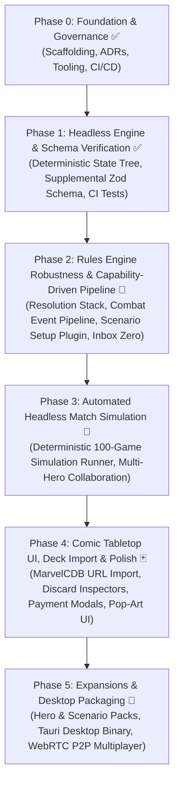

# Marvel Champions Digital (MCD) — Roadmap & Milestones

This document outlines the authoritative development roadmap for **Marvel Champions Digital**. It follows an iterative, **Capability-First, Headless-Engine Architecture**, ensuring the pure rules engine is proven out and verified with headless automated simulations before layering on visual polish and extended card sets.

---

## 🎯 Release Strategy & v1.0 Target Scope

* **v1.0 Core Release Objective:** Deliver a 100% polished, complete, and fully debugged **Core Set Experience** supporting **1 to 4 Heroes in Single Player mode (True Solo & Multi-Handed Solo)** against all 3 Core Set Villains (Rhino, Klaw, Ultron).
* **Future Official Content Releases (v1.1+):** Incremental releases organized by official Hero Packs, Scenario Packs, and Campaign Expansions.
* **Fan-Made / Custom Content Extensibility:** Supported natively via declarative Supplemental Card Data and the Scenario Plugin Architecture.

---

## 🏷️ Feature Prioritization Framework

All uncompleted and future roadmap items are categorized using the following priority scale:

| Level | Badge | Description | Target |
| :--- | :--- | :--- | :--- |
| **P0** | `🔴 [Must-Have]` | **Critical Path / Core Playability:** Non-negotiable for a fully functional, playable game loop. | Current Sprint |
| **P1** | `🟠 [Should-Have]` | **High Priority / Core Content:** Essential UX, complete Core Set cards, and key accessibility features. | Phase 3 & Phase 4 |
| **P2** | `🟡 [Nice-to-Have]` | **Polish & Ergonomics:** Visual flourishes, audio, mobile layout adaptations, and developer tooling. | Phase 4 & Phase 5 |
| **P3** | `🔵 [Future / Experimental]` | **Ecosystem & Distribution:** Native desktop binaries, multiplayer, and multi-language packs. | Phase 5+ |

---

## 🗺️ High-Level Roadmap Architecture

---

## 📍 Phase 0: Project Inception & Foundation ✅ (Completed)
* [x] **Architecture Decision Records (ADRs):** ADR-0001 through ADR-0029 created and indexed.
* [x] **Technology Selection:** TypeScript 5 + React 18 + Tailwind CSS + Vitest + Vite.
* [x] **Open-Source Governance:** MIT License, README, CONTRIBUTING, CODE_OF_CONDUCT, SECURITY, and CI workflow.
* [x] **Tooling & Scaffolding:** Vite 5, TypeScript 5, Vitest, Tailwind with Comic Theme, smoke tests verified.

---

## 📍 Phase 1: Headless Rules Engine & Schema Verification ✅ (Completed)
* [x] **Card Data Models & MarvelsDB Ingestion:** Ingest all Core Set cards with normalized schemas.
* [x] **Authoritative Zod Supplemental Schema (`schema.ts`):** Complete validation for `CardEnrichment`, `CardAbility`, `AbilityCost`, `FilterSchema`, `ConditionGate`, and `CardAuditRecord`.
* [x] **Automated Schema CI/CD Tests:** `tests/data/supplemental-schema.test.ts` validating 100% of supplemental packs.
* [x] **Modular Documentation Hub:** 10-part specification suite in `docs/specifications/supplemental/` with 🟢 `IMPLEMENTED` vs 🟡 `ROADMAP` status badges.
* [x] **Declarative Sequencing & Generic Zone Primitives (ADR-0028 & ADR-0029):** Atomic multi-step sequences (`sequence: []`), conditional gates (`gate: "ALWAYS" | "THEN" | "IF_AMOUNT_ZERO" | "IF_ALREADY_HAS_STATUS" | "IF_FAILED"`), and generic zone transfer primitives (`PUT_INTO_PLAY`, `SHUFFLE_INTO_DECK`).
* [x] **100% Core Set Encounter Pool Parity:** Multi-Stage Villain transitions (I $\rightarrow$ II $\rightarrow$ III), Option 3 Extra Activations (*Advance*, *Assault*, *Gang-Up*, *Explosion*, *Masterplan*, *Under Fire*), and Nemesis Spawning pipeline (*Shadow of the Past* `01190`).
* [x] **Mulligan Rules Alignment (RR v1.8 p. 23):** Discard pile placement with top replacement draws.
* [x] **Ergonomics & Action Engine:** 1960s Daily Bugle Action Dispatcher (`DailyBugleActionNewspaper.tsx`), form-aware Identity Action Modal (`IdentityActionModal.tsx`), and Dynamic Fan-Out Stack Hand layout (`useHandFanLayout.ts`).

---

## 📍 Phase 2: Rules Engine Robustness & Capability-Driven Pipeline 🚧 (Current Phase)
*Objective: Build an industrial-grade, capability-driven rules engine with complete nested resolution, a unified combat event pipeline, standardized scenario setup, and 100% Core Set card pool promotion (Inbox Zero).*

### 1. 🔴 `[Must-Have]` Completed Engine Foundations
* [x] **Interleaved Villain Phase Activations (RR v1.8 p. 22):**
  * Structured Step 2/3 as a unified player-by-player loop starting from the First Player.
* [x] **Sequential Hazard Icon Distribution (RR v1.8 p. 11) & Heroic Mode:**
  * Distributed extra encounter cards from Hazard icons sequentially in player order starting from the First Player (round-robin).
* [x] **Turn-Gated Form Changes (RR v1.8 p. 8):**
  * Basic 1/round form change limit tracked via `basicChangeFormUsedThisRound` with automatic reset on `ROUND_BEGAN`.

### 2. 🔴 `[Must-Have]` Milestone 2A: Universal Resolution Stack & Decision Prompt Queue (ADR-0030)
* [ ] **Nested Action & Trigger Execution Stack (RR v1.8 p. 16, 24):**
  * Support interruption windows opening inside active action/activation windows without state corruption.
  * Support player-ordered resolution when multiple `FORCED` triggers fire simultaneously (RR v1.8 p. 16).
* [ ] **Decision Prompt Queue Management:**
  * Transition from single prompt overwrite to structured FIFO/LIFO queue (`pendingDecisionQueue`), ensuring multiple triggered prompts resolve sequentially.
  * Allow voluntary reactions with explicit "Pass / Do Nothing" options in prompts.
* [ ] **Unlocks 10 Ambiguity Cards:** *Great Responsibility* (`01061`), *Emergency* (`01085`), *Get Behind Me!* (`01078`), *One-Two Punch* (`01024`), *Counter-Punch* (`01077`), *Energy Channel* (`01018`), *Black Widow* (`01075`), *Enhanced Spider-Sense* (`01004`), *Captain Marvel's Helmet* (`01016`), *Cosmic Flight* (`01017`).

### 3. 🔴 `[Must-Have]` Milestone 2B: Unified Combat & Damage Event Pipeline (ADR-0031)
* [ ] **Atomic Damage Resolution Pipeline (RR v1.8 p. 4, 11):**
  * Formally differentiate damage caused by an *Attack* from *Direct Damage*.
  * Structured flow: Source $\rightarrow$ IsAttack $\rightarrow$ Guard/Target Validation $\rightarrow$ Toughness Strip $\rightarrow$ Interrupt/Prevention $\rightarrow$ Apply Damage $\rightarrow$ Overkill/Defeat $\rightarrow$ Responses (Retaliate/Heal).
* [ ] **Event Dispatcher Hooks:**
  * Fire discrete engine events for `ATTACK_RESOLVED`, `DAMAGE_DEALT`, `OVERKILL_OCCURRED`, `ENEMY_DEFEATED`, `ALLY_CONSEQUENTIAL_DAMAGE`, `THWART_COMPLETED`, and `RECOVER_COMPLETED`.
* [ ] **Unlocks 8 Ambiguity Cards:** *Gamma Slam* (`01021`), *Relentless Assault* (`01053`), *Uppercut* (`01054`), *Tigra* (`01051`), *Panther Claws* (`01047`), *Hulk* (`01050`), *Superhuman Strength* (`01028`), *Repulsor Blast* (`01031`).

### 4. 🔴 `[Must-Have]` Milestone 2C: Scenario Setup & Modular Plugin Pipeline (ADR-0032)
* [ ] **Official 15-Step Scenario Setup Engine (RR v1.8 p. 27–28):**
  * Refactor scenario initialization into declarative plug-in modules (`createGame(scenarioConfig, playerConfigs)`).
  * Executes Main Scheme Stage 1A setup instructions (Villain placement, initial threat, starting side schemes, environments, attachments, encounter deck compilation, and player dealing).
  * Standardizes scenario plugins for Rhino, Klaw, and Ultron with plug-and-play modular encounter sets (*Bomb Scare*, *Masters of Evil*, *Under Attack*, *Legions of Hydra*, *The Doomsday Chair*).

### 5. 🔴 `[Must-Have]` Milestone 2D: The Great Core Set Promotion Pass (Inbox Zero)
* [ ] **Promote 100% of Ambiguity Cards in `docs/ambiguities/`:**
  * Execute Card Integration Protocol across all remaining 32 ambiguity files.
  * Promote all cards to $\ge 98\%$ confidence with dedicated unit tests.
  * Prune `docs/ambiguities/` to **0 files (Inbox Zero)**.
  * 100% Core Set Player Cards (all 5 Heroes) + 100% Rhino Encounter Pool executable in headless engine.

---

## 📍 Phase 3: Automated Headless Match Simulation & Multi-Hero Verification 📅 (Planned Next)
*Objective: Deliver a 100% automated, headless, deterministic game simulator capable of running full multi-round matches across all 5 Core Heroes against Rhino, Klaw, and Ultron.*

### Milestones & Tasks
1. 🔴 `[Must-Have]` **Deterministic Monte Carlo Simulation Engine:**
   * Automated headless runner executing 100 complete simulated games (Spider-Man, Captain Marvel, She-Hulk, Iron Man, Black Panther) using heuristic legal action dispatchers.
   * Asserts zero state corruption, zero deadlocks, and verified win/loss condition evaluations.
2. 🔴 `[Must-Have]` **Multi-Hero Collaboration & Cooperative Triggers:**
   * Verify "Action: Ask another player to..." and cross-player resource/defense triggers (*Make the Call*, *Get Behind Me!*, *Helicarrier*, *Maria Hill*).

---

## 📍 Phase 4: Comic Tabletop UI, Deck Import & Visual Polish 🃏 (Planned)
*Objective: Connect the proven headless engine to our 1960s Pop-Art presentation layer with community deck import.*

### 1. 🟠 `[Should-Have]` Community Deck Import (MarvelCDB REST API)
* [ ] 1-click **"Import Deck by MarvelCDB URL / ID"** button to load any community deck directly from `https://marvelcdb.com`.
* [ ] In-game deck validation checking aspect and unicity rules (40–50 cards).

### 2. 🟠 `[Should-Have]` Comic Tabletop UI Polish & Visual Ergonomics
* [ ] **Discard Pile Inspectors with Multi-Tier Sorting Options:**
  * Interactive modal to inspect Player Discard and Encounter Discard piles with sorting toggles (Chronological, Card Type, Aspect, Cost, Alphabetical) preserving underlying state order.
* [ ] **Interactive Card Play & Resource Payment Modal:**
  * Select resources from hand cards and exhausted generators (*Web-Shooter*, *Helicarrier*, *Rechannel*).
* [ ] **Turn Pass & Step-by-Step Activation Banners.**

### 3. 🟡 `[Nice-to-Have]` Visual & Audio Polish
* [ ] Dynamic Onomatopoeia starburst overlays (*POW!*, *BAM!*, *KAPOW!*, *THWIP!*).
* [ ] Retro comic action sound effects and card dealing chimes.
* [ ] Standalone In-Game Visual Deckbuilder (secondary to MarvelCDB import).

---

## 📍 Phase 5: Expansions, Native Desktop & Ecosystem 🚀 (Planned)
*Objective: Expansion packaging, native binaries, and multiplayer connectivity.*

* 🔴 `[Must-Have]` **Official Pack Rollout Pipeline:** Incremental releases for Captain America, Ms. Marvel, Thor, Doctor Strange, Rise of Red Skull, Green Goblin, etc.
* 🟠 `[Should-Have]` **Power-User Keyboard Shortcuts:** Configurable hotkeys (`Space`, `F`, `A`, `T`, `R`, `1`–`9`, `Esc`).
* 🟡 `[Nice-to-Have]` **Responsive Tablet / Mobile Portrait Mode:** Adaptive 1-column layout for mobile devices.
* 🔵 `[Future / Experimental]` **Native Desktop Executable (Tauri):** Standalone Windows/Mac/Linux binaries with ultra-low memory footprint.
* 🔵 `[Future / Experimental]` **Peer-to-Peer Network Multiplayer (WebRTC):** Synchronized state room for 2–4 players over WebSockets/WebRTC.
