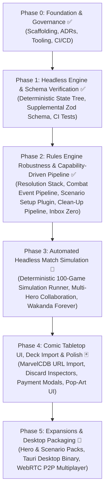

# Marvel Champions Digital (MCD) — Roadmap & Milestones

This document outlines the authoritative development roadmap for **Marvel Champions Digital**. It follows an iterative, **Capability-First, Headless-Engine Architecture**, ensuring the pure rules engine is proven out and verified with headless automated simulations before layering on visual polish and extended card sets.

---

## 🎯 Release Strategy & v1.0 Target Scope

- **v1.0 Core Release Objective:** Deliver a 100% polished, complete, and fully debugged **Core Set Experience** supporting **1 to 4 Heroes in Single Player mode (True Solo & Multi-Handed Solo)** against all 3 Core Set Villains (Rhino, Klaw, Ultron).
- **Future Official Content Releases (v1.1+):** Incremental releases organized by official Hero Packs, Scenario Packs, and Campaign Expansions.
- **Fan-Made / Custom Content Extensibility:** Supported natively via declarative Supplemental Card Data and the Scenario Plugin Architecture.

---

## 🏷️ Feature Prioritization Framework

All uncompleted and future roadmap items are categorized using the following priority scale:

| Level  | Badge                        | Description                                                                                              | Target            |
| :----- | :--------------------------- | :------------------------------------------------------------------------------------------------------- | :---------------- |
| **P0** | `🔴 [Must-Have]`             | **Critical Path / Core Playability:** Non-negotiable for a fully functional, playable game loop.         | Current Sprint    |
| **P1** | `🟠 [Should-Have]`           | **High Priority / Core Content:** Essential UX, complete Core Set cards, and key accessibility features. | Phase 3 & Phase 4 |
| **P2** | `🟡 [Nice-to-Have]`          | **Polish & Ergonomics:** Visual flourishes, audio, mobile layout adaptations, and developer tooling.     | Phase 4 & Phase 5 |
| **P3** | `🔵 [Future / Experimental]` | **Ecosystem & Distribution:** Native desktop binaries, multiplayer, and multi-language packs.            | Phase 5+          |

---

## 🗺️ High-Level Roadmap Architecture

---

## 📍 Phase 0: Project Inception & Foundation ✅ (Completed)

- [x] **Architecture Decision Records (ADRs):** ADR-0001 through ADR-0029 created and indexed.
- [x] **Technology Selection:** TypeScript 5 + React 18 + Tailwind CSS + Vitest + Vite.
- [x] **Open-Source Governance:** MIT License, README, CONTRIBUTING, CODE_OF_CONDUCT, SECURITY, and CI workflow.
- [x] **Tooling & Scaffolding:** Vite 5, TypeScript 5, Vitest, Tailwind with Comic Theme, smoke tests verified.

---

## 📍 Phase 1: Headless Rules Engine & Schema Verification ✅ (Completed)

- [x] **Card Data Models & MarvelsDB Ingestion:** Ingest all Core Set cards with normalized schemas.
- [x] **Authoritative Zod Supplemental Schema (`schema.ts`):** Complete validation for `CardEnrichment`, `CardAbility`, `AbilityCost`, `FilterSchema`, `ConditionGate`, and `CardAuditRecord`.
- [x] **Automated Schema CI/CD Tests:** `tests/data/supplemental-schema.test.ts` validating 100% of supplemental packs.
- [x] **Modular Documentation Hub:** 10-part specification suite in `docs/specifications/supplemental/` with 🟢 `IMPLEMENTED` vs 🟡 `ROADMAP` status badges.
- [x] **Declarative Sequencing & Generic Zone Primitives (ADR-0028 & ADR-0029):** Atomic multi-step sequences (`steps: []`, renamed from `sequence: []` by ADR-0030), conditional gates (`gate: "ALWAYS" | "THEN" | "IF_AMOUNT_ZERO" | "IF_ALREADY_HAS_STATUS" | "IF_FAILED"`), and generic zone transfer primitives (`PUT_INTO_PLAY`, `SHUFFLE_INTO_DECK`).
- [x] **100% Core Set Encounter Pool Parity:** Multi-Stage Villain transitions (I $\rightarrow$ II $\rightarrow$ III), Option 3 Extra Activations (_Advance_, _Assault_, _Gang-Up_, _Explosion_, _Masterplan_, _Under Fire_), and Nemesis Spawning pipeline (_Shadow of the Past_ `01190`).
- [x] **Mulligan Rules Alignment (RR v1.8 p. 23):** Discard pile placement with top replacement draws.
- [x] **Ergonomics & Action Engine:** 1960s Daily Bugle Action Dispatcher (`DailyBugleActionNewspaper.tsx`), form-aware Identity Action Modal (`IdentityActionModal.tsx`), and Dynamic Fan-Out Stack Hand layout (`useHandFanLayout.ts`).

---

## 📍 Phase 2: Rules Engine Robustness & Capability-Driven Pipeline ✅ (Completed)

_Objective: Build an industrial-grade, capability-driven rules engine with complete nested resolution, a unified combat event pipeline, standardized scenario setup, and 100% Core Set card pool promotion (Inbox Zero)._

### 1. 🔴 `[Must-Have]` Completed Engine Foundations

- [x] **Interleaved Villain Phase Activations (RR v1.8 p. 22):**
  - Structured Step 2/3 as a unified player-by-player loop starting from the First Player.
- [x] **Sequential Hazard Icon Distribution (RR v1.8 p. 11) & Heroic Mode:**
  - Distributed extra encounter cards from Hazard icons sequentially in player order starting from the First Player (round-robin).
- [x] **Turn-Gated Form Changes (RR v1.8 p. 8):**
  - Basic 1/round form change limit tracked via `basicChangeFormUsedThisRound` with automatic reset on `ROUND_BEGAN`.

### 2. 🔴 `[Must-Have]` Milestone 2A: Universal Resolution Stack & Decision Prompt Queue ([ADR-0032](decisions/0032-universal-resolution-stack-decision-prompt-queue-and-nested-interrupts.md)) ✅ (Completed)

- [x] **Nested Action & Trigger Execution Stack (RR v1.8 p. 16, 24 / [ADR-0032](decisions/0032-universal-resolution-stack-decision-prompt-queue-and-nested-interrupts.md)):**
  - Supported interruption windows and execution frames (`ExecutionFrame`, `executionStack`) without state corruption.
  - Supported voluntary reaction windows with explicit "Pass / Do Nothing" options in `DecisionPromptModal`.
- [x] **Decision Prompt Queue Management:**
  - Transitioned from single prompt overwrite to structured FIFO prompt queue (`pendingDecisionQueue`), ensuring multiple triggered prompts resolve sequentially with visual queue depth badges.
- [x] **Promoted 5 Ambiguity Cards to 100% Confidence:** _Emergency_ (`01085`), _Great Responsibility_ (`01061`), _Get Behind Me!_ (`01078`), _One-Two Punch_ (`01024`), _Counter-Punch_ (`01077`).

### 3. 🔴 `[Must-Have]` Milestone 2B: Comprehensive Combat, Enemy Attack & Multi-Window Defense Pipeline ([ADR-0031](decisions/0031-comprehensive-combat-enemy-attack-and-multi-window-defense-pipeline.md)) ✅ (Completed)

- [x] **Sub-Milestone 2B-1: Core Combat Lifecycle & Defender Declaration Engine ✅ (Completed):**
  - Built modular 7-step combat pipeline in `src/engine/pipeline/combat-pipeline.ts` ([ADR-0031](decisions/0031-comprehensive-combat-enemy-attack-and-multi-window-defense-pipeline.md)).
  - Step 1 Stun/Webbed Up check & Step 2 Initiation triggers (`VILLAIN_INITIATES_ATTACK` / _Spider-Sense_ card draw).
  - Step 3 `DECLARE_DEFENDER` modal prompt with Basic Hero Defend (DEF mitigation), Ally Block, and Take Undefended.
  - Headless synchronous execution helper with configurable defense policy (`TAKE_UNDEFENDED`, `HERO_IF_READY`, `ALLY_CHUMP_BLOCK`, `AUTO_OPTIMAL`).
  - Promoted _Armored Vest_ (`01081`) and _Indomitable_ (`01082`) to 100% confidence.
- [x] **Sub-Milestone 2B-2: 0-to-Many Boost Queue, Star Abilities (★) & Boost Interrupts ✅ (Completed):**
  - Step 4 facedown boost deal queue ($N \ge 0$) and Step 5 iterative 1-by-1 boost reveal loop.
  - Boost Interrupt window (`WHEN_BOOST_CARD_REVEALED` / _Defiance_, _Target Acquired_).
  - ★ Star Boost abilities engine & dynamic boost card chaining (_Titania's Fury_ `01164`, _Sweeping Swoop_ `01168`, _Electric Whip Attack_ `01173`, _Kree Manipulator_ `01178`).
- [x] **Sub-Milestone 2B-3: Damage Prevention, Overkill, Retaliate & Direct Damage Invariant ✅ (Completed):**
  - Step 6 Damage Prevention Interrupts (_Backflip_ `01003`, _Cosmic Flight_ `01017`) and Tough preservation.
  - Overkill excess damage routing (bidirectional: Enemy $\rightarrow$ Defending Ally $\rightarrow$ Hero, Player $\rightarrow$ Minion $\rightarrow$ Villain) and `RETALIATE X` return damage in Step 7.
  - Direct damage vs. attack damage invariant (`dealDirectDamage`).
  - Promotes 8 Core Set cards: _Backflip_ (`01003`), _Enhanced Spider-Sense_ (`01004`), _Cosmic Flight_ (`01017`), _Gamma Slam_ (`01021`), _Hulk_ (`01050`), _Tigra_ (`01051`), _Relentless Assault_ (`01053`), _Uppercut_ (`01054`).

### 4. 🔴 `[Must-Have]` Milestone 2C: Scenario Setup & Modular Plugin Pipeline ([ADR-0033](decisions/0033-official-15-step-scenario-setup-engine-and-modular-plugin-pipeline.md)) ✅ (Completed)

- [x] **Official 15-Step Scenario Setup Engine (RR v1.8 p. 27–28 / [ADR-0033](decisions/0033-official-15-step-scenario-setup-engine-and-modular-plugin-pipeline.md)) ✅ (Completed):**
  - Refactored scenario initialization into declarative plug-in modules (`createGame(scenarioConfig, playerConfigs)`).
  - Enforced strict encounter set taxonomy: Scenario-Mandatory Sets (Villain set, Standard/Expert set) vs. Customizable Modular Slots.
  - Executed Main Scheme Stage 1A setup instructions (Permanent cards in play, villain placement, initial threat, starting side schemes, environments, attachments, encounter deck compilation, and player dealing) using generic zone primitives.
  - Standardized scenario plugins for Rhino, Klaw, and Ultron with plug-and-play modular encounter sets (_Bomb Scare_, _Masters of Evil_, _Under Attack_, _Legions of Hydra_, _The Doomsday Chair_).
- [x] **Scenario Selection Screen & Modular Set Customizer (`ScenarioSelector.tsx`) ✅ (Completed):**
  - Updated `ScenarioSelector.tsx` to display locked scenario-mandatory set badges (`[🔒 MANDATORY]`).
  - Added modular encounter set slot selectors pre-populated with scenario default recommendations (e.g. _Bomb Scare_ for Rhino, _Masters of Evil_ for Klaw, _Under Attack_ for Ultron), allowing players to replace optional sets with any modular set in their collection.
  - Provided a "Reset to Defaults" button and passed `selectedModularSetCodes` in `SetupSelection`.

### 5. 🔴 `[Must-Have]` Milestone 2D: Table Invariants, Deck Exhaustion & Core Set Promotion Pass (Inbox Zero) ✅ (Completed)

- [x] **Universal SEARCH_AND_SELECT Two-Pile Destination Routing & Specific Card Picking (RR v1.8 p. 19, 26 / [ADR-0030](decisions/0030-unified-ability-step-sequence-architecture.md) / [Issue #10](https://github.com/SteveRodrigue/MCD/issues/10)) ✅ (Completed):**
  - Implemented universal declarative `SEARCH_AND_SELECT` effect primitive and resolution dispatcher in `src/engine/effects/index.ts` and `src/engine/pipeline/action-dispatcher.ts`.
  - Supports Top-$N$ Look & Split (`lookCount: N`, `selectedDestination: "HAND"`, `unselectedDestination: "DISCARD"` / `"DECK_BOTTOM"` / `"DECK_TOP"`).
  - Enforced strict deck order preservation when returning looked cards to `DECK_TOP` / `DECK_BOTTOM` (RR v1.8 p. 19).
  - Supports targeted search and specific card picking (`unselectedDestination: null`, `shuffleAfter: true`, RR v1.8 p. 26).
  - Retrofitted Tony Stark (_Futurist_ `01029b`) to declarative schema.
- [x] **Restricted Card Keyword Limit Engine (RR v1.8 p. 25 / [ADR-0018](decisions/0018-declarative-state-modifiers-and-dynamic-board-limits.md) / [Issue #30](https://github.com/SteveRodrigue/MCD/issues/30)) ✅ (Completed):**
  - Implemented dynamic restricted limit calculator (`getPlayerRestrictedLimit`, base 2).
  - Supported heavy item weights ("Counts as 2 restricted cards", e.g. _Bazooka_, _Nightcrawler's Blades_).
  - Supported dynamic limit expansion modifiers (e.g. _Side Holster_, _Venom_, _Prehensile Tail_).
  - Validated voluntary discard replacement policy in `canPlayCard()` when playing a restricted card at capacity.
- [x] **Global Unique Card Rule & Identity Collision (RR v1.8 p. 29 / [Issue #31](https://github.com/SteveRodrigue/MCD/issues/31)) ✅ (Completed):**
  - Evaluated uniqueness globally across all active player tableaus, all player allies, and all in-game **Hero / Alter-Ego identities** (e.g. preventing _Captain Marvel_ ally when _Carol Danvers_ identity is in the game).
- [x] **Mid-Action Player & Encounter Deck Exhaustion Invariants (RR v1.8 p. 11, 18 / [Issue #32](https://github.com/SteveRodrigue/MCD/issues/32)) ✅ (Completed):**
  - Guaranteed immediate discard pile reshuffle and penalty application (1 acceleration token on main scheme for encounter deck; 1 facedown encounter card dealt to player for player deck) at any point during turn execution, milling, or card draws (`drawPlayerCard`, `drawEncounterCard`, `discardFromEncounterDeckUntil`, `discardFromPlayerDeckUntil`).
- [x] **End of Player Phase Clean-Up & Voluntary Hand Discard (RR v1.8 p. 23 / [Issue #41](https://github.com/SteveRodrigue/MCD/issues/41)) ✅ (Completed):**
  - Implemented the official End of Player Phase clean-up sequence in a dedicated module (`src/engine/pipeline/player-phase-cleanup.ts`):
  - In player order starting from the First Player, prompts active players with voluntary multi-select discard decision prompts.
  - Draws up to effective hand size and readies identities, allies, and tableau upgrades/supports _before_ the Villain Phase begins.
- [x] **Cost Arrow Mandatory Resolution & Self-Damage Cost Primitives (RR v1.8 p. 8, 15 / [ADR-0041](decisions/0041-cost-arrow-mandatory-resolution-and-self-damage-costs.md) / [Issue #8](https://github.com/SteveRodrigue/MCD/issues/8) & [Issue #11](https://github.com/SteveRodrigue/MCD/issues/11)) ✅ (Completed):**
  - Automated mandatory cost resolution on `FORCED_RESPONSE` and `FORCED_INTERRUPT` triggers (_Superhuman Strength_ `01028` discard self + stun).
  - Integrated `BASIC_ATTACK_PERFORMED`, `ATTACK_RESOLVED`, and `THWART_RESOLVED` lifecycle triggers in `action-dispatcher.ts`.
  - Formalized direct character self-damage cost primitive (`cost.damageSelf`) in `cost-engine.ts` with automated ally defeat handling (_War Machine_ `01030`).
- [x] **Promoted 100% of Ambiguity Cards in `docs/ambiguities/` ([ADR-0021](decisions/0021-card-integration-workflow-and-composable-primitives.md), [ADR-0025](decisions/0025-architectural-subsystem-completion-and-mandatory-supplemental-review-pipeline.md), [ADR-0030](decisions/0030-unified-ability-step-sequence-architecture.md)) ✅ (Completed):**
  - Executed Card Integration Protocol across all 23 ambiguity files.
  - Promoted all cards to $\ge 98\%$ confidence with dedicated unit tests.
  - Pruned `docs/ambiguities/` to **0 files (Inbox Zero)**.
  - 100% Core Set Player Cards (all 5 Heroes: Spider-Man, Captain Marvel, She-Hulk, Iron Man, Black Panther) + 100% Encounter Pool executable in headless engine.

---

## 📍 Phase 3: Automated Headless Match Simulation & Multi-Hero Verification 🚧 (Current Phase)

_Objective: Deliver a 100% automated, headless, deterministic game simulator capable of running full multi-round matches across all 5 Core Heroes against Rhino, Klaw, and Ultron ([ADR-0002](decisions/0002-decoupled-headless-rules-engine.md), [ADR-0009](decisions/0009-game-history-and-action-log.md))._

### Milestones & Tasks

1. 🔴 `[Must-Have]` **Deterministic Monte Carlo Simulation Engine:**
   - Automated headless runner executing complete simulated games (`tests/engine/match-simulator.test.ts`) using heuristic legal action dispatchers.
   - Asserts zero state corruption, zero deadlocks, and verified win/loss condition evaluations across 100-game headless batches.
2. 🔴 `[Must-Have]` **Multi-Hero Collaboration & Cooperative Triggers ([Issue #37](https://github.com/SteveRodrigue/MCD/issues/37)):**
   - Verify "Action: Ask another player to..." and cross-player resource/defense triggers (_Make the Call_, _Get Behind Me!_, _Helicarrier_, _Maria Hill_).
   - **`Alliance` Keyword Engine (RR v1.8 p. 4 / [ADR-0032](decisions/0032-universal-resolution-stack-decision-prompt-queue-and-nested-interrupts.md)):** Support collaborative multi-player resource pooling from hands and generators for Alliance cards.
   - **`Team-Up` Prerequisite Validator (RR v1.8 p. 28):** Validate dual-identity prerequisites across active identities and tableaus.
3. 🔴 `[Must-Have]` **Special Ability Multi-Upgrade Sequences ([Issue #18](https://github.com/SteveRodrigue/MCD/issues/18)):**
   - Support sequential multi-upgrade resolution chains (_Wakanda Forever!_ triggering all in-play _Black Panther_ upgrades: _Energy Daggers_, _Panther Suit_, _Vibranium Claws_, _Tactical Genius_ in chosen order).

---

## 📍 Phase 4: Comic Tabletop UI, Deck Import & Visual Polish 🃏 (Planned)

_Objective: Connect the proven headless engine to our 1960s Pop-Art presentation layer with community deck import ([ADR-0004](decisions/0004-visual-art-direction-comic-pop-art.md), [ADR-0014](decisions/0014-marvelcdb-deck-schema-and-metadata-decks.md), [ADR-0017](decisions/0017-panoramic-horizontal-tabletop-and-edge-scrolling.md), [ADR-0026](decisions/0026-daily-bugle-action-dispatcher-and-dynamic-fan-out-hand.md))._

### 1. 🟠 `[Should-Have]` Community Deck Import (MarvelCDB REST API - [ADR-0014](decisions/0014-marvelcdb-deck-schema-and-metadata-decks.md))

- [ ] 1-click **"Import Deck by MarvelCDB URL / ID"** button to load any community deck directly from `https://marvelcdb.com`.
- [ ] In-game deck validation checking aspect and unicity rules (40–50 cards).

### 2. 🟠 `[Should-Have]` Comic Tabletop UI Polish & Visual Ergonomics ([ADR-0017](decisions/0017-panoramic-horizontal-tabletop-and-edge-scrolling.md), [ADR-0026](decisions/0026-daily-bugle-action-dispatcher-and-dynamic-fan-out-hand.md))

- [ ] **Discard Pile Inspectors with Multi-Tier Sorting Options:**
  - Interactive modal to inspect Player Discard and Encounter Discard piles with sorting toggles (Chronological, Card Type, Aspect, Cost, Alphabetical) preserving underlying state order.
- [ ] **Interactive Card Play & Resource Payment Modal:**
  - Select resources from hand cards and exhausted generators (_Web-Shooter_, _Helicarrier_, _Rechannel_).
- [ ] **Turn Pass & Step-by-Step Activation Banners.**

### 3. 🟡 `[Nice-to-Have]` Visual & Audio Polish

- [ ] Dynamic Onomatopoeia starburst overlays (_POW!_, _BAM!_, _KAPOW!_, _THWIP!_ - [ADR-0004](decisions/0004-visual-art-direction-comic-pop-art.md)).
- [ ] Retro comic action sound effects and card dealing chimes.
- [ ] Standalone In-Game Visual Deckbuilder (secondary to MarvelCDB import).

### 4. 🟡 `[Nice-to-Have]` Developer Tooling ([ADR-0042](decisions/0042-local-first-developer-problem-reporting.md))

- [x] **Dev Mode "Report a Problem" Capture:** Top-bar button opening a modal to file a bug/improvement/missing-feature report (with priority and free text), attaching the live `GameState`, saved locally to `logs/reports/` via a dev-only Vite middleware, with a token-free prefilled GitHub issue link and a companion `problem-report-triage` skill for Inbox-Zero GitHub filing.

---

## 📍 Phase 5: Expansion Waves, Advanced Mechanics & Native Ecosystem 🚀 (Planned)

_Objective: Scale the engine to support advanced expansion mechanics, new card types, multi-form identities, and native platforms._

### 1. 🔴 `[Must-Have]` Milestone 5A: Player Side Schemes, Victory Display & Auxiliary Decks ([ADR-0034](decisions/0034-player-side-schemes-victory-display-and-auxiliary-decks.md) / [Issue #34](https://github.com/SteveRodrigue/MCD/issues/34))

- [ ] **Player Side Scheme Execution Engine (`player_side_scheme` - RR v1.8 p. 26 / [ADR-0034](decisions/0034-player-side-schemes-victory-display-and-auxiliary-decks.md)):**
  - Support voluntary player side schemes with printed threat and "When Defeated" player reward step sequences.
  - Enable heroes and allies to target player side schemes with basic thwart and thwart events.
- [ ] **Persistent Victory Display (`state.victoryDisplay` - RR v1.8 p. 30):**
  - Route defeated `Victory X` schemes and minions to the Victory Display zone to prevent deck recycling and track victory scores.
- [ ] **Auxiliary Scenario Decks (`auxiliaryDecks` & `auxiliaryDiscards`):**
  - Support modular auxiliary decks for complex campaign scenarios (_Infinity Gauntlet_, _Holding Cell_, _Market_, _Evidence_).

### 2. 🔴 `[Must-Have]` Milestone 5B: Multi-Form Identities & Universal Counter Engine ([ADR-0035](decisions/0035-universal-multi-form-identities-and-generic-counter-engine.md) / [Issue #33](https://github.com/SteveRodrigue/MCD/issues/33))

- [ ] **Multi-Form Identity Scaling (3-Sided & Mass/Energy Forms - RR v1.8 p. 12 / [ADR-0035](decisions/0035-universal-multi-form-identities-and-generic-counter-engine.md)):**
  - Support 3-sided identities (_Ant-Man_, _Wasp_), Energy Forms (_Spectrum_), Mass Forms (_Vision_, _Shadowcat_), and Progression levels (_Ironheart_).
  - Dispatch discrete `FORM_CHANGED` lifecycle events with form-entry ability step triggers.
- [x] **Universal Dynamic Counter Map (`counters: Record<string, number>` - [ADR-0035](decisions/0035-universal-multi-form-identities-and-generic-counter-engine.md) / [Issue #33](https://github.com/SteveRodrigue/MCD/issues/33)) ✅ (Completed):**
  - Generic counter engine supporting all 51 catalog counter types (_Charge_, _Ammo_, _Arrow_, _Web_, _Chi_, _Labor_, _Pym_, _Time_) via atomic `ADD_COUNTERS`, `SPEND_COUNTERS`, `REMOVE_COUNTERS_MATCHING_FILTER`, and dynamic `COUNTERS_ON_TARGET` scaling.
  - Built-in Uses zero-counter card discard lifecycle dispatching `CARD_DISCARDED` triggers.

### 3. 🔴 `[Must-Have]` Milestone 5C: Advanced Status Scaling & Minion Entry Modifiers ([ADR-0036](decisions/0036-advanced-status-card-dynamics-and-minion-activations.md) / [Issue #35](https://github.com/SteveRodrigue/MCD/issues/35)) ✅ (Completed)

- [x] **Advanced Status Dynamics (`Stalwart`, `Steady` - RR v1.8 p. 28 / [ADR-0036](decisions/0036-advanced-status-card-dynamics-and-minion-activations.md) / [Issue #35](https://github.com/SteveRodrigue/MCD/issues/35)) ✅ (Completed):**
  - Enforce `Stalwart` keyword complete immunity to Stun and Confuse status cards (`"IMMUNE! (STALWART)"`).
  - Implement count-based status card scaling for `Steady` (requires 2 copies of Stun or Confuse to incapacitate character; discards both upon cancellation).
- [x] **Minion Combat Entry & Activation Modifiers ([Issue #35](https://github.com/SteveRodrigue/MCD/issues/35)) ✅ (Completed):**
  - Support `Villainous` minion activations dealing and resolving facedown boost cards from encounter deck.
  - Support `Quickstrike` immediate minion attacks on engagement in Hero form.
  - Resolve `Incite X` (direct threat on reveal) and `Hinder X` (per-player side scheme threat) entry triggers.

### 4. 🟠 `[Should-Have]` Official Pack Rollout Pipeline

- [ ] Incremental pack integration: Captain America, Ms. Marvel, Thor, Doctor Strange, Rise of Red Skull, Green Goblin, Galaxy's Most Wanted, Mad Titan's Shadow, Sinister Motives, Mutant Genesis, Next Evolution, Age of Apocalypse.

### 5. 🔵 `[Future / Experimental]` Native Desktop & Network Multiplayer

- [ ] **Native Desktop Executable (Tauri - [ADR-0003](decisions/0003-technology-stack-selection.md)):** Standalone Windows/Mac/Linux binaries with ultra-low memory footprint.
- [ ] **Peer-to-Peer Network Multiplayer (WebRTC):** Synchronized state room for 2–4 players over WebSockets/WebRTC.

---

## ⚠️ Known Upstream Data Caveats & Upstream PR Backlog

### 1. 🟡 `[Low-Priority Backlog]` Zzorba Core Set Main Scheme Inverted Image Naming Quirk

- **Context:** In the upstream `zzorba/marvelsdb-json-data` Core Set encounter pack (`core_encounter.json` / pack code `01`), the asset file mapping for Main Scheme cards is inverted compared to all subsequent expansion sets:
  - **Core Set (`01xxx`):** Stage 1A (Setup face) maps to image `xxxxb.png`, while Stage 1B (Active threat face) maps to image `xxxx.png`.
  - **All Other Expansions (`02xxx`, `16xxx`, `24xxx`, etc.):** Stage A maps to `xxxx.png` (or `xxxxa.png`), while Stage B maps to `xxxxb.png`.
- **MCD Handling:** Encapsulated in [`resolveMainSchemeArtFileName()`](../src/ui/services/card-cache-service.ts) in `src/ui/services/card-cache-service.ts`.
- **Action Item:** Consider submitting a PR / issue upstream to `zzorba/marvelsdb-json-data` to standardize Core Set image naming conventions (Low priority).
