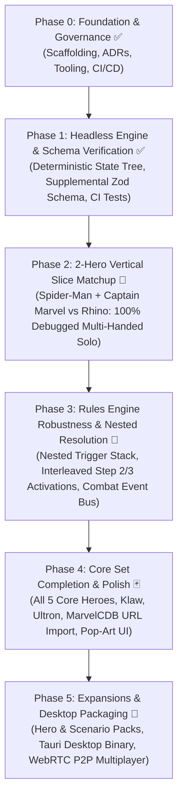

# Marvel Champions Digital (MCD) — Roadmap & Milestones

This document outlines the authoritative development roadmap for **Marvel Champions Digital**. It follows an iterative, **Vertical Slice** approach, ensuring the pure rules engine is proven out and tested before layering on visual polish and extended card sets.

---

## 🎯 Release Strategy & v1.0 Target Scope

* **v1.0 Core Release Objective:** Deliver a 100% polished, complete, and fully debugged **Core Set Experience** supporting **1 to 4 Heroes in Single Player mode (True Solo & Multi-Handed Solo)** against all 3 Core Set Villains (Rhino, Klaw, Ultron).
* **Future Official Content Releases (v1.1+):** Incremental releases organized by official Hero Packs, Scenario Packs, and Campaign Expansions.
* **Fan-Made / Custom Content Extensibility:** Supported natively via declarative Supplemental Card Data and the Scenario Plugin Architecture.

---

## 🏷️ Feature Prioritization Framework

All uncompleted and future roadmap items are categorized using the following priority scale:

| Level | Badge | Description | Target |
| :--- | :--- | :--- | :--- |
| **P0** | `🔴 [Must-Have]` | **Critical Path / Core Playability:** Non-negotiable for a fully functional, playable game loop. | Current Sprint |
| **P1** | `🟠 [Should-Have]` | **High Priority / Core Content:** Essential UX, complete Core Set cards, and key accessibility features. | Phase 3 & Phase 4 |
| **P2** | `🟡 [Nice-to-Have]` | **Polish & Ergonomics:** Visual flourishes, audio, mobile layout adaptations, and developer tooling. | Phase 4 & Phase 5 |
| **P3** | `🔵 [Future / Experimental]` | **Ecosystem & Distribution:** Native desktop binaries, multiplayer, and multi-language packs. | Phase 5+ |

---

## 🗺️ High-Level Roadmap Architecture

---

## 📍 Phase 0: Project Inception & Foundation ✅ (Completed)
* [x] **Architecture Decision Records (ADRs):** ADR-0001 through ADR-0022 created and indexed.
* [x] **Technology Selection:** TypeScript 5 + React 18 + Tailwind CSS + Vitest + Vite.
* [x] **Open-Source Governance:** MIT License, README, CONTRIBUTING, CODE_OF_CONDUCT, SECURITY, and CI workflow.
* [x] **Tooling & Scaffolding:** Vite 5, TypeScript 5, Vitest, Tailwind with Comic Theme, smoke tests verified.

---

## 📍 Phase 1: Headless Rules Engine & Schema Verification ✅ (Completed)
* [x] **Card Data Models & MarvelsDB Ingestion:** Ingest all Core Set cards with normalized schemas.
* [x] **Authoritative Zod Supplemental Schema (`schema.ts`):** Complete validation for `CardEnrichment`, `CardAbility`, `AbilityCost`, `FilterSchema`, and `CardAuditRecord`.
* [x] **Automated Schema CI/CD Tests:** `tests/data/supplemental-schema.test.ts` validating 100% of supplemental packs.
* [x] **Modular Documentation Hub:** 10-part specification suite in `docs/specifications/supplemental/` with 🟢 `IMPLEMENTED` vs 🟡 `ROADMAP` status badges.
* [x] **Hero & Scenario Creation Guides:** Standardized authoring guides for community and official expansion packs.

---

## 📍 Phase 2: 2-Hero Multi-Handed Vertical Slice (Current Sprint) 🚧
*Objective: Deliver a 100% automated, fully working, and deeply playable multi-handed solo game: **Spider-Man (Justice) + Captain Marvel (Leadership) vs Rhino (Standard I + Bomb Scare)**.*

### Milestones & Tasks
1. 🔴 `[Must-Have]` **100% Core Set Encounter Pool Parity (Completed):**
   * [x] Multi-Stage Villain transitions (Stage I $\rightarrow$ II $\rightarrow$ III).
   * [x] Option 3 Extra Activations (*Advance*, *Assault*, *Gang-Up*, *Explosion*, *Masterplan*, *Under Fire*).
   * [x] Nemesis Spawning pipeline (*Shadow of the Past* `01190` with set-aside isolation and Surge fallback).
2. 🔴 `[Must-Have]` **Mulligan Rules Alignment (RR v1.8 p. 23):**
   * [x] Ensure rejected mulligan cards are placed in player **discard pile** (not shuffled into deck), and replacement cards drawn from top.
3. 🔴 `[Must-Have]` **Dynamic Hand Size & Tech Upgrades (Issue #9):**
   * [ ] Continuous aura modifying live effective hand size dynamically during round upkeep and UI rendering (*Iron Man* `01029a`, *Arc Reactor*, *Mark V Armor*, *Rocket Boots*).
4. 🔴 `[Must-Have]` **Captain Marvel & Spider-Man Card Parity:**
   * [x] Spider-Man signature cards: *Spider-Sense*, *Backflip*, *Swinging Web Kick*, *Spider-Tracer*, *Aunt May*, *Web-Shooter*.
   * [ ] Captain Marvel signature cards: *Rechannel*, *Crisis Intervenor*, *Photonic Blast*, *Energy Channel* (energy token accumulation), *Cosmic Flight*, *Captain Marvel's Helmet*.
5. 🔴 `[Must-Have]` **2-Hero Multi-Handed Solo Automated Match Simulation:**
   * [ ] Automated end-to-end game simulation verifying full win/loss conditions with 2 heroes collaborating against Rhino across multiple rounds.

---

## 📍 Phase 3: Rules Engine Robustness & Nested Timing Architecture 📅 (Planned)
*Objective: Build an industrial-grade, event-driven rules engine with complete nested resolution and correct multiplayer turn loops.*

### 1. 🔴 `[Must-Have]` Nested Resolution Stack & Decision Prompt Queue (RR v1.8 p. 16, 24)
* [ ] **Nested Action & Trigger Execution Stack:**
  * Support interruption windows opening inside active action/activation windows without state corruption.
  * Allow voluntary reactions with explicit "Pass / Do Nothing" options in `DecisionPromptModal`.
  * Support player-ordered resolution when multiple `FORCED` triggers fire simultaneously (RR v1.8 p. 16).
* [ ] **Turn-Gated Form Changes (`basicChangeFormUsedThisRound`):**
  * Track natural 1/round basic flip action separately from card-effect flips (e.g. *Split Personality* `01025`).

### 2. 🔴 `[Must-Have]` Interleaved Villain Phase Activations (RR v1.8 p. 22)
* [ ] **Interleaved Player-by-Player Activation Loop:**
  * Structure Step 2/3 as a unified loop starting from the First Player:
    $$\text{For each player (starting at First Player)} \rightarrow \text{Villain activates against player} \rightarrow \text{Engaged minions activate against player}.$$
* [ ] **Sequential Hazard Icon Distribution (RR v1.8 p. 11):**
  * Distribute extra encounter cards from Hazard icons sequentially in player order starting from the First Player (e.g. In a 2-player game with 2 Hazard icons: Player 1 receives 2 cards, Player 2 receives 2 cards).

### 3. 🔴 `[Must-Have]` Event-Driven Combat & Action Signals
* [ ] **Direct Damage vs Attack Damage Distinction:**
  * Formally differentiate damage caused by an *Attack* (triggers Defense, Retaliate, Guard) from *Direct Damage* (e.g. *Ground Stomp*, *Energy Channel*).
* [ ] **Event Dispatcher Hooks:**
  * Fire discrete engine events for `OVERKILL_OCCURRED` (tracking excess overkill damage), `ALLY_CONSEQUENTIAL_DAMAGE`, `THWART_COMPLETED`, and `RECOVER_COMPLETED`.
* [ ] **Action Frequency Limits:**
  * Enforce `maxPerRound` and `maxPerPhase` tracking in `GameState`.

---

## 📍 Phase 4: Core Set Content, Deck Import & UI Polish 🃏 (Planned)
*Objective: Deliver all 5 Core Set Heroes, all 3 Core Set Villains, and responsive Comic Tabletop ergonomics.*

### 1. 🔴 `[Must-Have]` Remaining Core Heroes & Villains
* [ ] **Core Heroes:** *She-Hulk* (Aggression), *Iron Man* (Aggression), *Black Panther* (Protection with *Wakanda Forever!* Special upgrade pipeline).
* [ ] **Core Villains & Modulars:** *Klaw* (Stage I/II + Weapons Runner), *Ultron* (Stage I/II + Drone mechanics), *Masters of Evil*, *Under Attack*, *Legions of Hydra*, *The Doomsday Chair*.

### 2. 🟠 `[Should-Have]` Community Deck Import (MarvelCDB REST API)
* [ ] 1-click **"Import Deck by MarvelCDB URL / ID"** button to load any community deck directly from `https://marvelcdb.com`.
* [ ] In-game deck validation checking aspect and unicity rules (40–50 cards).

### 3. 🟠 `[Should-Have]` Comic Tabletop UI Polish & Visual Ergonomics
* [ ] **Card Exhaustion Visuals:** Subtle 15-degree tilt and greyed-out interactive overlay (replacing 90-degree rotation to eliminate board sprawl).
* [ ] **Interactive Card Play & Resource Payment Modal:** Select resources from hand cards and exhausted generators (*Web-Shooter*, *Helicarrier*, *Rechannel*).
* [ ] **Turn Pass & Step-by-Step Activation Banners.**

### 4. 🟡 `[Nice-to-Have]` Visual & Audio Polish
* [ ] Dynamic Onomatopoeia starburst overlays (*POW!*, *BAM!*, *KAPOW!*, *THWIP!*).
* [ ] Retro comic action sound effects and card dealing chimes.
* [ ] Standalone In-Game Visual Deckbuilder (secondary to MarvelCDB import).

---

## 📍 Phase 5: Expansions, Native Desktop & Ecosystem 🚀 (Planned)
*Objective: Expansion packaging, native binaries, and multiplayer connectivity.*

* 🔴 `[Must-Have]` **Official Pack Rollout Pipeline:** Incremental releases for Captain America, Ms. Marvel, Thor, Doctor Strange, Rise of Red Skull, Green Goblin, etc.
* 🟠 `[Should-Have]` **Power-User Keyboard Shortcuts:** Configurable hotkeys (`Space`, `F`, `A`, `T`, `R`, `1`–`9`, `Esc`).
* 🟡 `[Nice-to-Have]` **Responsive Tablet / Mobile Portrait Mode:** Adaptive 1-column layout for mobile devices.
* 🔵 `[Future / Experimental]` **Native Desktop Executable (Tauri):** Standalone Windows/Mac/Linux binaries with ultra-low memory footprint.
* 🔵 `[Future / Experimental]` **Peer-to-Peer Network Multiplayer (WebRTC):** Synchronized state room for 2–4 players over WebSockets/WebRTC.
